# 关联质量规则

当您完成表的新建和发布后，您可以在表中关联质量规则。在“配置中心 \> 功能配置“页面中的“模型设计业务流程步骤 \> 创建质量作业“勾选的情况下，完成质量规则的关联后，表发布后就会在DGC数据质量中自动创建质量作业，如果当前表已经发布，则系统会自动更新质量作业。

## 关联质量规则并查看质量作业

1.  在DGC规范设计控制台，单击左侧导航栏的“关系建模“进入关系建模页面。
2.  在页面选择所需要的模型单击进入，在右侧的列表中将显示该模型下面所有的表。您也可以展开主题结构，选中一个对象，右侧的列表中将显示该对象下所有的表。
3.  在列表中，找到所需要的表，单击表名称进入表详情页面。

    **图 1**  关系模型列表  
    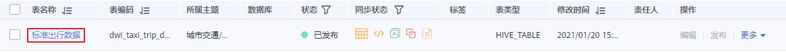

4.  在详情页的表字段区域，选中需要关联质量规则的的字段，然后单击“关联质量规则“按钮。

    **图 2**  标准与规则  
    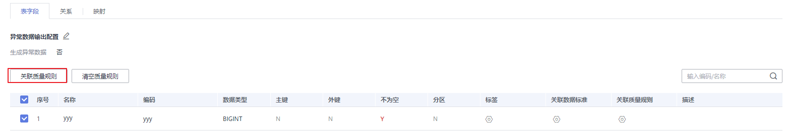

    异常数据输出配置：勾选此项，并勾选生成异常数据，表示异常数据将按照配置的参数存储到规定的库中。

5.  在弹出的“关联质量规则“对话框中，单击“添加规则“。

    **图 3**  添加质量规则页  
    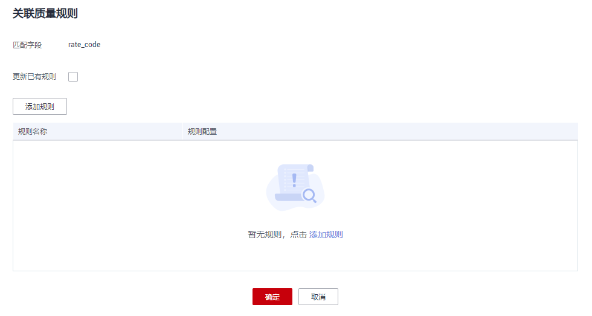

    此时，系统将弹出“添加规则“对话框，在规则列表中将显示**DGC数据质量**中默认的质量规则，选中所需要的规则，然后单击“确定“。如果列表中的规则不满足业务需求，您也可以创建自定义规则，单击“新建规则“可以跳转到**DGC数据质量**页面，请参考[新建规则模板](新建规则模板.md)新建规则。

    **图 4**  添加规则  
    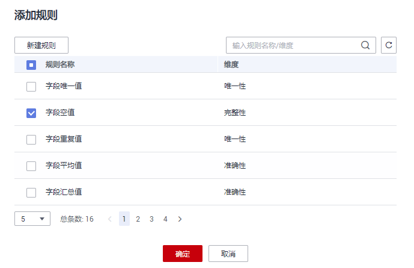

    添加规则完成后，将返回“关联质量规则“对话框，在“规则名称“列表中，选中一条规则，然后设置告警条件，设置完所有规则的告警条件后单击“确定“。

    -   在“告警条件“输入框中，请输入告警条件表达式，在质量作业运行时，系统将计算出告警条件表达式的结果，并根据表达式的结果是否为真来判断是否触发告警。如果表达式的结果为真则触发质量告警，结果为假则不触发质量告警。
    -   告警条件表达式由告警参数和逻辑运算符组成。

        每个规则的告警参数会在“告警参数“中以按钮形式列出。单击这些按钮，在“告警条件“中将按告警参数的排列顺序显示为$\{1\}、$\{2\}、$\{3\}等变量名称，以此类推，变量名即代表告警参数。也就是说，在设置“告警条件“时，使用变量$\{1\}代表第一个告警参数，$\{2\}代表第二个告警参数，以此类推。

    **图 5**  设置告警条件  
    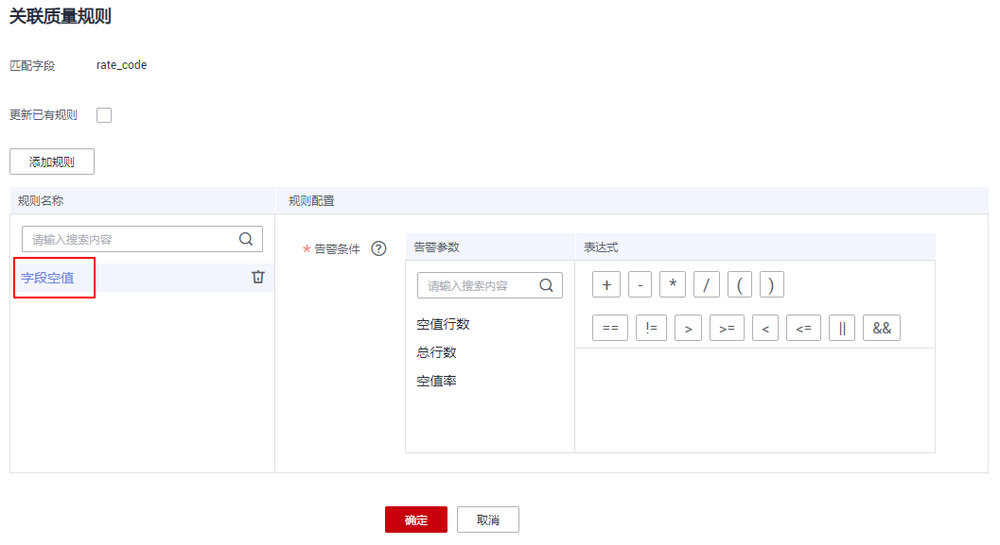

6.  （可选）如需要将质量作业中不符合设定规则的异常数据存储在异常表中，可以打开“异常数据输出配置”开关。

    **图 6**  异常数据输出开关  
    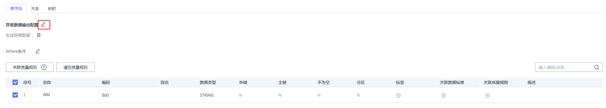

    点击开关，并打开“生成异常数据”按钮，表示异常数据将按照配置的参数存储到规定的库中。

    **图 7**  异常数据输出配置  
    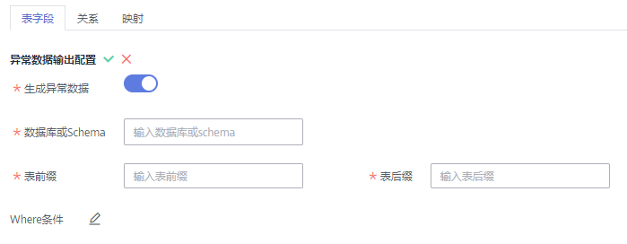

    各参数具体含义如下：

    -   数据库或Schema：表示存储异常数据的数据库或Schema。
    -   表前缀：表示存储异常数据的表的前缀。
    -   表后缀：表示存储异常数据的表的后缀。

    配置完成后点击保存配置。

7.  （可选）质量规则的检查范围默认是全表，如需要精确定位分区查询数据，请填写where条件。

    **图 8**  where条件开关  
    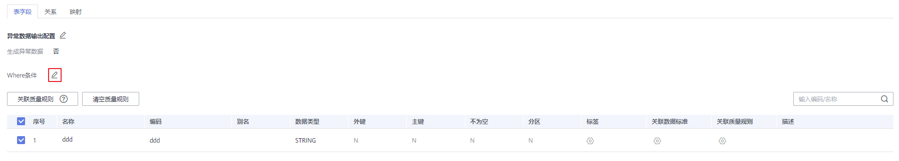

8.  查看关联质量规则的结果，如果显示成功，单击“确定“。如果显示失败，请查看失败原因，等问题处理后，再重新关联质量规则。

    **图 9**  关联结果  
    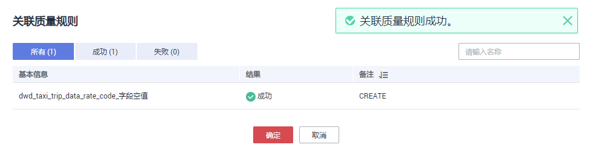

9.  返回关系模型列表页面，找到已关联质量规则的表，在“同步状态“列中，鼠标移至创建质量作业的图标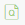上，单击“查看“进入质量作业页面查看已添加的质量规则。

    **图 10**  质量作业同步状态  
    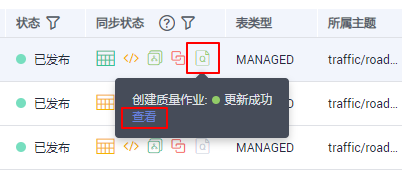

10. 进入质量作业的“规则配置“页面，可以查看刚才添加的质量规则。

    **图 11**  质量规则  
    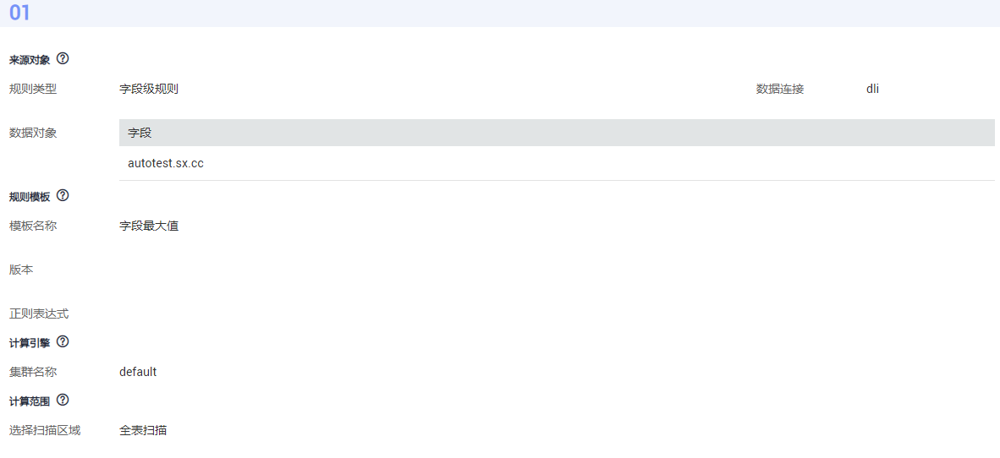

    此外，在建表时已关联的数据标准，在表发布后也会在上图中生成相应的质量规则，您可以在质量作业中进行查看。

    字段关联的数据标准生成的质量规则，示例如下：

    **图 12**  字段关联的质量规则  
    

    字段关联了数据标准，数据标准关联的码表生成的质量规则，示例如下：

    **图 13**  码表的质量规则  
    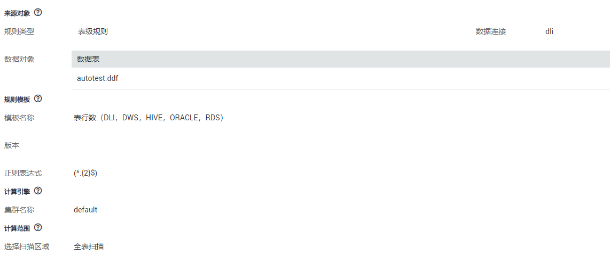

