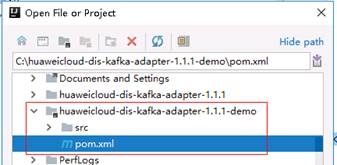
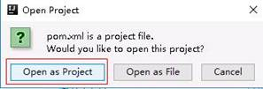
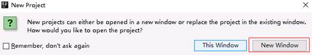
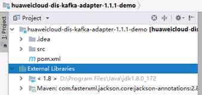
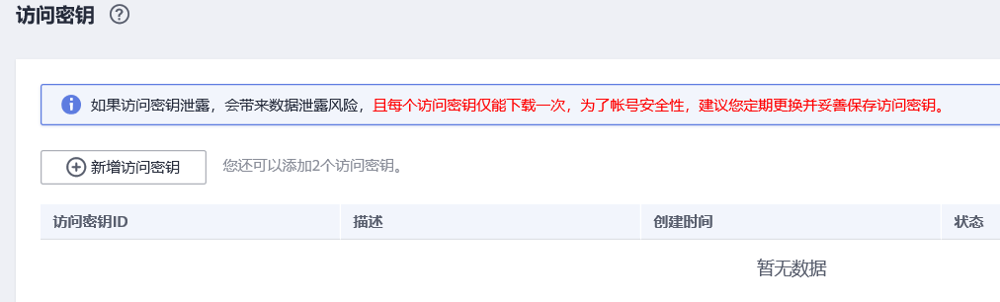

# 准备环境<a name="dgc_01_0244"></a>

## 配置pom.xml文件<a name="zh-cn_topic_0120206105_section154462583339"></a>

如果已有maven工程，在pom.xml中使用如下依赖即可。

```
<dependency>
    <groupId>com.huaweicloud.dis</groupId>
    <artifactId>huaweicloud-dis-kafka-adapter</artifactId>
    <version>1.2.9</version>
</dependency>
```

## 使用DIS样例工程<a name="zh-cn_topic_0120206105_section33892692175719"></a>

在[https://dis-publish.obs-website.cn-north-1.myhuaweicloud.com/](https://dis-publish.obs-website.cn-north-1.myhuaweicloud.com/)中下载DIS的kafka-adapter压缩包。

此zip包中有两个目录。

-   huaweicloud-dis-kafka-adapter-_X.X.X_目录下是所有依赖的jar包，如果使用非Maven工程，则可导入此lib目录下的所有jar到环境依赖即可
-   huaweicloud-dis-kafka-adapter-_X.X.X_-demo是一个样例工程，使用maven编写

例如使用IntelliJ IDEA，可按如下方式导入工程。

1.  打开IntelliJ IDEA，选择“File \> Open”

    在弹出的对话框中，选择huaweicloud-dis-kafka-adapter-_X.X.X_-demo目录，并双击pom.xml确定。

    

2.  当弹出如下对话框，请选择“Open as Project”，作为工程打开。

    

3.  单击“New Window”，在新窗口打开此工程。

    

4.  等待IntelliJ IDEA构建工程，完成之后会显示目录与文件

    


## 检查认证信息<a name="zh-cn_topic_0120206105_section940704175738"></a>

-   检查AK/SK

    AK/SK \(Access Key ID/Secret Access Key\)是用户调用接口的访问密钥。

    您可以通过如下方式获取访问密钥。

    1.  登录控制台，在用户名额下拉列表中选择“我的凭证”。
    2.  进入“我的凭证“页面，选择“访问密钥 \> 新增访问密钥“，如[图1](#zh-cn_topic_0120206105_dgc_01_0220_zh-cn_topic_0000001129241845_zh-cn_topic_0183643042_fig1552229194615)所示。

        **图 1**  单击新增访问密钥<a name="zh-cn_topic_0120206105_dgc_01_0220_zh-cn_topic_0000001129241845_zh-cn_topic_0183643042_fig1552229194615"></a>  
        

    3.  单击“确定”，根据浏览器提示，保存密钥文件。密钥文件会直接保存到浏览器默认的下载文件夹中。打开名称为“credentials.csv”的文件，即可查看访问密钥（Access Key Id和Secret Access Key）。

-   检查项目ID

    ProjectID表示租户的资源，每个Region都有一个唯一的项目ID。

    项目ID表示租户的资源，帐号ID对应当前帐号。用户可在对应页面下查看不同Region对应的项目ID和帐号ID。

    1.  注册并登录管理控制台。
    2.  在用户名的下拉列表中单击“我的凭证“。
    3.  在“我的凭证“页面，查看帐号名和帐号ID，在项目列表中查看项目ID。


