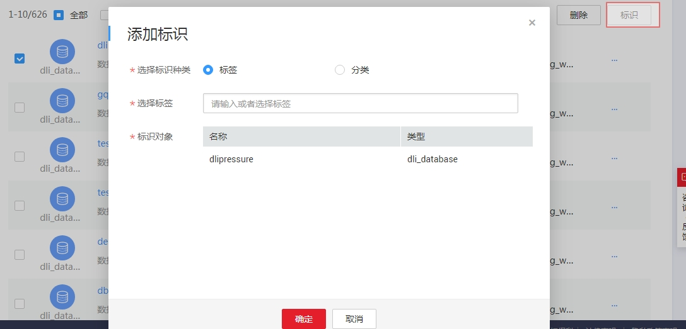

# 分类和标签管理

为方便管理技术资产，可以从业务角度定义分类与标签，并与技术资产关联。

## 创建分类

1.  [登录DAYU控制台](https://console.huaweicloud.com/dayu/)，找到所需要的DAYU实例，单击实例卡片上的“进入控制台”，进入概览页面。

    选择“空间管理”页签，完成工作空间的创建。

    在工作空间列表中，找到所需要的工作空间。

1.  单击相应工作空间的“数据资产“。

    系统跳转至“数据资产“页面。

1.  选择“数据地图  \>  数据目录“。

1.  单击分类后的“管理“。

    系统跳转至管理页面，单击“添加“，新建分类。

    **图 1**  新建分类  
    

2.  配置分类属性，单击“确定”提交。

## 新建标签

1.  [登录DAYU控制台](https://console.huaweicloud.com/dayu/)，找到所需要的DAYU实例，单击实例卡片上的“进入控制台”，进入概览页面。

    选择“空间管理”页签，完成工作空间的创建。

    在工作空间列表中，找到所需要的工作空间。

1.  单击相应工作空间的“数据资产“。

    系统跳转至“数据资产“页面。

1.  选择“数据地图  \>  数据目录“。

1.  勾选资产前的对话框，单击“标识“。

    在添加标识对话框中新建标签。

    **图 2**  新建标签  
    

2.  选择标识种类并配置标签，单击“确定”提交。

