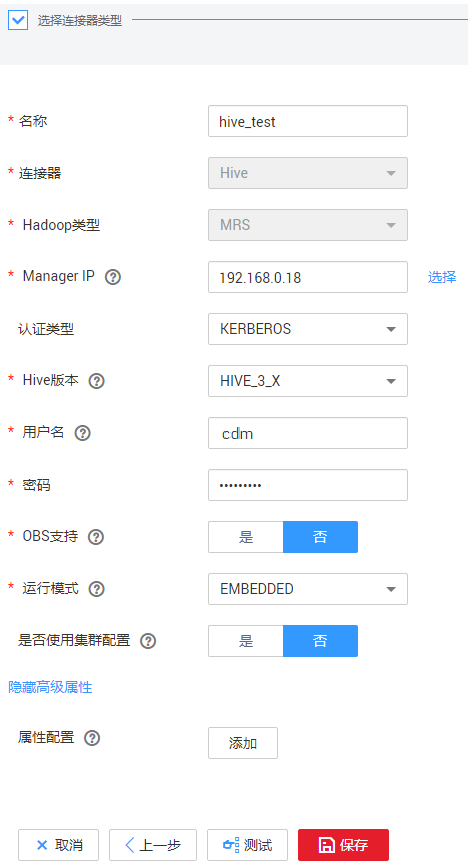

# 创建MRS Hive连接器

MRS Hive连接适用于MapReduce服务，本教程为您介绍如何创建MRS Hive连接器。

## 前提条件

-   已创建CDM集群。
-   已获取MRS集群的Manager IP、管理员账号和密码，且该账号拥有数据导入、导出的操作权限。
-   MRS集群和CDM集群之间网络互通，网络互通需满足如下条件：
    -   CDM集群与云上服务处于不同区域的情况下，需要通过公网或者专线打通网络。
    -   CDM集群与云上服务同区域情况下，同虚拟私有云、同子网、同安全组的不同实例默认网络互通；如果同虚拟私有云但是子网或安全组不同，还需配置路由规则及安全组规则，配置路由规则请参见[如何配置路由规则](https://support.huaweicloud.com/bestpractice-vpc/bestpractice_0009.html#bestpractice_0009__zh-cn_topic_0252060877_li16617547103419)章节，配置安全组规则请参见[如何配置安全组规则](https://support.huaweicloud.com/usermanual-ecs/zh-cn_topic_0140323152.html)《虚拟私有云\(VPC\)用户指南》中的“安全组 \> 添加安全组规则”章节。
    -   此外，您还必须确保该云服务的实例与CDM集群所属的企业项目必须相同，如果不同，需要修改工作空间的企业项目。

## 新建MRS hive连接

1.  在集群管理界面，单击集群后的“作业管理“，选择“连接管理  \>  新建连接“，进入连接器类型的选择界面，如[图1](#zh-cn_topic_0000001192533813_fig106261251939)所示。

    **图 1**  选择连接器类型  
    

2.  选择“MRS Hive“，后单击下一步，配置MRS Hive连接的参数，如[图2](#zh-cn_topic_0000001192533813_fig19677147505)所示。

    **图 2**  创建MRS Hive连接  
    

3.  单击“显示高级属性”可查看更多可选参数，具体请参见5.6-配置关系数据库连接。这里保持默认，必填参数如[表1](#zh-cn_topic_0000001192533813_table01908281765)所示。

    **表 1**  MRS Hive连接参数

    
    <table><thead align="left"><tr id="zh-cn_topic_0000001192533813_zh-cn_topic_0262779691_zh-cn_topic_0183448671_zh-cn_topic_0108618545_row918111835015"><th class="cellrowborder" valign="top" width="16.72%" id="mcps1.2.4.1.1">
参数名

    </th>
    <th class="cellrowborder" valign="top" width="62.1%" id="mcps1.2.4.1.2">
说明

    </th>
    <th class="cellrowborder" valign="top" width="21.18%" id="mcps1.2.4.1.3">
取值样例

    </th>
    </tr>
    </thead>
    <tbody><tr id="zh-cn_topic_0000001192533813_zh-cn_topic_0262779691_zh-cn_topic_0183448671_zh-cn_topic_0108618545_row151817815505"><td class="cellrowborder" valign="top" width="16.72%" headers="mcps1.2.4.1.1 ">
名称

    </td>
    <td class="cellrowborder" valign="top" width="62.1%" headers="mcps1.2.4.1.2 ">
连接的名称，根据连接的数据源类型，用户可自定义便于记忆、区分的连接名。

    </td>
    <td class="cellrowborder" valign="top" width="21.18%" headers="mcps1.2.4.1.3 ">
mrs-link

    </td>
    </tr>
    <tr id="zh-cn_topic_0000001192533813_zh-cn_topic_0262779691_zh-cn_topic_0183448671_zh-cn_topic_0108618545_row16181208165013"><td class="cellrowborder" valign="top" width="16.72%" headers="mcps1.2.4.1.1 ">
Manager IP

    </td>
    <td class="cellrowborder" valign="top" width="62.1%" headers="mcps1.2.4.1.2 ">
MRS Manager的浮动IP地址，可以单击输入框后的“选择”来选定已创建的MRS集群，CDM会自动填充下面的鉴权参数。

    </td>
    <td class="cellrowborder" valign="top" width="21.18%" headers="mcps1.2.4.1.3 ">
127.0.0.1

    </td>
    </tr>
    <tr id="zh-cn_topic_0000001192533813_zh-cn_topic_0262779691_zh-cn_topic_0183448671_zh-cn_topic_0108618545_row7181168105018"><td class="cellrowborder" valign="top" width="16.72%" headers="mcps1.2.4.1.1 ">
认证类型

    </td>
    <td class="cellrowborder" valign="top" width="62.1%" headers="mcps1.2.4.1.2 ">
访问MRS的认证类型：<ul id="zh-cn_topic_0000001192533813_zh-cn_topic_0262779691_zh-cn_topic_0108618545_ul12623191718453"><li>SIMPLE：非安全模式选择Simple鉴权。</li><li>KERBEROS：安全模式选择Kerberos鉴权。</li></ul>
    

    </td>
    <td class="cellrowborder" valign="top" width="21.18%" headers="mcps1.2.4.1.3 ">
SIMPLE

    </td>
    </tr>
    <tr id="zh-cn_topic_0000001192533813_zh-cn_topic_0262779691_zh-cn_topic_0183448671_zh-cn_topic_0108618545_row6181138195013"><td class="cellrowborder" valign="top" width="16.72%" headers="mcps1.2.4.1.1 ">
Hive版本

    </td>
    <td class="cellrowborder" valign="top" width="62.1%" headers="mcps1.2.4.1.2 ">
Hive的版本。根据服务端Hive版本设置。

    </td>
    <td class="cellrowborder" valign="top" width="21.18%" headers="mcps1.2.4.1.3 ">
HIVE_3_X

    </td>
    </tr>
    <tr id="zh-cn_topic_0000001192533813_zh-cn_topic_0262779691_zh-cn_topic_0183448671_zh-cn_topic_0108618545_row818110813502"><td class="cellrowborder" valign="top" width="16.72%" headers="mcps1.2.4.1.1 ">
用户名

    </td>
    <td class="cellrowborder" valign="top" width="62.1%" headers="mcps1.2.4.1.2 ">
选择KERBEROS鉴权时，需要配置MRS Manager的用户名和密码。从HDFS导出目录时，如果需要创建快照，这里配置的用户需要HDFS系统的管理员权限。

    
如果要创建MRS安全集群的数据连接，不能使用admin用户。因为admin用户是默认的管理页面用户，这个用户无法作为安全集群的认证用户来使用。您可以创建一个新的MRS用户，然后在创建MRS数据连接时，“用户名”和“密码”填写为新建的MRS用户及其密码。
 说明： 
<ul id="zh-cn_topic_0000001192533813_zh-cn_topic_0262779691_zh-cn_topic_0108618545_ul17715141011134"><li>如果CDM集群为2.9.0版本及之后版本，且MRS集群为3.1.0及之后版本，则所创建的用户至少需具备Manager_viewer的角色权限才能在CDM创建连接；如果需要对应组件的进行库、表、数据的操作，还需要添加对应组件的用户组权限。</li><li>如果CDM集群为2.9.0之前的版本，或MRS集群为3.1.0之前的版本，则所创建的用户需要具备Manager_administrator或System_administrator权限，才能在CDM创建连接。</li><li>仅具备Manager_tenant或Manager_auditor权限，无法创建连接。</li></ul>
    

    

    </td>
    <td class="cellrowborder" valign="top" width="21.18%" headers="mcps1.2.4.1.3 ">
cdm

    </td>
    </tr>
    <tr id="zh-cn_topic_0000001192533813_zh-cn_topic_0262779691_zh-cn_topic_0183448671_zh-cn_topic_0108618545_row8181188155013"><td class="cellrowborder" valign="top" width="16.72%" headers="mcps1.2.4.1.1 ">
密码

    </td>
    <td class="cellrowborder" valign="top" width="62.1%" headers="mcps1.2.4.1.2 ">
访问MRS Manager的用户密码。

    </td>
    <td class="cellrowborder" valign="top" width="21.18%" headers="mcps1.2.4.1.3 ">
-

    </td>
    </tr>
    <tr id="zh-cn_topic_0000001192533813_zh-cn_topic_0262779691_zh-cn_topic_0183448671_zh-cn_topic_0108618545_row191817855019"><td class="cellrowborder" valign="top" width="16.72%" headers="mcps1.2.4.1.1 ">
OBS支持

    </td>
    <td class="cellrowborder" valign="top" width="62.1%" headers="mcps1.2.4.1.2 ">
需服务端支持OBS存储。在创建Hive表时，您可以指定将表存储在OBS中。

    </td>
    <td class="cellrowborder" valign="top" width="21.18%" headers="mcps1.2.4.1.3 ">
否

    </td>
    </tr>
    <tr id="zh-cn_topic_0000001192533813_zh-cn_topic_0262779691_zh-cn_topic_0183448671_zh-cn_topic_0108618545_row218148115017"><td class="cellrowborder" valign="top" width="16.72%" headers="mcps1.2.4.1.1 ">
运行模式

    </td>
    <td class="cellrowborder" valign="top" width="62.1%" headers="mcps1.2.4.1.2 ">
“HIVE_3_X”版本支持该参数。支持以下模式：<ul id="zh-cn_topic_0000001192533813_zh-cn_topic_0262779691_zh-cn_topic_0108618545_ul111811818502"><li>EMBEDDED：连接实例与CDM运行在一起，该模式性能较好。</li><li>STANDALONE：连接实例运行在独立进程。如果CDM需要对接多个Hadoop数据源（MRS、Hadoop或CloudTable），并且既有KERBEROS认证模式又有SIMPLE认证模式，只能使用STANDALONE模式或者配置不同的Agent。
<strong id="zh-cn_topic_0000001192533813_zh-cn_topic_0262779691_zh-cn_topic_0108618545_b6845133152817">说明</strong>：STANDALONE模式主要是用来解决版本冲突问题的运行模式。当同一种数据连接的源端或者目的端连接器的版本不一致时，存在jar包冲突的情况，这时需要将源端或目的端放在STANDALONE进程里，防止冲突导致迁移失败。

    </li></ul>
    

    </td>
    <td class="cellrowborder" valign="top" width="21.18%" headers="mcps1.2.4.1.3 ">
EMBEDDED

    </td>
    </tr>
    <tr id="zh-cn_topic_0000001192533813_zh-cn_topic_0262779691_zh-cn_topic_0183448671_row1320544493817"><td class="cellrowborder" valign="top" width="16.72%" headers="mcps1.2.4.1.1 ">
是否使用集群配置

    </td>
    <td class="cellrowborder" valign="top" width="62.1%" headers="mcps1.2.4.1.2 ">
用户可以在“连接管理”处创建集群配置，用于简化Hadoop连接参数配置。

    </td>
    <td class="cellrowborder" valign="top" width="21.18%" headers="mcps1.2.4.1.3 ">
否

    </td>
    </tr>
    </tbody>
    </table>

    > **说明：** 
    >单击“显示高级属性“，然后单击“添加“，您可以添加客户端的配置属性。所添加的每个属性需配置属性名称和值。对于不再需要的属性，可单击属性后的“删除“按钮进行删除。

4.  单击“保存“回到连接管理界面，完成MRS Hive连接器的配置。

