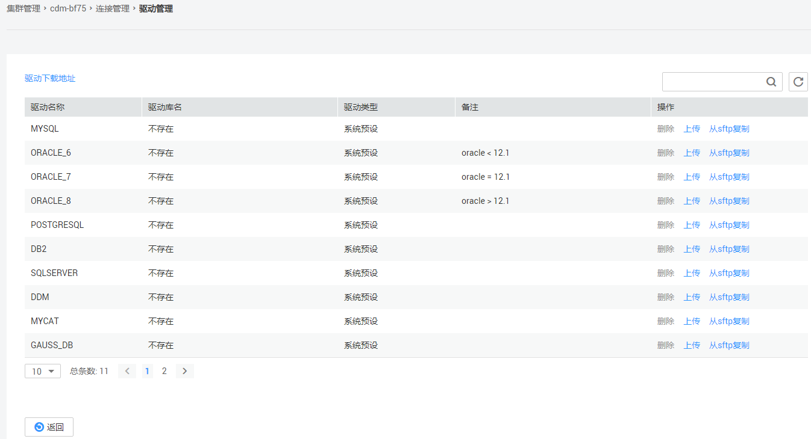
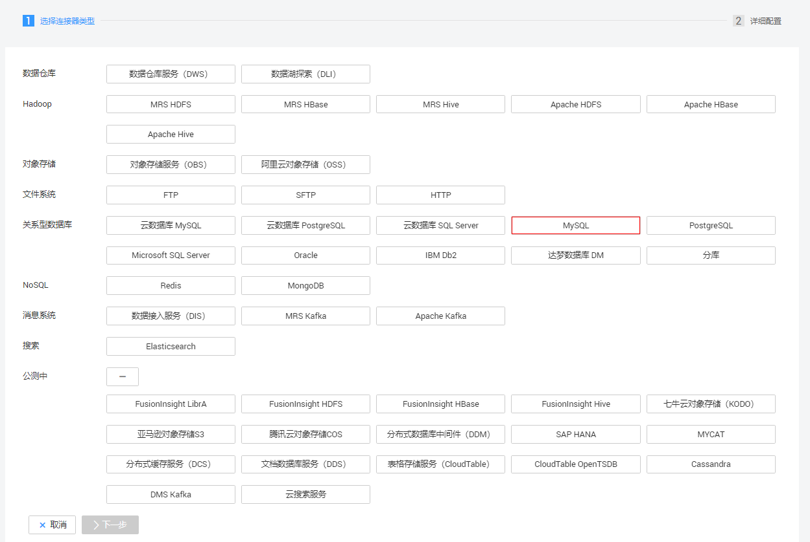
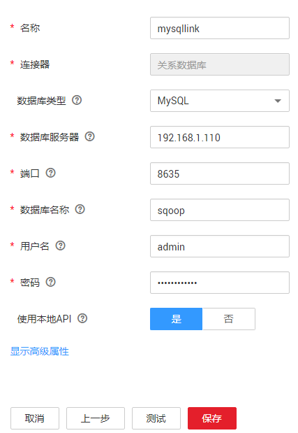

# 创建MySQL连接器

MySQL连接适用于第三方云MySQL服务，以及用户在本地数据中心或ECS上自建的MySQL。本教程为您介绍如何创建MySQL连接器。

## 前提条件

-   已获取连接MySQL数据库的IP地址、端口、数据库名称、用户名、密码，且该用户拥有MySQL数据库的读写权限。
-   本地MySQL数据库可通过公网访问。如果MySQL服务器是在本地数据中心或第三方云上，需要确保MySQL可以通过公网IP访问，或者是已经建立好了企业内部数据中心到云服务平台的VPN通道或专线。
-   已创建CDM集群。

## 新建MySQL连接器

1.  进入CDM主界面，单击左侧导航上的“集群管理“，选择CDM集群后的“作业管理  \>  连接管理  \>  驱动管理“，进入驱动管理页面。

    **图 1**  上传驱动  
    

2.  单击“驱动管理“页面左上角“驱动下载地址“链接下载MySQL的驱动，详情请参见[如何获取驱动](管理驱动.md#zh-cn_topic_0286032703_section631855342818)。
3.  在“驱动管理“页面中，选择以下方式上传MySQL驱动。

    方式一：单击对应驱动名称右侧操作列的“上传“，选择本地已下载的驱动。

    方式二：单击对应驱动名称右侧操作列的“从sftp复制”，配置sftp连接器名称和驱动文件路径。

4.  在“集群管理“界面，单击集群后的“作业管理“，选择“连接管理  \>  新建连接“，进入连接器类型的选择界面，如[图2](#zh-cn_topic_0000001147041354_zh-cn_topic_0284710796_zh-cn_topic_0111325168_fig15373426133913)所示。

    **图 2**  选择连接器类型  
    

5.  选择“MySQL“后单击“下一步“，配置MySQL连接的参数，参数如[表1](#zh-cn_topic_0000001147041354_zh-cn_topic_0284710796_zh-cn_topic_0111325168_zh-cn_topic_0108275298_table5321744015490)所示。

    **图 3**  创建MySQL连接  
    

    **表 1**  MySQL连接参数

    
    <table><thead align="left"><tr id="zh-cn_topic_0000001147041354_zh-cn_topic_0284710796_zh-cn_topic_0111325168_zh-cn_topic_0108275298_row185605615490"><th class="cellrowborder" valign="top" width="21.39%" id="mcps1.2.4.1.1">
参数名

    </th>
    <th class="cellrowborder" valign="top" width="46.01%" id="mcps1.2.4.1.2">
说明

    </th>
    <th class="cellrowborder" valign="top" width="32.6%" id="mcps1.2.4.1.3">
取值样例

    </th>
    </tr>
    </thead>
    <tbody><tr id="zh-cn_topic_0000001147041354_zh-cn_topic_0284710796_zh-cn_topic_0111325168_zh-cn_topic_0108275298_row6448267615421"><td class="cellrowborder" valign="top" width="21.39%" headers="mcps1.2.4.1.1 ">
名称

    </td>
    <td class="cellrowborder" valign="top" width="46.01%" headers="mcps1.2.4.1.2 ">
输入便于记忆和区分的连接名称。

    </td>
    <td class="cellrowborder" valign="top" width="32.6%" headers="mcps1.2.4.1.3 ">
mysqllink

    </td>
    </tr>
    <tr id="zh-cn_topic_0000001147041354_zh-cn_topic_0284710796_zh-cn_topic_0111325168_zh-cn_topic_0108275298_row23645714155554"><td class="cellrowborder" valign="top" width="21.39%" headers="mcps1.2.4.1.1 ">
数据库服务器

    </td>
    <td class="cellrowborder" valign="top" width="46.01%" headers="mcps1.2.4.1.2 ">
MySQL数据库的IP地址或域名。

    </td>
    <td class="cellrowborder" valign="top" width="32.6%" headers="mcps1.2.4.1.3 ">
192.168.1.110

    </td>
    </tr>
    <tr id="zh-cn_topic_0000001147041354_zh-cn_topic_0284710796_zh-cn_topic_0111325168_zh-cn_topic_0108275298_row35721234155558"><td class="cellrowborder" valign="top" width="21.39%" headers="mcps1.2.4.1.1 ">
端口

    </td>
    <td class="cellrowborder" valign="top" width="46.01%" headers="mcps1.2.4.1.2 ">
MySQL数据库的端口。

    </td>
    <td class="cellrowborder" valign="top" width="32.6%" headers="mcps1.2.4.1.3 ">
3306

    </td>
    </tr>
    <tr id="zh-cn_topic_0000001147041354_zh-cn_topic_0284710796_zh-cn_topic_0111325168_zh-cn_topic_0108275298_row58054787162632"><td class="cellrowborder" valign="top" width="21.39%" headers="mcps1.2.4.1.1 ">
数据库名称

    </td>
    <td class="cellrowborder" valign="top" width="46.01%" headers="mcps1.2.4.1.2 ">
MySQL数据库的名称。

    </td>
    <td class="cellrowborder" valign="top" width="32.6%" headers="mcps1.2.4.1.3 ">
sqoop

    </td>
    </tr>
    <tr id="zh-cn_topic_0000001147041354_zh-cn_topic_0284710796_zh-cn_topic_0111325168_zh-cn_topic_0108275298_row121116115490"><td class="cellrowborder" valign="top" width="21.39%" headers="mcps1.2.4.1.1 ">
用户名

    </td>
    <td class="cellrowborder" valign="top" width="46.01%" headers="mcps1.2.4.1.2 ">
拥有MySQL数据库的读、写和删除权限的用户。

    </td>
    <td class="cellrowborder" valign="top" width="32.6%" headers="mcps1.2.4.1.3 ">
admin

    </td>
    </tr>
    <tr id="zh-cn_topic_0000001147041354_zh-cn_topic_0284710796_zh-cn_topic_0111325168_zh-cn_topic_0108275298_row4576104015490"><td class="cellrowborder" valign="top" width="21.39%" headers="mcps1.2.4.1.1 ">
密码

    </td>
    <td class="cellrowborder" valign="top" width="46.01%" headers="mcps1.2.4.1.2 ">
用户的密码。

    </td>
    <td class="cellrowborder" valign="top" width="32.6%" headers="mcps1.2.4.1.3 ">
-

    </td>
    </tr>
    <tr id="zh-cn_topic_0000001147041354_row1695382013335"><td class="cellrowborder" valign="top" width="21.39%" headers="mcps1.2.4.1.1 ">
使用本地API

    </td>
    <td class="cellrowborder" valign="top" width="46.01%" headers="mcps1.2.4.1.2 ">
使用数据库本地API加速（系统会尝试启用MySQL数据库的local_infile系统变量）。

    </td>
    <td class="cellrowborder" valign="top" width="32.6%" headers="mcps1.2.4.1.3 ">
是

    </td>
    </tr>
    <tr id="zh-cn_topic_0000001147041354_zh-cn_topic_0284710796_zh-cn_topic_0111325168_zh-cn_topic_0108275298_row117692617437"><td class="cellrowborder" valign="top" width="21.39%" headers="mcps1.2.4.1.1 ">
使用Agent

    </td>
    <td class="cellrowborder" valign="top" width="46.01%" headers="mcps1.2.4.1.2 ">
是否选择通过Agent从源端提取数据。

    </td>
    <td class="cellrowborder" valign="top" width="32.6%" headers="mcps1.2.4.1.3 ">
是

    </td>
    </tr>
    <tr id="zh-cn_topic_0000001147041354_row1785145420225"><td class="cellrowborder" valign="top" width="21.39%" headers="mcps1.2.4.1.1 ">
Agent

    </td>
    <td class="cellrowborder" valign="top" width="46.01%" headers="mcps1.2.4.1.2 ">
单击“选择”，选择<a href="管理Agent.md#zh-cn_topic_0207402273_zh-cn_topic_0191978474_section1072083564713">连接Agent</a>中已创建的Agent。

    </td>
    <td class="cellrowborder" valign="top" width="32.6%" headers="mcps1.2.4.1.3 ">
-

    </td>
    </tr>
    <tr id="zh-cn_topic_0000001147041354_row198311582349"><td class="cellrowborder" valign="top" width="21.39%" headers="mcps1.2.4.1.1 ">
一次请求行数

    </td>
    <td class="cellrowborder" valign="top" width="46.01%" headers="mcps1.2.4.1.2 ">
指定每次请求获取的行数。

    </td>
    <td class="cellrowborder" valign="top" width="32.6%" headers="mcps1.2.4.1.3 ">
1000

    </td>
    </tr>
    <tr id="zh-cn_topic_0000001147041354_row18386135893414"><td class="cellrowborder" valign="top" width="21.39%" headers="mcps1.2.4.1.1 ">
一次提交行数

    </td>
    <td class="cellrowborder" valign="top" width="46.01%" headers="mcps1.2.4.1.2 ">
支持通过agent从源端提取数据

    </td>
    <td class="cellrowborder" valign="top" width="32.6%" headers="mcps1.2.4.1.3 ">
1000

    </td>
    </tr>
    <tr id="zh-cn_topic_0000001147041354_row753265813344"><td class="cellrowborder" valign="top" width="21.39%" headers="mcps1.2.4.1.1 ">
连接属性

    </td>
    <td class="cellrowborder" valign="top" width="46.01%" headers="mcps1.2.4.1.2 ">
自定义连接属性。

    </td>
    <td class="cellrowborder" valign="top" width="32.6%" headers="mcps1.2.4.1.3 ">
useCompression=true

    </td>
    </tr>
    <tr id="zh-cn_topic_0000001147041354_row1477817242359"><td class="cellrowborder" valign="top" width="21.39%" headers="mcps1.2.4.1.1 ">
引用符号

    </td>
    <td class="cellrowborder" valign="top" width="46.01%" headers="mcps1.2.4.1.2 ">
连接引用表名或列名时的分隔符号。默认为空。

    </td>
    <td class="cellrowborder" valign="top" width="32.6%" headers="mcps1.2.4.1.3 ">
'

    </td>
    </tr>
    </tbody>
    </table>

6.  单击“保存“回到连接管理界面，完成MySQL连接器的配置。

    > **说明：** 
    >如果保存时出错，一般是由于MySQL数据库的安全设置问题，需要设置允许CDM集群的EIP访问MySQL数据库。

