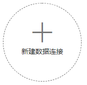

# 创建数据连接

数据连接对应于DLF管理的数据实体，它保存了数据实体的连接信息。同一个数据连接下，可支持多个作业运行和多个脚本开发，当数据连接保存的信息发生变化时，您只需在连接管理中编辑修改该数据连接的信息。

目前支持创建如下类型的数据连接，其中CloudTable数据连接类型仅在华为-北京一区域支持。

-   DLI
-   DWS
-   MRS Hive
-   MRS SparkSQL
-   CloudTable
-   RDS

## 前提条件

-   已开通或创建相应的云服务。

    例如，创建RDS类型的数据连接前，您需要先在RDS中创建数据库实例。

-   数据连接的最大配额为20，当前数据连接的数量未达到最大配额。

## 操作步骤

1.  创建数据连接的入口有两个，分别是“连接管理“页面和右侧区域。
    -   通过“连接管理“页面
        1.  在DLF控制台的左侧导航栏，选择“数据管理  \>  连接管理“。
        2.  在页面的右上方，单击“新建数据连接“。

    -   通过右侧区域
        1.  在DLF控制台的左侧导航栏，选择“数据开发  \>  脚本开发“/“数据开发  \>  作业开发“。
        2.  在右侧区域创建数据连接的方式有以下三种：

            方式一：单击“新建数据连接“。

            **图 1**  新建数据连接（方式一）  
            

            方式二：在左侧菜单选择，右键单击根目录“数据连接“，选择“新建数据连接“。

            **图 2**  新建数据连接（方式二）  
            

            方式三：打开详细的脚本或者作业，单击，选择“新建数据连接“  。

            **图 3**  新建数据连接（方式三）  
            

2.  在弹出的对话框中，选择“数据连接类型“，并参见[表1](#zh-cn_topic_0125513549_table168445103311)配置相关参数。

    **表 1**  数据连接

    
    <table><thead align="left"><tr id="zh-cn_topic_0125513549_row38441710153116"><th class="cellrowborder" valign="top" width="31%" id="mcps1.2.4.1.1">
数据连接类型

    </th>
    <th class="cellrowborder" valign="top" width="36%" id="mcps1.2.4.1.2">
参数说明

    </th>
    <th class="cellrowborder" valign="top" width="33%" id="mcps1.2.4.1.3">
其他说明

    </th>
    </tr>
    </thead>
    <tbody><tr id="zh-cn_topic_0125513549_row3844181014312"><td class="cellrowborder" valign="top" width="31%" headers="mcps1.2.4.1.1 ">
DLI

    </td>
    <td class="cellrowborder" valign="top" width="36%" headers="mcps1.2.4.1.2 ">
请见<a href="#zh-cn_topic_0125513549_table1932615611325">表2</a>

    </td>
    <td class="cellrowborder" valign="top" width="33%" headers="mcps1.2.4.1.3 ">
DLI类型的数据连接只能创建一个。

    </td>
    </tr>
    <tr id="zh-cn_topic_0125513549_row1384491011313"><td class="cellrowborder" valign="top" width="31%" headers="mcps1.2.4.1.1 ">
DWS

    </td>
    <td class="cellrowborder" valign="top" width="36%" headers="mcps1.2.4.1.2 ">
请见<a href="#zh-cn_topic_0125513549_table1845615233417">表3</a>

    </td>
    <td class="cellrowborder" valign="top" width="33%" headers="mcps1.2.4.1.3 ">
-

    </td>
    </tr>
    <tr id="zh-cn_topic_0125513549_row18441110193115"><td class="cellrowborder" valign="top" width="31%" headers="mcps1.2.4.1.1 ">
MRS Hive

    </td>
    <td class="cellrowborder" valign="top" width="36%" headers="mcps1.2.4.1.2 ">
请见<a href="#zh-cn_topic_0125513549_table24969616139">表4</a>

    </td>
    <td class="cellrowborder" valign="top" width="33%" headers="mcps1.2.4.1.3 ">
-

    </td>
    </tr>
    <tr id="zh-cn_topic_0125513549_row1184411018312"><td class="cellrowborder" valign="top" width="31%" headers="mcps1.2.4.1.1 ">
MRS SparkSQL

    </td>
    <td class="cellrowborder" valign="top" width="36%" headers="mcps1.2.4.1.2 ">
请见<a href="#zh-cn_topic_0125513549_table19875165153316">表5</a>

    </td>
    <td class="cellrowborder" valign="top" width="33%" headers="mcps1.2.4.1.3 ">
-

    </td>
    </tr>
    <tr id="zh-cn_topic_0125513549_row168441210113118"><td class="cellrowborder" valign="top" width="31%" headers="mcps1.2.4.1.1 ">
CloudTable

    </td>
    <td class="cellrowborder" valign="top" width="36%" headers="mcps1.2.4.1.2 ">
请见<a href="#zh-cn_topic_0125513549_table192421109512">表6</a>

    </td>
    <td class="cellrowborder" valign="top" width="33%" headers="mcps1.2.4.1.3 ">
-

    </td>
    </tr>
    <tr id="zh-cn_topic_0125513549_row384420100313"><td class="cellrowborder" valign="top" width="31%" headers="mcps1.2.4.1.1 ">
RDS

    </td>
    <td class="cellrowborder" valign="top" width="36%" headers="mcps1.2.4.1.2 ">
请见<a href="#zh-cn_topic_0125513549_table6414478016135">表7</a>

    </td>
    <td class="cellrowborder" valign="top" width="33%" headers="mcps1.2.4.1.3 ">
-

    </td>
    </tr>
    </tbody>
    </table>

3.  单击“测试“，测试数据连接的连通性。如果无法连通，数据连接将无法创建。
4.  单击“确定“，创建数据连接。

## 参数说明

**表 2**  DLI数据连接

<table><thead align="left"><tr id="zh-cn_topic_0125513549_row03414562326"><th class="cellrowborder" valign="top" width="31.080000000000002%" id="mcps1.2.4.1.1">
参数

</th>
<th class="cellrowborder" valign="top" width="15.1%" id="mcps1.2.4.1.2">
是否必选

</th>
<th class="cellrowborder" valign="top" width="53.82%" id="mcps1.2.4.1.3">
说明

</th>
</tr>
</thead>
<tbody><tr id="zh-cn_topic_0125513549_row1356155620321"><td class="cellrowborder" valign="top" width="31.080000000000002%" headers="mcps1.2.4.1.1 ">
数据连接名称

</td>
<td class="cellrowborder" valign="top" width="15.1%" headers="mcps1.2.4.1.2 ">
是

</td>
<td class="cellrowborder" valign="top" width="53.82%" headers="mcps1.2.4.1.3 ">
数据连接的名称，只能包含英文字母、数字、“_”，且长度为1~100个字符。

</td>
</tr>
</tbody>
</table>

**表 3**  DWS数据连接

<table><thead align="left"><tr id="zh-cn_topic_0125513549_row547216521340"><th class="cellrowborder" valign="top" width="31.04%" id="mcps1.2.4.1.1">
参数

</th>
<th class="cellrowborder" valign="top" width="14.96%" id="mcps1.2.4.1.2">
是否必选

</th>
<th class="cellrowborder" valign="top" width="54%" id="mcps1.2.4.1.3">
说明

</th>
</tr>
</thead>
<tbody><tr id="zh-cn_topic_0125513549_row1747212526346"><td class="cellrowborder" valign="top" width="31.04%" headers="mcps1.2.4.1.1 ">
数据连接名称

</td>
<td class="cellrowborder" valign="top" width="14.96%" headers="mcps1.2.4.1.2 ">
是

</td>
<td class="cellrowborder" valign="top" width="54%" headers="mcps1.2.4.1.3 ">
数据连接的名称，只能包含英文字母、数字、“_”，且长度为1~100个字符。

</td>
</tr>
<tr id="zh-cn_topic_0125513549_row164873525349"><td class="cellrowborder" valign="top" width="31.04%" headers="mcps1.2.4.1.1 ">
集群名

</td>
<td class="cellrowborder" valign="top" width="14.96%" headers="mcps1.2.4.1.2 ">
否

</td>
<td class="cellrowborder" valign="top" width="54%" headers="mcps1.2.4.1.3 ">
选择DWS集群。如果不直接选择DWS集群，用户需要配置“访问地址”和“端口”。

</td>
</tr>
<tr id="zh-cn_topic_0125513549_row12144192015298"><td class="cellrowborder" valign="top" width="31.04%" headers="mcps1.2.4.1.1 ">
访问地址

</td>
<td class="cellrowborder" valign="top" width="14.96%" headers="mcps1.2.4.1.2 ">
是/否

</td>
<td class="cellrowborder" valign="top" width="54%" headers="mcps1.2.4.1.3 ">
DWS集群的访问地址。

<ul id="zh-cn_topic_0125513549_ul12971913143212"><li>当用户在“集群名”中选择了DWS集群时，系统会自动填写为对应DWS集群的访问地址。</li><li>当不选择DWS集群时，用户需要手动填写为DWS集群的访问地址。</li></ul>
</td>
</tr>
<tr id="zh-cn_topic_0125513549_row16369141692911"><td class="cellrowborder" valign="top" width="31.04%" headers="mcps1.2.4.1.1 ">
端口

</td>
<td class="cellrowborder" valign="top" width="14.96%" headers="mcps1.2.4.1.2 ">
是/否

</td>
<td class="cellrowborder" valign="top" width="54%" headers="mcps1.2.4.1.3 ">
DWS集群的访问端口。

<ul id="zh-cn_topic_0125513549_ul15514143312324"><li>当用户在“集群名”中选择了DWS集群时，系统会自动填写为对应DWS集群的访问端口。</li><li>当不选择DWS集群时，用户需要手动填写为DWS集群的访问端口。</li></ul>
</td>
</tr>
<tr id="zh-cn_topic_0125513549_row350375243410"><td class="cellrowborder" valign="top" width="31.04%" headers="mcps1.2.4.1.1 ">
用户名

</td>
<td class="cellrowborder" valign="top" width="14.96%" headers="mcps1.2.4.1.2 ">
是

</td>
<td class="cellrowborder" valign="top" width="54%" headers="mcps1.2.4.1.3 ">
DWS集群的管理员用户。

</td>
</tr>
<tr id="zh-cn_topic_0125513549_row250305212346"><td class="cellrowborder" valign="top" width="31.04%" headers="mcps1.2.4.1.1 ">
密码

</td>
<td class="cellrowborder" valign="top" width="14.96%" headers="mcps1.2.4.1.2 ">
是

</td>
<td class="cellrowborder" valign="top" width="54%" headers="mcps1.2.4.1.3 ">
DWS集群的管理员密码。

</td>
</tr>
<tr id="zh-cn_topic_0125513549_row184474307812"><td class="cellrowborder" valign="top" width="31.04%" headers="mcps1.2.4.1.1 ">
SSL连接

</td>
<td class="cellrowborder" valign="top" width="14.96%" headers="mcps1.2.4.1.2 ">
是/否

</td>
<td class="cellrowborder" valign="top" width="54%" headers="mcps1.2.4.1.3 ">
DWS支持SSL认证方式的连接，以加密DWS客户端与数据库之间传输的数据。SSL连接方式的安全性高于普通模式，从安全性考虑，建议用户开启SSL连接。

</td>
</tr>
<tr id="zh-cn_topic_0125513549_row25181052123419"><td class="cellrowborder" valign="top" width="31.04%" headers="mcps1.2.4.1.1 ">
KMS密钥

</td>
<td class="cellrowborder" valign="top" width="14.96%" headers="mcps1.2.4.1.2 ">
是

</td>
<td class="cellrowborder" valign="top" width="54%" headers="mcps1.2.4.1.3 ">
通过KMS加密和解密用户密码和密钥对的密码，选择KMS中已创建的密钥。

</td>
</tr>
<tr id="zh-cn_topic_0125513549_row145181952163418"><td class="cellrowborder" valign="top" width="31.04%" headers="mcps1.2.4.1.1 ">
连接代理

</td>
<td class="cellrowborder" valign="top" width="14.96%" headers="mcps1.2.4.1.2 ">
是

</td>
<td class="cellrowborder" valign="top" width="54%" headers="mcps1.2.4.1.3 ">
DWS为非全托管服务，DLF无法直接与非全托管服务进行连接。CDM集群提供了DLF与非全托管服务通信的代理，所以创建DWS的数据连接时，请选择一个CDM集群。如果没有可用的CDM集群，请先创建一个CDM集群。

</td>
</tr>
</tbody>
</table>

**表 4**  MRS Hive数据连接

<table><thead align="left"><tr id="zh-cn_topic_0125513549_row4254551716139"><th class="cellrowborder" valign="top" width="31%" id="mcps1.2.4.1.1">
参数

</th>
<th class="cellrowborder" valign="top" width="15%" id="mcps1.2.4.1.2">
是否必选

</th>
<th class="cellrowborder" valign="top" width="54%" id="mcps1.2.4.1.3">
说明

</th>
</tr>
</thead>
<tbody><tr id="zh-cn_topic_0125513549_row6639547616139"><td class="cellrowborder" valign="top" width="31%" headers="mcps1.2.4.1.1 ">
数据连接名称

</td>
<td class="cellrowborder" valign="top" width="15%" headers="mcps1.2.4.1.2 ">
是

</td>
<td class="cellrowborder" valign="top" width="54%" headers="mcps1.2.4.1.3 ">
数据连接的名称，只能包含英文字母、数字、“_”，且长度为1~100个字符。

</td>
</tr>
<tr id="zh-cn_topic_0125513549_row4266132916139"><td class="cellrowborder" valign="top" width="31%" headers="mcps1.2.4.1.1 ">
集群名

</td>
<td class="cellrowborder" valign="top" width="15%" headers="mcps1.2.4.1.2 ">
是

</td>
<td class="cellrowborder" valign="top" width="54%" headers="mcps1.2.4.1.3 ">
选择Hive所属的MRS集群。

</td>
</tr>
<tr id="zh-cn_topic_0125513549_row1920182015186"><td class="cellrowborder" valign="top" width="31%" headers="mcps1.2.4.1.1 ">
连接方式

</td>
<td class="cellrowborder" valign="top" width="15%" headers="mcps1.2.4.1.2 ">
是

</td>
<td class="cellrowborder" valign="top" width="54%" headers="mcps1.2.4.1.3 ">
选择DLF连接MRS的方式。

<strong id="zh-cn_topic_0125513549_b81671232115015">通过代理连接</strong>

使用CDM集群的通信代理功能，连接DLF和MRS，推荐使用该方式。

选择该方式的用户还需配置如下参数：

<ul id="zh-cn_topic_0125513549_ul7150165445016"><li>用户名（可选）：MRS Manager管理员用户。部分MRS集群不需要配置用户名，以具体集群为准。</li><li>密码（可选）：MRS Manager管理员用户的密码。部分MRS集群不需要配置用户密码，以具体集群为准。</li><li>KMS密钥（可选）：通过KMS加密和解密用户密码和密钥对的密码，选择KMS中已创建的密钥。</li><li>连接代理（必选）：选择可用的CDM集群。</li></ul>

<strong id="zh-cn_topic_0125513549_b1030834055020">直接连接</strong>

选择该方式的用户，将无法查看Hive数据表及字段内容；在线开发Hive SQL脚本时，执行结果只能在日志中查看。

</td>
</tr>
</tbody>
</table>

**表 5**  MRS SparkSQL数据连接

<table><thead align="left"><tr id="zh-cn_topic_0125513549_row148902553314"><th class="cellrowborder" valign="top" width="31%" id="mcps1.2.4.1.1">
参数

</th>
<th class="cellrowborder" valign="top" width="15%" id="mcps1.2.4.1.2">
是否必选

</th>
<th class="cellrowborder" valign="top" width="54%" id="mcps1.2.4.1.3">
说明

</th>
</tr>
</thead>
<tbody><tr id="zh-cn_topic_0125513549_row29061252336"><td class="cellrowborder" valign="top" width="31%" headers="mcps1.2.4.1.1 ">
数据连接名称

</td>
<td class="cellrowborder" valign="top" width="15%" headers="mcps1.2.4.1.2 ">
是

</td>
<td class="cellrowborder" valign="top" width="54%" headers="mcps1.2.4.1.3 ">
数据连接的名称，只能包含英文字母、数字、“_”，且长度为1~100个字符。

</td>
</tr>
<tr id="zh-cn_topic_0125513549_row159061254331"><td class="cellrowborder" valign="top" width="31%" headers="mcps1.2.4.1.1 ">
集群名

</td>
<td class="cellrowborder" valign="top" width="15%" headers="mcps1.2.4.1.2 ">
是

</td>
<td class="cellrowborder" valign="top" width="54%" headers="mcps1.2.4.1.3 ">
选择SparkSQL所属的MRS集群。

</td>
</tr>
<tr id="zh-cn_topic_0125513549_row139228510332"><td class="cellrowborder" valign="top" width="31%" headers="mcps1.2.4.1.1 ">
连接方式

</td>
<td class="cellrowborder" valign="top" width="15%" headers="mcps1.2.4.1.2 ">
是

</td>
<td class="cellrowborder" valign="top" width="54%" headers="mcps1.2.4.1.3 ">
选择DLF连接MRS的方式。

<strong id="zh-cn_topic_0125513549_b184287451454">通过代理连接</strong>

使用CDM集群的通信代理功能，连接DLF和MRS，推荐使用该方式。

选择该方式的用户还需配置如下参数：

<ul id="zh-cn_topic_0125513549_ul2428114519514"><li>用户名（可选）：MRS Manager管理员用户。部分MRS集群不需要配置用户名，以具体集群为准。</li><li>密码（可选）：MRS Manager管理员用户的密码。部分MRS集群不需要配置用户密码，以具体集群为准。</li><li>KMS密钥（可选）：通过KMS加密和解密用户密码和密钥对的密码，选择KMS中已创建的密钥。</li><li>连接代理（必选）：选择可用的CDM集群。</li></ul>

<strong id="zh-cn_topic_0125513549_b3443184514512">直接连接</strong>

选择该方式的用户，将无法查看Hive数据表及字段内容；在线开发SparkSQL脚本时，执行结果只能在日志中查看。

</td>
</tr>
</tbody>
</table>

**表 6**  CloudTable数据连接

<table><thead align="left"><tr id="zh-cn_topic_0125513549_row8242400519"><th class="cellrowborder" valign="top" width="31%" id="mcps1.2.4.1.1">
参数

</th>
<th class="cellrowborder" valign="top" width="15%" id="mcps1.2.4.1.2">
是否必选

</th>
<th class="cellrowborder" valign="top" width="54%" id="mcps1.2.4.1.3">
说明

</th>
</tr>
</thead>
<tbody><tr id="zh-cn_topic_0125513549_row325720017518"><td class="cellrowborder" valign="top" width="31%" headers="mcps1.2.4.1.1 ">
数据连接名称

</td>
<td class="cellrowborder" valign="top" width="15%" headers="mcps1.2.4.1.2 ">
是

</td>
<td class="cellrowborder" valign="top" width="54%" headers="mcps1.2.4.1.3 ">
数据连接的名称，只能包含英文字母、数字、“_”，且长度为1~100个字符。

</td>
</tr>
<tr id="zh-cn_topic_0125513549_row72571508513"><td class="cellrowborder" valign="top" width="31%" headers="mcps1.2.4.1.1 ">
集群名

</td>
<td class="cellrowborder" valign="top" width="15%" headers="mcps1.2.4.1.2 ">
是

</td>
<td class="cellrowborder" valign="top" width="54%" headers="mcps1.2.4.1.3 ">
选择CloudTable集群。每一个CloudTable集群都只能对应一个数据连接。

</td>
</tr>
</tbody>
</table>

**表 7**  RDS数据连接

<table><thead align="left"><tr id="zh-cn_topic_0125513549_row1852375216135"><th class="cellrowborder" valign="top" width="30.89%" id="mcps1.2.4.1.1">
参数

</th>
<th class="cellrowborder" valign="top" width="15.479999999999999%" id="mcps1.2.4.1.2">
是否必选

</th>
<th class="cellrowborder" valign="top" width="53.63%" id="mcps1.2.4.1.3">
说明

</th>
</tr>
</thead>
<tbody><tr id="zh-cn_topic_0125513549_row187937216135"><td class="cellrowborder" valign="top" width="30.89%" headers="mcps1.2.4.1.1 ">
数据连接名称

</td>
<td class="cellrowborder" valign="top" width="15.479999999999999%" headers="mcps1.2.4.1.2 ">
是

</td>
<td class="cellrowborder" valign="top" width="53.63%" headers="mcps1.2.4.1.3 ">
数据连接的名称，只能包含英文字母、数字、“_”，且长度为1~100个字符。

</td>
</tr>
<tr id="zh-cn_topic_0125513549_row6400848816135"><td class="cellrowborder" valign="top" width="30.89%" headers="mcps1.2.4.1.1 ">
IP

</td>
<td class="cellrowborder" valign="top" width="15.479999999999999%" headers="mcps1.2.4.1.2 ">
是

</td>
<td class="cellrowborder" valign="top" width="53.63%" headers="mcps1.2.4.1.3 ">
RDS实例的连接地址。

</td>
</tr>
<tr id="zh-cn_topic_0125513549_row4317670416135"><td class="cellrowborder" valign="top" width="30.89%" headers="mcps1.2.4.1.1 ">
端口

</td>
<td class="cellrowborder" valign="top" width="15.479999999999999%" headers="mcps1.2.4.1.2 ">
是

</td>
<td class="cellrowborder" valign="top" width="53.63%" headers="mcps1.2.4.1.3 ">
RDS实例的端口。

</td>
</tr>
<tr id="zh-cn_topic_0125513549_row6489289316135"><td class="cellrowborder" valign="top" width="30.89%" headers="mcps1.2.4.1.1 ">
驱动程序名称

</td>
<td class="cellrowborder" valign="top" width="15.479999999999999%" headers="mcps1.2.4.1.2 ">
是

</td>
<td class="cellrowborder" valign="top" width="53.63%" headers="mcps1.2.4.1.3 ">
选择数据库驱动程序的名称：

<ul id="zh-cn_topic_0125513549_ul1146847716528"><li>com.mysql.jdbc.Driver</li><li>org.postgresql.Driver</li></ul>
</td>
</tr>
<tr id="zh-cn_topic_0125513549_row1103871516651"><td class="cellrowborder" valign="top" width="30.89%" headers="mcps1.2.4.1.1 ">
用户名

</td>
<td class="cellrowborder" valign="top" width="15.479999999999999%" headers="mcps1.2.4.1.2 ">
是

</td>
<td class="cellrowborder" valign="top" width="53.63%" headers="mcps1.2.4.1.3 ">
RDS实例的用户名，默认为root。

</td>
</tr>
<tr id="zh-cn_topic_0125513549_row1975100716648"><td class="cellrowborder" valign="top" width="30.89%" headers="mcps1.2.4.1.1 ">
密码

</td>
<td class="cellrowborder" valign="top" width="15.479999999999999%" headers="mcps1.2.4.1.2 ">
是

</td>
<td class="cellrowborder" valign="top" width="53.63%" headers="mcps1.2.4.1.3 ">
RDS实例的密码。

</td>
</tr>
<tr id="zh-cn_topic_0125513549_row633627616644"><td class="cellrowborder" valign="top" width="30.89%" headers="mcps1.2.4.1.1 ">
KMS密钥

</td>
<td class="cellrowborder" valign="top" width="15.479999999999999%" headers="mcps1.2.4.1.2 ">
是

</td>
<td class="cellrowborder" valign="top" width="53.63%" headers="mcps1.2.4.1.3 ">
通过KMS加密和解密用户密码和密钥对的密码，选择KMS中已创建的密钥。

</td>
</tr>
<tr id="zh-cn_topic_0125513549_row667671294537"><td class="cellrowborder" valign="top" width="30.89%" headers="mcps1.2.4.1.1 ">
驱动路径

</td>
<td class="cellrowborder" valign="top" width="15.479999999999999%" headers="mcps1.2.4.1.2 ">
是

</td>
<td class="cellrowborder" valign="top" width="53.63%" headers="mcps1.2.4.1.3 ">
JDBC驱动程序的路径。

请根据实际需求提前在MySQL和PostgreSQL官网下载JDBC驱动程序，并上传到OBS桶中。

<ul id="zh-cn_topic_0125513549_ul5502345153922"><li>“驱动程序名称”选择的是“com.mysql.jdbc.Driver”时，请使用“mysql-connector-java-5.1.21.jar”驱动程序。</li><li>“驱动程序名称”选择的是“org.postgresql.Driver”时，请使用“postgresql-42.2.2.jar”驱动程序。</li></ul>
</td>
</tr>
<tr id="zh-cn_topic_0125513549_row2946163194541"><td class="cellrowborder" valign="top" width="30.89%" headers="mcps1.2.4.1.1 ">
连接代理

</td>
<td class="cellrowborder" valign="top" width="15.479999999999999%" headers="mcps1.2.4.1.2 ">
是

</td>
<td class="cellrowborder" valign="top" width="53.63%" headers="mcps1.2.4.1.3 ">
RDS为非全托管服务，DLF无法直接与非全托管服务进行连接。CDM集群提供了DLF与非全托管服务通信的代理，所以创建RDS的数据连接时，请选择一个CDM集群。如果没有可用的CDM集群，请先创建一个CDM集群。

</td>
</tr>
</tbody>
</table>

