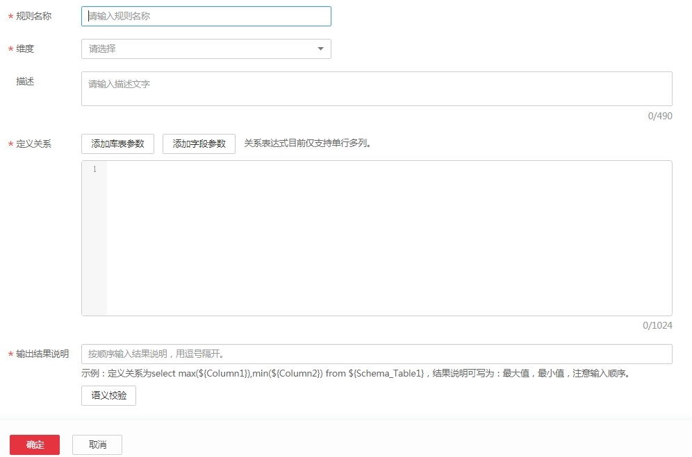

# 创建规则

创建规则是数据质量的核心，数据质量支持对离线数据的监控，您可根据表的实际需要创建规则。目前创建规则的方式包括模板规则和自定义规则。

系统内置的模板规则共计19种，分为库级规则，表级规则，字段级规则和跨字段级规则四种类型。当系统内置规则模板不足以满足您的需求，请参见下文自定义规则模板。

1.  选择“数据质量监控  \>  规则模板“，单击“新建“，在弹出的新建规则模板页面中进行配置。

    **图 1**  新建规则模板  
    

2.  输入规则名称，选择规则匹配的维度，定义sql模板并对输出结果进行说明注释后，单击“确定“。
    -   维度：数据质量支持从完整性、有效性、及时性、一致性、准确性、唯一性六个维度进行单列、跨列、跨行和跨表的分析。自定义质量规则时，请对此规则进行维度匹配。
    -   定义关系：输入sql语句，实现对数据的查找。
    -   输出结果说明：对sql获得结果的每一列进行说明，列说明之间用逗号进行分隔。

        **图 2**  配置规则模板  
        

