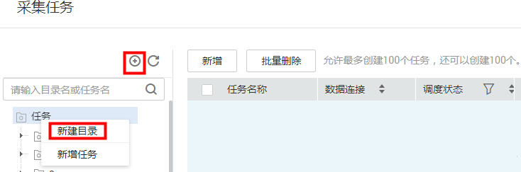
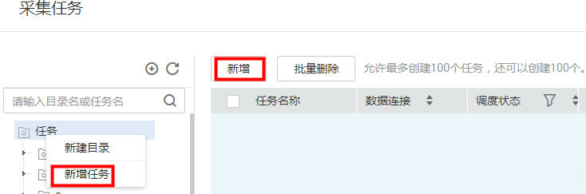

# 创建采集任务

通过配置元数据采集策略新建采集任务，不同类型的数据源的采集策略不尽相同。元数据管理依据采集任务的配置策略，采集对应的技术元数据信息。

## 入口说明

创建采集任务，需要选择该任务所归属的目录，请参见[图1](#zh-cn_topic_0141836083_fig142971113815)创建归属目录。

**图 1**  新建采集任务的归属目录  

新建任务有如[图2](#zh-cn_topic_0141836083_fig278352781015)所示的两个入口。

**图 2**  新建采集任务入口  

## 新增采集任务

1.  [登录DAYU控制台](https://console.huaweicloud.com/dayu/)，找到所需要的DAYU实例，单击实例卡片上的“进入控制台”，进入概览页面。

    选择“空间管理”页签，完成工作空间的创建。

    在工作空间列表中，找到所需要的工作空间。

1.  单击相应工作空间的“数据资产“。

    系统跳转至“数据资产“页面。

1.  选择“元数据管理  \>  采集任务“。
2.  单击“新增“或者任务菜单后的“新增任务“，在弹出的对话框中，参见[表1](#zh-cn_topic_0141836083_table105313428316)配置相关参数，新建采集任务。

    **表 1**  配置采集任务参数

    
    <table><thead align="left"><tr id="zh-cn_topic_0141836083_row553544283118"><th class="cellrowborder" valign="top" width="21.07%" id="mcps1.2.3.1.1">
参数名

    </th>
    <th class="cellrowborder" valign="top" width="78.93%" id="mcps1.2.3.1.2">
说明

    </th>
    </tr>
    </thead>
    <tbody><tr id="zh-cn_topic_0141836083_row18536164263118"><td class="cellrowborder" valign="top" width="21.07%" headers="mcps1.2.3.1.1 ">
数据源类型

    </td>
    <td class="cellrowborder" valign="top" width="78.93%" headers="mcps1.2.3.1.2 ">
从下拉列表中选择数据源类型。

    </td>
    </tr>
    <tr id="zh-cn_topic_0141836083_row3611947602"><td class="cellrowborder" valign="top" width="21.07%" headers="mcps1.2.3.1.1 ">
OBS桶

    </td>
    <td class="cellrowborder" valign="top" width="78.93%" headers="mcps1.2.3.1.2 ">
选择待采集数据归属的OBS桶，仅数据源类型为OBS时，呈现此参数。

    </td>
    </tr>
    <tr id="zh-cn_topic_0141836083_row35360424312"><td class="cellrowborder" valign="top" width="21.07%" headers="mcps1.2.3.1.1 ">
数据连接

    </td>
    <td class="cellrowborder" valign="top" width="78.93%" headers="mcps1.2.3.1.2 "><ul id="zh-cn_topic_0141836083_ul12455454717"><li>所选数据连接类型中已创建数据连接，支持从下拉列表中选择。</li><li>所选数据连接类型中未创建数据连接，请单击“新建”，创建新的数据连接。</li></ul>
    </td>
    </tr>
    <tr id="zh-cn_topic_0141836083_row105361242173111"><td class="cellrowborder" valign="top" width="21.07%" headers="mcps1.2.3.1.1 ">
任务名称

    </td>
    <td class="cellrowborder" valign="top" width="78.93%" headers="mcps1.2.3.1.2 ">
采集任务的名称，只能包含英文字母、数字、“_”，且长度为1~63个字符。

    </td>
    </tr>
    <tr id="zh-cn_topic_0141836083_row5550175812324"><td class="cellrowborder" valign="top" width="21.07%" headers="mcps1.2.3.1.1 ">
描述

    </td>
    <td class="cellrowborder" valign="top" width="78.93%" headers="mcps1.2.3.1.2 ">
为更好的识别采集任务 ，此处加以描述信息。描述信息只能包含英文字母、数字、“_”，且长度不能超过255个字符。

    </td>
    </tr>
    <tr id="zh-cn_topic_0141836083_row015812693317"><td class="cellrowborder" valign="top" width="21.07%" headers="mcps1.2.3.1.1 ">
选择目录

    </td>
    <td class="cellrowborder" valign="top" width="78.93%" headers="mcps1.2.3.1.2 ">
采集任务的存储目录，可选择已创建的目录。目录创建请参见<a href="#zh-cn_topic_0141836083_fig142971113815">图1</a>。

    </td>
    </tr>
    <tr id="zh-cn_topic_0141836083_row670553113316"><td class="cellrowborder" valign="top" width="21.07%" headers="mcps1.2.3.1.1 ">
采集策略

    </td>
    <td class="cellrowborder" valign="top" width="78.93%" headers="mcps1.2.3.1.2 ">
单击“设置”，选择采集任务对数据的采集策略，可以是整个数据库，也可以是单库或者单表。

    </td>
    </tr>
    <tr id="zh-cn_topic_0141836083_row1298952113111"><td class="cellrowborder" valign="top" width="21.07%" headers="mcps1.2.3.1.1 ">
OBS路径

    </td>
    <td class="cellrowborder" valign="top" width="78.93%" headers="mcps1.2.3.1.2 ">
选择待采集数据归属的OBS路径，仅数据源类型为OBS时，呈现此参数。

    </td>
    </tr>
    <tr id="zh-cn_topic_0141836083_row1214919116330"><td class="cellrowborder" valign="top" width="21.07%" headers="mcps1.2.3.1.1 ">
数据库

    </td>
    <td class="cellrowborder" rowspan="2" valign="top" width="78.93%" headers="mcps1.2.3.1.2 ">
呈现待采集的数据库和数据表，可在文本框中进行删减。

    </td>
    </tr>
    <tr id="zh-cn_topic_0141836083_row1610223115359"><td class="cellrowborder" valign="top" headers="mcps1.2.3.1.1 ">
数据表

    </td>
    </tr>
    <tr id="zh-cn_topic_0141836083_row266441516458"><td class="cellrowborder" valign="top" width="21.07%" headers="mcps1.2.3.1.1 ">
作业时间

    </td>
    <td class="cellrowborder" valign="top" width="78.93%" headers="mcps1.2.3.1.2 ">
设置按照时间段采集相关作业。

    </td>
    </tr>
    </tbody>
    </table>

3.  单击“下一步“，选择调度方式，支持单次调度和周期调度两种方式，周期调度的相关参数配置请参见[表2](#zh-cn_topic_0141836083_table75621469441)。

    > **说明：**   
    >1.  单次调度会产生手动任务的实例，手动任务的特点是没有调度依赖，只需要手动触发即可。  
    >2.  周期调度会产生周期实例，周期实例是周期任务达到启用调度所配置的周期性运行时间时，被自动调度起来的实例快照。  
    >3.  周期任务每调度一次，便生成一个实例工作流。您可以对已调度起的实例任务进行日常的运维管理，如查看运行状态，对任务进行终止、重跑等操作。  

    **表 2**  配置周期调度参数

    
    <table><thead align="left"><tr id="zh-cn_topic_0141836083_row1656214694416"><th class="cellrowborder" valign="top" width="27.58%" id="mcps1.2.3.1.1">
参数名

    </th>
    <th class="cellrowborder" valign="top" width="72.42%" id="mcps1.2.3.1.2">
说明

    </th>
    </tr>
    </thead>
    <tbody><tr id="zh-cn_topic_0141836083_row856213462449"><td class="cellrowborder" valign="top" width="27.58%" headers="mcps1.2.3.1.1 ">
生效日期

    </td>
    <td class="cellrowborder" valign="top" width="72.42%" headers="mcps1.2.3.1.2 ">
调度任务的生效时间段

    </td>
    </tr>
    <tr id="zh-cn_topic_0141836083_row65623466445"><td class="cellrowborder" valign="top" width="27.58%" headers="mcps1.2.3.1.1 ">
调度周期

    </td>
    <td class="cellrowborder" valign="top" width="72.42%" headers="mcps1.2.3.1.2 ">
选择调度任务的执行周期，并配置相关参数。

    <ul id="zh-cn_topic_0141836083_ul9562114610446"><li>分</li><li>小时</li><li>天</li><li>周</li></ul>
    </td>
    </tr>
    <tr id="zh-cn_topic_0141836083_row95621046154413"><td class="cellrowborder" valign="top" width="27.58%" headers="mcps1.2.3.1.1 ">
启动调度

    </td>
    <td class="cellrowborder" valign="top" width="72.42%" headers="mcps1.2.3.1.2 ">
勾选复选框，则表示立即启动此调度任务。

    </td>
    </tr>
    </tbody>
    </table>

## 管理采集任务

右侧快捷入口栏中单击“数据资产“。系统跳转至数据资产页面，选择“元数据管理  \>  采集任务“。

在采集任务页面，可查看所有已创建的采集任务。

**表 3**  管理采集任务

<table><thead align="left"><tr id="zh-cn_topic_0141836083_row1922973120286"><th class="cellrowborder" valign="top" width="17.150000000000002%" id="mcps1.2.3.1.1">
参数名

</th>
<th class="cellrowborder" valign="top" width="82.85%" id="mcps1.2.3.1.2">
说明

</th>
</tr>
</thead>
<tbody><tr id="zh-cn_topic_0141836083_row8234143119282"><td class="cellrowborder" valign="top" width="17.150000000000002%" headers="mcps1.2.3.1.1 ">
任务名称

</td>
<td class="cellrowborder" valign="top" width="82.85%" headers="mcps1.2.3.1.2 ">
采集任务的名称。

单击采集任务名称，可查看该采集任务的采集策略和调度属性。

</td>
</tr>
<tr id="zh-cn_topic_0141836083_row1723483112816"><td class="cellrowborder" valign="top" width="17.150000000000002%" headers="mcps1.2.3.1.1 ">
数据源类型

</td>
<td class="cellrowborder" valign="top" width="82.85%" headers="mcps1.2.3.1.2 ">
数据连接的名称。

</td>
</tr>
<tr id="zh-cn_topic_0141836083_row52341331152817"><td class="cellrowborder" valign="top" width="17.150000000000002%" headers="mcps1.2.3.1.1 ">
调度状态

</td>
<td class="cellrowborder" valign="top" width="82.85%" headers="mcps1.2.3.1.2 ">
显示采集任务的调度方式，单击，可进行筛选。

</td>
</tr>
<tr id="zh-cn_topic_0141836083_row152348319286"><td class="cellrowborder" valign="top" width="17.150000000000002%" headers="mcps1.2.3.1.1 ">
调度频率

</td>
<td class="cellrowborder" valign="top" width="82.85%" headers="mcps1.2.3.1.2 ">
显示采集任务的调度频率，单击，可进行筛选。

</td>
</tr>
<tr id="zh-cn_topic_0141836083_row172341831172815"><td class="cellrowborder" valign="top" width="17.150000000000002%" headers="mcps1.2.3.1.1 ">
描述

</td>
<td class="cellrowborder" valign="top" width="82.85%" headers="mcps1.2.3.1.2 ">
展示采集任务的描述信息。

</td>
</tr>
<tr id="zh-cn_topic_0141836083_row6891102614294"><td class="cellrowborder" valign="top" width="17.150000000000002%" headers="mcps1.2.3.1.1 ">
创建人

</td>
<td class="cellrowborder" valign="top" width="82.85%" headers="mcps1.2.3.1.2 ">
展示采集任务的创建人。

</td>
</tr>
<tr id="zh-cn_topic_0141836083_row10580183752912"><td class="cellrowborder" valign="top" width="17.150000000000002%" headers="mcps1.2.3.1.1 ">
创建时间

</td>
<td class="cellrowborder" valign="top" width="82.85%" headers="mcps1.2.3.1.2 ">
展示采集任务的创建时间。

</td>
</tr>
<tr id="zh-cn_topic_0141836083_row109871947102915"><td class="cellrowborder" valign="top" width="17.150000000000002%" headers="mcps1.2.3.1.1 ">
操作

</td>
<td class="cellrowborder" valign="top" width="82.85%" headers="mcps1.2.3.1.2 ">
对已创建的采集任务可进行如下操作：

<ul id="zh-cn_topic_0141836083_ul290595718720"><li>编辑：支持对采集任务（状态为已启动，未启动，运行失败）的采集策略强相关参数进行修改，不支持修改数据源类型。</li><li>运行：单击“运行”，可运行此采集任务，并可在“任务监控”页面查看其状态和相关日志信息。</li><li>启动调度：当其状态为“已停止”，则可重新启动调度。</li><li>停止调度：仅对周期调度的采集任务有效，当其状态为“调度中”，则可停止调度。</li></ul>
</td>
</tr>
</tbody>
</table>

