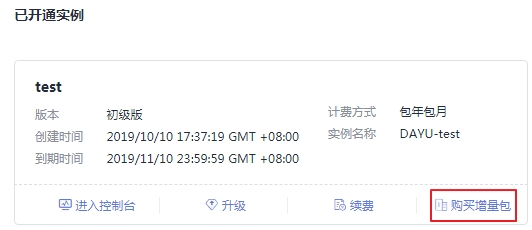
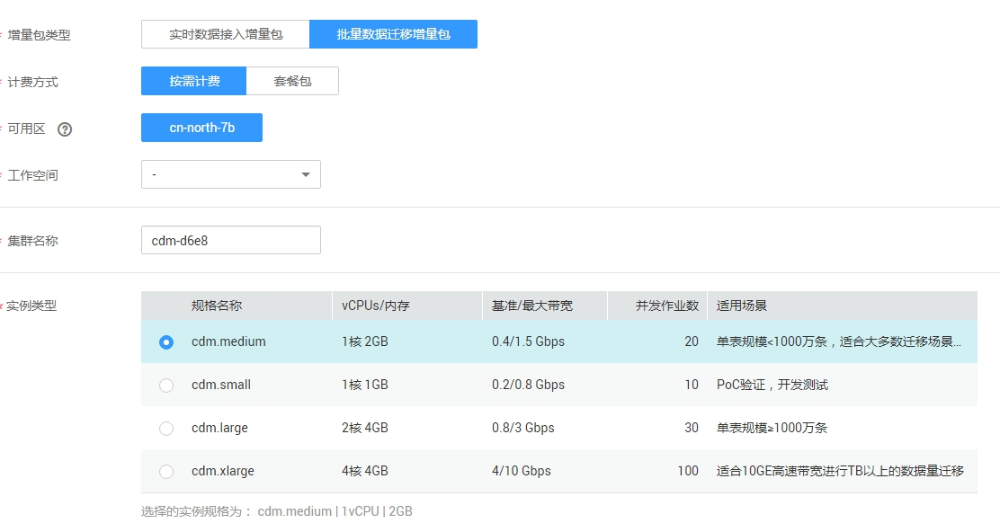

# 创建集群

## 操作场景

目前批量数据迁移采用独立集群的方式为用户提供安全可靠的数据迁移服务，各集群之间相互隔离，不可相互访问。目前一个集群只支持一个服务器，后期规划支持自动扩容。

## 前提条件

已申请VPC、子网和安全组。批量数据迁移集群连接云上其它服务时，需确保批量数据迁移集群与待连接的云服务在同一个VPC。如果批量数据迁移集群与其它云服务所属不同VPC，则批量数据迁移集群需要通过EIP连接云服务。

> **说明：**   
>如果配置了VPC对等连接，可能会出现对端VPC子网与CDM管理网重叠，从而无法访问对端VPC中数据源的情况。推荐使用公网做跨VPC数据迁移，或联系管理员在CDM后台为VPC对等连接添加特定路由。  

## 按需计费方式购买批量数据迁移增量包

1.  单击已开通实例卡片上的“购买增量包“。

    **图 1**  购买增量包  
    

1.  进入购买DAYU增量包页面，参见[图2](#zh-cn_topic_0197155665_fig16853116181012)进行配置。

    **图 2**  配置批量数据迁移增量包  
    

    **表 1**  配置批量数据迁移的增量包

    
    <table><thead align="left"><tr id="zh-cn_topic_0197155665_row885412616106"><th class="cellrowborder" valign="top" width="21.529999999999998%" id="mcps1.2.3.1.1">
参数

    </th>
    <th class="cellrowborder" valign="top" width="78.47%" id="mcps1.2.3.1.2">
说明

    </th>
    </tr>
    </thead>
    <tbody><tr id="zh-cn_topic_0197155665_row4854464105"><td class="cellrowborder" valign="top" width="21.529999999999998%" headers="mcps1.2.3.1.1 ">
增量包类型

    </td>
    <td class="cellrowborder" valign="top" width="78.47%" headers="mcps1.2.3.1.2 ">
选择批量数据迁移增量包。

    </td>
    </tr>
    <tr id="zh-cn_topic_0197155665_row16855562104"><td class="cellrowborder" valign="top" width="21.529999999999998%" headers="mcps1.2.3.1.1 ">
计费方式

    </td>
    <td class="cellrowborder" valign="top" width="78.47%" headers="mcps1.2.3.1.2 ">
选择按需计费。

    </td>
    </tr>
    <tr id="zh-cn_topic_0197155665_row196241012202014"><td class="cellrowborder" valign="top" width="21.529999999999998%" headers="mcps1.2.3.1.1 ">
可用区

    </td>
    <td class="cellrowborder" valign="top" width="78.47%" headers="mcps1.2.3.1.2 ">
请参见<a href="https://support.huaweicloud.com/productdesc-cdm/cdm_01_0200.html" target="_blank" rel="noopener noreferrer">什么是可用区</a>。

    </td>
    </tr>
    <tr id="zh-cn_topic_0197155665_row08553681013"><td class="cellrowborder" valign="top" width="21.529999999999998%" headers="mcps1.2.3.1.1 ">
工作空间

    </td>
    <td class="cellrowborder" valign="top" width="78.47%" headers="mcps1.2.3.1.2 ">
选择需要使用批量数据迁移增量包的工作空间。例如在DAYU实例test的A工作空间中按需购买批量数据迁移的增量包，这里工作空间选择A。购买成功后，即可通过A工作空间查看到已经创建的批量数据迁移集群。

    </td>
    </tr>
    <tr id="zh-cn_topic_0197155665_row208551561101"><td class="cellrowborder" valign="top" width="21.529999999999998%" headers="mcps1.2.3.1.1 ">
集群名称

    </td>
    <td class="cellrowborder" valign="top" width="78.47%" headers="mcps1.2.3.1.2 ">
自定义批量数据迁移集群名称。

    </td>
    </tr>
    <tr id="zh-cn_topic_0197155665_row585512613100"><td class="cellrowborder" valign="top" width="21.529999999999998%" headers="mcps1.2.3.1.1 ">
实例类型

    </td>
    <td class="cellrowborder" valign="top" width="78.47%" headers="mcps1.2.3.1.2 ">
目前批量数据迁移集群支持以下规格供用户选择：

    <ul id="zh-cn_topic_0197155665_ul89841417102112"><li>cdm.small：2核CPU、4G内存的虚拟机，最大带宽/基准带宽为0.8/0.2Gbps，能够并发执行的作业个数为10，适合PoC验证和开发测试。</li><li>cdm.medium：4核CPU、8G内存的虚拟机，最大带宽/基准带宽为1.5/0.4Gbps，能够并发执行的作业个数为20，适合单张表规模&lt;1000万条的场景。</li><li>cdm.large：8核CPU、16G内存的虚拟机，最大带宽/基准带宽为3/0.8Gbps，能够并发执行的作业个数为30，适合单张表规模≥1000万条的场景。</li><li>cdm.xlarge：16核CPU、32G内存的虚拟机，最大带宽/基准带宽为10/4Gbps，能够并发执行的作业个数为100，适合使用10GE高速带宽进行TB以上的数据量迁移。</li></ul>
    </td>
    </tr>
    <tr id="zh-cn_topic_0197155665_row11855168108"><td class="cellrowborder" valign="top" width="21.529999999999998%" headers="mcps1.2.3.1.1 ">
虚拟私有云

    </td>
    <td class="cellrowborder" rowspan="3" valign="top" width="78.47%" headers="mcps1.2.3.1.2 ">
批量数据迁移集群所属VPC、子网、安全组，需确保批量数据迁移集群与待连接的数据源能正常通信。用户可以根据批量数据迁移迁移的数据源端、目的端所处网络进行选择：

    <ul id="zh-cn_topic_0197155665_ul17018187216"><li>如果批量数据迁移集群与待连接的数据源所属不同的VPC，或者待连接的为本地数据源时，批量数据迁移集群需要绑定EIP，通过公网通信。</li><li>如果待连接的数据源为云上服务，则推荐批量数据迁移集群的网络配置与该云服务一致，此时批量数据迁移集群不用绑定EIP，通过内网通信。</li><li>如果待连接的数据源为云上服务，批量数据迁移与它在同一个VPC但所属不同子网，则可以通过配置安全组规则来使批量数据迁移集群与云服务间的网络互通。</li></ul>
    
VPC、子网、安全组的详细操作，请参见《<a href="https://support.huaweicloud.com/usermanual-vpc/vpc_0001.html" target="_blank" rel="noopener noreferrer">虚拟私有云用户指南</a>》。

    </td>
    </tr>
    <tr id="zh-cn_topic_0197155665_row1585612601011"><td class="cellrowborder" valign="top" headers="mcps1.2.3.1.1 ">
子网

    </td>
    </tr>
    <tr id="zh-cn_topic_0197155665_row1885611661012"><td class="cellrowborder" valign="top" headers="mcps1.2.3.1.1 ">
安全组

    </td>
    </tr>
    </tbody>
    </table>

2.  单击“立即购买“，确认规格后提交订单。
3.  购买成功后，即可返回对应的工作空间查看已购买的批量数据迁移集群。

