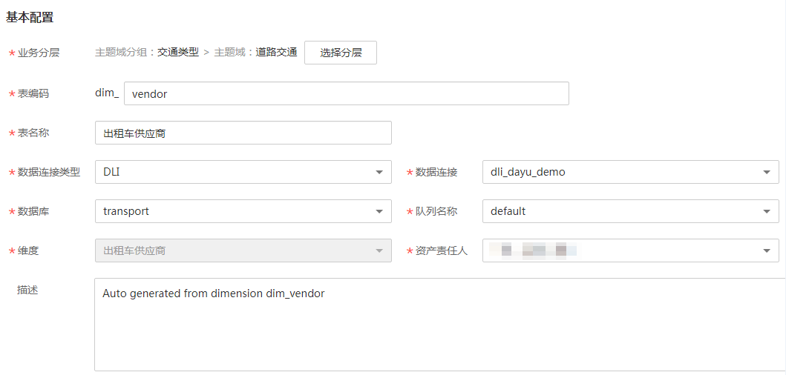

# 发布维度表

与维度一一对应，通过丰富维度中的属性信息构建形成。维度发布成功后系统自动创建对应的维度逻辑表，支持模型信息展示、属性添加、维度关联等功能。

## 发布维度表

维度审核通过后，维度表就自动创建好了，但是维度表还没有发布，我们还需要发布维度表。

1.  [登录DAYU控制台](https://console.huaweicloud.com/dayu/)，找到所需要的DAYU实例，单击实例卡片上的“进入控制台”，进入概览页面。

    选择“空间管理”页签，完成工作空间的创建。

    在工作空间列表中，找到所需要的工作空间。

1.  单击相应工作空间的“规范设计“。

    系统跳转至规范设计页面。

1.  在规范设计页面，单击左侧导航树中的“维度建模“，选择“维度表”页签。
2.  在维度表列表中，找到之前建好的维度表，单击“编辑”。
3.  在“编辑维度表”页面，设置维度表参数，如下图所示，然后单击“发布”。

    **图 1**  编辑维度表  
    

    **表 1**  维度表参数说明

    
    <table><thead align="left"><tr id="zh-cn_topic_0171848091_row247512573431"><th class="cellrowborder" valign="top" width="24.81%" id="mcps1.2.3.1.1">
参数名称

    </th>
    <th class="cellrowborder" valign="top" width="75.19%" id="mcps1.2.3.1.2">
说明

    </th>
    </tr>
    </thead>
    <tbody><tr id="zh-cn_topic_0171848091_row134751357194320"><td class="cellrowborder" valign="top" width="24.81%" headers="mcps1.2.3.1.1 ">
业务分层

    </td>
    <td class="cellrowborder" valign="top" width="75.19%" headers="mcps1.2.3.1.2 ">
单击“选择分层”，选择维度表所属的主题域分组、主题域和业务对象。

    </td>
    </tr>
    <tr id="zh-cn_topic_0171848091_row14756577436"><td class="cellrowborder" valign="top" width="24.81%" headers="mcps1.2.3.1.1 ">
表编码

    </td>
    <td class="cellrowborder" valign="top" width="75.19%" headers="mcps1.2.3.1.2 ">
设置表编码，一般不需要修改。

    
只能以英文字母开头，支持英文字母、数字和下划线。

    </td>
    </tr>
    <tr id="zh-cn_topic_0171848091_row347575710439"><td class="cellrowborder" valign="top" width="24.81%" headers="mcps1.2.3.1.1 ">
表名称

    </td>
    <td class="cellrowborder" valign="top" width="75.19%" headers="mcps1.2.3.1.2 ">
设置表名称，一般不需要修改。

    
只能是中文或英文字母开头，支持中文、英文字母、数字和下划线。

    </td>
    </tr>
    <tr id="zh-cn_topic_0171848091_row04758579435"><td class="cellrowborder" valign="top" width="24.81%" headers="mcps1.2.3.1.1 ">
数据连接类型

    </td>
    <td class="cellrowborder" valign="top" width="75.19%" headers="mcps1.2.3.1.2 ">
根据下拉框选择对应的数据连接类型。

    </td>
    </tr>
    <tr id="zh-cn_topic_0171848091_row1647675718433"><td class="cellrowborder" valign="top" width="24.81%" headers="mcps1.2.3.1.1 ">
数据连接

    </td>
    <td class="cellrowborder" valign="top" width="75.19%" headers="mcps1.2.3.1.2 ">
根据下拉框选择对应的数据连接。

    </td>
    </tr>
    <tr id="zh-cn_topic_0171848091_row147685714317"><td class="cellrowborder" valign="top" width="24.81%" headers="mcps1.2.3.1.1 ">
数据库

    </td>
    <td class="cellrowborder" valign="top" width="75.19%" headers="mcps1.2.3.1.2 ">
根据下拉框选择对应的数据库。

    </td>
    </tr>
    <tr id="zh-cn_topic_0171848091_row15476185715433"><td class="cellrowborder" valign="top" width="24.81%" headers="mcps1.2.3.1.1 ">
维度

    </td>
    <td class="cellrowborder" valign="top" width="75.19%" headers="mcps1.2.3.1.2 ">
-

    </td>
    </tr>
    <tr id="zh-cn_topic_0171848091_row15476357174310"><td class="cellrowborder" valign="top" width="24.81%" headers="mcps1.2.3.1.1 ">
资产责任人

    </td>
    <td class="cellrowborder" valign="top" width="75.19%" headers="mcps1.2.3.1.2 ">
根据下拉框选择对应的资产责任人。

    </td>
    </tr>
    <tr id="zh-cn_topic_0171848091_row10476757134314"><td class="cellrowborder" valign="top" width="24.81%" headers="mcps1.2.3.1.1 ">
描述

    </td>
    <td class="cellrowborder" valign="top" width="75.19%" headers="mcps1.2.3.1.2 ">
描述信息。支持的长度0~600字符。

    </td>
    </tr>
    </tbody>
    </table>

4.  在弹出框中，单击“确认提交”提交审核。
5.  参照步骤[4](#li3718104581714)\~步骤[6](#li871814517170)，完成其他维度表的编辑和发布。
6.  完成所有维度表的编辑和发布之后，需要等待审核人员审核。

    审核通过后，维度表在数据库中就建好了。

7.  返回“维度建模 \> 维度表“页面，在列表中找到刚发布的维度表，单击“更多 \> 发布日志“查看发布日志。

    表发布并通过审核后，系统会进行创建表、同步数据资产操作，通过“发布日志“可以查看流程处理的日志详情，同时可以查看操作是否成功以及处理失败的原因。

    -   如果“发布日志“显示成功，无错误日志，说明表在数据库中创建成功。
    -   如果“发布日志”中出现错误日志，说明表创建失败。

        请根据错误日志定位错误原因，问题解决后再单击“发布日志”对话框中的“重新同步“再次下发同步命令。在处理过程中，如果您有任何问题，请联系技术支持人员。

## 管理维度表

1.  在规范设计页面，选择“模型管理 \> 维度建模“，进入维度建模页面。
2.  单击“维度表“，进入维度表页面。

    **图 2**  维度表页面  
    

3.  您可以根据实际需要选择如下操作。

    
    <table><thead align="left"><tr id="zh-cn_topic_0171848091_row167461051211"><th class="cellrowborder" valign="top" width="37.9%" id="mcps1.1.3.1.1">
当需要...

    </th>
    <th class="cellrowborder" valign="top" width="62.1%" id="mcps1.1.3.1.2">
则...

    </th>
    </tr>
    </thead>
    <tbody><tr id="zh-cn_topic_0171848091_row137468516113"><td class="cellrowborder" valign="top" width="37.9%" headers="mcps1.1.3.1.1 ">
编辑

    </td>
    <td class="cellrowborder" valign="top" width="62.1%" headers="mcps1.1.3.1.2 ">
执行<a href="#li12516110181">4</a>。

    </td>
    </tr>
    <tr id="zh-cn_topic_0171848091_row1746651110"><td class="cellrowborder" valign="top" width="37.9%" headers="mcps1.1.3.1.1 ">
发布

    </td>
    <td class="cellrowborder" valign="top" width="62.1%" headers="mcps1.1.3.1.2 ">
执行<a href="#li95171141817">5</a>。

    </td>
    </tr>
    <tr id="zh-cn_topic_0171848091_row195105118312"><td class="cellrowborder" valign="top" width="37.9%" headers="mcps1.1.3.1.1 ">
下线

    </td>
    <td class="cellrowborder" valign="top" width="62.1%" headers="mcps1.1.3.1.2 ">
执行<a href="#li558119185">6</a>。

    </td>
    </tr>
    <tr id="zh-cn_topic_0171848091_row93081635144718"><td class="cellrowborder" valign="top" width="37.9%" headers="mcps1.1.3.1.1 ">
同步表模型

    </td>
    <td class="cellrowborder" valign="top" width="62.1%" headers="mcps1.1.3.1.2 ">
执行<a href="#li0531191819">7</a>。

    </td>
    </tr>
    <tr id="zh-cn_topic_0171848091_row9597213538"><td class="cellrowborder" valign="top" width="37.9%" headers="mcps1.1.3.1.1 ">
删除

    </td>
    <td class="cellrowborder" valign="top" width="62.1%" headers="mcps1.1.3.1.2 ">
执行<a href="#li36181181810">8</a>。

    </td>
    </tr>
    </tbody>
    </table>

4.  编辑
    1.  在需要编辑的维度表右侧，单击“编辑“，进入编辑维度表页面。
    2.  根据实际需要编辑相关内容。
    3.  单击“保存“，保存设置的信息；单击“发布“，发布设置的信息。

5.  发布
    1.  在需要发布的维度表右侧，单击“发布“，弹出“提交发布“对话框。
    2.  在下拉菜单中选择审核人。
    3.  单击“确定提交“。

6.  下线
    1.  在需要下线的维度表右侧，选择“更多 \> 下线“，系统弹出“提交下线“对话框。
    2.  在下拉菜单中选择审核人。
    3.  单击“确认提交“。

        > **说明：**   
        >-   草稿状态的维度逻辑表不支持下线操作。  
        >-   下线或删除维度表的前提是无依赖引用，包括维度表无使用、对应的维度没有被关联、对应的维度无子维度等。  

7.  查看发布日志
    1.  在列表中找到所需要的维度表，在右侧单击“更多 \> 发布日志“，弹出“发布日志“对话框。
    2.  如果“发布日志”中有错误日志，说明发布失败。您可以单击“重新同步“同步该维度表的元数据信息到DAYU的其他模块中。
    3.  完成后，单击“取消“关闭窗口。

8.  删除
    1.  勾选需要删除的维度表，单击左上角“删除“，系统弹出“删除“对话框。
    2.  单击“确定“。

