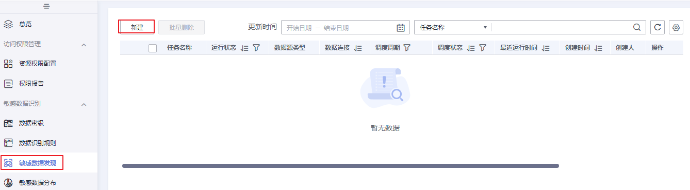
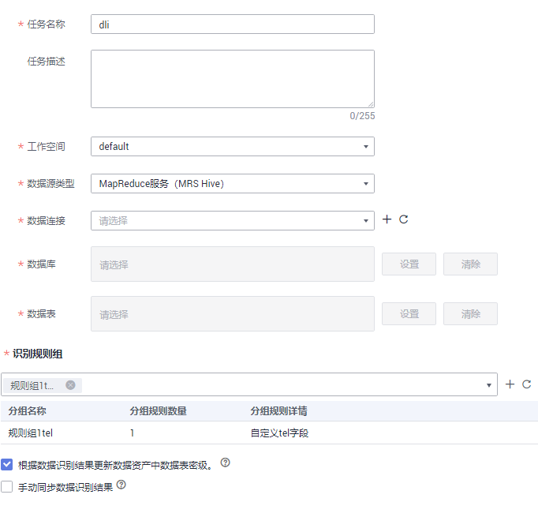
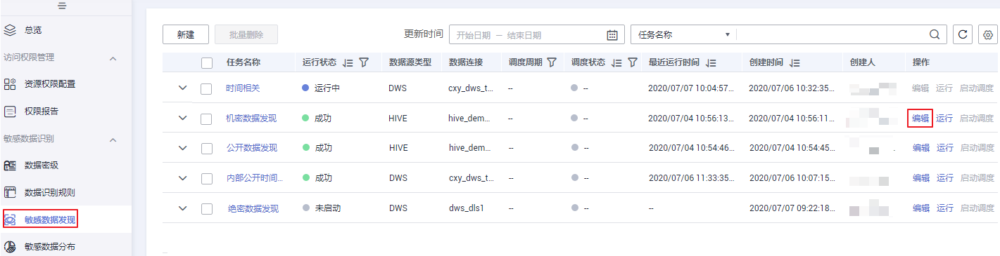
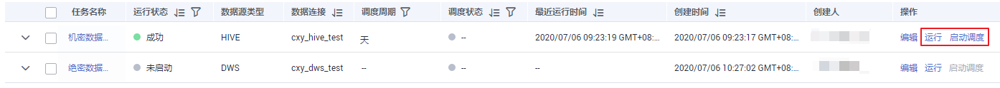
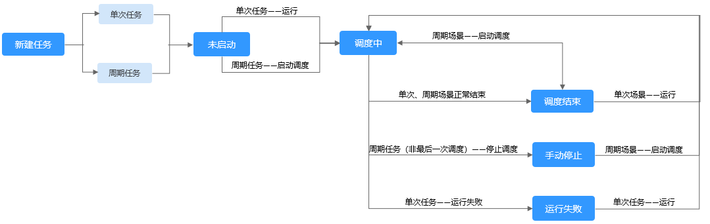
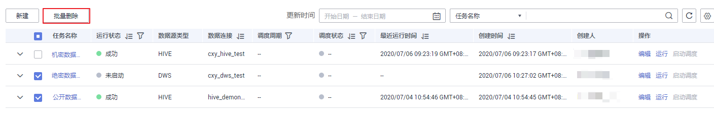
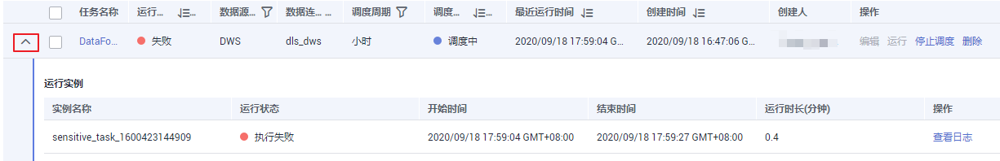

# 发现敏感数据

完成了敏感数据识别规则组定义后，用户就可以根据定义的规则来创建敏感数据识别任务，发现敏感数据。

## 前提条件

-   已完成敏感数据规则组定义，请参考[定义识别规则组](定义识别规则组.md)。
-   对于数据仓库服务（DWS）、数据湖探索（DLI）、MapReduce服务（MRS Hive）类型的数据源，首先需要在管理中心创建数据连接，请参考[创建数据连接](创建数据连接.md)。

## 创建敏感数据发现任务

1.  在DGC控制台首页，选择对应工作空间的“数据安全“模块，进入数据安全页面。

    **图 1**  选择数据安全  
    

1.  单击左侧导航树中的“敏感数据发现“，进入敏感数据发现页面。

    **图 2**  创建敏感数据发现任务  
    

2.  单击“新建“，进入新建发现任务页面，输入基本信息，参数配置参考[表1](#table99188713455)。

    **图 3**  新建发现任务参数配置  
    

    创建敏感数据发现任务参数配置说明：

    **表 1**  配置任务参数

    
    <table><thead align="left"><tr id="row29151277458"><th class="cellrowborder" valign="top" width="21.07%" id="mcps1.2.3.1.1">
参数名

    </th>
    <th class="cellrowborder" valign="top" width="78.93%" id="mcps1.2.3.1.2">
参数说明

    </th>
    </tr>
    </thead>
    <tbody><tr id="row1915173454"><td class="cellrowborder" valign="top" width="21.07%" headers="mcps1.2.3.1.1 ">
任务名称

    </td>
    <td class="cellrowborder" valign="top" width="78.93%" headers="mcps1.2.3.1.2 ">
采集任务的名称，只能包含英文字母、数字、“_”，且长度为64个字符。

    </td>
    </tr>
    <tr id="row491611724517"><td class="cellrowborder" valign="top" width="21.07%" headers="mcps1.2.3.1.1 ">
任务描述

    </td>
    <td class="cellrowborder" valign="top" width="78.93%" headers="mcps1.2.3.1.2 ">
为更好的识别敏感数据发现任务，此处加以描述信息。描述信息长度不能超过256个字符。

    </td>
    </tr>
    <tr id="row5640152311416"><td class="cellrowborder" valign="top" width="21.07%" headers="mcps1.2.3.1.1 ">
工作空间

    </td>
    <td class="cellrowborder" valign="top" width="78.93%" headers="mcps1.2.3.1.2 ">
数据所属工作空间。

    </td>
    </tr>
    <tr id="row109164724518"><td class="cellrowborder" valign="top" width="21.07%" headers="mcps1.2.3.1.1 ">
数据源类型

    </td>
    <td class="cellrowborder" valign="top" width="78.93%" headers="mcps1.2.3.1.2 ">
从下拉列表中选择已创建的数据源类型。若未创建请参考<a href="创建数据连接.md">创建数据连接</a>新建连接。

    </td>
    </tr>
    <tr id="row5916872450"><td class="cellrowborder" valign="top" width="21.07%" headers="mcps1.2.3.1.1 ">
数据连接

    </td>
    <td class="cellrowborder" valign="top" width="78.93%" headers="mcps1.2.3.1.2 ">
所选数据连接类型中已创建数据连接，支持从下拉列表中选择。

    
所选数据连接类型中未创建数据连接，请单击“新建”，创建新的数据连接。

    </td>
    </tr>
    <tr id="row591710710457"><td class="cellrowborder" valign="top" width="21.07%" headers="mcps1.2.3.1.1 ">
数据库

    </td>
    <td class="cellrowborder" rowspan="2" valign="top" width="78.93%" headers="mcps1.2.3.1.2 ">
呈现待采集的数据库和数据表。

    <ul id="ul16917177144516"><li>单击数据库后的“设置”，设置采集任务扫描的数据库范围。当不进行设置时，默认选择该数据连接下的所有数据库 。</li><li>单击数据表后的“设置”，设置采集任务扫描的数据表范围。当不进行设置时，默认选择数据库下的所有数据表。针对数据连接类型为数据仓库服务（DWS）Mysql和数据湖探索（DLI）的数据表，支持按照正则表达式过滤需要采集的表。</li><li>当数据库和数据表均不设置时，则采集任务扫描的数据范围为该数据连接下的所有数据表。</li><li>单击“删除”，可对已选择的数据库和数据表进行修改。</li></ul>
    </td>
    </tr>
    <tr id="row691715744511"><td class="cellrowborder" valign="top" headers="mcps1.2.3.1.1 ">
数据表

    </td>
    </tr>
    <tr id="row82742914155"><td class="cellrowborder" valign="top" width="21.07%" headers="mcps1.2.3.1.1 ">
SQL队列

    </td>
    <td class="cellrowborder" valign="top" width="78.93%" headers="mcps1.2.3.1.2 ">
数据源类型为DLI时，需要设置SQL队列。该参数表示执行DLI作业时的队列（不要使用default队列，因为该队列不支持获取查询结果）。

    </td>
    </tr>
    <tr id="row2136163424211"><td class="cellrowborder" valign="top" width="21.07%" headers="mcps1.2.3.1.1 ">
计算引擎

    </td>
    <td class="cellrowborder" valign="top" width="78.93%" headers="mcps1.2.3.1.2 ">
数据源类型为DWS或DLI时，需要设置敏感数据发现任务的引擎。请确保所要使用的计算引擎对应的MRS集群，已经在管理中心创建了Hive数据连接，否则无法选择使用该计算引擎。

    </td>
    </tr>
    <tr id="row184691113141516"><td class="cellrowborder" valign="top" width="21.07%" headers="mcps1.2.3.1.1 ">
绑定Agent

    </td>
    <td class="cellrowborder" valign="top" width="78.93%" headers="mcps1.2.3.1.2 ">
数据源类型为DLI时，需要设置由CDM集群提供的代理服务。

    </td>
    </tr>
    <tr id="row591718719457"><td class="cellrowborder" valign="top" width="21.07%" headers="mcps1.2.3.1.1 ">
识别规则组

    </td>
    <td class="cellrowborder" valign="top" width="78.93%" headers="mcps1.2.3.1.2 ">
从下拉列表中选择数据识别规则组，若未定义请参考<a href="定义识别规则组.md">定义识别规则组</a>新建。

    </td>
    </tr>
    <tr id="row169171976455"><td class="cellrowborder" valign="top" width="21.07%" headers="mcps1.2.3.1.1 ">
根据数据识别结果更新数据资产中数据表密级

    </td>
    <td class="cellrowborder" valign="top" width="78.93%" headers="mcps1.2.3.1.2 ">
勾选表示将根据数据识别结果去更新数据资产中所对应数据表的密级。

    </td>
    </tr>
    <tr id="row169185715451"><td class="cellrowborder" valign="top" width="21.07%" headers="mcps1.2.3.1.1 ">
手动同步数据识别结果

    </td>
    <td class="cellrowborder" valign="top" width="78.93%" headers="mcps1.2.3.1.2 ">
勾选表示手动确认数据识别结果，是否同步更新到数据资产中。

    </td>
    </tr>
    </tbody>
    </table>

3.  单击“下一步“，进行调度信息配置，调度方式选择单次调度直接勾选即可。

    **图 4**  周期调度配置参数  
    

    周期调度参数配置参考[表2](#zh-cn_topic_0141836089_table117064413127)。

    **表 2**  配置周期调度参数

    
    <table><thead align="left"><tr id="zh-cn_topic_0141836089_row5714194151214"><th class="cellrowborder" valign="top" width="27.58%" id="mcps1.2.3.1.1">
参数名

    </th>
    <th class="cellrowborder" valign="top" width="72.42%" id="mcps1.2.3.1.2">
说明

    </th>
    </tr>
    </thead>
    <tbody><tr id="zh-cn_topic_0141836089_row871554191219"><td class="cellrowborder" valign="top" width="27.58%" headers="mcps1.2.3.1.1 ">
调度日期

    </td>
    <td class="cellrowborder" valign="top" width="72.42%" headers="mcps1.2.3.1.2 ">
调度任务的生效时间段。

    </td>
    </tr>
    <tr id="zh-cn_topic_0141836089_row2071644141217"><td class="cellrowborder" valign="top" width="27.58%" headers="mcps1.2.3.1.1 ">
调度周期

    </td>
    <td class="cellrowborder" valign="top" width="72.42%" headers="mcps1.2.3.1.2 ">
选择调度任务的执行周期，并配置相关参数。

    <ul id="zh-cn_topic_0141836089_ul1937815611617"><li>分</li><li>小时</li><li>天
调度时会从每天对应的时间执行。

    </li><li>周
如果周期是“周”或“月”，那么调度时会从对应的星期几或几号执行。

    
例如：选择调度周期是周，调度区间是2020-06-30 15:52:43至2020-08-01 17:20:21，那么06-30是周二，也就是在调度区间内，每周二的15点52分43秒会执行任务。

    </li></ul>
    </td>
    </tr>
    <tr id="zh-cn_topic_0141836089_row3896645121511"><td class="cellrowborder" valign="top" width="27.58%" headers="mcps1.2.3.1.1 ">
立即启动

    </td>
    <td class="cellrowborder" valign="top" width="72.42%" headers="mcps1.2.3.1.2 ">
勾选复选框，则表示立即启动此调度任务。

    </td>
    </tr>
    </tbody>
    </table>

4.  单击“确定“，完成创建敏感数据发现任务。

## 编辑敏感数据发现任务

1.  在DGC控制台首页，选择对应工作空间的“数据安全“模块，进入数据安全页面。

    **图 5**  选择数据安全  
    

1.  单击左侧导航树中的“敏感数据发现“，进入敏感数据发现页面。
2.  在任务列表中单击“编辑“，编辑敏感数据发现任务。

    运行状态为正在“运行中“的任务不允许被编辑。

    **图 6**  编辑敏感数据发现任务  
    

## 调度运行敏感数据发现任务

1.  在DGC控制台首页，选择对应工作空间的“数据安全“模块，进入数据安全页面。

    **图 7**  选择数据安全  
    

1.  单击左侧导航树中的“敏感数据发现“，进入敏感数据发现页面。
2.  在任务列表单击待启动任务的“运行“或“启动调度“，运行和启动敏感数据发现任务。

    **图 8**  调度运行敏感数据发现任务  
    

    > **说明：** 
    >如果敏感数据发现任务执行成功后，界面不显示执行结果，并且在查看运行日志时发现无匹配信息，这种情况下说明执行该任务时没有发现任何敏感数据。

    您可以通过调度周期区分该任务是单次调度还是周期调度任务。单次调度任务不显示周期。

    任务调度状态机制参考[图9](#fig12746186121813)。

    **图 9**  任务调度状态机制图  
    

## 删除敏感数据发现任务

1.  在DGC控制台首页，选择对应工作空间的“数据安全“模块，进入数据安全页面。

    **图 10**  选择数据安全  
    

1.  单击左侧导航树中的“敏感数据发现“，进入敏感数据发现页面。
2.  勾选需要删除的敏感数据发现任务，单击“批量删除“。

    正在执行中的敏感数据发现任务不允许被删除。

    **图 11**  批量删除入口  
    

    > **说明：** 
    >删除操作无法撤销，请谨慎操作。

## 查看运行实例日志

1.  在DGC控制台首页，选择对应工作空间的“数据安全“模块，进入数据安全页面。

    **图 12**  选择数据安全  
    

2.  单击左侧导航树中的“敏感数据发现“，进入敏感数据发现页面。
3.  找到需要查看的实例并展开，单击“查看日志“，查看运行实例日志。

    运行失败可通过日志排查失败原因，问题修正后尝试重新运行。如果仍运行失败，请联系技术支持人员协助处理。

    **图 13**  查看运行实例日志  
    

