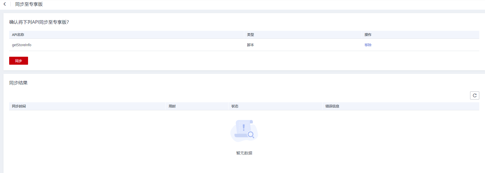

# 同步API

## 操作场景

您可以通过同步API功能，在数据服务共享版与专享版之前同步API。

## 前提条件

已创建API。

## 操作步骤

1.  在DGC控制台首页，选择对应工作空间的“数据服务“模块，进入数据服务页面。

    **图 1**  选择数据服务  
    

1.  在左侧导航栏选择服务版本（例如：专享版），进入总览页。
2.  单击“开发API  \>  API管理“页面，进入API管理页面。
3.  勾选待同步的API所在行，在API列表上方，选择“更多  \>  同步“，进入同步窗口。
4.  在窗口中点击同步进行开始API同步，同步结果中可以展示同步状态。

    **图 2**  同步API  
    

