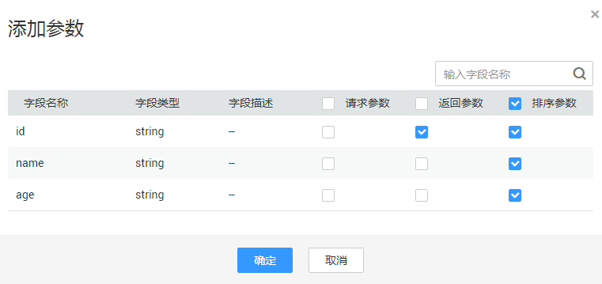
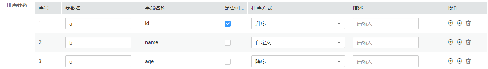
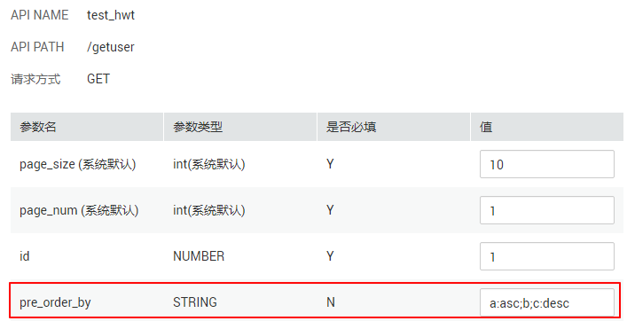

# 向导模式生成API

本节介绍如何通过向导模式生成API。

使用向导模式生成数据API简单且容易上手，您不需编写任何代码，通过产品界面进行勾选配置即可快速生成API。推荐对API功能的要求不高或者无代码开发经验的用户使用。

**图 1**  向导模式生成API流程  

## 前提条件

已在“管理中心  \>  数据连接“页面，完成数据源的配置。

## 管理API分组

API分组是同一种业务API的集合，一个API分组可视为一种服务（如征信查询服务）。API开发者以API为单位，管理应用内的所有API.

1.  [登录DAYU控制台](https://console.huaweicloud.com/dayu/)，找到所需要的DAYU实例，单击实例卡片上的“进入控制台”，进入概览页面。

    选择“空间管理”页签，完成工作空间的创建。

    在工作空间列表中，找到所需要的工作空间。

1.  单击相应工作空间的“数据服务“。

    系统跳转至“数据服务“页面。

1.  进入“数据服务\>  \>  总览  \>  开发API  \>  API分组“页面，单击“新建“。

    输入新建API分组名称，可新建API分组。

2.  对应已成功创建的API分组的操作列，可重新编辑API分组或者管理API。

    其中单击“编辑“，可修改API分组名称信息。

    单击“API管理“，可基于此API分组，新建，编辑和删除API。

## 绑定域名

开放API前，您需要为API分组绑定一个或多个独立域名，API网关通过独立域名定位到此分组。如果您未绑定独立域名，那么调用API时默认使用子域名，API网关对子域名的访问次数做了限制，每天最多可以访问1000次。

在绑定域名前，您需要理解以下2个概念：

-   子域名：API分组创建后，系统为分组自动分配一个内部测试用的子域名，此子域名唯一且不可更改，每天最多可以访问1000次。
-   独立域名：您自定义的域名，API调用者通过访问独立域名来调用您开放的API。

**前提条件**

-   已将独立域名CNAME解析到分组的子域名上，具体方法请参见[增加CNAME类型记录集](https://support.huaweicloud.com/usermanual-dns/dns_usermanual_0010.html  )。
-   如果API分组中的API支持HTTPS请求协议，那么在独立域名中需要添加SSL证书，请您提前准备SSL证书。此证书不支持导入，您需要填写证书的名称、内容和密钥。

**操作步骤**

1.  [登录DAYU控制台](https://console.huaweicloud.com/dayu/)，找到所需要的DAYU实例，单击实例卡片上的“进入控制台”，进入概览页面。

    选择“空间管理”页签，完成工作空间的创建。

    在工作空间列表中，找到所需要的工作空间。

1.  单击相应工作空间的“数据服务“。

    系统跳转至“数据服务“页面。

1.  单击“开放API  \>  API分组“，在待绑定域名的分组所在行，单击“域名管理“。
2.  单击绑定新域名，输入域名名称，单击。

    > **说明：**   
    >如果不再需要此域名时，在域名所在行，单击“解除绑定“。  

3.  （可选）API分组中的API支持HTTPS请求协议时，需要添加SSL证书。
    1.  单击“添加SSL证书“，弹出“添加SSL证书对话框“。
    2.  输入证书名称、证书内容和密钥，单击“确定“，完成SSL证书的添加。

## 配置API基本信息

1.  [登录DAYU控制台](https://console.huaweicloud.com/dayu/)，找到所需要的DAYU实例，单击实例卡片上的“进入控制台”，进入概览页面。

    选择“空间管理”页签，完成工作空间的创建。

    在工作空间列表中，找到所需要的工作空间。

1.  单击相应工作空间的“数据服务“。

    系统跳转至“数据服务“页面。

1.  进入“数据服务 \>  \>  总览  \>  开发API  \>  API管理“页面，单击“新建“，填写API基本信息。

    **表 1**  API基本信息

    
    <table><thead align="left"><tr id="zh-cn_topic_0180012632_row5944624142115"><th class="cellrowborder" valign="top" width="17.72%" id="mcps1.2.3.1.1">
配置

    </th>
    <th class="cellrowborder" valign="top" width="82.28%" id="mcps1.2.3.1.2">
说明

    </th>
    </tr>
    </thead>
    <tbody><tr id="zh-cn_topic_0180012632_row8944132412212"><td class="cellrowborder" valign="top" width="17.72%" headers="mcps1.2.3.1.1 ">
API名称

    </td>
    <td class="cellrowborder" valign="top" width="82.28%" headers="mcps1.2.3.1.2 ">
支持中文、英文、数字、下划线，且只能以英文或中文开头，3-64个字符。

    </td>
    </tr>
    <tr id="zh-cn_topic_0180012632_row159441924202111"><td class="cellrowborder" valign="top" width="17.72%" headers="mcps1.2.3.1.1 ">
API分组

    </td>
    <td class="cellrowborder" valign="top" width="82.28%" headers="mcps1.2.3.1.2 ">
一个特定功能或场景的API集合，是数据服务中API的最小组织单元，也是API网关中的最小管理单元。

    
您可单击“新建”进行新建，也可选择<a href="#zh-cn_topic_0180012632_section18624154416414">管理API分组</a>已创建的API分组。

    </td>
    </tr>
    <tr id="zh-cn_topic_0180012632_row19944122419211"><td class="cellrowborder" valign="top" width="17.72%" headers="mcps1.2.3.1.1 ">
请求Path

    </td>
    <td class="cellrowborder" valign="top" width="82.28%" headers="mcps1.2.3.1.2 ">
资源路径，也即API访问路径。

    
示例：/v2/{project_id}/streams

    </td>
    </tr>
    <tr id="zh-cn_topic_0180012632_row5944724132111"><td class="cellrowborder" valign="top" width="17.72%" headers="mcps1.2.3.1.1 ">
参数协议

    </td>
    <td class="cellrowborder" valign="top" width="82.28%" headers="mcps1.2.3.1.2 ">
用于传输请求的协议，支持HTTP和HTTPS协议。

    </td>
    </tr>
    <tr id="zh-cn_topic_0180012632_row4944624182114"><td class="cellrowborder" valign="top" width="17.72%" headers="mcps1.2.3.1.1 ">
请求方法

    </td>
    <td class="cellrowborder" valign="top" width="82.28%" headers="mcps1.2.3.1.2 ">
HTTP请求方法（也称为操作或动词），它告诉服务你正在请求什么类型的操作。

    
GET：请求服务器返回指定资源。

    
POST：请求服务器新增资源或执行特殊操作。

    </td>
    </tr>
    <tr id="zh-cn_topic_0180012632_row894416245216"><td class="cellrowborder" valign="top" width="17.72%" headers="mcps1.2.3.1.1 ">
描述

    </td>
    <td class="cellrowborder" valign="top" width="82.28%" headers="mcps1.2.3.1.2 ">
对API进行简要描述。

    </td>
    </tr>
    <tr id="zh-cn_topic_0180012632_row14789201319239"><td class="cellrowborder" valign="top" width="17.72%" headers="mcps1.2.3.1.1 ">
负责人

    </td>
    <td class="cellrowborder" valign="top" width="82.28%" headers="mcps1.2.3.1.2 ">
拥有API的审核权限。

    
单击“新建”，进入“审核中心 &gt; 审核人管理”页面，新建审核人。

    </td>
    </tr>
    <tr id="zh-cn_topic_0180012632_row1451110214238"><td class="cellrowborder" valign="top" width="17.72%" headers="mcps1.2.3.1.1 ">
是否公开

    </td>
    <td class="cellrowborder" valign="top" width="82.28%" headers="mcps1.2.3.1.2 ">
勾选，则发布的API将在服务市场公开售卖。

    </td>
    </tr>
    <tr id="zh-cn_topic_0180012632_row19497130152315"><td class="cellrowborder" valign="top" width="17.72%" headers="mcps1.2.3.1.1 ">
入参定义

    </td>
    <td class="cellrowborder" valign="top" width="82.28%" headers="mcps1.2.3.1.2 ">
配置API请求中的参数，包含资源路径中的动态参数，请求URI中的查询参数和Header参数。

    
以配置资源路径中的动态参数为例进行说明，例如资源路径（请求Path）设置为：

    
/v2/{project_id}/streams，资源路径中的{project_id}为动态参数，需要在此进行配置。

    <ol id="zh-cn_topic_0180012632_ol15807165012339"><li>单击“添加”，参数名配置为project_id。</li><li>参数位置选择PATH。</li><li>类型设置为STRING</li><li>选择性配置示例值和描述。</li></ol>
    </td>
    </tr>
    </tbody>
    </table>

2.  配置好API基本信息后，单击“下一步“，即可进入API取数逻辑页面。

## 配置取数逻辑

“取数方式“选择“配置方式“：

1.  选择数据源，数据连接，数据库，数据表，获取到需要配置的表。

    > **说明：**   
    >您需提前在数据集成中配置好数据源，数据表支持表名搜索。  

2.  配置参数字段

    选择好数据表之后，单击“参数设置“后的“添加“，添加参数页面自动列出这个表的所有字段，分别勾选需要设置为请求参数、返回参数和排序参数的字段，分别添加到请求参数、返回参数和排序参数列表当中。

    **图 2**  添加参数  
    

3.  编辑请求参数信息

    在请求参数列表中，设置绑定参数和操作符。

4.  编辑返回参数信息

    在返回参数列表中，设置参数的名称、参数类型、示例值和描述。

5.  编辑排序参数信息

    在排序参数列表中，设置排序字段是否可选，排序方式和描述。

    通过排序参数列表中的操作列的向上，向下和删除按钮，可调整排序参数的顺序或者删除某排序参数。

    **图 3**  编辑排序参数  
    

6.  单击“下一步“，设置pre\_order\_by的值为所有排序参数的描述，以“分号“进行分隔，如[图4](#zh-cn_topic_0180012632_fig1337415324911)所示。

    以[图3](#zh-cn_topic_0180012632_fig1128916411523)中的样例数据为例进行说明：

    **表 2**  排序字段对应的参数描述

    
    <table><thead align="left"><tr id="zh-cn_topic_0180012632_row15761313181618"><th class="cellrowborder" valign="top" width="27.33%" id="mcps1.2.3.1.1">
排序字段

    </th>
    <th class="cellrowborder" valign="top" width="72.67%" id="mcps1.2.3.1.2">
对应的排序参数描述

    </th>
    </tr>
    </thead>
    <tbody><tr id="zh-cn_topic_0180012632_row1457681381619"><td class="cellrowborder" valign="top" width="27.33%" headers="mcps1.2.3.1.1 ">
id

    </td>
    <td class="cellrowborder" valign="top" width="72.67%" headers="mcps1.2.3.1.2 ">
a:asc

    
其中，a是参数名，asc代表升序。

    </td>
    </tr>
    <tr id="zh-cn_topic_0180012632_row195772013191613"><td class="cellrowborder" valign="top" width="27.33%" headers="mcps1.2.3.1.1 ">
name

    </td>
    <td class="cellrowborder" valign="top" width="72.67%" headers="mcps1.2.3.1.2 "><ul id="zh-cn_topic_0180012632_ul12458416170"><li>b:asc</li><li>b</li><li>b:desc</li></ul>
    
其中，b是参数名，因为排序方式是自定义，所以有如上三种参数描述。

    </td>
    </tr>
    <tr id="zh-cn_topic_0180012632_row135775137164"><td class="cellrowborder" valign="top" width="27.33%" headers="mcps1.2.3.1.1 ">
age

    </td>
    <td class="cellrowborder" valign="top" width="72.67%" headers="mcps1.2.3.1.2 ">
c:desc

    
其中，c是参数名，desc代表降序

    </td>
    </tr>
    </tbody>
    </table>

    依据[表2](#zh-cn_topic_0180012632_table1357619134165)，分析得出各个字段对应的排序参数描述，则pre\_order\_by的设置方式有如下几种情况，包含所有排序参数的描述。

    **表 3**  配置pre\_order\_by

    
    <table><thead align="left"><tr id="zh-cn_topic_0180012632_row1897755082415"><th class="cellrowborder" valign="top" width="24.98%" id="mcps1.2.4.1.1">
pre_order_by

    </th>
    <th class="cellrowborder" valign="top" width="42.08%" id="mcps1.2.4.1.2">
对应的后端order by 语句

    </th>
    <th class="cellrowborder" valign="top" width="32.940000000000005%" id="mcps1.2.4.1.3">
备注

    </th>
    </tr>
    </thead>
    <tbody><tr id="zh-cn_topic_0180012632_row10978195010248"><td class="cellrowborder" valign="top" width="24.98%" headers="mcps1.2.4.1.1 ">
a:asc;b;c:desc

    </td>
    <td class="cellrowborder" valign="top" width="42.08%" headers="mcps1.2.4.1.2 ">
order by id ASC, name, age DESC

    </td>
    <td class="cellrowborder" valign="top" width="32.940000000000005%" headers="mcps1.2.4.1.3 ">
-

    </td>
    </tr>
    <tr id="zh-cn_topic_0180012632_row16978350122411"><td class="cellrowborder" valign="top" width="24.98%" headers="mcps1.2.4.1.1 ">
b;c:desc

    </td>
    <td class="cellrowborder" valign="top" width="42.08%" headers="mcps1.2.4.1.2 ">
order by name, age DESC

    </td>
    <td class="cellrowborder" valign="top" width="32.940000000000005%" headers="mcps1.2.4.1.3 ">
因a是可选排序字段，所以可以不填。

    </td>
    </tr>
    <tr id="zh-cn_topic_0180012632_row297845032413"><td class="cellrowborder" valign="top" width="24.98%" headers="mcps1.2.4.1.1 ">
b:asc;c:desc

    </td>
    <td class="cellrowborder" valign="top" width="42.08%" headers="mcps1.2.4.1.2 ">
order by name ASC; age DESC

    </td>
    <td class="cellrowborder" valign="top" width="32.940000000000005%" headers="mcps1.2.4.1.3 ">
b排序方式是自定义，排序时可选择升序。

    </td>
    </tr>
    <tr id="zh-cn_topic_0180012632_row1497845092419"><td class="cellrowborder" valign="top" width="24.98%" headers="mcps1.2.4.1.1 ">
b:desc;c:desc

    </td>
    <td class="cellrowborder" valign="top" width="42.08%" headers="mcps1.2.4.1.2 ">
order by name DESC; age DESC

    </td>
    <td class="cellrowborder" valign="top" width="32.940000000000005%" headers="mcps1.2.4.1.3 ">
b排序方式是自定义，排序时可选择降序。

    </td>
    </tr>
    </tbody>
    </table>

    **图 4**  配置排序参数值  
    

    > **须知：**   
    >-   pre\_order\_by是非必填参数，当未配置pre\_order\_by参数值时，则选取非可选排序字段作为排序的依据。  
    >-   当配置pre\_order\_by参数值时，配置类API需严格按照[图3](#zh-cn_topic_0180012632_fig1128916411523)设置的排序参数顺序进行设置。例如  
    >    a:asc;b;c:desc ，可行。当设置为b;a:asc;c:desc，则报错。  

## API测试

完成API参数的配置并保存后，单击左下角的“开始测试“，即可进入API测试环节。  填写参数值，单击“开始测试“，即可在线发送API请求，在右侧可以看到API请求详情及返回内容。如果测试失败，请仔细查看错误提示并做相应的修改重新测试。 配置过程中需要注意正常返回示例的设置。

完成API测试之后，单击“确定“，即成功生成了一个数据API。

