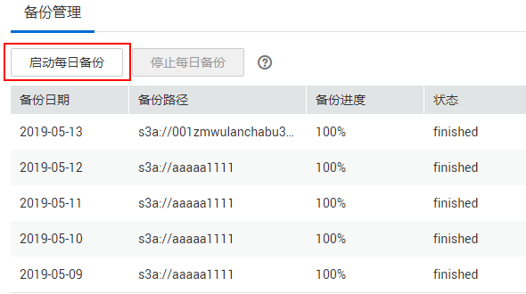
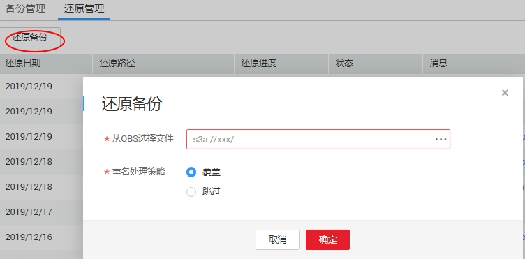

# 备份和还原资产

通过备份功能，您可每日定时备份昨日系统中的所有作业、脚本、资源和环境变量。

通过还原功能，您可还原已备份的资产，包含作业、脚本、资源和环境变量。

## 约束限制

该功能依赖于OBS服务。

## 前提条件

已开通对象存储服务，并在OBS中创建文件夹。

## 备份资产

1.  登录DGC控制台。选择对应工作空间的“数据开发“模块，进入数据开发页面。

    **图 1**  选择数据开发  
    

2.  在数据开发主界面的左侧导航栏，选择“备份管理“。
3.  单击“启动每日备份“，打开“OBS文件浏览“页面，选择OBS文件夹，设置备份数据的存储位置。

    **图 2**  备份管理  
    

    > **说明：** 
    >-   每日备份在每日0点开始备份昨日的所有作业、脚本、资源和环境变量，启动当日不会备份昨日的作业、脚本、资源和环境变量。
    >-   选择OBS存储路径时，若仅选择至桶名层级，则备份对象自动存储在以“备份日期”命名的文件夹内。环境变量，资源，脚本和作业分别存储在1\_env,2\_resources,3\_scripts和4\_jobs文件夹内。
    >-   备份成功后，在以“备份日期”命名的文件夹内，自动生成backup.json文件，该文件按照节点类型存储了作业信息，支持恢复作业前进行修改。
    >-   启动每日备份后，若想结束备份任务，您可以单击右边的“停止每日备份“。

## 还原资产

1.  登录DGC控制台。选择对应工作空间的“数据开发“模块，进入数据开发页面。

    **图 3**  选择数据开发  
    

2.  在数据开发模块控制台的左侧导航栏，选择“备份管理“。
3.  选择“还原管理“页签，单击“还原备份“。

    在还原备份对话框中，从OBS桶中选择待还原的资产存储路径，设置重名处理策略。

    > **说明：** 
    >-   待还原的资产存储路径请获取[备份资产](#zh-cn_topic_0169685606_section381611818613)中生成的文件路径。
    >-   您可在还原资产前修改备份路径下的backup.json文件，支持修改连接名（connectionName）、数据库名（database）和集群名（clusterName）。

    **图 4**  还原资产  
    

4.  单击“确定“。

