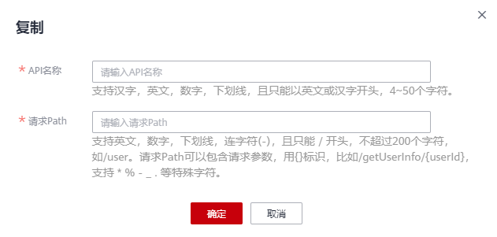

# 复制API

## 操作场景

您可以通过复制API功能，得到与原API配置相同的API。

## 前提条件

已创建API。

## 操作步骤

1.  在DGC控制台首页，选择对应工作空间的“数据服务“模块，进入数据服务页面。

    **图 1**  选择数据服务  
    

1.  在左侧导航栏选择服务版本（例如：专享版），进入总览页。
2.  单击“开发API  \>  API管理“页面，进入API管理页面。
3.  勾选待复制的API所在行，在API列表上方，选择“更多  \>  复制“，弹出复制窗口。
4.  在弹出的窗口中输入新API的名称和请求path，点击确认即可完成API复制。

    **图 2**  复制API  
    

