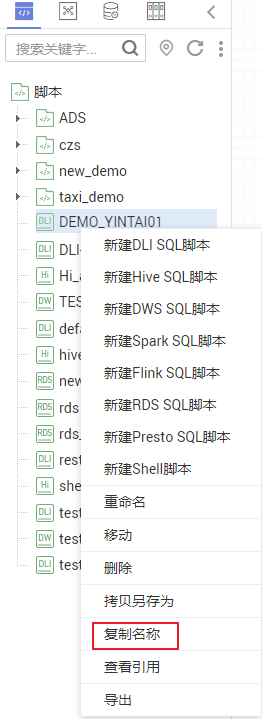
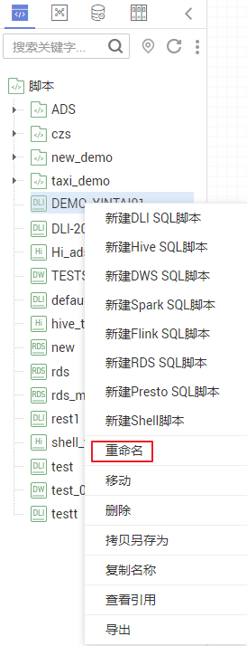
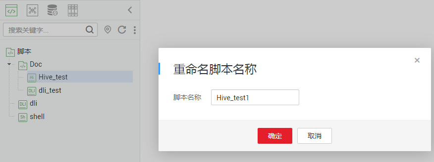

# 复制名称与重命名脚本

您可以通过复制名称功能复制当前脚本名称，通过重命名功能修改当前脚本名称。

本章节主要介绍如何复制名称和重命名脚本。

## 前提条件

-   您已开发脚本，脚本目录中存在需要复制名称或重命名的脚本文件。
-   如何开发脚本，请参见[开发SQL脚本](开发SQL脚本.md)和[开发Shell脚本](开发Shell脚本.md)。

## 复制名称

1.  登录DGC控制台。选择对应工作空间的“数据开发“模块，进入数据开发页面。

    **图 1**  选择数据开发  
    

2.  在数据开发主界面的左侧导航栏，选择“数据开发  \>  脚本开发“。
3.  在脚本目录中选择需要复制名称的脚本，右键单击脚本名称，选择“复制名称“，即可复制名称到剪贴板。

    **图 2**  复制脚本名称  
    

## 重命名脚本

1.  登录DGC控制台。选择对应工作空间的“数据开发“模块，进入数据开发页面。

    **图 3**  选择数据开发  
    

2.  在数据开发主界面的左侧导航栏，选择“数据开发  \>  脚本开发“。
3.  在脚本目录中选择需要重命名的脚本，右键单击脚本名称，选择“重命名“。

    **图 4**  重命名  
    

    > **说明：** 
    >已经打开了的脚本文件不支持重命名。

4.  在弹出的“重命名脚本名称“页面，配置如[图5](#fig6202081011)所示的参数。

    **图 5**  重命名脚本名称  
    

    **表 1**  重命名脚本参数

    
    <table><thead align="left"><tr id="row19242071016"><th class="cellrowborder" valign="top" width="29.310000000000002%" id="mcps1.2.3.1.1">
参数

    </th>
    <th class="cellrowborder" valign="top" width="70.69%" id="mcps1.2.3.1.2">
说明

    </th>
    </tr>
    </thead>
    <tbody><tr id="row18262013107"><td class="cellrowborder" valign="top" width="29.310000000000002%" headers="mcps1.2.3.1.1 ">
脚本名称

    </td>
    <td class="cellrowborder" valign="top" width="70.69%" headers="mcps1.2.3.1.2 ">
脚本的名称，只能包含字符：英文字母、数字、中文、中划线、下划线和点号，且长度小于等于128个字符。

    </td>
    </tr>
    </tbody>
    </table>

5.  单击“确定“，重命名脚本。

