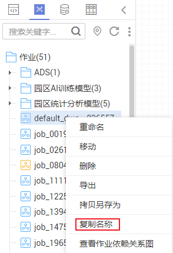
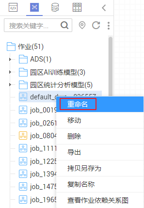
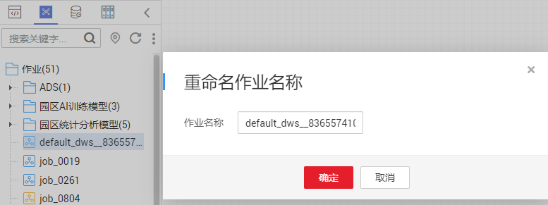

# 复制名称和重命名作业

您可以通过复制名称功能复制当前作业名称，通过重命名功能修改当前作业名称。

本章节主要介绍如何复制名称和重命名作业。

## 前提条件

您已[新建作业](新建作业.md)，作业目录中存在需要复制名称或重命名的作业。

## 复制名称

1.  登录DGC控制台。选择对应工作空间的“数据开发“模块，进入数据开发页面。

    **图 1**  选择数据开发  
    

2.  在数据开发主界面的左侧导航栏，选择“数据开发  \>  作业开发“。

1.  在作业目录中选择需要复制名称的作业，右键单击作业名称，选择“复制名称“，即可复制名称到剪贴板。

    **图 2**  复制作业名称  
    

## 重命名作业

1.  登录DGC控制台。选择对应工作空间的“数据开发“模块，进入数据开发页面。

    **图 3**  选择数据开发  
    

2.  在数据开发主界面的左侧导航栏，选择“数据开发  \>  作业开发“。
3.  在作业目录中选择需要重命名的作业，右键单击作业名称，选择“重命名“。

    **图 4**  重命名作业  
    

4.  在弹出的“重命名作业名称“页面，配置如[表1](#zh-cn_topic_0171677203_table133101211151017)所示的参数。

    **图 5**  重命名作业名称  
    

    **表 1**  重命名作业参数

    
    <table><thead align="left"><tr id="zh-cn_topic_0171677203_row5310151181012"><th class="cellrowborder" valign="top" width="15.24%" id="mcps1.2.3.1.1">
参数

    </th>
    <th class="cellrowborder" valign="top" width="84.76%" id="mcps1.2.3.1.2">
说明

    </th>
    </tr>
    </thead>
    <tbody><tr id="zh-cn_topic_0171677203_row1431031141019"><td class="cellrowborder" valign="top" width="15.24%" headers="mcps1.2.3.1.1 ">
作业名称

    </td>
    <td class="cellrowborder" valign="top" width="84.76%" headers="mcps1.2.3.1.2 ">
自定义作业的名称，只能包含英文字母、数字、中文、“-”、“_”、“.”，且长度为1～128个字符。

    </td>
    </tr>
    </tbody>
    </table>

5.  单击“确定“，重命名作业。

