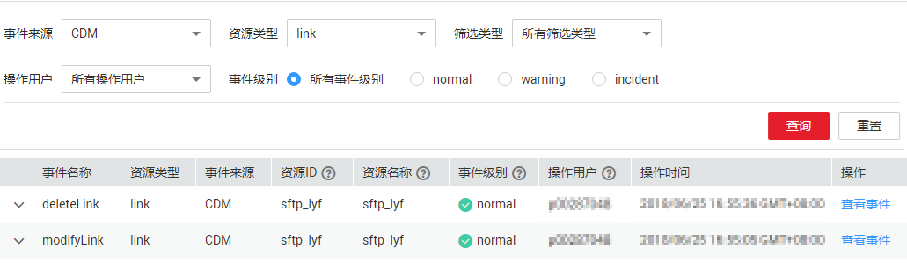

# 如何查看审计日志

## 操作场景

在您开启了云审计服务后，系统开始记录CDM的相关操作，云审计服务的管理控制台保存最近7天的操作记录。

本节介绍如何在云审计服务管理控制台查看最近7天的操作记录。

## 操作步骤

1.  登录管理控制台。
2.  单击“服务列表“，选择“管理与部署  \>  云审计服务“，进入云审计服务信息页面。
3.  单击左侧导航树的“事件列表“，进入事件列表信息页面。
4.  事件列表支持通过筛选来查询对应的操作事件。

    **图 1**  CDM操作事件  
    

5.  在需要查看的事件左侧，单击事件名称左边的箭头，展开该记录的详细信息。
6.  在需要查看的记录右侧，单击“查看事件“，弹窗中显示了该操作事件结构的详细信息。

    更多关于云审计的信息，请参见《[云审计服务用户指南](https://support.huaweicloud.com/usermanual-cts/zh-cn_topic_0030598500.html)》。

