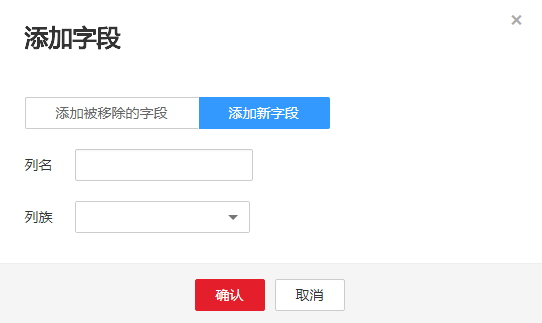

# 字段映射界面无法显示所有列怎么处理？<a name="dayu_01_0111"></a>

## 问题描述<a name="zh-cn_topic_0108275272_section1329589093527"></a>

在使用CDM从HBase/CloudTable导出数据时，在字段映射界面HBase/CloudTable表的字段偶尔显示不全，无法与目的端字段一一匹配，造成导入到目的端的数据不完整。

## 原因分析<a name="zh-cn_topic_0108275272_section527818427306"></a>

由于HBase/CloudTable无Schema，每条数据的列数不固定，在字段映射界面CDM通过获取样值的方式有较大概率无法获得所有列，此时作业执行完后会造成目的端的数据不全。

这个问题，可以通过以下方法解决：

1.  <a name="zh-cn_topic_0108275272_li275094115519"></a>在CDM的字段映射界面增加字段。
2.  <a name="zh-cn_topic_0108275272_li1275016411516"></a>在CDM的作业管理界面直接编辑作业的JSON（修改“fromJobConfig.columns“、“toJobConfig.columnList“这2个参数）。
3.  导出作业的JSON文件到本地，在本地手动修改JSON文件中的参数后（原理同[2](#zh-cn_topic_0108275272_li1275016411516)相同），再导回CDM。

推荐使用方法[1](#zh-cn_topic_0108275272_li275094115519)，下面以HBase导到DWS为例进行说明。

## 解决方法一：CDM的字段映射界面增加字段<a name="zh-cn_topic_0108275272_section3970219094610"></a>

1.  获取源端HBase待迁移的表中所有的字段，列族与列之间用“:“分隔，例如：

    ```
    rowkey:rowkey
    g:DAY_COUNT
    g:CATEGORY_ID
    g:CATEGORY_NAME
    g:FIND_TIME
    g:UPLOAD_PEOPLE
    g:ID
    g:INFOMATION_ID
    g:TITLE
    g:COORDINATE_X
    g:COORDINATE_Y
    g:COORDINATE_Z
    g:CONTENT
    g:IMAGES
    g:STATE
    ```

2.  在CDM的作业管理界面，找到HBase导出数据到DWS的作业，单击作业后面的“编辑“，进入字段映射界面，如[图1](#zh-cn_topic_0108275272_fig112631440789)所示。

    **图 1**  字段映射03<a name="zh-cn_topic_0108275272_fig112631440789"></a>  
    

3.  单击添加字段，在弹出框中选择“添加新字段“，如[图2](#zh-cn_topic_0108275272_fig19710195193217)所示。

    **图 2**  添加字段04<a name="zh-cn_topic_0108275272_fig19710195193217"></a>  
    

    > **说明：**   
    >-   添加完字段后，新增的字段在界面不显示样值，这个不影响字段值的传输，CDM会将字段值直接写入目的端。  
    >-   这里“添加新字段“的功能，要求源端数据源为：MongoDB、HBase、关系型数据库或Redis，其中Redis必须为Hash数据格式。  

4.  全部字段添加完之后，检查源端和目的端的字段映射关系是否正确，如果不正确可以拖拽字段调整字段位置。
5.  单击“下一步“后保存作业。

## 解决方法二：修改JSON文件<a name="zh-cn_topic_0108275272_section38620214575"></a>

1.  <a name="zh-cn_topic_0108275272_li17865211575"></a>获取源端HBase待迁移的表中所有的字段，列族与列之间用“:“分隔，例如：

    ```
    rowkey:rowkey
    g:DAY_COUNT
    g:CATEGORY_ID
    g:CATEGORY_NAME
    g:FIND_TIME
    g:UPLOAD_PEOPLE
    g:ID
    g:INFOMATION_ID
    g:TITLE
    g:COORDINATE_X
    g:COORDINATE_Y
    g:COORDINATE_Z
    g:CONTENT
    g:IMAGES
    g:STATE
    ```

2.  <a name="zh-cn_topic_0108275272_li0101221195713"></a>在DWS目的表中，获取与HBase表对应的字段。

    如果DWS目的表中没有HBase对应的字段名，需在DWS表定义中加上，假设DWS表中的字段齐全且如下：

    ```
    rowkey
    day_count
    category
    category_name
    find_time
    upload_people
    id
    infomation_id
    title
    coordinate_x
    coordinate_y
    coordinate_z
    content
    images
    state
    ```

3.  在CDM的作业管理界面，找到HBase到DWS的作业，选择作业后面的“更多  \>  编辑作业JSON“。
4.  在CDM界面编辑作业的JSON文件。
    1.  修改源端的“fromJobConfig.columns“参数，配置为[1](#zh-cn_topic_0108275272_li17865211575)获取的HBase的字段，列号之间使用“&“分隔，列族与列之间用“:“分隔，如下：

        ```
        "from-config-values": {
                        "configs": [
                            {
                                "inputs": [
                                    {
                                        "name": "fromJobConfig.table",
                                        "value": "HBase"
                                    },
                                    {
                                        "name": "fromJobConfig.columns",
                                        "value": "rowkey:rowkey&g:DAY_COUNT&g:CATEGORY_ID&g:CATEGORY_NAME&g:FIND_TIME&g:UPLOAD_PEOPLE&g:ID&g:INFOMATION_ID&g:TITLE&g:COORDINATE_X&g:COORDINATE_Y&g:COORDINATE_Z&g:CONTENT&g:IMAGES&g:STATE"
                                    },
                                    {
                                        "name": "fromJobConfig.formats",
                                        "value": {
                                            "2": "yyyy-MM-dd",
                                            "undefined": "yyyy-MM-dd"
                                        }
                                    }
                                ],
                                "name": "fromJobConfig"
                            }
                        ]
                    }
        ```

    2.  修改目的端的“toJobConfig.columnList“参数，配置为[2](#zh-cn_topic_0108275272_li0101221195713)中DWS的字段列表。

        这里的顺序必须与HBase保持一致，才能保证正确的字段映射关系，字段名之间使用“&“分隔，如下：

        ```
        "to-config-values": {
                        "configs": [
                            {
                                "inputs": [
                                    {
                                        "name": "toJobConfig.schemaName",
                                        "value": "dbadmin"
                                    },
                                    {
                                        "name": "toJobConfig.tablePreparation",
                                        "value": "DO_NOTHING"
                                    },
                                    {
                                        "name": "toJobConfig.tableName",
                                        "value": "DWS "
                                    },
                                    {
                                        "name": "toJobConfig.columnList",
                                        "value": "rowkey&day_count&category&category_name&find_time&upload_people&id&infomation_id&title&coordinate_x&coordinate_y&coordinate_z&content&images&state"
                                    },
                                    {
                                        "name": "toJobConfig.shouldClearTable",
                                        "value": "true"
                                    }
                                ],
                                "name": "toJobConfig"
                            }
                        ]
                    }
        ```

    3.  其他参数保持不变，单击“保存并运行“。

5.  作业完成后，查询DWS表中的数据是否和HBase中的数据匹配。如果不匹配，请检查JSON文件中HBase和DWS字段的顺序是否一致。

