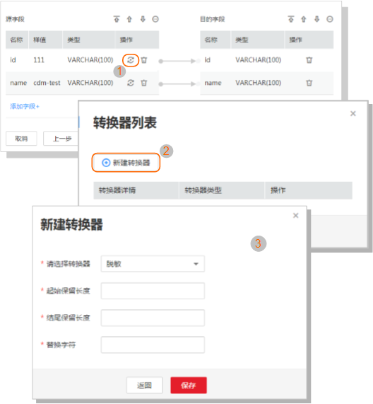
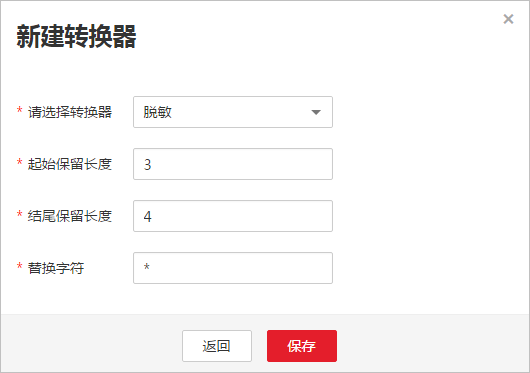

# 字段转换

在创建表/文件迁移作业的字段映射界面，可新建字段转换器，如[图1](#zh-cn_topic_0108275447_fig69892917212)所示。

**图 1**  新建字段转换器  

> **说明：**   
>当使用二进制格式进行文件到文件的迁移时，没有字段映射这一步。  

CDM可以在迁移过程中对字段进行转换，目前支持以下字段转换器：

-   [脱敏](#zh-cn_topic_0108275447_section16186221155714)
-   [去前后空格](#zh-cn_topic_0108275447_section53424217155959)
-   [字符串反转](#zh-cn_topic_0108275447_section233407616045)
-   [字符串替换](#zh-cn_topic_0108275447_section4265729416112)
-   [去换行](#zh-cn_topic_0108275447_section16632332201817)
-   [表达式转换](#zh-cn_topic_0108275447_section3561010716314)

## 脱敏

隐藏字符串中的关键信息，例如要将“12345678910“转换为“123\*\*\*\*8910“，则配置如下：

-   “起始保留长度“为“3“。
-   “结尾保留长度“为“4“.。
-   “替换字符“为“\*“。

**图 2**  字段脱敏  

## 去前后空格

自动去字符串前后的空值，不需要配置参数。

## 字符串反转

自动反转字符串，例如将“ABC“转换为“CBA“，不需要配置参数。

## 字符串替换

替换字符串，需要用户配置被替换的对象，以及替换后的值。

## 去换行

将字段中的换行符（\\n、\\r、\\r\\n）删除。

## 表达式转换

使用JSP表达式语言（Expression Language）对当前字段或整行数据进行转换。JSP表达式语言可以用来创建算术和逻辑表达式。在表达式内可以使用整型数，浮点数，字符串，常量true、false和null。

表达式支持以下两个环境变量：

-   value：当前字段值。
-   row：当前行，数组类型。

表达式支持以下工具类：

-   StringUtils：字符串处理类，参考Java SDK代码的包结构“org.apache.commons.lang.StringUtils“。
-   DateUtils：日期工具类。
-   CommonUtils：公共工具类。
-   NumberUtils：字符串转数值类。
-   HttpsUtils：读取网络文件类。

应用举例：

1.  给当前字段设置一个字符串常量，例如设置为VIP。

    表达式：**"**_VIP_**"**

2.  如果当前字段为字符串类型，将字符串全部转换为小写，例如将“aBC“转换为“abc“。

    表达式：StringUtils.lowerCase\(value\)

3.  将当前字段的字符串全部转为大写。

    表达式：StringUtils.upperCase\(value\)

4.  如果当前字段值为“yyyy-MM-dd“格式的日期字符串，需要截取年，例如字段值为“2017-12-01“，转换后为“2017“。

    表达式：StringUtils.substringBefore\(value,"-"\)

5.  如果当前字段值为数值类型，转换后值为当前值的两倍。

    表达式：value\*2

6.  如果当前字段值为“true“，转换后为“Y“，其它值则转换后为“N“。

    表达式：value=="true"?"Y":"N"

7.  如果当前字段值为字符串类型，当为空时，转换为“Default“，否则不转换。

    表达式：empty value? "Default":value

8.  如果当前字段、第1、第2字段为数值类型，当前字段转换为第1字段与第2字段值的和。

    表达式：row\[0\]+row\[1\]

9.  如果当前字段为Date或Timestamp类型，转换后返回当前年份，类型为Int。

    表达式：DateUtils.getYear\(value\)

10. 如果当前字段为“yyyy-MM-dd“格式的时间日期字符串，转换成Date类型。

    表达式：DateUtils.format\(value,"yyyy-MM-dd"\)

11. 如果想将日期字段格式从“2018/01/05 15:15:05“转换为“2018-01-05 15:15:05“。

    表达式：DateUtils.format\(DateUtils.parseDate\(value,"yyyy/MM/dd HH:mm:ss"\),"yyyy-MM-dd HH:mm:ss"\)

12. 获取一个36位的UUID（Universally Unique Identifier，通用唯一识别码）。

    表达式：CommonUtils.randomUUID\(\)

13. 如果当前字段值为字符串类型，将首字母转换为大写，例如将“cat“转换为“Cat“。

    表达式：StringUtils.capitalize\(value\)

14. 如果当前字段值为字符串类型，将首字母转换为小写，例如将“Cat“转换为“cat“。

    表达式：StringUtils.uncapitalize\(value\)

15. 如果当前字段值为字符串类型，使用空格填充为指定长度，并且将字符串居中，当字符串长度不小于指定长度时不转换，例如将“ab“转换为长度为4的“ab“。

    表达式：StringUtils.center\(value,_4_\)

16. 删除字符串末尾的一个换行符（包括“\\n“、“\\r“或者“\\r\\n“），例如将“abc\\r\\n\\r\\n“转换为“abc\\r\\n“。

    表达式：StringUtils.chomp\(value\)

17. 如果字符串中包含指定的字符串，则返回布尔值true，否则返回false。例如“abc“中包含“a“，则返回true。

    表达式：StringUtils.contains\(value,"_a_"\)

18. 如果字符串中包含指定字符串的任一字符，则返回布尔值true，否则返回false。例如“zzabyycdxx“中包含“z“或“a“任意一个，则返回true。

    表达式：StringUtils.containsAny\("value","_za_"\)

19. 如果字符串中不包含指定的所有字符，则返回布尔值true，包含任意一个字符则返回false。例如“abz“中包含“xyz“里的任意一个字符，则返回false。

    表达式：StringUtils.containsNone\(value,"_xyz_"\)

20. 如果当前字符串只包含指定字符串中的字符，则返回布尔值true，包含任意一个其它字符则返回false。例如“abab“只包含“abc“中的字符，则返回true。

    表达式：StringUtils.containsOnly\(value,"_abc_"\)

21. 如果字符串为空或null，则转换为指定的字符串，否则不转换。例如将空字符转换为null。

    表达式：StringUtils.defaultIfEmpty\(value,_null_\)

22. 如果字符串以指定的后缀结尾（包括大小写），则返回布尔值true，否则返回false。例如“abcdef“后缀不为null，则返回false。

    表达式：StringUtils.endsWith\(value,_null_\)

23. 如果字符串和指定的字符串完全一样（包括大小写），则返回布尔值true，否则返回false。例如比较字符串“abc“和“ABC“，则返回false。

    表达式：StringUtils.equals\(value,"_ABC_"\)

24. 从字符串中获取指定字符串的第一个索引，没有则返回整数-1。例如从“aabaabaa“中获取“ab“的第一个索引1。

    表达式：StringUtils.indexOf\(value,"_ab_"\)

25. 从字符串中获取指定字符串的最后一个索引，没有则返回整数-1。例如从“aFkyk“中获取“k“的最后一个索引4。

    表达式：StringUtils.lastIndexOf\(value,"_k_"\)

26. 从字符串中指定的位置往后查找，获取指定字符串的第一个索引，没有则转换为“-1“。例如“aabaabaa“中索引3的后面，第一个“b“的索引是5。

    表达式：StringUtils.indexOf\(value,"_b_",_3_\)

27. 从字符串获取指定字符串中任一字符的第一个索引，没有则返回整数-1。例如从“zzabyycdxx“中获取“z“或“a“的第一个索引0。

    表达式：StringUtils.indexOfAny\(value,"_za_"\)

28. 如果字符串仅包含Unicode字符，返回布尔值true，否则返回false。例如“ab2c“中包含非Unicode字符，返回false。

    表达式：StringUtils.isAlpha\(value\)

29. 如果字符串仅包含Unicode字符或数字，返回布尔值true，否则返回false。例如“ab2c“中仅包含Unicode字符和数字，返回true。

    表达式：StringUtils.isAlphanumeric\(value\)

30. 如果字符串仅包含Unicode字符、数字或空格，返回布尔值true，否则返回false。例如“ab2c“中仅包含Unicode字符和数字，返回true。

    表达式：StringUtils.isAlphanumericSpace\(value\)

31. 如果字符串仅包含Unicode字符或空格，返回布尔值true，否则返回false。例如“ab2c“中包含Unicode字符和数字，返回false。

    表达式：StringUtils.isAlphaSpace\(value\)

32. 如果字符串仅包含ASCII可打印字符，返回布尔值true，否则返回false。例如“!ab-c\~“返回true。

    表达式：StringUtils.isAsciiPrintable\(value\)

33. 如果字符串为空或null，返回布尔值true，否则返回false。

    表达式：StringUtils.isEmpty\(value\)

34. 如果字符串中仅包含Unicode数字，返回布尔值true，否则返回false。

    表达式：StringUtils.isNumeric\(value\)

35. 获取字符串最左端的指定长度的字符，例如获取“abc“最左端的2位字符“ab“。

    表达式：StringUtils.left\(value,_2_\)

36. 获取字符串最右端的指定长度的字符，例如获取“abc“最右端的2位字符“bc“。

    表达式：StringUtils.right\(value,_2_\)

37. 将指定字符串拼接至当前字符串的左侧，需同时指定拼接后的字符串长度，如果当前字符串长度不小于指定长度，则不转换。例如将“yz“拼接到“bat“左侧，拼接后长度为8，则转换后为“yzyzybat“。

    表达式：StringUtils.leftPad\(value,_8_,"_yz_"\)

38. 将指定字符串拼接至当前字符串的右侧，需同时指定拼接后的字符串长度，如果当前字符串长度不小于指定长度，则不转换。例如将“yz“拼接到“bat“右侧，拼接后长度为8，则转换后为“batyzyzy“。

    表达式：StringUtils.rightPad\(value,_8_,"_yz_"\)

39. 如果当前字段为字符串类型，获取当前字符串的长度，如果该字符串为null，则返回0。

    表达式：StringUtils.length\(value\)

40. 如果当前字段为字符串类型，删除其中所有的指定字符串，例如从“queued“中删除“ue“，转换后为“qd“。

    表达式：StringUtils.remove\(value,"_ue_"\)

41. 如果当前字段为字符串类型，移除当前字段末尾指定的子字符串。指定的子字符串若不在当前字段的末尾，则不转换，例如移除当前字段“www.domain.com“后的“.com“。

    表达式：StringUtils.removeEnd\(value,"_.com_"\)

42. 如果当前字段为字符串类型，移除当前字段开头指定的子字符串。指定的子字符串若不在当前字段的开头，则不转换，例如移除当前字段“www.domain.com“前的“www.“。

    表达式：StringUtils.removeStart\(value,"_www__._"\)

43. 如果当前字段为字符串类型，替换当前字段中所有的指定字符串，例如将“aba“中的“a“用“z“替换，转换后为“zbz“。

    表达式：StringUtils.replace\(value,"_a_","_z_"\)

44. 如果当前字段为字符串类型，一次替换字符串中的多个字符，例如将字符串“hello“中的“h“用“j“替换，“o“用“y“替换，转换后为“jelly“。

    表达式：StringUtils.replaceChars\(value,"_ho_","_jy_"\)

45. 如果当前字段为字符串类型，使用指定分隔符将提供的文本拆分为数组。例如将“ab:cd:ef“按“:“分隔，转换后为“\["ab","cd","ef"\]“。

    表达式：StringUtils.split\(value,":"\)

46. 如果字符串以指定的前缀开头（区分大小写），则返回布尔值true，否则返回false，例如当前字符串“abcdef“以“abc“开头，则返回true。

    表达式：StringUtils.startsWith\(value,"_abc_"\)

47. 如果当前字段为字符串类型，去除字段中所有指定的字符，例如去除“abcyx“中所有的“x“、“y“和“z“，转换后为“abc“。

    表达式：StringUtils.strip\(value,"_xyz_"\)

48. 如果当前字段为字符串类型，去除字段末尾所有指定的字符，例如去除当前字段末尾的所有空格。

    表达式：StringUtils.stripEnd\(value,_null_\)

49. 如果当前字段为字符串类型，去除字段开头所有指定的字符，例如去除当前字段开头的所有空格。

    表达式：StringUtils.stripStart\(value,_null_\)

50. 如果当前字段为字符串类型，获取字符串指定位置后（不包括指定位置的字符）的子字符串，指定位置如果为负数，则从末尾往前计算位置。例如获取“abcde“第2个字符后的字符串，则转换后为“cde“。

    表达式：StringUtils.substring\(value,_2_\)

51. 如果当前字段为字符串类型，获取字符串指定区间的子字符串，区间位置如果为负数，则从末尾往前计算位置。例如获取“abcde“第2个字符后、第5个字符前的字符串，则转换后为“cd“。

    表达式：StringUtils.substring\(value,_2_,_5_\)

52. 如果当前字段为字符串类型，获取当前字段里第一个指定字符后的子字符串。例如获取“abcba“中第一个“b“之后的子字符串，转换后为“cba“。

    表达式：StringUtils.substringAfter\(value,"_b_"\)

53. 如果当前字段为字符串类型，获取当前字段里最后一个指定字符后的子字符串。例如获取“abcba“中最后一个“b“之后的子字符串，转换后为“a“。

    表达式：StringUtils.substringAfterLast\(value,"_b_"\)

54. 如果当前字段为字符串类型，获取当前字段里第一个指定字符前的子字符串。例如获取“abcba“中第一个“b“之前的子字符串，转换后为“a“。

    表达式：StringUtils.substringBefore\(value,"_b_"\)

55. 如果当前字段为字符串类型，获取当前字段里最后一个指定字符前的子字符串。例如获取“abcba“中最后一个“b“之前的子字符串，转换后为“abc“。

    表达式：StringUtils.substringBeforeLast\(value,"_b_"\)

56. 如果当前字段为字符串类型，获取嵌套在指定字符串之间的子字符串，没有匹配的则返回null。例如获取“tagabctag“中“tag“之间的子字符串，转换后为“abc“。

    表达式：StringUtils.substringBetween\(value,"_tag_"\)

57. 如果当前字段为字符串类型，删除当前字符串两端的控制字符（char≤32），例如删除字符串前后的空格。

    表达式：StringUtils.trim\(value\)

58. 将当前字符串转换为字节，如果转换失败，则返回0。

    表达式：NumberUtils.toByte\(value\)

59. 将当前字符串转换为字节，如果转换失败，则返回指定值，例如指定值配置为1。

    表达式：NumberUtils.toByte\(value,_1_\)

60. 将当前字符串转换为Double数值，如果转换失败，则返回0.0d。

    表达式：NumberUtils.toDouble\(value\)

61. 将当前字符串转换为Double数值，如果转换失败，则返回指定值，例如指定值配置为1.1d。

    表达式：NumberUtils.toDouble\(value,_1.1d_\)

62. 将当前字符串转换为Float数值，如果转换失败，则返回0.0f。

    表达式：NumberUtils.toFloat\(value\)

63. 将当前字符串转换为Float数值，如果转换失败，则返回指定值，例如配置指定值为1.1f。

    表达式：NumberUtils.toFloat\(value,_1.1f_\)

64. 将当前字符串转换为Int数值，如果转换失败，则返回0。

    表达式：NumberUtils.toInt\(value\)

65. 将当前字符串转换为Int数值，如果转换失败，则返回指定值，例如配置指定值为1。

    表达式：NumberUtils.toInt\(value,_1_\)

66. 将字符串转换为Long数值，如果转换失败，则返回0。

    表达式：NumberUtils.toLong\(value\)

67. 将当前字符串转换为Long数值，如果转换失败，则返回指定值，例如配置指定值为1L。

    表达式：NumberUtils.toLong\(value,_1L_\)

68. 将字符串转换为Short数值，如果转换失败，则返回0。

    表达式：NumberUtils.toShort\(value\)

69. 将当前字符串转换为Short数值，如果转换失败，则返回指定值，例如配置指定值为1。

    表达式：NumberUtils.toShort\(value,_1_\)

70. 将当前IP字符串转换为Long数值，例如将“10.78.124.0“转换为LONG数值是“172915712“。

    表达式：CommonUtils.ipToLong\(value\)

71. 从网络读取一个IP与物理地址映射文件，并存放到Map集合，这里的URL是IP与地址映射文件存放地址，例如“http://10.114.205.45:21203/sqoop/IpList.csv“。

    表达式：HttpsUtils.downloadMap\("_url_"\)

72. 将IP与地址映射对象缓存起来并指定一个key值用于检索，例如“ipList“。

    表达式：CommonUtils.setCache\("_ipList_",HttpsUtils.downloadMap\("_url_"\)\)

73. 取出缓存的IP与地址映射对象。

    表达式：CommonUtils.getCache\("_ipList_"\)

74. 判断是否有IP与地址映射缓存。

    表达式：CommonUtils.cacheExists\("_ipList_"\)

75. 根据IP取出对应的详细地址：国家\_省份\_城市\_运营商，例如“1xx.78.124.0“对应的地址为“中国\_广东\_深圳\_电信“，取不到对应地址则默认“\*\*\_\*\*\_\*\*\_\*\*“。如果需要，可通过StringUtil类表达式对地址进行进一步拆分。

    表达式：CommonUtils.getMapValue\(CommonUtils.ipToLong\(value\),CommonUtils.cacheExists\("_ipLis_"\)?CommonUtils.getCache\("_ipLis_"\):CommonUtils.setCache\("_ipLis_",HttpsUtils.downloadMap\("_url_"\)\)\)

76. 根据指定的偏移类型（month/day/hour/minute/second）及偏移量（正数表示增加，负数表示减少），将指定格式的时间转换为一个新时间，例如将“2019-05-21 12:00:00“增加8个小时。

    表达式：DateUtils.getCurrentTimeByZone\("_yyyy-MM-dd HH:mm:ss_",value, "_hour_",  _8_\)

