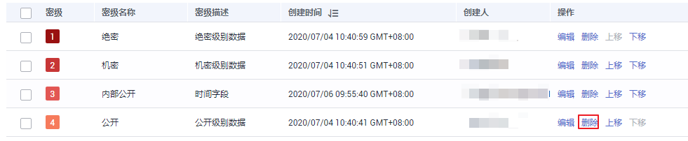

# 定义数据密级

为了方便对数据进行管理，在对数据进行操作前，需要您为数据定义密级，并对保密等级做相应的描述，例如明确涉密的范围。本章主要介绍如何定义数据密级。

## 约束与限制

当前最多支持定义10个数据密级，密级数字越大表示保密等级越低。

## 创建密级

1.  在DGC控制台首页，选择对应工作空间的“数据安全“模块，进入数据安全页面。

    **图 1**  选择数据安全  
    

2.  单击数据安全左侧导航树中的“数据密级“，进入数据密级列表页面。
3.  单击“新建“，输入数据密级信息。定义数据密级参数设置请参考[表1](#table1125141919221)。

    **表 1**  参数设置

    
    <table><thead align="left"><tr id="row112661982212"><th class="cellrowborder" valign="top" width="15.690000000000001%" id="mcps1.2.3.1.1">
参数名

    </th>
    <th class="cellrowborder" valign="top" width="84.31%" id="mcps1.2.3.1.2">
参数设置

    </th>
    </tr>
    </thead>
    <tbody><tr id="row181265197226"><td class="cellrowborder" valign="top" width="15.690000000000001%" headers="mcps1.2.3.1.1 ">
名称

    </td>
    <td class="cellrowborder" valign="top" width="84.31%" headers="mcps1.2.3.1.2 ">
密级名称只能包含中文、英文字母、数字和下划线，创建完成后不支持“编辑”操作。

    </td>
    </tr>
    <tr id="row11126819122216"><td class="cellrowborder" valign="top" width="15.690000000000001%" headers="mcps1.2.3.1.1 ">
描述

    </td>
    <td class="cellrowborder" valign="top" width="84.31%" headers="mcps1.2.3.1.2 ">
密级描述支持所有字符输入，创建完成后支持通过“编辑”操作修改。

    </td>
    </tr>
    </tbody>
    </table>

    > **说明：** 
    >在输入密级信息时，建议按照从安全程度由高到低的顺序依次创建。您也可以在密级建立好后，按照安全程度高低，通过“上移“、“下移“操作来调整密级顺序。

## 调整密级

1.  在DGC控制台首页，选择对应工作空间的“数据安全“模块，进入数据安全页面。

    **图 2**  选择数据安全  
    

2.  单击数据安全左侧导航树中的“数据密级“，进入数据密级定义页面。
3.  单击密级所属的“上移“、“下移“，调整该密级信息在列表中的位置。

## 编辑密级

1.  在DGC控制台首页，选择对应工作空间的“数据安全“模块，进入数据安全页面。

    **图 3**  选择数据安全  
    

2.  单击左侧导航树中的“数据密级“，进入“数据密级定义“页面。
3.  单击密级所属的“编辑“，修改其描述信息。

## 删除密级

1.  在DGC控制台首页，选择对应工作空间的“数据安全“模块，进入数据安全页面。

    **图 4**  选择数据安全  
    

2.  单击数据安全左侧导航树中的“数据密级“，进入数据密级定义页面。
3.  单击密级所属的“删除“，该密级信息即被删除。

    **图 5**  单个删除操作  
    

    同时，您也可以使用批量删除功能。在勾选需要删除的密级之后，单击“批量删除“即可。

    **图 6**  批量删除操作  
    

