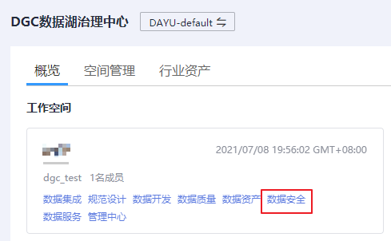
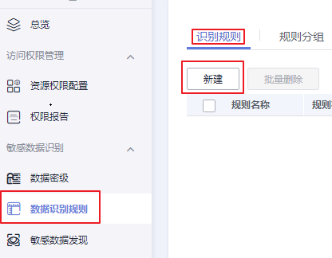
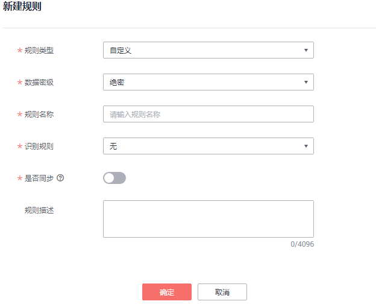
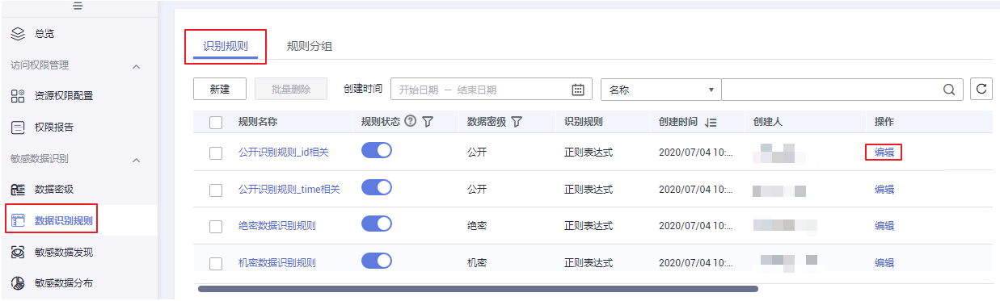
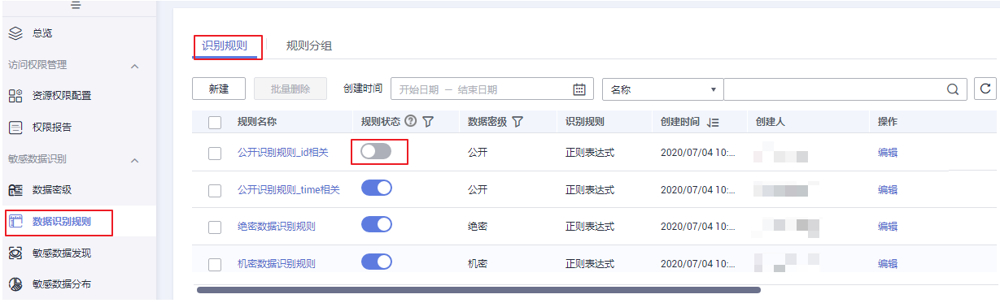
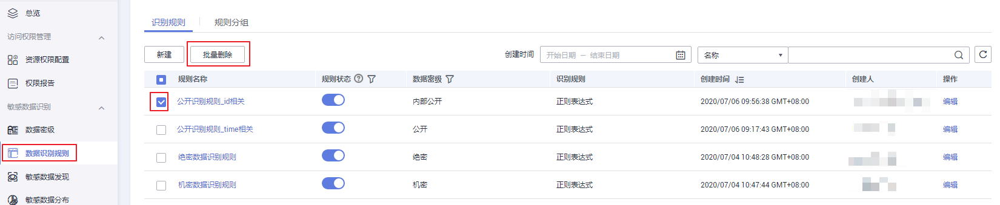

# 定义识别规则

您可以通过定义敏感数据识别规则，来有效识别数据库内的敏感数据。

## 前提条件

数据密级定义已完成，请参见[定义数据密级](定义数据密级.md)。

## 约束与限制

当前最多支持用户定义100条敏感数据识别规则。

## 创建数据识别规则

1.  在DGC控制台首页，选择对应工作空间的“数据安全“模块，进入数据安全页面。

    **图 1**  选择数据安全  
    

2.  在数据安全控制台左侧的导航树中单击“数据识别规则“，进入数据识别规则页面。
3.  在“识别规则“页单击“新建”，创建分类信息。

    **图 2**  新建识别规则  
    

4.  新建规则页参数配置请参考[表1](#table19786314182513)，参数配置完成单击“保存“即可。

    **图 3**  规则配置  
    

    识别规则参数说明表：

    **表 1**  配置识别规则参数说明

    
    <table><thead align="left"><tr id="row3783014172513"><th class="cellrowborder" valign="top" width="21.89%" id="mcps1.2.3.1.1">
配置

    </th>
    <th class="cellrowborder" valign="top" width="78.11%" id="mcps1.2.3.1.2">
说明

    </th>
    </tr>
    </thead>
    <tbody><tr id="row14783111412511"><td class="cellrowborder" valign="top" width="21.89%" headers="mcps1.2.3.1.1 ">
规则类型

    </td>
    <td class="cellrowborder" valign="top" width="78.11%" headers="mcps1.2.3.1.2 ">
即规则所属分类，支持按模板添加内置规则和自定义规则。

    </td>
    </tr>
    <tr id="row27841148256"><td class="cellrowborder" valign="top" width="21.89%" headers="mcps1.2.3.1.1 ">
数据密级

    </td>
    <td class="cellrowborder" valign="top" width="78.11%" headers="mcps1.2.3.1.2 ">
对配置的数据进行等级划分。如果现有的分级不满足需求，请进入数据密级管理页面进行设置，详情请参见<a href="定义数据密级.md">定义数据密级</a>。

    </td>
    </tr>
    <tr id="row177843145258"><td class="cellrowborder" valign="top" width="21.89%" headers="mcps1.2.3.1.1 ">
规则模板

    </td>
    <td class="cellrowborder" valign="top" width="78.11%" headers="mcps1.2.3.1.2 ">
“规则类型”选择“内置”，呈现此参数。如果选择按模板添加，系统内置了100+条敏感数据识别和脱敏规则，可对个人敏感信息（身份证、银行卡、姓名、手机号、邮箱等）、企业敏感信息（营业执照号码、税务登录证号码等）、密钥敏感信息（PEM证书、HEY私钥等）、设备敏感信息（IP地址、MAC地址、IPV6地址等）、位置敏感信息（省份、城市、GPS位置、地址等）和通用敏感信息（日期）等敏感信息进行识别和脱敏。

    </td>
    </tr>
    <tr id="row11785141492519"><td class="cellrowborder" valign="top" width="21.89%" headers="mcps1.2.3.1.1 ">
规则名称

    </td>
    <td class="cellrowborder" valign="top" width="78.11%" headers="mcps1.2.3.1.2 "><ul id="ul978581412257"><li>规则类型选择“内置”，规则名称自动关联分类模板生成。</li><li>规则类型选择自定义“自定义”，您可以自行填写分类名称，名称为必填项，只能包含英文字母、数字、下划线和中划线，且长度为1~50个字符，且输入不能为空。

 说明： 

定义数据识别规则，名称必须唯一。

    

    

    </li></ul>
    </td>
    </tr>
    <tr id="row578551412255"><td class="cellrowborder" valign="top" width="21.89%" headers="mcps1.2.3.1.1 ">
识别规则

    </td>
    <td class="cellrowborder" valign="top" width="78.11%" headers="mcps1.2.3.1.2 ">
规则类型选择“自定义”，呈现此参数，支持正则表达式。

    
当选择“无”，表示关联了该规则的敏感数据发现任务不生效。无法自动为数据资产分类，需要您手动添加分类。

    </td>
    </tr>
    <tr id="row96821047145117"><td class="cellrowborder" valign="top" width="21.89%" headers="mcps1.2.3.1.1 ">
是否同步

    </td>
    <td class="cellrowborder" valign="top" width="78.11%" headers="mcps1.2.3.1.2 ">
默认关闭。开启该按钮表示该新建规则将被同步到数据资产中。

    </td>
    </tr>
    <tr id="row11785101411259"><td class="cellrowborder" valign="top" width="21.89%" headers="mcps1.2.3.1.1 ">
正则表达式

    </td>
    <td class="cellrowborder" valign="top" width="78.11%" headers="mcps1.2.3.1.2 ">
识别规则选择“正则表达式”时，呈现此参数。

    <ul id="ul1578591419251"><li>内容识别：勾选此项后输入自定义正则表达式，该表达式将用于数据内容识别。内容识别正则表达式举例：“^男$|^女&amp;”。</li><li>列名识别：勾选此项后输入自定义正则表达式，该表达式将用于字段名精确匹配和模糊匹配两种方式，当前支持多个字段匹配。列名识别正则表达式举例：“sex|gender”。</li><li>备注识别：勾选此项后输入自定义正则表达式，例如“.*comment.*”代表模糊匹配备注。</li></ul>
    </td>
    </tr>
    <tr id="row17864143257"><td class="cellrowborder" valign="top" width="21.89%" headers="mcps1.2.3.1.1 ">
规则描述

    </td>
    <td class="cellrowborder" valign="top" width="78.11%" headers="mcps1.2.3.1.2 ">
对当前规则进行简单描述。

    </td>
    </tr>
    </tbody>
    </table>

## 编辑数据识别规则

1.  在DGC控制台首页，选择对应工作空间的“数据安全“模块，进入数据安全页面。

    **图 4**  选择数据安全  
    

2.  单击左侧导航树中的“数据识别规则“，进入数据识别规则页面。
3.  在“识别规则“页找到待编辑的识别规则，单击“编辑”， 编辑识别规则。

    **图 5**  编辑识别规则  
    

4.  编辑完成后单击“确定“，完成编辑。

## 启用数据识别规则

1.  在DGC控制台首页，选择对应工作空间的“数据安全“模块，进入数据安全页面。

    **图 6**  选择数据安全  
    

2.  单击左侧导航树中的“数据识别规则“，进入数据识别规则页面。
3.  在“识别规则“页面，找到需要启用的识别规则，单击“规则状态“为，即为启用状态，表示该规则可以使用。

    **图 7**  启用数据识别规则  
    

## 禁用数据识别规则

1.  在DGC控制台首页，选择对应工作空间的“数据安全“模块，进入数据安全页面。

    **图 8**  选择数据安全  
    

2.  单击左侧导航树中的“数据识别规则“，进入数据识别规则页面。
3.  在“识别规则“列表页，找到需要禁用的识别规则，单击“状态“为，即为禁用状态，表示该规则将不可被添加到识别规则组，因而无法被使用。

    **图 9**  禁用数据识别规则  
    

## 删除数据识别规则

1.  在DGC控制台首页，选择对应工作空间的“数据安全“模块，进入数据安全页面。

    **图 10**  选择数据安全  
    

2.  单击左侧导航树中的“数据识别规则“，进入数据识别规则页面。

    > **说明：** 
    >-   有catalog引用关系时可能会删除失败。
    >-   删除操作成功后无法撤销，请谨慎操作。

3.  在“识别规则“页勾选需要删除的规则，单击“批量删除“。

    包含在分组中的识别规则无法删除。若要删除包含在分组中的分类规格，需要先删除规则组，再进行删除识别规则操作。

    **图 11**  批量删除  
    

