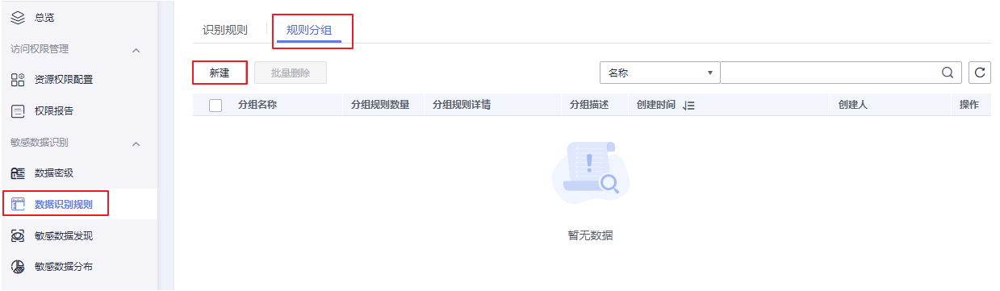
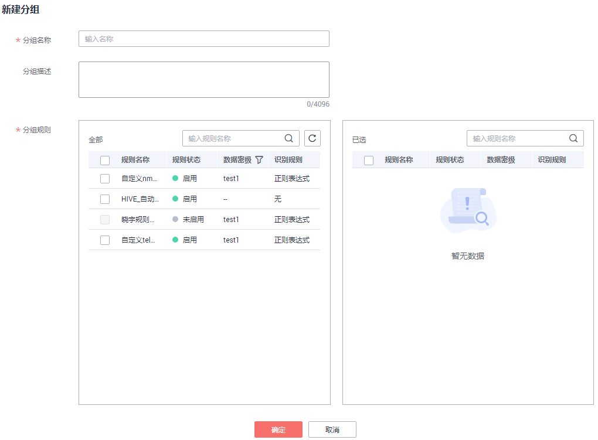
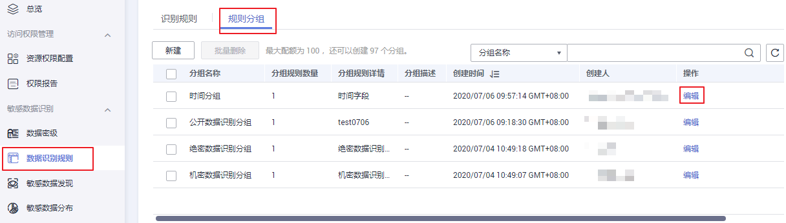
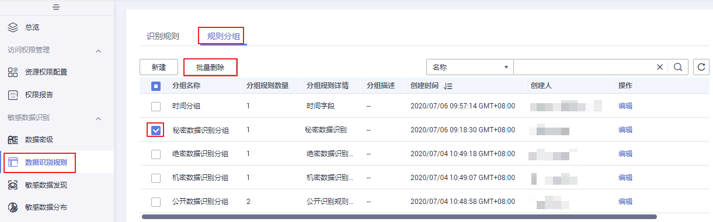

# 定义识别规则组

定义敏感数据识别规则组操作将多个零散的规则组合成为一个有业务逻辑的规则组，该操作是用户后续进行敏感数据发现任务操作的前提 。

## 前提条件

识别规则创建完成，请参考[定义识别规则](定义识别规则.md)。

## 约束与限制

当前最多支持用户定义100个敏感数据识别规则组。

## 创建数据识别规则组

1.  在DGC控制台首页，选择对应工作空间的“数据安全“模块，进入数据安全页面。

    **图 1**  选择数据安全  
    

2.  单击左侧导航树中的“数据识别规则“，进入数据识别规则页面。
3.  单击页面上方“规则分组“页签，进入分组列表页面。

    **图 2**  新建数据识别规则组  
    

4.  单击“新建“，输入新建分组名称和描述，参数设置参考[表1](#table12131512192419)，并勾选左侧列表中的识别规则。配置完成后单击“保存“即可。

    **图 3**  新建分组参数配置  
    

    您所勾选的规则将显示在右侧列表中，右侧已选列表中，已选规则可以通过单击操作来取消勾选。

    **表 1**  参数配置表

    
    <table><thead align="left"><tr id="row111251262411"><th class="cellrowborder" valign="top" width="16.78%" id="mcps1.2.3.1.1">
配置

    </th>
    <th class="cellrowborder" valign="top" width="83.22%" id="mcps1.2.3.1.2">
说明

    </th>
    </tr>
    </thead>
    <tbody><tr id="row1712141272415"><td class="cellrowborder" valign="top" width="16.78%" headers="mcps1.2.3.1.1 ">
名称

    </td>
    <td class="cellrowborder" valign="top" width="83.22%" headers="mcps1.2.3.1.2 ">
规则组名称只能包含中文、英文字母、数字和下划线。

    </td>
    </tr>
    <tr id="row1712612112413"><td class="cellrowborder" valign="top" width="16.78%" headers="mcps1.2.3.1.1 ">
描述

    </td>
    <td class="cellrowborder" valign="top" width="83.22%" headers="mcps1.2.3.1.2 ">
为更好的识别规则组，此处加以描述信息。描述信息只能包含英文字母、数字、“_”，且长度不能超过4096个字符。

    </td>
    </tr>
    </tbody>
    </table>

## 编辑数据识别规则组

1.  在DGC控制台首页，选择对应工作空间的“数据安全“模块，进入数据安全页面。

    **图 4**  选择数据安全  
    

1.  单击左侧导航树中的“数据识别规则“，进入数据识别规则页面。
2.  单击页面上方“规则分组“页签，进入分组列表页面。

    单击待编辑规则分组的“编辑“，编辑数据识别规则组。

    **图 5**  编辑数据识别规则组  
    

## 删除数据识别规则组

1.  在DGC控制台首页，选择对应工作空间的“数据安全“模块，进入数据安全页面。

    **图 6**  选择数据安全  
    

2.  单击左侧导航树中的“数据识别规则“，进入数据识别规则页面。
3.  单击页面上方“规则分组“页签，进入分组列表页面。

    > **说明：** 
    >删除操作无法撤销，请谨慎操作。

4.  在列表中勾选需要删除的分组，单击“批量删除“。

    被引用的规则组不可删除。如果要删除引用的规则组，需要先解除规则组关联的敏感数据发现任务后再删除，解除关联任务请参考[编辑敏感数据发现任务](发现敏感数据.md#section15437253111912)，修改“识别规则组“即可。

    **图 7**  删除规则组  
    

