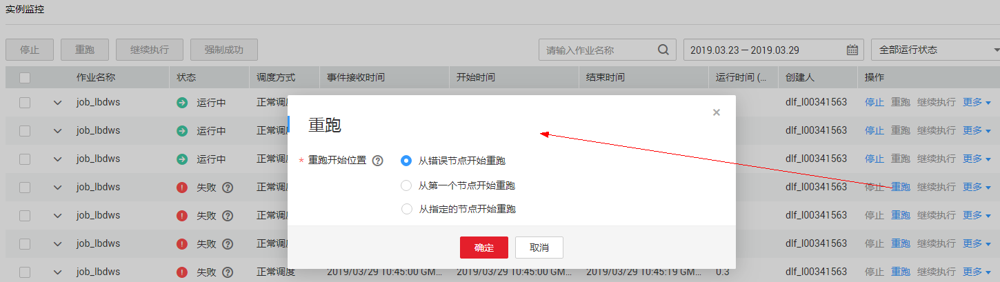

# 实例监控

在数据开发模块控制台的左侧导航栏，选择  “运维调度“，进入实例监控列表页面，用户可以在该页面中查看作业的实例信息，并根据需要对实例和节点进行更多操作。

实例监控支持从“作业名称”、“创建人”、“CDM作业”和“节点类型”等维度搜索实例。其中按照“CDM作业”搜索，是从节点的维度搜索，搜索包含该节点的作业实例列表。

## 实例操作

1.  登录DGC控制台。选择对应工作空间的“数据开发“模块，进入数据开发页面。

    **图 1**  选择数据开发  
    

2.  在数据开发主界面的左侧导航栏，选择“运维调度  \>  实例监控“。
3.  当前支持批量停止、重跑、继续执行、强制成功多个实例，使用说明参见[表1](#zh-cn_topic_0159100548_table958254318576)。

    其中，批量重跑多个实例时，重跑的顺序如下：

    -   如果作业不依赖上一调度周期，多个实例并行重跑。
    -   如果作业自依赖，多个实例串行重跑，以上一调度周期中实例执行完成的先后顺序为准，先执行完成的先重跑。

4.  在实例的“操作“列，提供如[表1](#zh-cn_topic_0159100548_table958254318576)所示的操作。

    **表 1**  操作（实例）

    
    <table><thead align="left"><tr id="zh-cn_topic_0159100548_row1558284313572"><th class="cellrowborder" valign="top" width="30%" id="mcps1.2.3.1.1">
操作项

    </th>
    <th class="cellrowborder" valign="top" width="70%" id="mcps1.2.3.1.2">
说明

    </th>
    </tr>
    </thead>
    <tbody><tr id="zh-cn_topic_0159100548_row35827433577"><td class="cellrowborder" valign="top" width="30%" headers="mcps1.2.3.1.1 ">
停止

    </td>
    <td class="cellrowborder" valign="top" width="70%" headers="mcps1.2.3.1.2 ">
停止运行状态为“待运行”、“运行中”或“运行异常”的实例。

    </td>
    </tr>
    <tr id="zh-cn_topic_0159100548_row10582843155716"><td class="cellrowborder" valign="top" width="30%" headers="mcps1.2.3.1.1 ">
重跑

    </td>
    <td class="cellrowborder" valign="top" width="70%" headers="mcps1.2.3.1.2 ">
重新运行状态为“成功”或“取消”的实例。

    </td>
    </tr>
    <tr id="zh-cn_topic_0159100548_row1845754013820"><td class="cellrowborder" valign="top" width="30%" headers="mcps1.2.3.1.1 ">
查看等待作业实例

    </td>
    <td class="cellrowborder" valign="top" width="70%" headers="mcps1.2.3.1.2 ">
实例的状态为“等待运行”时，支持查看等待的作业实例。

    </td>
    </tr>
    <tr id="zh-cn_topic_0159100548_row158214433574"><td class="cellrowborder" valign="top" width="30%" headers="mcps1.2.3.1.1 ">
更多 &gt; 继续执行

    </td>
    <td class="cellrowborder" valign="top" width="70%" headers="mcps1.2.3.1.2 ">
实例的状态为“运行异常”时，支持继续运行实例中的后续节点。

    
 说明： 

只有节点的“节点属性 &gt; 高级 &gt; 失败策略”设置为“挂起当前作业执行计划”时，才可以执行该操作。

    

    </td>
    </tr>
    <tr id="zh-cn_topic_0159100548_row15821434571"><td class="cellrowborder" valign="top" width="30%" headers="mcps1.2.3.1.1 ">
更多 &gt; 强制成功

    </td>
    <td class="cellrowborder" valign="top" width="70%" headers="mcps1.2.3.1.2 ">
强制将状态为“运行异常”、“取消”、“失败”的实例变更为“成功”状态。

    </td>
    </tr>
    <tr id="zh-cn_topic_0159100548_row9642818103917"><td class="cellrowborder" valign="top" width="30%" headers="mcps1.2.3.1.1 ">
更多 &gt; 查看

    </td>
    <td class="cellrowborder" valign="top" width="70%" headers="mcps1.2.3.1.2 ">
跳转至作业开发页面，查看作业信息。

    </td>
    </tr>
    </tbody>
    </table>

5.  单击实例前方的，显示该实例所有节点的运行记录。
6.  在节点的“操作“列，提供如[表2](#zh-cn_topic_0159100548_table181913016117)所示的操作。

    **表 2**  操作（节点）

    
    <table><thead align="left"><tr id="zh-cn_topic_0159100548_row241300116"><th class="cellrowborder" valign="top" width="32%" id="mcps1.2.3.1.1">
操作项

    </th>
    <th class="cellrowborder" valign="top" width="68%" id="mcps1.2.3.1.2">
说明

    </th>
    </tr>
    </thead>
    <tbody><tr id="zh-cn_topic_0159100548_row194120212"><td class="cellrowborder" valign="top" width="32%" headers="mcps1.2.3.1.1 ">
查看日志

    </td>
    <td class="cellrowborder" valign="top" width="68%" headers="mcps1.2.3.1.2 ">
查看节点的日志信息。

    </td>
    </tr>
    <tr id="zh-cn_topic_0159100548_row18195019113"><td class="cellrowborder" valign="top" width="32%" headers="mcps1.2.3.1.1 ">
更多 &gt; 手工重试

    </td>
    <td class="cellrowborder" valign="top" width="68%" headers="mcps1.2.3.1.2 ">
节点的状态为“失败”时，支持重新运行节点。

    
 说明： 

只有节点的“节点属性 &gt; 高级 &gt; 失败策略”设置为“挂起当前作业执行计划”时，才可以执行该操作。

    

    </td>
    </tr>
    <tr id="zh-cn_topic_0159100548_row719100419"><td class="cellrowborder" valign="top" width="32%" headers="mcps1.2.3.1.1 ">
更多 &gt; 强制成功

    </td>
    <td class="cellrowborder" valign="top" width="68%" headers="mcps1.2.3.1.2 ">
节点的状态为“失败”时，支持将该节点强制变更为“成功”状态。

    
 说明： 

只有节点的“节点属性 &gt; 高级 &gt; 失败策略”设置为“挂起当前作业执行计划”时，才可以执行该操作。

    

    </td>
    </tr>
    <tr id="zh-cn_topic_0159100548_row151950117"><td class="cellrowborder" valign="top" width="32%" headers="mcps1.2.3.1.1 ">
更多 &gt; 跳过

    </td>
    <td class="cellrowborder" valign="top" width="68%" headers="mcps1.2.3.1.2 ">
节点的状态为“待运行”或“已暂停节点”时，支持跳过该节点。

    </td>
    </tr>
    <tr id="zh-cn_topic_0159100548_row5191401120"><td class="cellrowborder" valign="top" width="32%" headers="mcps1.2.3.1.1 ">
更多 &gt; 暂停

    </td>
    <td class="cellrowborder" valign="top" width="68%" headers="mcps1.2.3.1.2 ">
节点的状态为“待运行”时，支持暂停运行该节点，该暂停节点的后续节点将会被阻塞。

    </td>
    </tr>
    <tr id="zh-cn_topic_0159100548_row0191701213"><td class="cellrowborder" valign="top" width="32%" headers="mcps1.2.3.1.1 ">
更多 &gt; 恢复

    </td>
    <td class="cellrowborder" valign="top" width="68%" headers="mcps1.2.3.1.2 ">
节点的状态为“已暂停”时，支持恢复运行该节点。

    </td>
    </tr>
    </tbody>
    </table>

## 重跑作业实例

您可以对运行成功或失败的作业实例设置重跑，配置重跑开始位置。

1.  登录DGC控制台。选择对应工作空间的“数据开发“模块，进入数据开发页面。

    **图 2**  选择数据开发  
    

2.  在数据开发主界面的左侧导航栏，选择“运维调度  \>  实例监控“。
3.  选择作业名称，在作业的“操作“列，单击“重跑“设置重跑作业实例；或单击作业名称左边的复选框，再选择“重跑“按钮设置作业实例重跑。

    **图 3**  设置作业重跑  
    

    **表 3**  参数说明

    
    <table><thead align="left"><tr id="zh-cn_topic_0118654558_row9507465414"><th class="cellrowborder" valign="top" width="35.17%" id="mcps1.2.3.1.1">
参数

    </th>
    <th class="cellrowborder" valign="top" width="64.83%" id="mcps1.2.3.1.2">
说明

    </th>
    </tr>
    </thead>
    <tbody><tr id="row48571031111716"><td class="cellrowborder" valign="top" width="35.17%" headers="mcps1.2.3.1.1 ">
重跑类型

    </td>
    <td class="cellrowborder" valign="top" width="64.83%" headers="mcps1.2.3.1.2 ">
选择需要重跑的实例。

    <ul id="ul62091690183"><li>重跑当前实例</li><li>重跑当前作业以及上下游作业实例：</li></ul>
    </td>
    </tr>
    <tr id="row1459412346213"><td class="cellrowborder" valign="top" width="35.17%" headers="mcps1.2.3.1.1 ">
开始时间

    </td>
    <td class="cellrowborder" valign="top" width="64.83%" headers="mcps1.2.3.1.2 ">
重跑用户设置的时间段内的实例。

    </td>
    </tr>
    <tr id="row6439173214217"><td class="cellrowborder" valign="top" width="35.17%" headers="mcps1.2.3.1.1 ">
重跑作业实例列表

    </td>
    <td class="cellrowborder" valign="top" width="64.83%" headers="mcps1.2.3.1.2 ">
选择需要重跑的上下游作业，支持多选。

    
此处系统会展示作业依赖关系视图，关于作业依赖关系视图的操作，请参考<a href="批作业监控.md#section1913992715419">批作业监控：查看作业依赖关系图</a>。

    </td>
    </tr>
    <tr id="zh-cn_topic_0118654558_row18899622103418"><td class="cellrowborder" valign="top" width="35.17%" headers="mcps1.2.3.1.1 ">
重跑开始位置

    </td>
    <td class="cellrowborder" valign="top" width="64.83%" headers="mcps1.2.3.1.2 ">
选择作业实例重跑的开始位置：

    <ul id="zh-cn_topic_0118654558_ul437512816364"><li>从错误节点开始重跑：作业实例执行失败时，从实例执行失败的错误节点开始重跑。</li><li>从第一个节点开始重跑：从作业实例的第一个节点开始重跑。</li><li>从指定的节点开始重跑：从作业实例中指定的节点开始重跑。仅当“重跑类型”为“重跑当前实例”时有此选项。</li></ul>
    
 说明： 

以下两种情况，系统运行会从第一个节点开始重跑。

    <ul id="zh-cn_topic_0118654558_ul165113420374"><li>如果作业中节点个数或者名称发生变化，从第一个节点开始重跑。</li><li>如果重跑成功状态的作业实例，从第一个节点开始重跑。</li></ul>
    

    </td>
    </tr>
    <tr id="row16195592115"><td class="cellrowborder" valign="top" width="35.17%" headers="mcps1.2.3.1.1 ">
处理并发数

    </td>
    <td class="cellrowborder" valign="top" width="64.83%" headers="mcps1.2.3.1.2 ">
选择作业实例并行处理的数量。

    </td>
    </tr>
    </tbody>
    </table>

