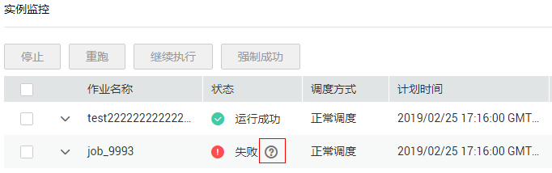

# 实例监控

在DLF控制台的左侧导航栏，选择  “运维调度“，进入实例监控列表页面，用户可以在该页面中查看作业的实例信息，并根据需要对实例和节点进行更多操作，请参见[批处理：查看所有实例](批作业监控.md#zh-cn_topic_0159100548_section8198174163417)  。

当作业实例的运行状态为“失败“时，您可以通过“失败“旁边的提示信息查看作业实例失败的原因。如[图1](#zh-cn_topic_0118654558_fig15674193582811)。

**图 1**  作业实例失败提示  

## 重跑作业实例

您可以对运行成功或失败的作业实例设置重跑，配置重跑开始位置。

1.  在数据开发主界面的左侧导航栏，选择“运维调度  \>  实例监控“。
2.  选择作业名称，在作业的“操作“列，单击“重跑“设置重跑作业实例；或单击作业名称左边的复选框，再选择“重跑“按钮设置作业重跑。

    **图 2**  设置作业重跑  
    

    **表 1**  参数说明

    
    <table><thead align="left"><tr id="zh-cn_topic_0118654558_row9507465414"><th class="cellrowborder" valign="top" width="35.17%" id="mcps1.2.3.1.1">
参数

    </th>
    <th class="cellrowborder" valign="top" width="64.83%" id="mcps1.2.3.1.2">
说明

    </th>
    </tr>
    </thead>
    <tbody><tr id="zh-cn_topic_0118654558_row18899622103418"><td class="cellrowborder" valign="top" width="35.17%" headers="mcps1.2.3.1.1 ">
重跑开始位置

    </td>
    <td class="cellrowborder" valign="top" width="64.83%" headers="mcps1.2.3.1.2 ">
选择作业实例重跑的开始位置：

    <ul id="zh-cn_topic_0118654558_ul437512816364"><li>从错误节点开始重跑：作业实例执行失败时，从实例执行失败的错误节点开始重跑。</li><li>从第一个节点开始重跑：从作业实例的第一个节点开始重跑。</li><li>从指定的节点开始重跑：从作业实例中指定的节点开始重跑。</li></ul>
    
 说明： 

以下两种情况，系统运行会从第一个节点开始重跑。

    <ul id="zh-cn_topic_0118654558_ul165113420374"><li>如果作业中节点个数或者名称发生变化，从第一个节点开始重跑。</li><li>如果重跑成功状态的作业实例，从第一个节点开始重跑。</li></ul>
    

    </td>
    </tr>
    </tbody>
    </table>

