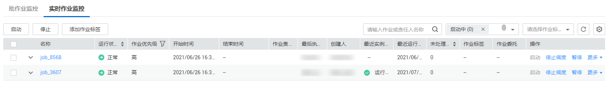
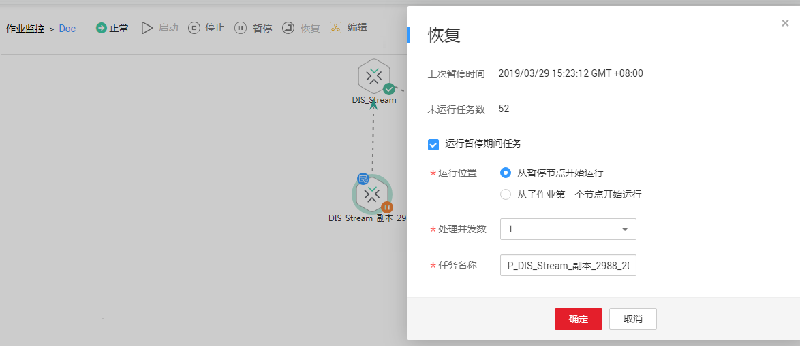
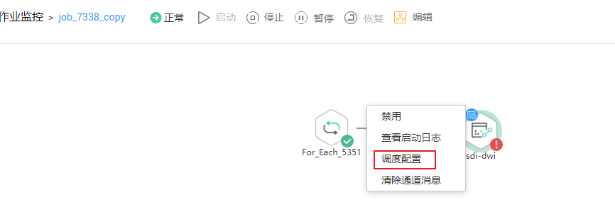
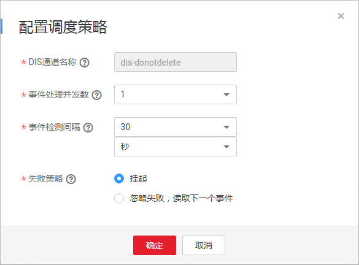
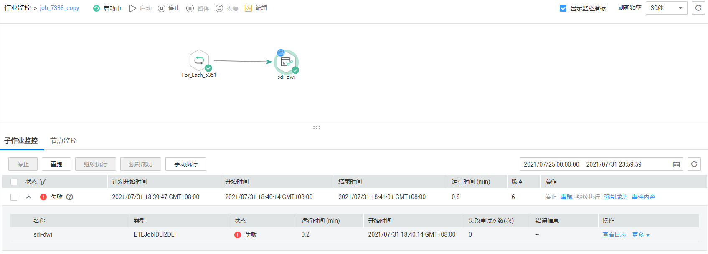

# 实时作业监控

批作业监控提供了对批处理作业的状态进行监控的能力。

实时处理作业处理实时的连续数据，主要用于实时性要求高的场景。实时作业是由一个或多个多个节点组成的流水线，每个节点配置独立的、节点级别的调度策略，而且节点启动的任务可以永不下线。在实时作业里，带箭头的连线仅代表业务上的关系，而非任务执行流程，更不是数据流。

您可以在“作业监控 \> 实时作业监控“页面查看实时处理作业的运行状态、开始执行时间、结束执行时间等信息，以及进行如[表1](#zh-cn_topic_0159098544_table958254318576)所示的操作。

**图 1**  实时作业监控  

**表 1**  实时作业监控支持的操作项

<table><thead align="left"><tr id="zh-cn_topic_0159098544_row1558284313572"><th class="cellrowborder" valign="top" width="5.050000000000001%" id="mcps1.2.4.1.1">
序号

</th>
<th class="cellrowborder" valign="top" width="25.41%" id="mcps1.2.4.1.2">
支持的操作项

</th>
<th class="cellrowborder" valign="top" width="69.54%" id="mcps1.2.4.1.3">
说明

</th>
</tr>
</thead>
<tbody><tr id="row679218403524"><td class="cellrowborder" valign="top" width="5.050000000000001%" headers="mcps1.2.4.1.1 ">
1

</td>
<td class="cellrowborder" valign="top" width="25.41%" headers="mcps1.2.4.1.2 ">
根据“作业名”或“责任人名”搜索作业

</td>
<td class="cellrowborder" valign="top" width="69.54%" headers="mcps1.2.4.1.3 ">
-

</td>
</tr>
<tr id="zh-cn_topic_0159098544_row35827433577"><td class="cellrowborder" valign="top" width="5.050000000000001%" headers="mcps1.2.4.1.1 ">
2

</td>
<td class="cellrowborder" valign="top" width="25.41%" headers="mcps1.2.4.1.2 ">
根据“运行状态”或“作业标签”筛选作业

</td>
<td class="cellrowborder" valign="top" width="69.54%" headers="mcps1.2.4.1.3 ">
-

</td>
</tr>
<tr id="row26614215186"><td class="cellrowborder" valign="top" width="5.050000000000001%" headers="mcps1.2.4.1.1 ">
3

</td>
<td class="cellrowborder" valign="top" width="25.41%" headers="mcps1.2.4.1.2 ">
批量配置作业

</td>
<td class="cellrowborder" valign="top" width="69.54%" headers="mcps1.2.4.1.3 ">
通过勾选作业名称前的复选框，支持批量执行操作。

</td>
</tr>
<tr id="row1381522614390"><td class="cellrowborder" valign="top" width="5.050000000000001%" headers="mcps1.2.4.1.1 ">
4

</td>
<td class="cellrowborder" valign="top" width="25.41%" headers="mcps1.2.4.1.2 ">
查看作业实例状态

</td>
<td class="cellrowborder" valign="top" width="69.54%" headers="mcps1.2.4.1.3 ">
单击作业名称前方的，显示“最近的实例”页面，查看该作业最近的实例信息。

</td>
</tr>
<tr id="row64751814419"><td class="cellrowborder" valign="top" width="5.050000000000001%" headers="mcps1.2.4.1.1 ">
5

</td>
<td class="cellrowborder" valign="top" width="25.41%" headers="mcps1.2.4.1.2 ">
作业状态相关

</td>
<td class="cellrowborder" valign="top" width="69.54%" headers="mcps1.2.4.1.3 ">
在作业的“操作”列，支持作业级别的启动、暂停、恢复、停止调度等。

</td>
</tr>
<tr id="row1041316794911"><td class="cellrowborder" valign="top" width="5.050000000000001%" headers="mcps1.2.4.1.1 ">
6

</td>
<td class="cellrowborder" valign="top" width="25.41%" headers="mcps1.2.4.1.2 ">
添加作业标签

</td>
<td class="cellrowborder" valign="top" width="69.54%" headers="mcps1.2.4.1.3 ">
在作业的“操作”列，选择“更多 &gt; 添加作业标签”，弹出“添加作业标签”对话框进行配置。

</td>
</tr>
<tr id="row1694122981615"><td class="cellrowborder" valign="top" width="5.050000000000001%" headers="mcps1.2.4.1.1 ">
7

</td>
<td class="cellrowborder" valign="top" width="25.41%" headers="mcps1.2.4.1.2 ">
查看作业的节点信息

</td>
<td class="cellrowborder" valign="top" width="69.54%" headers="mcps1.2.4.1.3 ">
单击作业名称，进入“作业监控”详情页面后，单击某个节点，查看该节点的相关关联作业\脚本与监控信息。

 说明： 

当作业中某个节点配置有事件驱动调度时，在单击此节点时会弹出子作业监控页面。

</td>
</tr>
<tr id="zh-cn_topic_0159098544_row10582843155716"><td class="cellrowborder" valign="top" width="5.050000000000001%" headers="mcps1.2.4.1.1 ">
8

</td>
<td class="cellrowborder" valign="top" width="25.41%" headers="mcps1.2.4.1.2 ">
“禁用”和“恢复”节点

</td>
<td class="cellrowborder" valign="top" width="69.54%" headers="mcps1.2.4.1.3 ">
单击作业名称，进入“作业监控”详情页面后，右键单击某个节点选择“禁用”，禁用后可以再选择“恢复”，恢复运行时可以重新选择运行位置。详情请参见<a href="#zh-cn_topic_0159097444_section1263174611499">实时作业监控：禁用节点后恢复</a>。

</td>
</tr>
<tr id="zh-cn_topic_0159098544_row158214433574"><td class="cellrowborder" valign="top" width="5.050000000000001%" headers="mcps1.2.4.1.1 ">
9

</td>
<td class="cellrowborder" valign="top" width="25.41%" headers="mcps1.2.4.1.2 ">
查看启动日志

</td>
<td class="cellrowborder" valign="top" width="69.54%" headers="mcps1.2.4.1.3 ">
单击作业名称，进入“作业监控”详情页面后，右键单击某个节点选择“查看启动日志”，您可以查看该节点的日志信息。

</td>
</tr>
<tr id="zh-cn_topic_0159098544_row15821434571"><td class="cellrowborder" valign="top" width="5.050000000000001%" headers="mcps1.2.4.1.1 ">
10

</td>
<td class="cellrowborder" valign="top" width="25.41%" headers="mcps1.2.4.1.2 ">
调度配置

</td>
<td class="cellrowborder" valign="top" width="69.54%" headers="mcps1.2.4.1.3 ">
单击作业名称，进入“作业监控”详情页面后，在“作业监控”详情页面中右键单击配置有事件驱动调度的节点，选择“调度配置”，您可以查看查看和修改节点的调度信息。详情请参见<a href="#zh-cn_topic_0159097444_section112906617404">实时作业监控：事件驱动调度节点调度配置</a>。

</td>
</tr>
<tr id="row1355154414541"><td class="cellrowborder" valign="top" width="5.050000000000001%" headers="mcps1.2.4.1.1 ">
11

</td>
<td class="cellrowborder" valign="top" width="25.41%" headers="mcps1.2.4.1.2 ">
子作业监控

</td>
<td class="cellrowborder" valign="top" width="69.54%" headers="mcps1.2.4.1.3 ">
单击作业名称，进入“作业监控”详情页面后，单击配置有事件驱动调度的节点，查看子作业监控页面。详情请参见<a href="#section10136113392518">实时作业监控：子作业监控</a>。

</td>
</tr>
<tr id="row10989143521416"><td class="cellrowborder" valign="top" width="5.050000000000001%" headers="mcps1.2.4.1.1 ">
12

</td>
<td class="cellrowborder" valign="top" width="25.41%" headers="mcps1.2.4.1.2 ">
清除通道消息

</td>
<td class="cellrowborder" valign="top" width="69.54%" headers="mcps1.2.4.1.3 ">
单击作业名称，进入“作业监控”详情页面后，右键单击配置有事件驱动调度的节点，选择“清除通道消息”，您可以清除通道消息。

</td>
</tr>
</tbody>
</table>

## 实时作业监控：禁用节点后恢复

您可以对实时作业中某个节点配置“禁用“后恢复运行，恢复运行时可以重新选择运行位置。

1.  登录DGC控制台。选择对应工作空间的“数据开发“模块，进入数据开发页面。

    **图 2**  选择数据开发  
    

2.  在数据开发主界面的左侧导航栏，选择“运维调度  \>  作业监控“。
3.  选择“实时作业监控“页签，单击作业名称。
4.  进入“作业监控“详情页面后，右键单击节点，选择“禁用“。
5.  设置禁用后，再右键单击选择“恢复“。弹出“恢复“对话框，配置如[表2](#zh-cn_topic_0159097444_table3326856465)所示的参数。

    **图 3**  恢复操作  
    

    **表 2**  恢复参数说明

    
    <table><thead align="left"><tr id="zh-cn_topic_0159097444_row3326205194619"><th class="cellrowborder" valign="top" width="35.17%" id="mcps1.2.3.1.1">
参数

    </th>
    <th class="cellrowborder" valign="top" width="64.83%" id="mcps1.2.3.1.2">
说明

    </th>
    </tr>
    </thead>
    <tbody><tr id="zh-cn_topic_0159097444_row032775174611"><td class="cellrowborder" valign="top" width="35.17%" headers="mcps1.2.3.1.1 ">
上次暂停时间

    </td>
    <td class="cellrowborder" valign="top" width="64.83%" headers="mcps1.2.3.1.2 ">
节点暂停运行的起始时间。

    </td>
    </tr>
    <tr id="zh-cn_topic_0159097444_row83271359463"><td class="cellrowborder" valign="top" width="35.17%" headers="mcps1.2.3.1.1 ">
未运行任务数

    </td>
    <td class="cellrowborder" valign="top" width="64.83%" headers="mcps1.2.3.1.2 ">
节点暂停期间没有运行的任务数量。

    </td>
    </tr>
    <tr id="zh-cn_topic_0159097444_row137888187485"><td class="cellrowborder" valign="top" width="35.17%" headers="mcps1.2.3.1.1 ">
运行位置

    </td>
    <td class="cellrowborder" valign="top" width="64.83%" headers="mcps1.2.3.1.2 ">
“运行暂停期间任务”的参数。

    
表示选择节点暂停运行后，恢复运行时的启动位置。

    <ul id="zh-cn_topic_0159097444_ul3377183914814"><li>从暂停节点开始运行</li><li>从子作业第一个节点开始运行</li></ul>
    </td>
    </tr>
    <tr id="zh-cn_topic_0159097444_row14252202320486"><td class="cellrowborder" valign="top" width="35.17%" headers="mcps1.2.3.1.1 ">
处理并发数

    </td>
    <td class="cellrowborder" valign="top" width="64.83%" headers="mcps1.2.3.1.2 ">
“运行暂停期间任务”的参数。

    
表示选择任务处理的数量。

    </td>
    </tr>
    <tr id="zh-cn_topic_0159097444_row9675415184815"><td class="cellrowborder" valign="top" width="35.17%" headers="mcps1.2.3.1.1 ">
任务名称

    </td>
    <td class="cellrowborder" valign="top" width="64.83%" headers="mcps1.2.3.1.2 ">
“运行暂停期间任务”的参数。

    
表示恢复的任务名称。

    </td>
    </tr>
    </tbody>
    </table>

## 实时作业监控：事件驱动调度节点调度配置

当您配置的实时作业中某个节点配置有事件驱动调度时，在“作业监控“详情页面中右键单击配置有事件驱动调度的节点，选择“调度配置“，可以查看和修改节点的调度信息。

1.  登录DGC控制台。选择对应工作空间的“数据开发“模块，进入数据开发页面。

    **图 4**  选择数据开发  
    

2.  在数据开发主界面的左侧导航栏，选择“运维调度  \>  作业监控“。
3.  选择“实时作业监控“页签，单击作业名称。
4.  进入“作业监控“详情页面后，右键单击配置有事件驱动调度的节点，选择“调度配置“。

    **图 5**  调度配置  
    

    当节点“事件驱动调度“的“触发事件类型“配置为“DIS“时：

    **图 6**  DIS调度策略配置  
    

1.  配置如[表3](#table9417351471)所示的参数。

    **表 3**  调度配策略参数说明

    
    <table><thead align="left"><tr id="row64116352479"><th class="cellrowborder" valign="top" width="35.17%" id="mcps1.2.3.1.1">
参数

    </th>
    <th class="cellrowborder" valign="top" width="64.83%" id="mcps1.2.3.1.2">
说明

    </th>
    </tr>
    </thead>
    <tbody><tr id="row24183514711"><td class="cellrowborder" valign="top" width="35.17%" headers="mcps1.2.3.1.1 ">
DIS通道名称

    </td>
    <td class="cellrowborder" valign="top" width="64.83%" headers="mcps1.2.3.1.2 ">
选择DIS通道，当指定的DIS通道有新消息时，数据开发模块将新消息传递给作业，触发该作业运行。

    </td>
    </tr>
    <tr id="row94115356474"><td class="cellrowborder" valign="top" width="35.17%" headers="mcps1.2.3.1.1 ">
事件处理并发数

    </td>
    <td class="cellrowborder" valign="top" width="64.83%" headers="mcps1.2.3.1.2 ">
选择作业并行处理的数量，最大并发数为10。

    </td>
    </tr>
    <tr id="row104118352474"><td class="cellrowborder" valign="top" width="35.17%" headers="mcps1.2.3.1.1 ">
事件检测间隔

    </td>
    <td class="cellrowborder" valign="top" width="64.83%" headers="mcps1.2.3.1.2 ">
配置事件检测时间间隔。时间间隔单位可以配置为秒或分钟。

    </td>
    </tr>
    <tr id="row154115359479"><td class="cellrowborder" valign="top" width="35.17%" headers="mcps1.2.3.1.1 ">
失败策略

    </td>
    <td class="cellrowborder" valign="top" width="64.83%" headers="mcps1.2.3.1.2 ">
选择调度失败后的策略：

    <ul id="ul1041435174716"><li>结束调度</li><li>忽略失败，继续调度</li></ul>
    </td>
    </tr>
    </tbody>
    </table>

## 实时作业监控：子作业监控

当用户配置的作业中某个节点配置有事件调度时，单击此节点可以查询子作业监控。在“子作业监控“页面可以对子作业设置停止、重跑、继续执行、强制成功、查看事件内容等操作。

1.  登录DGC控制台。选择对应工作空间的“数据开发“模块，进入数据开发页面。

    **图 7**  选择数据开发  
    

2.  在数据开发主界面的左侧导航栏，选择“运维调度  \>  作业监控“。
3.  选择“实时作业监控“页签，单击作业名称。
4.  进入“作业监控“详情页面后，单击配置有事件调度的节点。如[图8](#zh-cn_topic_0159098544_fig634514283111)所示。

    **图 8**  子作业监控  
    

    在“子作业监控“页面的“操作“列，提供如[表4](#table7990143352515)所示的操作。

    **表 4**  子作业监控操作

    
    <table><thead align="left"><tr id="row09919339258"><th class="cellrowborder" valign="top" width="30%" id="mcps1.2.3.1.1">
操作项

    </th>
    <th class="cellrowborder" valign="top" width="70%" id="mcps1.2.3.1.2">
说明

    </th>
    </tr>
    </thead>
    <tbody><tr id="row699163318253"><td class="cellrowborder" valign="top" width="30%" headers="mcps1.2.3.1.1 ">
停止

    </td>
    <td class="cellrowborder" valign="top" width="70%" headers="mcps1.2.3.1.2 ">
停止运行状态为“运行中”的子作业实例。

    </td>
    </tr>
    <tr id="row199183352510"><td class="cellrowborder" valign="top" width="30%" headers="mcps1.2.3.1.1 ">
重跑

    </td>
    <td class="cellrowborder" valign="top" width="70%" headers="mcps1.2.3.1.2 ">
重新运行状态为“成功”或“失败”的子作业实例。

    </td>
    </tr>
    <tr id="row7991133319253"><td class="cellrowborder" valign="top" width="30%" headers="mcps1.2.3.1.1 ">
继续执行

    </td>
    <td class="cellrowborder" valign="top" width="70%" headers="mcps1.2.3.1.2 ">
子作业实例的状态为“运行异常”时，支持继续运行子作业实例中的后续节点。

    
 说明： 

只有节点的“节点属性 &gt; 高级 &gt; 失败策略”设置为“挂起当前作业执行计划”时，才可以执行该操作。

    

    </td>
    </tr>
    <tr id="row699117334252"><td class="cellrowborder" valign="top" width="30%" headers="mcps1.2.3.1.1 ">
强制成功

    </td>
    <td class="cellrowborder" valign="top" width="70%" headers="mcps1.2.3.1.2 ">
强制将状态为“失败”的子作业实例变更为“运行成功”状态。

    </td>
    </tr>
    <tr id="zh-cn_topic_0159098544_row9642818103917"><td class="cellrowborder" valign="top" width="30%" headers="mcps1.2.3.1.1 ">
事件内容

    </td>
    <td class="cellrowborder" valign="top" width="70%" headers="mcps1.2.3.1.2 ">
查看子作业的事件内容。

    </td>
    </tr>
    </tbody>
    </table>

5.  单击“子作业监控“页面“状态“列下方的，显示该子作业节点的运行记录。

    在节点的“操作“列，提供如[表5](#zh-cn_topic_0159098544_table181913016117)所示的操作。

    **表 5**  操作（节点）

    
    <table><thead align="left"><tr id="dgc_01_0511_zh-cn_topic_0159100548_row241300116"><th class="cellrowborder" valign="top" width="32%" id="mcps1.2.3.1.1">
操作项

    </th>
    <th class="cellrowborder" valign="top" width="68%" id="mcps1.2.3.1.2">
说明

    </th>
    </tr>
    </thead>
    <tbody><tr id="dgc_01_0511_zh-cn_topic_0159100548_row194120212"><td class="cellrowborder" valign="top" width="32%" headers="mcps1.2.3.1.1 ">
查看日志

    </td>
    <td class="cellrowborder" valign="top" width="68%" headers="mcps1.2.3.1.2 ">
查看节点的日志信息。

    </td>
    </tr>
    <tr id="dgc_01_0511_zh-cn_topic_0159100548_row18195019113"><td class="cellrowborder" valign="top" width="32%" headers="mcps1.2.3.1.1 ">
更多 &gt; 手工重试

    </td>
    <td class="cellrowborder" valign="top" width="68%" headers="mcps1.2.3.1.2 ">
节点的状态为“失败”时，支持重新运行节点。

    
 说明： 

只有节点的“节点属性 &gt; 高级 &gt; 失败策略”设置为“挂起当前作业执行计划”时，才可以执行该操作。

    

    </td>
    </tr>
    <tr id="dgc_01_0511_zh-cn_topic_0159100548_row719100419"><td class="cellrowborder" valign="top" width="32%" headers="mcps1.2.3.1.1 ">
更多 &gt; 强制成功

    </td>
    <td class="cellrowborder" valign="top" width="68%" headers="mcps1.2.3.1.2 ">
节点的状态为“失败”时，支持将该节点强制变更为“成功”状态。

    
 说明： 

只有节点的“节点属性 &gt; 高级 &gt; 失败策略”设置为“挂起当前作业执行计划”时，才可以执行该操作。

    

    </td>
    </tr>
    <tr id="dgc_01_0511_zh-cn_topic_0159100548_row151950117"><td class="cellrowborder" valign="top" width="32%" headers="mcps1.2.3.1.1 ">
更多 &gt; 跳过

    </td>
    <td class="cellrowborder" valign="top" width="68%" headers="mcps1.2.3.1.2 ">
节点的状态为“待运行”或“已暂停节点”时，支持跳过该节点。

    </td>
    </tr>
    <tr id="dgc_01_0511_zh-cn_topic_0159100548_row5191401120"><td class="cellrowborder" valign="top" width="32%" headers="mcps1.2.3.1.1 ">
更多 &gt; 暂停

    </td>
    <td class="cellrowborder" valign="top" width="68%" headers="mcps1.2.3.1.2 ">
节点的状态为“待运行”时，支持暂停运行该节点，该暂停节点的后续节点将会被阻塞。

    </td>
    </tr>
    <tr id="dgc_01_0511_zh-cn_topic_0159100548_row0191701213"><td class="cellrowborder" valign="top" width="32%" headers="mcps1.2.3.1.1 ">
更多 &gt; 恢复

    </td>
    <td class="cellrowborder" valign="top" width="68%" headers="mcps1.2.3.1.2 ">
节点的状态为“已暂停”时，支持恢复运行该节点。

    </td>
    </tr>
    </tbody>
    </table>

