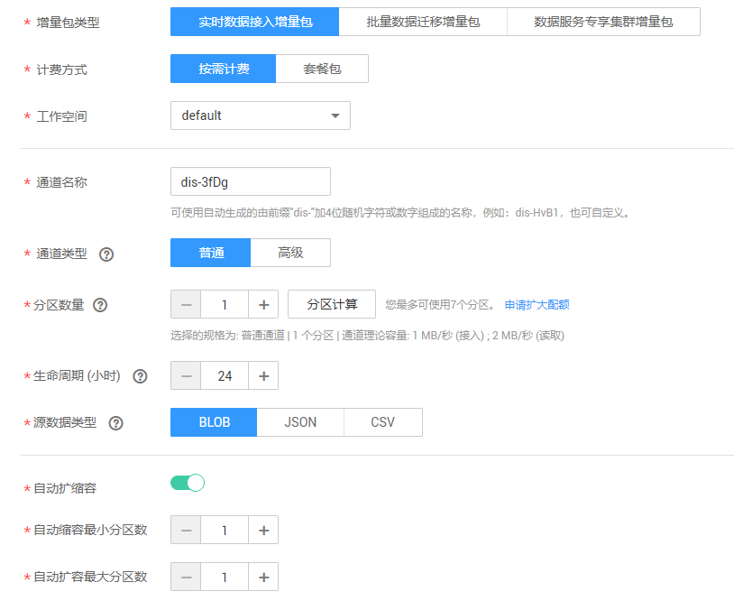
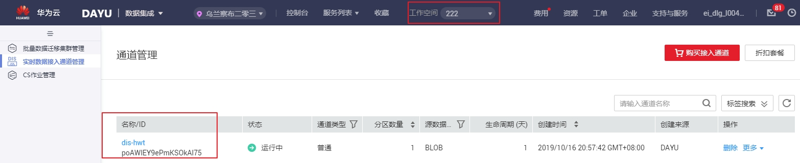
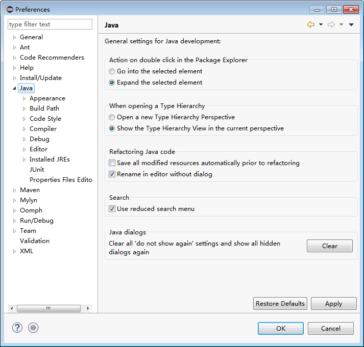
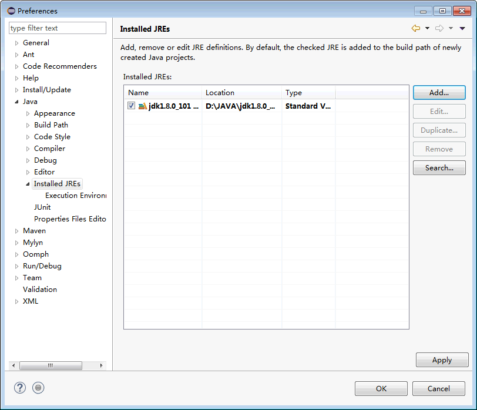
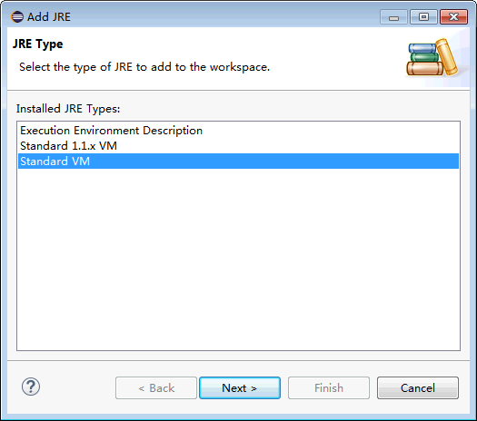
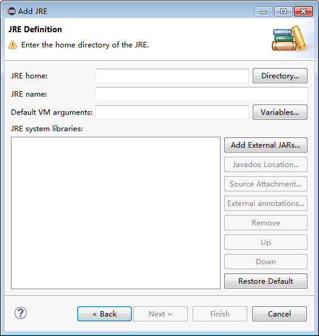
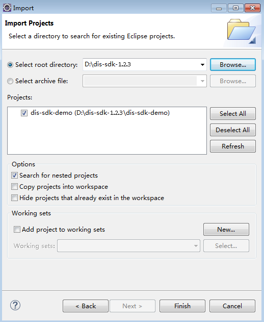
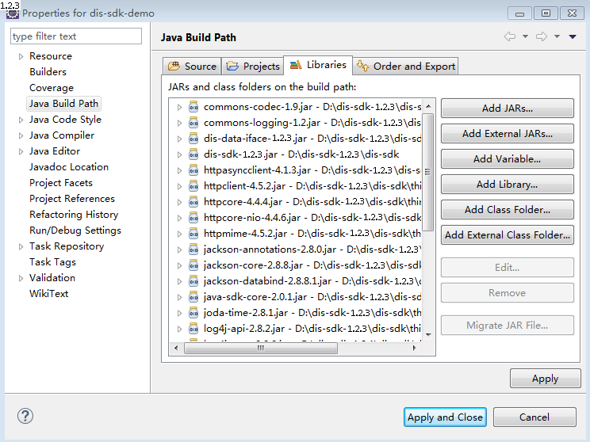
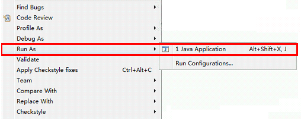

# 实时数据接入快速入门<a name="dgc_01_0202"></a>

## DIS使用流程简介<a name="section0751231144812"></a>

DIS的使用流程如下：

[按需计费方式购买实时数据接入通道](#section12577139103116)

用户使用DIS前需要先开通DIS通道。

[准备DIS应用开发环境](#section14841153918532)

用户开发DIS应用程序前，首先需要安装应用开发工具。然后获取SDK和样例工程，并导入到用户的开发环境中。

[发送数据到接入通道](#section1787611176593)

基于数据上传业务安装应用程序，并运行程序，实现数据上传功能。数据上传过程中可在Console控制台查看数据上传通道相关信息。

[从DIS获取数据](#section46415577119)

基于数据下载业务开发应用程序，并运行程序，实现数据下载功能。

## 按需计费方式购买实时数据接入通道<a name="section12577139103116"></a>

购买“按需计费”增量包，系统会按照您所选规格自动创建一个实时数据接入通道。

1.  单击已开通实例卡片上的“购买增量包“。
2.  进入购买DGC增量包页面，参见[表1](#zh-cn_topic_0000001127193887_zh-cn_topic_0197155665_table343119374217)进行配置。

    **图 1**  配置实时数据接入增量包<a name="zh-cn_topic_0000001127193887_zh-cn_topic_0197155665_fig20216136164313"></a>  
    

    **表 1**  配置实时数据接入的增量包

    <a name="zh-cn_topic_0000001127193887_zh-cn_topic_0197155665_table343119374217"></a>
    <table><thead align="left"><tr id="zh-cn_topic_0000001127193887_zh-cn_topic_0197155665_row1043219317428"><th class="cellrowborder" valign="top" width="17.62%" id="mcps1.2.3.1.1"><p id="zh-cn_topic_0000001127193887_zh-cn_topic_0197155665_p84322394218"><a name="zh-cn_topic_0000001127193887_zh-cn_topic_0197155665_p84322394218"></a><a name="zh-cn_topic_0000001127193887_zh-cn_topic_0197155665_p84322394218"></a>参数</p>
    </th>
    <th class="cellrowborder" valign="top" width="82.38%" id="mcps1.2.3.1.2"><p id="zh-cn_topic_0000001127193887_zh-cn_topic_0197155665_p74329304215"><a name="zh-cn_topic_0000001127193887_zh-cn_topic_0197155665_p74329304215"></a><a name="zh-cn_topic_0000001127193887_zh-cn_topic_0197155665_p74329304215"></a>说明</p>
    </th>
    </tr>
    </thead>
    <tbody><tr id="zh-cn_topic_0000001127193887_zh-cn_topic_0197155665_row943212311427"><td class="cellrowborder" valign="top" width="17.62%" headers="mcps1.2.3.1.1 "><p id="zh-cn_topic_0000001127193887_zh-cn_topic_0197155665_p4432133194215"><a name="zh-cn_topic_0000001127193887_zh-cn_topic_0197155665_p4432133194215"></a><a name="zh-cn_topic_0000001127193887_zh-cn_topic_0197155665_p4432133194215"></a>增量包类型</p>
    </td>
    <td class="cellrowborder" valign="top" width="82.38%" headers="mcps1.2.3.1.2 "><p id="zh-cn_topic_0000001127193887_zh-cn_topic_0197155665_p2432183134215"><a name="zh-cn_topic_0000001127193887_zh-cn_topic_0197155665_p2432183134215"></a><a name="zh-cn_topic_0000001127193887_zh-cn_topic_0197155665_p2432183134215"></a>选择实时数据接入增量包。</p>
    </td>
    </tr>
    <tr id="zh-cn_topic_0000001127193887_zh-cn_topic_0197155665_row2432153154210"><td class="cellrowborder" valign="top" width="17.62%" headers="mcps1.2.3.1.1 "><p id="zh-cn_topic_0000001127193887_zh-cn_topic_0197155665_p184321831424"><a name="zh-cn_topic_0000001127193887_zh-cn_topic_0197155665_p184321831424"></a><a name="zh-cn_topic_0000001127193887_zh-cn_topic_0197155665_p184321831424"></a>计费方式</p>
    </td>
    <td class="cellrowborder" valign="top" width="82.38%" headers="mcps1.2.3.1.2 "><p id="zh-cn_topic_0000001127193887_zh-cn_topic_0197155665_p16432934429"><a name="zh-cn_topic_0000001127193887_zh-cn_topic_0197155665_p16432934429"></a><a name="zh-cn_topic_0000001127193887_zh-cn_topic_0197155665_p16432934429"></a>选择按需计费。</p>
    </td>
    </tr>
    <tr id="zh-cn_topic_0000001127193887_zh-cn_topic_0197155665_row14432113144213"><td class="cellrowborder" valign="top" width="17.62%" headers="mcps1.2.3.1.1 "><p id="zh-cn_topic_0000001127193887_zh-cn_topic_0197155665_p9432123134217"><a name="zh-cn_topic_0000001127193887_zh-cn_topic_0197155665_p9432123134217"></a><a name="zh-cn_topic_0000001127193887_zh-cn_topic_0197155665_p9432123134217"></a>工作空间</p>
    </td>
    <td class="cellrowborder" valign="top" width="82.38%" headers="mcps1.2.3.1.2 "><p id="zh-cn_topic_0000001127193887_zh-cn_topic_0197155665_p117107275515"><a name="zh-cn_topic_0000001127193887_zh-cn_topic_0197155665_p117107275515"></a><a name="zh-cn_topic_0000001127193887_zh-cn_topic_0197155665_p117107275515"></a>选择需要使用实时数据接入增量包的工作空间。例如在<span id="zh-cn_topic_0000001127193887_text055432210529"><a name="zh-cn_topic_0000001127193887_text055432210529"></a><a name="zh-cn_topic_0000001127193887_text055432210529"></a>DGC</span>实例test的A工作空间中<span id="zh-cn_topic_0000001127193887_text266512343272"><a name="zh-cn_topic_0000001127193887_text266512343272"></a><a name="zh-cn_topic_0000001127193887_text266512343272"></a>购买</span>实时数据接入的增量包，这里工作空间选择A。<span id="zh-cn_topic_0000001127193887_text172251247132717"><a name="zh-cn_topic_0000001127193887_text172251247132717"></a><a name="zh-cn_topic_0000001127193887_text172251247132717"></a>购买</span>成功后，即可通过A工作空间查看到已经创建的通道。</p>
    </td>
    </tr>
    <tr id="zh-cn_topic_0000001127193887_zh-cn_topic_0197155665_row8433331429"><td class="cellrowborder" valign="top" width="17.62%" headers="mcps1.2.3.1.1 "><p id="zh-cn_topic_0000001127193887_zh-cn_topic_0197155665_p12433139422"><a name="zh-cn_topic_0000001127193887_zh-cn_topic_0197155665_p12433139422"></a><a name="zh-cn_topic_0000001127193887_zh-cn_topic_0197155665_p12433139422"></a>通道名称</p>
    </td>
    <td class="cellrowborder" valign="top" width="82.38%" headers="mcps1.2.3.1.2 "><p id="zh-cn_topic_0000001127193887_zh-cn_topic_0197155665_p411402701418"><a name="zh-cn_topic_0000001127193887_zh-cn_topic_0197155665_p411402701418"></a><a name="zh-cn_topic_0000001127193887_zh-cn_topic_0197155665_p411402701418"></a>用户发送或者接收数据时，需要指定通道名称，通道名称不可重复。通道名称由<span id="zh-cn_topic_0000001127193887_zh-cn_topic_0197155665_text53948140141235"><a name="zh-cn_topic_0000001127193887_zh-cn_topic_0197155665_text53948140141235"></a><a name="zh-cn_topic_0000001127193887_zh-cn_topic_0197155665_text53948140141235"></a>英文字母、数字、中划线和下划线组成。</span>长度为1～64个字符。</p>
    </td>
    </tr>
    <tr id="zh-cn_topic_0000001127193887_zh-cn_topic_0197155665_row1365517278599"><td class="cellrowborder" valign="top" width="17.62%" headers="mcps1.2.3.1.1 "><p id="zh-cn_topic_0000001127193887_zh-cn_topic_0197155665_p14656182716598"><a name="zh-cn_topic_0000001127193887_zh-cn_topic_0197155665_p14656182716598"></a><a name="zh-cn_topic_0000001127193887_zh-cn_topic_0197155665_p14656182716598"></a>通道类型</p>
    </td>
    <td class="cellrowborder" valign="top" width="82.38%" headers="mcps1.2.3.1.2 "><p id="zh-cn_topic_0000001127193887_zh-cn_topic_0197155665_p116911352175919"><a name="zh-cn_topic_0000001127193887_zh-cn_topic_0197155665_p116911352175919"></a><a name="zh-cn_topic_0000001127193887_zh-cn_topic_0197155665_p116911352175919"></a>通道类型分为普通和高级。</p>
    <a name="zh-cn_topic_0000001127193887_zh-cn_topic_0197155665_ul1069111529595"></a><a name="zh-cn_topic_0000001127193887_zh-cn_topic_0197155665_ul1069111529595"></a><ul id="zh-cn_topic_0000001127193887_zh-cn_topic_0197155665_ul1069111529595"><li>普通：单分区，最高发送速度可达1MB/秒或1000条记录/秒（达到任意一种速度上限才会被限流），最高提取速度可达2MB/秒。</li><li>高级：单分区，最高发送速度可达5MB/秒或2000条记录/秒（达到任意一种速度上限才会被限流），最高提取速度可达10MB/秒。</li></ul>
    </td>
    </tr>
    <tr id="zh-cn_topic_0000001127193887_zh-cn_topic_0197155665_row34339312423"><td class="cellrowborder" valign="top" width="17.62%" headers="mcps1.2.3.1.1 "><p id="zh-cn_topic_0000001127193887_zh-cn_topic_0197155665_p104335334211"><a name="zh-cn_topic_0000001127193887_zh-cn_topic_0197155665_p104335334211"></a><a name="zh-cn_topic_0000001127193887_zh-cn_topic_0197155665_p104335334211"></a>分区数量</p>
    </td>
    <td class="cellrowborder" valign="top" width="82.38%" headers="mcps1.2.3.1.2 "><div class="p" id="zh-cn_topic_0000001127193887_zh-cn_topic_0197155665_p50847566142947"><a name="zh-cn_topic_0000001127193887_zh-cn_topic_0197155665_p50847566142947"></a><a name="zh-cn_topic_0000001127193887_zh-cn_topic_0197155665_p50847566142947"></a>分区是数据通道的基本吞吐量单位，通道的多个分区可以并发进行数据传输，以提升效率。<a name="zh-cn_topic_0000001127193887_zh-cn_topic_0197155665_ul64669032142927"></a><a name="zh-cn_topic_0000001127193887_zh-cn_topic_0197155665_ul64669032142927"></a><ul id="zh-cn_topic_0000001127193887_zh-cn_topic_0197155665_ul64669032142927"><li>普通通道的分区数量取值范围：1～50的整数，每个租户分区数量总和不能超过50。</li><li>高级通道的分区数量取值范围：1～10的整数，每个租户分区数量总和不能超过10。</li></ul>
    </div>
    </td>
    </tr>
    <tr id="zh-cn_topic_0000001127193887_zh-cn_topic_0197155665_row13519264717"><td class="cellrowborder" valign="top" width="17.62%" headers="mcps1.2.3.1.1 "><p id="zh-cn_topic_0000001127193887_zh-cn_topic_0197155665_p173521822471"><a name="zh-cn_topic_0000001127193887_zh-cn_topic_0197155665_p173521822471"></a><a name="zh-cn_topic_0000001127193887_zh-cn_topic_0197155665_p173521822471"></a>分区计算</p>
    </td>
    <td class="cellrowborder" valign="top" width="82.38%" headers="mcps1.2.3.1.2 "><div class="p" id="zh-cn_topic_0000001127193887_zh-cn_topic_0197155665_p203587582019"><a name="zh-cn_topic_0000001127193887_zh-cn_topic_0197155665_p203587582019"></a><a name="zh-cn_topic_0000001127193887_zh-cn_topic_0197155665_p203587582019"></a>用户可以根据实际需求通过系统计算得到一个建议的分区数量值。<a name="zh-cn_topic_0000001127193887_zh-cn_topic_0197155665_ol03889271924"></a><a name="zh-cn_topic_0000001127193887_zh-cn_topic_0197155665_ol03889271924"></a><ol id="zh-cn_topic_0000001127193887_zh-cn_topic_0197155665_ol03889271924"><li>单击“分区计算”，弹出“计算所需分区数量”对话框。</li><li>根据实际需求填写“平均记录大小”、“最大写入记录数”和“消费程序数量”，“预估所需分区数量”选项框中将显示所需的分区数量，此值不可修改。<div class="note" id="zh-cn_topic_0000001127193887_zh-cn_topic_0197155665_note0380722563"><a name="zh-cn_topic_0000001127193887_zh-cn_topic_0197155665_note0380722563"></a><a name="zh-cn_topic_0000001127193887_zh-cn_topic_0197155665_note0380722563"></a><span class="notetitle"> 说明： </span><div class="notebody"><div class="p" id="zh-cn_topic_0000001127193887_zh-cn_topic_0197155665_p43809221865"><a name="zh-cn_topic_0000001127193887_zh-cn_topic_0197155665_p43809221865"></a><a name="zh-cn_topic_0000001127193887_zh-cn_topic_0197155665_p43809221865"></a>所需分区计算公式：<a name="zh-cn_topic_0000001127193887_zh-cn_topic_0197155665_ul13223349162"></a><a name="zh-cn_topic_0000001127193887_zh-cn_topic_0197155665_ul13223349162"></a><ul id="zh-cn_topic_0000001127193887_zh-cn_topic_0197155665_ul13223349162"><li>按流量计算所需写分区数：（所得数值需向上取整后作为分区数）<p id="zh-cn_topic_0000001127193887_zh-cn_topic_0197155665_p1292793683715"><a name="zh-cn_topic_0000001127193887_zh-cn_topic_0197155665_p1292793683715"></a><a name="zh-cn_topic_0000001127193887_zh-cn_topic_0197155665_p1292793683715"></a>普通通道：平均记录大小*（1+分区预留比例20%）*最大写入记录数/（1*1024KB）</p>
    <p id="zh-cn_topic_0000001127193887_zh-cn_topic_0197155665_p1611153718285"><a name="zh-cn_topic_0000001127193887_zh-cn_topic_0197155665_p1611153718285"></a><a name="zh-cn_topic_0000001127193887_zh-cn_topic_0197155665_p1611153718285"></a>高级通道：平均记录大小*（1+分区预留比例20%）*最大写入记录数/（5*1024KB）</p>
    </li><li>按消费程序数量计算读分区数：（消费程序数量/2后的数值需要保留两位小数，然后乘以“按流量计算所需写分区数”，最终取值需向上取整）<p id="zh-cn_topic_0000001127193887_zh-cn_topic_0197155665_p2361623371"><a name="zh-cn_topic_0000001127193887_zh-cn_topic_0197155665_p2361623371"></a><a name="zh-cn_topic_0000001127193887_zh-cn_topic_0197155665_p2361623371"></a>（消费程序数量/2）*按流量计算所需的写分区数</p>
    <p id="zh-cn_topic_0000001127193887_zh-cn_topic_0197155665_p183221412162615"><a name="zh-cn_topic_0000001127193887_zh-cn_topic_0197155665_p183221412162615"></a><a name="zh-cn_topic_0000001127193887_zh-cn_topic_0197155665_p183221412162615"></a>获取“按流量计算所需写分区数”、“按消费程序数量计算读分区数”中的最大值作为预估所需分区数量。</p>
    </li></ul>
    </div>
    </div></div>
    </li><li>单击“使用计算值”将系统计算出的建议值应用于“分区数量”。</li></ol>
    </div>
    </td>
    </tr>
    <tr id="zh-cn_topic_0000001127193887_zh-cn_topic_0197155665_row1043303194217"><td class="cellrowborder" valign="top" width="17.62%" headers="mcps1.2.3.1.1 "><p id="zh-cn_topic_0000001127193887_zh-cn_topic_0197155665_p1433103164216"><a name="zh-cn_topic_0000001127193887_zh-cn_topic_0197155665_p1433103164216"></a><a name="zh-cn_topic_0000001127193887_zh-cn_topic_0197155665_p1433103164216"></a>生命周期</p>
    </td>
    <td class="cellrowborder" valign="top" width="82.38%" headers="mcps1.2.3.1.2 "><p id="zh-cn_topic_0000001127193887_zh-cn_topic_0197155665_p25880564143452"><a name="zh-cn_topic_0000001127193887_zh-cn_topic_0197155665_p25880564143452"></a><a name="zh-cn_topic_0000001127193887_zh-cn_topic_0197155665_p25880564143452"></a>存储在实时数据接入通道中的数据保留的最长时间，超过此时长数据将被清除。</p>
    </td>
    </tr>
    <tr id="zh-cn_topic_0000001127193887_zh-cn_topic_0197155665_row686619452441"><td class="cellrowborder" valign="top" width="17.62%" headers="mcps1.2.3.1.1 "><p id="zh-cn_topic_0000001127193887_zh-cn_topic_0197155665_p88671845174415"><a name="zh-cn_topic_0000001127193887_zh-cn_topic_0197155665_p88671845174415"></a><a name="zh-cn_topic_0000001127193887_zh-cn_topic_0197155665_p88671845174415"></a>源数据类型</p>
    </td>
    <td class="cellrowborder" valign="top" width="82.38%" headers="mcps1.2.3.1.2 "><a name="zh-cn_topic_0000001127193887_zh-cn_topic_0197155665_ul88901210194810"></a><a name="zh-cn_topic_0000001127193887_zh-cn_topic_0197155665_ul88901210194810"></a><ul id="zh-cn_topic_0000001127193887_zh-cn_topic_0197155665_ul88901210194810"><li>BLOB：存储在数据库管理系统中的一组二进制数据。“源数据类型”选择“BLOB”，则支持的“转储服务类型”为“OBS”、“MRS”。</li><li>JSON：一种开放的文件格式，以易读的文字为基础，用来传输由属性值或者序列性的值组成的数据对象。“源数据类型”选择“JSON”，则支持的“转储服务类型”为“OBS”、“MRS”、“DLI”、“CloudTable”和“DWS”。</li><li>CSV：纯文本形式存储的表格数据，分隔符默认采用逗号。“源数据类型”选择“CSV”，则支持的“转储服务类型”为“OBS”、“MRS”、“DLI”、“DWS”。</li></ul>
    </td>
    </tr>
    <tr id="zh-cn_topic_0000001127193887_zh-cn_topic_0197155665_row1623444964416"><td class="cellrowborder" valign="top" width="17.62%" headers="mcps1.2.3.1.1 "><p id="zh-cn_topic_0000001127193887_zh-cn_topic_0197155665_p203581536205512"><a name="zh-cn_topic_0000001127193887_zh-cn_topic_0197155665_p203581536205512"></a><a name="zh-cn_topic_0000001127193887_zh-cn_topic_0197155665_p203581536205512"></a>自动扩缩容</p>
    </td>
    <td class="cellrowborder" valign="top" width="82.38%" headers="mcps1.2.3.1.2 "><p id="zh-cn_topic_0000001127193887_zh-cn_topic_0197155665_p2018612404556"><a name="zh-cn_topic_0000001127193887_zh-cn_topic_0197155665_p2018612404556"></a><a name="zh-cn_topic_0000001127193887_zh-cn_topic_0197155665_p2018612404556"></a>创建通道的同时是否开启自动扩缩容功能。</p>
    <div class="note" id="zh-cn_topic_0000001127193887_zh-cn_topic_0197155665_note1349702161119"><a name="zh-cn_topic_0000001127193887_zh-cn_topic_0197155665_note1349702161119"></a><a name="zh-cn_topic_0000001127193887_zh-cn_topic_0197155665_note1349702161119"></a><span class="notetitle"> 说明： </span><div class="notebody"><p id="zh-cn_topic_0000001127193887_zh-cn_topic_0197155665_p2497192151115"><a name="zh-cn_topic_0000001127193887_zh-cn_topic_0197155665_p2497192151115"></a><a name="zh-cn_topic_0000001127193887_zh-cn_topic_0197155665_p2497192151115"></a>用户可在创建通道时定义是否自动扩缩容，也可对已创建的通道修改自动扩缩容属性。</p>
    </div></div>
    </td>
    </tr>
    <tr id="zh-cn_topic_0000001127193887_zh-cn_topic_0197155665_row1463855919489"><td class="cellrowborder" valign="top" width="17.62%" headers="mcps1.2.3.1.1 "><p id="zh-cn_topic_0000001127193887_zh-cn_topic_0197155665_p830144817202"><a name="zh-cn_topic_0000001127193887_zh-cn_topic_0197155665_p830144817202"></a><a name="zh-cn_topic_0000001127193887_zh-cn_topic_0197155665_p830144817202"></a>自动缩容最小分区数</p>
    </td>
    <td class="cellrowborder" valign="top" width="82.38%" headers="mcps1.2.3.1.2 "><p id="zh-cn_topic_0000001127193887_zh-cn_topic_0197155665_p530184882010"><a name="zh-cn_topic_0000001127193887_zh-cn_topic_0197155665_p530184882010"></a><a name="zh-cn_topic_0000001127193887_zh-cn_topic_0197155665_p530184882010"></a>设置自动缩容的分区下限，自动缩容的目标分区数不小于下限值。</p>
    </td>
    </tr>
    <tr id="zh-cn_topic_0000001127193887_zh-cn_topic_0197155665_row162481562488"><td class="cellrowborder" valign="top" width="17.62%" headers="mcps1.2.3.1.1 "><p id="zh-cn_topic_0000001127193887_zh-cn_topic_0197155665_p18849165082019"><a name="zh-cn_topic_0000001127193887_zh-cn_topic_0197155665_p18849165082019"></a><a name="zh-cn_topic_0000001127193887_zh-cn_topic_0197155665_p18849165082019"></a>自动扩容最大分区数</p>
    </td>
    <td class="cellrowborder" valign="top" width="82.38%" headers="mcps1.2.3.1.2 "><p id="zh-cn_topic_0000001127193887_zh-cn_topic_0197155665_p68497506202"><a name="zh-cn_topic_0000001127193887_zh-cn_topic_0197155665_p68497506202"></a><a name="zh-cn_topic_0000001127193887_zh-cn_topic_0197155665_p68497506202"></a>设置自动扩容的分区上限，自动扩容的目标分区数不超过上限值。</p>
    </td>
    </tr>
    </tbody>
    </table>

3.  单击“立即购买“，确认规格后提交。
4.  购买成功后，即可返回对应的工作空间查看已购买的实时数据接入通道。

    **图 2**  查看通道<a name="zh-cn_topic_0000001127193887_zh-cn_topic_0197155665_fig48217317316"></a>  
    


## 准备DIS应用开发环境<a name="section14841153918532"></a>

-   JDK\(1.8版本或以上版本\)工具已安装成功。
-   Eclipse工具已安装成功。

1.  Eclipse中配置JDK。
    1.  打开Eclipse工具，选择“Window \> Preferences”，弹出“Preferences”窗口。
    2.  在左侧菜单栏单击“Java”，显示如[图3](#fig37124028152333)所示内容，选择相关配置，单击“OK”。

        **图 3**  Preferences<a name="fig37124028152333"></a>  
        

    3.  在左侧菜单栏选择“Java \> Installed JREs”配置JDK环境变量，显示如[图4](#fig6650071152523)所示。

        -   右侧窗口中显示已配置好的JDK变量，执行[1.c.i](#li12377149194529)完成JDK变量配置。
        -   如需配置多个不同的变量对应不同版本的JDK，请执行[1.c.ii](#li40268681153416)～[1.c.iv](#li6851708153416)。

        **图 4**  Installed JREs<a name="fig6650071152523"></a>  
        

        1.  <a name="li12377149194529"></a>勾选已安装的JDK，单击“OK”。
        2.  <a name="li40268681153416"></a>单击“Add”按钮，弹出“Add JRE”窗口，如[图5](#fig2154153153416)所示。

            **图 5**  JRE Type<a name="fig2154153153416"></a>  
            

        3.  选择一个JRE类型，单击“Next”，弹出如[图6](#fig62331347153416)所示窗口。

            **图 6**  JRE Definition<a name="fig62331347153416"></a>  
            

        4.  <a name="li6851708153416"></a>配置JDK基本信息，单击“Finish”完成配置。
            -   JRE home：JDK安装路径。
            -   Default VM arguments：JDK运行参数。


2.  在[https://github.com/huaweicloud/huaweicloud-sdk-java-dis](https://github.com/huaweicloud/huaweicloud-sdk-java-dis)中下载DIS的Java SDK压缩包。

3.  导入Eclipse项目。
    1.  打开Eclipse。选择“File \> Import”弹出“Import”窗口。

    1.  选择“Maven \> Existing Maven Projects”，单击“Next”，进入“Import Maven Projects”页面。
    2.  单击“Browse“按钮，根据实际情况选择“dis-sdk-demo”样例工程的存储位置，勾选样例工程，如[图7](#fig96131055317)所示。

        **图 7**  Import Maven Projects1<a name="fig96131055317"></a>  
        

    3.  单击“Finish”完成项目导入。

4.  导入Eclipse项目。
    1.  打开Eclipse。选择“File \> Import”弹出“Import”窗口。

    1.  选择“General \> Existing Projects into Workspace”，单击“Next”，进入“Import Projects”页面。
    2.  单击“Browse“按钮，根据实际情况选择“dis-sdk-demo”样例工程的存储位置，勾选样例工程，如[图8](#f23cd224614d04888bfa7c759107662f3)所示。

        **图 8**  Import Projects<a name="f23cd224614d04888bfa7c759107662f3"></a>  
        

    3.  单击“Finish”完成项目导入。

5.  导入Maven项目。
    1.  打开Eclipse。选择“File \> Import”弹出“Import”窗口。

    1.  选择“Maven \> Existing Maven Projects”，单击“Next”，进入“Import Maven projects”页面。
    2.  单击“Browse“按钮，根据实际情况选择“dis-sdk-demo”样例工程的存储位置，勾选样例工程，如[图9](#fig1862449910446)所示。

        **图 9**  Import Maven Projects2<a name="fig1862449910446"></a>  
        

    3.  单击“Finish”完成项目导入。

6.  配置Demo工程。
    1.  配置项目编码为“UTF-8”。
        1.  在左侧导航栏“Project Explorer”中右键单击所需工程，选择“Properties ”，进入“Properties for dis-sdk-demo”页面。
        2.  左侧页签栏选择“Resource”，右侧对话框显示“Resource”页面。
        3.  在“Text file encoding”栏中选择“Other”，单击下拉框选择“UTF-8”。
        4.  单击“Apply and Close”完成编码配置。

    2.  导入依赖jar包。

        1.  在左侧导航栏“Project Explorer”中右键单击所需工程，选择“Properties ”，进入“Properties for dis-sdk-demo”页面。
        2.  左侧页签栏选择“Java Build Path”，右侧对话框显示“Java Build Path”页面。
        3.  在“Java Build Path”页面选择“Libraries”页签，单击“Add External JARs”，弹出“JAR Selection”对话框。
        4.  选择解压后的“dis-sdk”文件夹的所在位置，单击“打开”。
        5.  在“Properties for dis-sdk-demo”页面单击“Apply and Close”，将当前路径下以及“third\_lib”文件夹下所有扩展名为“jar”的文件导入到项目中。

        **图 10**  Java Build Path<a name="fig1824213232316"></a>  
        

    3.  添加JDK。
        1.  在左侧导航栏“Project Explorer”中右键单击所需工程，选择“Properties ”，进入“Properties for dis-sdk-demo”页面。
        2.  左侧页签栏选择“Java Build Path”，右侧对话框显示“Java Build Path”页面。
        3.  在“Java Build Path”页面选择“Libraries”页签，单击“Add Library”，弹出“Add Library”对话框。
        4.  选择“JRE System Library”，单击“Next”确认“Workspace default JRE”为jdk1.8及以上版本。
        5.  单击“Finish”退出“Add Library”对话框。
        6.  单击“Apply and Close”完成JDK添加。

7.  初始化DIS客户端实例。

    终端节点（Endpoint）即调用API的**请求地址**，不同服务不同区域的终端节点不同。Endpoint可从[终端节点及区域说明](https://developer.huaweicloud.com/endpoint)获取。


## 发送数据到接入通道<a name="section1787611176593"></a>

将用户本地数据通过DIS通道不断上传至DIS服务。

样例工程为[准备DIS应用开发环境](#section14841153918532)章节中下载的“huaweicloud-sdk-dis-java-_X.X.X_.zip”压缩包中“\\dis-sdk-demo\\src\\main\\java\\com\\bigdata\\dis\\sdk\\demo“路径下“ProducerDemo.java”文件。

程序开发完成后，右键选择“Run As \> 1 Java Application”运行程序，如[图11](#fig15069943162017)所示。

**图 11**  运行上传数据程序<a name="fig15069943162017"></a>  


数据上传过程中可在Console控制台查看数据上传通道量信息。出现类似信息表示数据上传成功。

```
14:40:20.090 [main] INFOcom.bigdata.dis.sdk.DISConfig - get from classLoader
14:40:20.093 [main] INFODEMOT - ========== BEGIN PUT ============
14:40:21.186 [main] INFOcom.bigdata.dis.sdk.util.config.ConfigurationUtils - get from classLoader
14:40:21.187 [main] INFOcom.bigdata.dis.sdk.util.config.ConfigurationUtils - propertyMapFromFile size : 2
14:40:22.092 [main] INFOcom.bigdata.dis.sdk.demo.ProducerDemo - Put 3 records[3 successful / 0 failed].
14:40:22.092 [main] INFOcom.bigdata.dis.sdk.demo.ProducerDemo - [hello world.] put success, partitionId [shardId-0000000000], partitionKey [964885], sequenceNumber [0]
14:40:22.092 [main] INFOcom.bigdata.dis.sdk.demo.ProducerDemo - [hello world.] put success, partitionId [shardId-0000000000], partitionKey [910960], sequenceNumber [1]
14:40:22.092 [main] INFOcom.bigdata.dis.sdk.demo.ProducerDemo - [hello world.] put success, partitionId [shardId-0000000000], partitionKey [528377], sequenceNumber [2]
14:40:22.092 [main] INFOcom.bigdata.dis.sdk.demo.ProducerDemo - ========== PUT OVER ============
```

## 从DIS获取数据<a name="section46415577119"></a>

样例工程为“[准备DIS应用开发环境](#section14841153918532)”章节中下载的“huaweicloud-sdk-dis-java-_X.X.X_.zip”“dis-sdk-XXX.zip”压缩包中“\\dis-sdk-demo\\src\\main\\java\\com\\bigdata\\dis\\sdk\\demo”路径下“ConsumerDemo.java”文件。

运行程序，出现类似信息表示下载数据成功：

```
14:55:42.954 [main] INFOcom.bigdata.dis.sdk.DISConfig - get from classLoader
14:55:44.103 [main] INFOcom.bigdata.dis.sdk.util.config.ConfigurationUtils - get from classLoader
14:55:44.105 [main] INFOcom.bigdata.dis.sdk.util.config.ConfigurationUtils - propertyMapFromFile size : 2
14:55:45.235 [main] INFOcom.bigdata.dis.sdk.demo.ConsumerDemo - Get stream streamName[partitionId=0] cursor success : eyJnZXRJdGVyYXRvclBhcmFtIjp7InN0cmVhbS1uYW1lIjoiZGlzLTEzbW9uZXkiLCJwYXJ0aXRpb24taWQiOiIwIiwiY3Vyc29yLXR5cGUiOiJBVF9TRVFVRU5DRV9OVU1CRVIiLCJzdGFydGluZy1zZXF1ZW5jZS1udW1iZXIiOiIxMDY4OTcyIn0sImdlbmVyYXRlVGltZXN0YW1wIjoxNTEzNjY2NjMxMTYxfQ
14:55:45.305 [main] INFOcom.bigdata.dis.sdk.demo.ConsumerDemo - Get Record [hello world.], partitionKey [964885], sequenceNumber [0].
14:55:45.305 [main] INFOcom.bigdata.dis.sdk.demo.ConsumerDemo - Get Record [hello world.], partitionKey [910960], sequenceNumber [1].
14:55:46.359 [main] INFOcom.bigdata.dis.sdk.demo.ConsumerDemo - Get Record [hello world.], partitionKey [528377], sequenceNumber [2]. 
```

