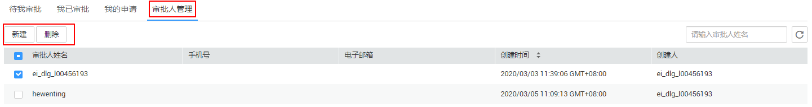

# 审批中心

## 约束与限制

仅管理员角色的用户支持管理审批人，可新建和删除审批人。

## 审批管理

用户可在审批中心页面，查看自己提交的申请及进度，查看待自己审批的申请，查看已审批的历史记录并对审批人进行管理。

-   审批人管理

    选择“数据权限 \> 审批中心”，在“审批人管理“页签“新建“和“删除“审批人，如[图1](#fig2620030459)。审批人数据来源于工作空间中添加的人。

    **图 1**  管理审批人  
    

-   待我审批
    1.  选择“数据权限 \> 审批中心”，单击“待我审批“页签。

        在此页面查看当前需要用户审批的申请单。

    2.  单击操作栏的“审批“，查看申请单的详细信息并进行审批。
    3.  填写审批意见后，根据实际情况同意或拒绝该申请。

-   我已审批
    1.  选择“数据权限 \> 审批中心”，单击“我已审批“页签。
    2.  单击操作栏中的“查看“，即可查看申请单的审批记录和申请内容等详细信息。

-   我的申请
    1.  选择“数据权限 \> 审批中心”，单击“我的申请“页签。
    2.  单击操作栏中的“查看“，即可查看申请单的详细信息。
    3.  单击操作栏中的“重新申请“，即可重新授权。

