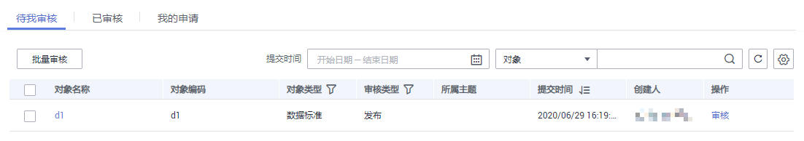
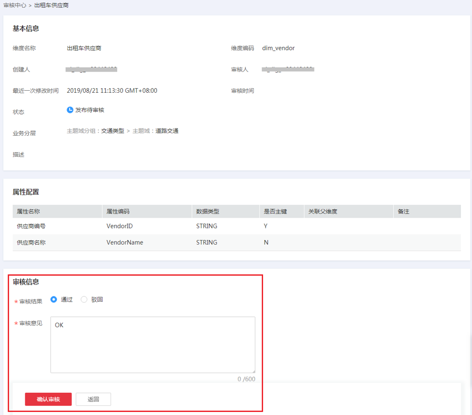
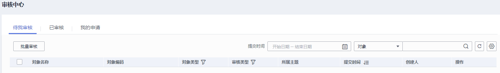
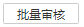
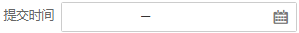
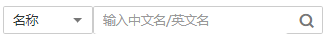
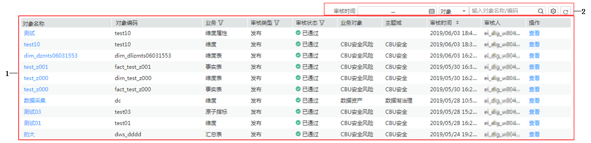
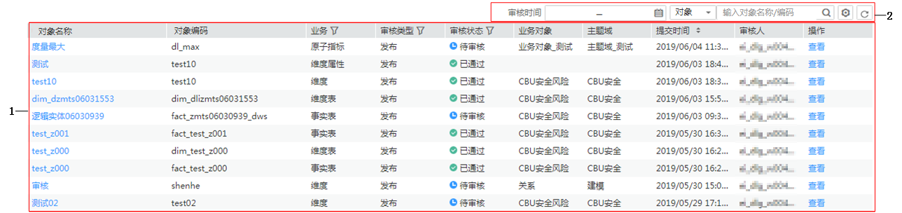
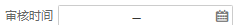
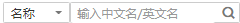

# 审核中心

开发环境生成的规范建模、数据处理类任务提交后，都会存储在审核中心页面，然后在审核中心页面进行任务发布，这些任务才会在生产环境上线。

## 审核人员审核对象

如果您是审核人员，请慎用审核人员的账号参考以下步骤审核对象。

1.  [登录DAYU控制台](https://console.huaweicloud.com/dayu/)，找到所需要的DAYU实例，单击实例卡片上的“进入控制台”，进入概览页面。

    选择“空间管理”页签，完成工作空间的创建。

    在工作空间列表中，找到所需要的工作空间。

1.  单击相应工作空间的“规范设计“。

    系统跳转至规范设计页面。

1.  在左侧导航树中，单击“审核中心“，选择“待审核“页签，在列表中找到需要审核的对象，然后在该对象所在行单击“审核“按钮。

    **图 1**  审核  
    

2.  选择审核结果，输入审核意见，然后单击“确认审核“按钮完成审核。

    **图 2**  确认审核  
    

## 待审核

1.  登录DLG控制台，右侧快捷入口栏中单击“规范设计“，系统跳转至规范设计页面。
2.  在左侧导航栏中，单击“审核中心“，进入审核中心页面，系统默认显示待审核页面，如下图所示。

    **图 3**  待审核页面  
    

    
    <table><thead align="left"><tr id="zh-cn_topic_0172166857_row1318511181552"><th class="cellrowborder" valign="top" width="14.000000000000002%" id="mcps1.1.3.1.1">
功能区域

    </th>
    <th class="cellrowborder" valign="top" width="86%" id="mcps1.1.3.1.2">
说明

    </th>
    </tr>
    </thead>
    <tbody><tr id="zh-cn_topic_0172166857_row5806026142410"><td class="cellrowborder" valign="top" width="14.000000000000002%" headers="mcps1.1.3.1.1 ">
1

    </td>
    <td class="cellrowborder" valign="top" width="86%" headers="mcps1.1.3.1.2 ">
批量审核：

    <ol id="zh-cn_topic_0172166857_ol15636154162715"><li>勾选多个待审核信息。</li><li>单击，弹出“批量审核”对话框。</li><li>输入有效的审核意见。</li><li>单击“批量通过”，所选审核信息通过审核；单击“批量驳回”，所选审核信息被驳回。</li></ol>
    </td>
    </tr>
    <tr id="zh-cn_topic_0172166857_row7185018105515"><td class="cellrowborder" valign="top" width="14.000000000000002%" headers="mcps1.1.3.1.1 ">
2

    </td>
    <td class="cellrowborder" valign="top" width="86%" headers="mcps1.1.3.1.2 ">
单个审核：

    <ol id="zh-cn_topic_0172166857_ol6603155514572"><li>单击操作列“审核”，进入指定待审核信息的审核页面。</li><li>据实际情况勾选审核结果、输入有效的审核的意见。</li><li>单击“确认审核”。</li></ol>
    </td>
    </tr>
    <tr id="zh-cn_topic_0172166857_row65442818553"><td class="cellrowborder" valign="top" width="14.000000000000002%" headers="mcps1.1.3.1.1 ">
3

    </td>
    <td class="cellrowborder" valign="top" width="86%" headers="mcps1.1.3.1.2 "><ul id="zh-cn_topic_0172166857_ul1252183125516"><li>：通过该按钮过滤出修改时间段内的待审核信息。</li><li>：通过该按钮查询各表、创建人、审核人或责任人的待审核信息。</li><li>：通过该按钮设置待审核表的表列项。</li><li>：刷新按钮。</li></ul>
    </td>
    </tr>
    </tbody>
    </table>

## 已审核

1.  在规范设计页面，单击“审核中心“，进入审核中心页面。
2.  单击“已审核“，进入已审核页面，如下图所示。

    **图 4**  已审核页面  
    

    
    <table><thead align="left"><tr id="zh-cn_topic_0172166857_row9961132714531"><th class="cellrowborder" valign="top" width="20.979999999999997%" id="mcps1.1.3.1.1">
功能区域

    </th>
    <th class="cellrowborder" valign="top" width="79.02%" id="mcps1.1.3.1.2">
说明

    </th>
    </tr>
    </thead>
    <tbody><tr id="zh-cn_topic_0172166857_row3961182765313"><td class="cellrowborder" valign="top" width="20.979999999999997%" headers="mcps1.1.3.1.1 ">
1

    </td>
    <td class="cellrowborder" valign="top" width="79.02%" headers="mcps1.1.3.1.2 ">
显示已审核信息。可用过操作列“查看”，查看指定行信息。

    </td>
    </tr>
    <tr id="zh-cn_topic_0172166857_row5961182719539"><td class="cellrowborder" valign="top" width="20.979999999999997%" headers="mcps1.1.3.1.1 ">
2

    </td>
    <td class="cellrowborder" valign="top" width="79.02%" headers="mcps1.1.3.1.2 "><ul id="zh-cn_topic_0172166857_ul1875718137355"><li>：通过该按钮设置已审核表的列头。</li><li>：刷新按钮。</li></ul>
    </td>
    </tr>
    </tbody>
    </table>

## 我的申请

1.  在规范设计页面，单击“审核中心“，进入审核中心页面。
2.  单击“我的申请“，进入我的申请页面，如下图所示。

    **图 5**  我的申请页面  
    

    
    <table><thead align="left"><tr id="zh-cn_topic_0172166857_row19240918153712"><th class="cellrowborder" valign="top" width="19.650000000000002%" id="mcps1.1.3.1.1">
功能区域

    </th>
    <th class="cellrowborder" valign="top" width="80.35%" id="mcps1.1.3.1.2">
说明

    </th>
    </tr>
    </thead>
    <tbody><tr id="zh-cn_topic_0172166857_row1124091853716"><td class="cellrowborder" valign="top" width="19.650000000000002%" headers="mcps1.1.3.1.1 ">
1

    </td>
    <td class="cellrowborder" valign="top" width="80.35%" headers="mcps1.1.3.1.2 ">
显示我的申请信息。可用过操作列“查看”，查看指定行信息。

    </td>
    </tr>
    <tr id="zh-cn_topic_0172166857_row11240161873718"><td class="cellrowborder" valign="top" width="19.650000000000002%" headers="mcps1.1.3.1.1 ">
2

    </td>
    <td class="cellrowborder" valign="top" width="80.35%" headers="mcps1.1.3.1.2 "><ul id="zh-cn_topic_0172166857_ul17240618123711"><li>：通过该按钮筛选出提交时间段内的我的申请信息。</li><li>：通过该按钮筛选需要的名称、审核人信息。</li><li>：通过该按钮设置我的申请表的表头信息。</li><li>：刷新按钮。</li></ul>
    </td>
    </tr>
    </tbody>
    </table>

