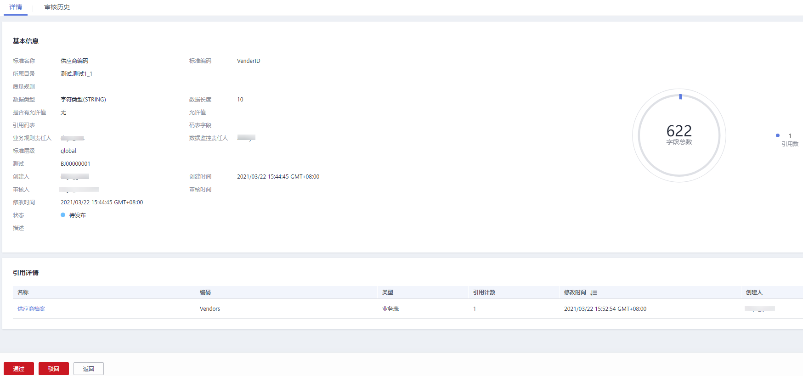
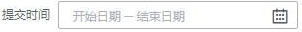
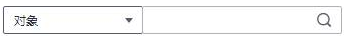

# 审核中心

开发环境生成的规范建模、数据处理类任务提交后，都会存储在审核中心页面，然后在审核中心页面进行任务发布，这些任务才会在生产环境上线。

## 审核人员审核对象

如果您是审核人员，请使用审核人员的帐号参考以下步骤审核对象。

1.  在DGC控制台首页，选择对应工作空间的“规范设计“模块，进入规范设计页面。

    **图 1**  选择规范设计  
    

2.  在左侧导航树中，单击“审核中心“，选择“待我审核“页签，在列表中找到需要审核的对象，然后在该对象所在行单击“审核“。

    您也可以勾选多个待审核的对象，然后单击“批量审核“按钮进行批量审核。

    **图 2**  审核  
    

3.  在审核的详情页面，确认信息无误后，单击“通过“，然后在弹出对话框中输入审核意见并单击“确定“完成审核。

    如果信息有误，请单击“驳回“，然后在弹出对话框中输入审核意见并单击“确定“完成审核。

    **图 3**  审核信息  
    

## 查看已审核、待审核、我的申请

-   **待我审核**

    在DGC规范设计的左侧导航树中，单击“审核中心“，选择“待我审核“页签，可以查看待审批的对象。

-   **已审核**

    在DGC规范设计的左侧导航树中，单击“审核中心“，选择“已审核“页签，可以查看已通过审批的对象。

-   **我的申请**

    在DGC规范设计的左侧导航树中，单击“审核中心“，选择“我的申请“页签，可以查看自己提交审批的对象。

## 待我审核

1.  在DGC规范设计控制台的左侧导航栏中，单击“审核中心“，进入审核中心页面，系统默认显示待审核页面，如下图所示。

    **图 4**  待审核页面  
    

    
    <table><thead align="left"><tr id="zh-cn_topic_0172166857_row1318511181552"><th class="cellrowborder" valign="top" width="14.000000000000002%" id="mcps1.1.3.1.1">
功能区域

    </th>
    <th class="cellrowborder" valign="top" width="86%" id="mcps1.1.3.1.2">
说明

    </th>
    </tr>
    </thead>
    <tbody><tr id="zh-cn_topic_0172166857_row5806026142410"><td class="cellrowborder" valign="top" width="14.000000000000002%" headers="mcps1.1.3.1.1 ">
1

    </td>
    <td class="cellrowborder" valign="top" width="86%" headers="mcps1.1.3.1.2 ">
批量审核：

    <ol id="zh-cn_topic_0172166857_ol15636154162715"><li>勾选多个待审核信息。</li><li>单击，弹出“批量审核”对话框。</li><li>输入有效的审核意见。</li><li>单击“批量通过”，所选审核信息通过审核；单击“批量驳回”，所选审核信息被驳回。</li></ol>
    </td>
    </tr>
    <tr id="zh-cn_topic_0172166857_row7185018105515"><td class="cellrowborder" valign="top" width="14.000000000000002%" headers="mcps1.1.3.1.1 ">
2

    </td>
    <td class="cellrowborder" valign="top" width="86%" headers="mcps1.1.3.1.2 ">
单个审核：

    <ol id="zh-cn_topic_0172166857_ol6603155514572"><li>单击操作列“审核”，进入指定待审核信息的审核页面。</li><li>据实际情况勾选审核结果、输入有效的审核的意见。</li><li>单击“确定”，完成审核。</li></ol>
    </td>
    </tr>
    <tr id="zh-cn_topic_0172166857_row65442818553"><td class="cellrowborder" valign="top" width="14.000000000000002%" headers="mcps1.1.3.1.1 ">
3

    </td>
    <td class="cellrowborder" valign="top" width="86%" headers="mcps1.1.3.1.2 "><ul id="zh-cn_topic_0172166857_ul1252183125516"><li>：通过该按钮过滤出修改时间段内的待审核信息。</li><li>：通过该按钮查询对象和创建人的待审核信息。</li><li>：通过该按钮设置待审核表的表列项。</li><li>：刷新按钮。</li></ul>
    </td>
    </tr>
    </tbody>
    </table>

## 我的申请

1.  在规范设计控制台，单击“审核中心“，进入审核中心页面。
2.  单击“我的申请“，进入我的申请页面，如下图所示。

    **图 5**  我的申请页面  
    

    您可以进行如下操作：

    -   通过操作列“查看“，查看指定行信息。
    -   通过操作列“撤回“，撤回申请。

