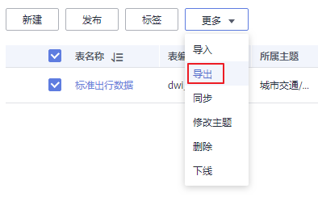
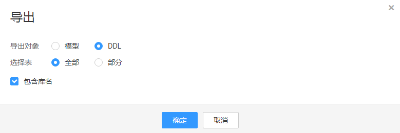

# 导入导出表

您可以通过导入表，可以将表批量导入到模型中。您也可以将已有的表导出，导出后的biao可用于导入到其他模型中。

## 导入表到逻辑模型

1.  在DGC规范设计控制台，单击左侧导航栏的“关系建模“进入关系建模页面。
2.  在模型总览中，找到所需要的逻辑模型，单击模型卡片进入，在主题目录中选中一个对象，然后单击“更多 -\> 导入“。
3.  在“导入表“对话框中，单击“下载关系建模导入模板”。

    **图 1**  导入表  
    

    **表 1**  导入配置参数说明

    
    <table><thead align="left"><tr id="row172981228172816"><th class="cellrowborder" valign="top" width="17.299999999999997%" id="mcps1.2.3.1.1">
参数名

    </th>
    <th class="cellrowborder" valign="top" width="82.69999999999999%" id="mcps1.2.3.1.2">
说明

    </th>
    </tr>
    </thead>
    <tbody><tr id="row1129817284285"><td class="cellrowborder" valign="top" width="17.299999999999997%" headers="mcps1.2.3.1.1 ">
更新已有表

    </td>
    <td class="cellrowborder" valign="top" width="82.69999999999999%" headers="mcps1.2.3.1.2 ">
如果所要导入的表，在模型中已经存在，是否更新已有的表。系统将根据表编码判断将要导入的表在关系模型中是否已存在。在导入时，只有创建或更新操作，不会删除已有的表。支持以下选项：

    <ul id="ul32984280284"><li><strong id="b1829812818282">不更新</strong>：如果表已存在，将直接跳过，不处理。</li><li><strong id="b929813286285">更新</strong>：如果表已存在，更新已有的表信息。如果表处于“已发布”状态，表更新后，您需要重新发布表，才能使更新后的表生效。</li></ul>
    </td>
    </tr>
    <tr id="row10298428102817"><td class="cellrowborder" valign="top" width="17.299999999999997%" headers="mcps1.2.3.1.1 ">
上传模板

    </td>
    <td class="cellrowborder" valign="top" width="82.69999999999999%" headers="mcps1.2.3.1.2 ">
选择所需导入的文件。所需导入的文件，可以通过以下两种方式获得。

    <ul id="ul029815286288"><li><strong id="b1029882816284">下载关系建模导入模板并填写模板</strong>
在“导入配置”页签内，单击“下载关系建模导入模板”下载模板，然后根据业务需求填写好模板中的相关参数并保存。

    </li><li><strong id="b72981628192813">导出的表文件</strong>
您可以将某个DGC实例的规范设计中已创建的表导出到Excel文件中。导出后的文件可用于导入到关系模型中。导出模型的操作请参见<a href="#section1911133213143">导出表或DDL</a>。

    </li></ul>
    </td>
    </tr>
    </tbody>
    </table>

4.  打开下载的模板，请根据业务需求填写好模板中的相关参数并保存，模板中的“填写说明”Sheet页供参考。

    模板中的参数，其中名称前带“\*”的参数为必填参数，名称前未带“\*”的参数为可选参数。

    在模板的“表模型“Sheet页中，所需填写的参数，说明如下：

    **表 2**  表模型Sheet页参数说明

    
    <table><thead align="left"><tr id="row132982028152814"><th class="cellrowborder" valign="top" width="20%" id="mcps1.2.3.1.1">
参数名

    </th>
    <th class="cellrowborder" valign="top" width="80%" id="mcps1.2.3.1.2">
参数说明

    </th>
    </tr>
    </thead>
    <tbody><tr id="row152967107437"><td class="cellrowborder" valign="top" width="20%" headers="mcps1.2.3.1.1 ">
所属主题

    </td>
    <td class="cellrowborder" valign="top" width="80%" headers="mcps1.2.3.1.2 ">
需填写已有的主题的编码路径，以/分隔。如果您未新建主题信息，请参见<a href="主题设计.md">主题设计</a>进行新建。

    </td>
    </tr>
    <tr id="row02981828122810"><td class="cellrowborder" valign="top" width="20%" headers="mcps1.2.3.1.1 ">
*逻辑实体名称

    </td>
    <td class="cellrowborder" valign="top" width="80%" headers="mcps1.2.3.1.2 ">
表名称，只能包含中文、英文字母、数字、左右括号、中划线和下划线，且以中文和英文字母开头。

    </td>
    </tr>
    <tr id="row1729818285285"><td class="cellrowborder" valign="top" width="20%" headers="mcps1.2.3.1.1 ">
*表名称

    </td>
    <td class="cellrowborder" valign="top" width="80%" headers="mcps1.2.3.1.2 ">
表编码，只能包含英文字母、数字、下划线、$、{、}，且不能以数字开头。

    </td>
    </tr>
    <tr id="row8367152219125"><td class="cellrowborder" valign="top" width="20%" headers="mcps1.2.3.1.1 ">
表别名

    </td>
    <td class="cellrowborder" valign="top" width="80%" headers="mcps1.2.3.1.2 ">
用户在配置中心打开了“表别名”时显示此项，名称别名。

    </td>
    </tr>
    <tr id="row1029817284283"><td class="cellrowborder" valign="top" width="20%" headers="mcps1.2.3.1.1 ">
表级标签

    </td>
    <td class="cellrowborder" valign="top" width="80%" headers="mcps1.2.3.1.2 ">
给表添加的标签，请输入已有的标签或新的标签名称。您也可以先前往DGC数据资产模块的“标签管理”页面添加标签，然后再回到此处设置相应的标签。添加标签的具体操作，请参见<a href="标签管理.md">标签管理</a>。

    </td>
    </tr>
    <tr id="row17299152802817"><td class="cellrowborder" valign="top" width="20%" headers="mcps1.2.3.1.1 ">
描述

    </td>
    <td class="cellrowborder" valign="top" width="80%" headers="mcps1.2.3.1.2 ">
表的描述信息。

    </td>
    </tr>
    <tr id="row12299628142811"><td class="cellrowborder" valign="top" width="20%" headers="mcps1.2.3.1.1 ">
资产责任人

    </td>
    <td class="cellrowborder" valign="top" width="80%" headers="mcps1.2.3.1.2 ">
需输入DGC实例当前工作空间中的用户名。只有工作空间管理员或开发者、运维者角色的用户才可以设置为责任人。

    </td>
    </tr>
    <tr id="row329952822815"><td class="cellrowborder" valign="top" width="20%" headers="mcps1.2.3.1.1 ">
父表

    </td>
    <td class="cellrowborder" valign="top" width="80%" headers="mcps1.2.3.1.2 ">
只能填写为本模型中的其他表的表名称。

    </td>
    </tr>
    <tr id="row1283882395617"><td class="cellrowborder" valign="top" width="20%" headers="mcps1.2.3.1.1 ">
DWS表 DISTRIBUTE BY

    </td>
    <td class="cellrowborder" valign="top" width="80%" headers="mcps1.2.3.1.2 ">
仅DWS连接支持，支持HASH(属性名称)、REPLICATION2种方式分布。

    </td>
    </tr>
    <tr id="row629902882811"><td class="cellrowborder" valign="top" width="20%" headers="mcps1.2.3.1.1 ">
*属性名称（CHN）

    </td>
    <td class="cellrowborder" valign="top" width="80%" headers="mcps1.2.3.1.2 ">
表中的属性字段的中文名称。只能包含中文、英文字母、数字、左右括号、中划线和下划线，且以中文或英文字母开头。

    </td>
    </tr>
    <tr id="row1429942818286"><td class="cellrowborder" valign="top" width="20%" headers="mcps1.2.3.1.1 ">
*属性名称（ENG）

    </td>
    <td class="cellrowborder" valign="top" width="80%" headers="mcps1.2.3.1.2 ">
表中的属性字段的英文名称。只能包含英文字母、数字和下划线，且以英文字母开头。

    </td>
    </tr>
    <tr id="row1163715121158"><td class="cellrowborder" valign="top" width="20%" headers="mcps1.2.3.1.1 ">
属性别名

    </td>
    <td class="cellrowborder" valign="top" width="80%" headers="mcps1.2.3.1.2 ">
用户在配置中心打开了“属性别名”时显示此项，属性别名。

    </td>
    </tr>
    <tr id="row82991228172813"><td class="cellrowborder" valign="top" width="20%" headers="mcps1.2.3.1.1 ">
顺序

    </td>
    <td class="cellrowborder" valign="top" width="80%" headers="mcps1.2.3.1.2 ">
属性字段在表中的顺序，从1开始。可以不填，不填时属性字段默认按模板中的顺序在表中排列。

    </td>
    </tr>
    <tr id="row14299928202814"><td class="cellrowborder" valign="top" width="20%" headers="mcps1.2.3.1.1 ">
属性描述

    </td>
    <td class="cellrowborder" valign="top" width="80%" headers="mcps1.2.3.1.2 ">
属性字段的描述信息。

    </td>
    </tr>
    <tr id="row330012882820"><td class="cellrowborder" valign="top" width="20%" headers="mcps1.2.3.1.1 ">
*数据类型

    </td>
    <td class="cellrowborder" valign="top" width="80%" headers="mcps1.2.3.1.2 ">
逻辑模型的数据类型，请参见<a href="配置中心.md#section06381835171">字段类型管理</a>中的DEFAULT类型分组。

    </td>
    </tr>
    <tr id="row2246725294"><td class="cellrowborder" valign="top" width="20%" headers="mcps1.2.3.1.1 ">
数据长度

    </td>
    <td class="cellrowborder" valign="top" width="80%" headers="mcps1.2.3.1.2 ">
数据的长度。对于不定长的数据类型，如果所指定的数据连接类型支持对其指定数据长度，请指定数据长度。

    
例如，DWS连接类型，如果字段类型为CHAR(10)，需要在“数据类型”中填写“CHAR”，在“数据长度”中填写“10”。

    </td>
    </tr>
    <tr id="row0300182822819"><td class="cellrowborder" valign="top" width="20%" headers="mcps1.2.3.1.1 ">
是否分区

    </td>
    <td class="cellrowborder" valign="top" width="80%" headers="mcps1.2.3.1.2 ">
填写“Y”表示该字段为分区字段，填写“N”表示不是分区字段。

    </td>
    </tr>
    <tr id="row130082812814"><td class="cellrowborder" valign="top" width="20%" headers="mcps1.2.3.1.1 ">
是否主键

    </td>
    <td class="cellrowborder" valign="top" width="80%" headers="mcps1.2.3.1.2 ">
填写“Y”表示该字段为主键，填写“N”表示不是主键。

    </td>
    </tr>
    <tr id="row131664932912"><td class="cellrowborder" valign="top" width="20%" headers="mcps1.2.3.1.1 ">
不为空

    </td>
    <td class="cellrowborder" valign="top" width="80%" headers="mcps1.2.3.1.2 ">
填写“Y”表示该字段不为空，填写“N”表示字段允许为空。

    </td>
    </tr>
    <tr id="row1230012832815"><td class="cellrowborder" valign="top" width="20%" headers="mcps1.2.3.1.1 ">
引用的数据标准编码

    </td>
    <td class="cellrowborder" valign="top" width="80%" headers="mcps1.2.3.1.2 ">
填写需要引用的数据标准的编码，也可以不填。如果未创建数据标准，请参见<a href="新建数据标准.md">新建数据标准</a>进行创建。

    </td>
    </tr>
    <tr id="row20300132862820"><td class="cellrowborder" valign="top" width="20%" headers="mcps1.2.3.1.1 ">
属性标签

    </td>
    <td class="cellrowborder" valign="top" width="80%" headers="mcps1.2.3.1.2 ">
为属性字段添加的标签，请输入已有的标签或新的标签名称。您也可以先前往DGC数据资产模块的“标签管理”页面添加标签，然后再回到此处设置相应的标签。添加标签的具体操作，请参见<a href="标签管理.md">标签管理</a>。

    </td>
    </tr>
    </tbody>
    </table>

    在“关系“Sheet页中，所需填写的参数，请参考[表4](逻辑模型设计.md#table187270468196)中的说明。

    暂不支持导入映射，“映射“Sheet页无需填写。

5.  导入结果会在导入对话框的“上次导入“中显示。如果导入成功，单击“关闭“完成导入。如果导入失败，您可以查看失败原因，将模板文件修改正确后，再重新上传。

    **图 2**  上次导入  
    

## 导入表到物理模型

1.  在DGC规范设计控制台，单击左侧导航栏的“关系建模“进入关系建模页面。
2.  在关系模型树中，找到所需要的物理模型，单击进入，展开模型，选中一个对象，然后单击“导入“。
3.  在“导入表“对话框中，单击“下载关系建模导入模板”。

    **图 3**  导入表  
    

    **表 3**  导入配置参数说明

    
    <table><thead align="left"><tr id="dgc_01_0637_row172981228172816"><th class="cellrowborder" valign="top" width="17.299999999999997%" id="mcps1.2.3.1.1">
参数名

    </th>
    <th class="cellrowborder" valign="top" width="82.69999999999999%" id="mcps1.2.3.1.2">
说明

    </th>
    </tr>
    </thead>
    <tbody><tr id="dgc_01_0637_row1129817284285"><td class="cellrowborder" valign="top" width="17.299999999999997%" headers="mcps1.2.3.1.1 ">
更新已有表

    </td>
    <td class="cellrowborder" valign="top" width="82.69999999999999%" headers="mcps1.2.3.1.2 ">
如果所要导入的表，在模型中已经存在，是否更新已有的表。系统将根据表编码判断将要导入的表在关系模型中是否已存在。在导入时，只有创建或更新操作，不会删除已有的表。支持以下选项：

    <ul id="dgc_01_0637_ul32984280284"><li><strong id="dgc_01_0637_b1829812818282">不更新</strong>：如果表已存在，将直接跳过，不处理。</li><li><strong id="dgc_01_0637_b929813286285">更新</strong>：如果表已存在，更新已有的表信息。如果表处于“已发布”状态，表更新后，您需要重新发布表，才能使更新后的表生效。</li></ul>
    </td>
    </tr>
    <tr id="dgc_01_0637_row10298428102817"><td class="cellrowborder" valign="top" width="17.299999999999997%" headers="mcps1.2.3.1.1 ">
上传模板

    </td>
    <td class="cellrowborder" valign="top" width="82.69999999999999%" headers="mcps1.2.3.1.2 ">
选择所需导入的文件。所需导入的文件，可以通过以下两种方式获得。

    <ul id="dgc_01_0637_ul029815286288"><li><strong id="dgc_01_0637_b1029882816284">下载关系建模导入模板并填写模板</strong>
在“导入配置”页签内，单击“下载关系建模导入模板”下载模板，然后根据业务需求填写好模板中的相关参数并保存。

    </li><li><strong id="dgc_01_0637_b72981628192813">导出的表文件</strong>
您可以将某个DGC实例的规范设计中已创建的表导出到Excel文件中。导出后的文件可用于导入到关系模型中。导出模型的操作请参见<a href="导入导出表.md#section1911133213143">导出表或DDL</a>。

    </li></ul>
    </td>
    </tr>
    </tbody>
    </table>

4.  打开下载的模板，请根据业务需求填写好模板中的相关参数并保存，模板中的“填写说明”Sheet页供参考。

    模板中的参数，其中名称前带“\*”的参数为必填参数，名称前未带“\*”的参数为可选参数。

    在模板的“表模型“Sheet页中，所需填写的参数，说明如下：

    **表 4**  表模型Sheet页参数说明

    
    <table><thead align="left"><tr id="zh-cn_topic_0189641497_row5359244131414"><th class="cellrowborder" valign="top" width="31.53%" id="mcps1.2.3.1.1">
参数名

    </th>
    <th class="cellrowborder" valign="top" width="68.47%" id="mcps1.2.3.1.2">
参数说明（导入DLI/POSTGRESQL/DWS/MRS_HIVE类型的表）

    </th>
    </tr>
    </thead>
    <tbody><tr id="row20257585245"><td class="cellrowborder" valign="top" width="31.53%" headers="mcps1.2.3.1.1 ">
所属主题

    </td>
    <td class="cellrowborder" valign="top" width="68.47%" headers="mcps1.2.3.1.2 ">
需填写已有的主题的编码路径，以/分隔。如果您未新建主题信息，请参见<a href="主题设计.md">主题设计</a>进行新建。

    </td>
    </tr>
    <tr id="zh-cn_topic_0189641497_row197774551394"><td class="cellrowborder" valign="top" width="31.53%" headers="mcps1.2.3.1.1 ">
*逻辑实体名称

    </td>
    <td class="cellrowborder" valign="top" width="68.47%" headers="mcps1.2.3.1.2 ">
表名称，只能包含中文、英文字母、数字、左右括号、中划线和下划线，且以中文和英文字母开头。

    </td>
    </tr>
    <tr id="zh-cn_topic_0189641497_row22319913409"><td class="cellrowborder" valign="top" width="31.53%" headers="mcps1.2.3.1.1 ">
*表名称

    </td>
    <td class="cellrowborder" valign="top" width="68.47%" headers="mcps1.2.3.1.2 ">
表编码，只能包含英文字母、数字、下划线、$、{、}，且不能以数字开头。

    </td>
    </tr>
    <tr id="row1639739141913"><td class="cellrowborder" valign="top" width="31.53%" headers="mcps1.2.3.1.1 ">
表别名

    </td>
    <td class="cellrowborder" valign="top" width="68.47%" headers="mcps1.2.3.1.2 ">
用户在配置中心打开了“表别名”时显示此项，名称别名。

    </td>
    </tr>
    <tr id="zh-cn_topic_0189641497_row171377201403"><td class="cellrowborder" valign="top" width="31.53%" headers="mcps1.2.3.1.1 ">
表级标签

    </td>
    <td class="cellrowborder" valign="top" width="68.47%" headers="mcps1.2.3.1.2 ">
给表添加的标签，请输入已有的标签或新的标签名称。您也可以先前往DGC数据资产模块的“标签管理”页面添加标签，然后再回到此处设置相应的标签。添加标签的具体操作，请参见<a href="标签管理.md">标签管理</a>。

    </td>
    </tr>
    <tr id="zh-cn_topic_0189641497_row20355164134020"><td class="cellrowborder" valign="top" width="31.53%" headers="mcps1.2.3.1.1 ">
描述

    </td>
    <td class="cellrowborder" valign="top" width="68.47%" headers="mcps1.2.3.1.2 ">
表的描述信息。

    </td>
    </tr>
    <tr id="zh-cn_topic_0189641497_row4217103774014"><td class="cellrowborder" valign="top" width="31.53%" headers="mcps1.2.3.1.1 ">
资产责任人

    </td>
    <td class="cellrowborder" valign="top" width="68.47%" headers="mcps1.2.3.1.2 ">
需输入DGC实例当前工作空间中的用户名。只有工作空间管理员或开发者、运维者角色的用户才可以设置为责任人。

    </td>
    </tr>
    <tr id="zh-cn_topic_0189641497_row239063034013"><td class="cellrowborder" valign="top" width="31.53%" headers="mcps1.2.3.1.1 ">
数据连接类型

    </td>
    <td class="cellrowborder" valign="top" width="68.47%" headers="mcps1.2.3.1.2 ">
支持以下连接类型：DLI、POSTGRESQL、DWS、MRS_HIVE。

    </td>
    </tr>
    <tr id="zh-cn_topic_0189641497_row18716165274114"><td class="cellrowborder" valign="top" width="31.53%" headers="mcps1.2.3.1.1 ">
*表类型

    </td>
    <td class="cellrowborder" valign="top" width="68.47%" headers="mcps1.2.3.1.2 ">
DLI模型的表支持以下表类型：<ul id="ul75081022088"><li>Managed：数据存储位置为DLI的表。</li><li>External：数据存储位置为OBS的表。当“表类型”设置为External时，需设置“OBS路径””参数。</li><li>DLI_VIEW：该类型只支持导入，不支持在控制台页面创建。</li></ul>
    

    
DWS模型的表支持以下表类型：

    <ul id="ul1250818218817"><li>DWS_ROW：行类型。</li><li>DWS_COLUMN：列类型。</li><li>DWS_VIEW：视图类型。
MRS_HIVE模型的表不支持该参数。

    </li></ul>
    </td>
    </tr>
    <tr id="zh-cn_topic_0189641497_row11420384211"><td class="cellrowborder" valign="top" width="31.53%" headers="mcps1.2.3.1.1 ">
OBS路径

    </td>
    <td class="cellrowborder" valign="top" width="68.47%" headers="mcps1.2.3.1.2 ">
DLI模型的表类型为DLI_EXTERNAL时，需填写与表相关联的存放源数据的OBS路径。OBS路径格式如：bucket_name/filepath。

    </td>
    </tr>
    <tr id="zh-cn_topic_0189641497_row17533125912418"><td class="cellrowborder" valign="top" width="31.53%" headers="mcps1.2.3.1.1 ">
数据格式

    </td>
    <td class="cellrowborder" valign="top" width="68.47%" headers="mcps1.2.3.1.2 ">
该参数仅DLI模型的表有效。

    
表类型为DLI_MANAGED的表支持的数据格式有：Parquet、Carbon。

    
表类型为DLI_EXTERNAL的表支持的数据格式有：Parquet、Carbon、CSV、ORC、JSON、Avro。

    </td>
    </tr>
    <tr id="row1474014201164"><td class="cellrowborder" valign="top" width="31.53%" headers="mcps1.2.3.1.1 ">
表所属的数据连接

    </td>
    <td class="cellrowborder" valign="top" width="68.47%" headers="mcps1.2.3.1.2 ">
输入已创建的数据连接名称。

    </td>
    </tr>
    <tr id="zh-cn_topic_0189641497_row534311565414"><td class="cellrowborder" valign="top" width="31.53%" headers="mcps1.2.3.1.1 ">
表所属的数据库

    </td>
    <td class="cellrowborder" valign="top" width="68.47%" headers="mcps1.2.3.1.2 ">
输入已创建的数据库名称。

    </td>
    </tr>
    <tr id="row112361734172215"><td class="cellrowborder" valign="top" width="31.53%" headers="mcps1.2.3.1.1 ">
数据连接扩展信息

    </td>
    <td class="cellrowborder" valign="top" width="68.47%" headers="mcps1.2.3.1.2 ">
连接类型为DLI时，输入DLI队列名称。连接类型为DWS或POSTGRESQL时，输入Schema名称。

    </td>
    </tr>
    <tr id="zh-cn_topic_0189641497_row33624114215"><td class="cellrowborder" valign="top" width="31.53%" headers="mcps1.2.3.1.1 ">
*属性名称（CHN）

    </td>
    <td class="cellrowborder" valign="top" width="68.47%" headers="mcps1.2.3.1.2 ">
表中的属性字段的中文名称。只能包含中文、英文字母、数字、左右括号、中划线和下划线，且以中文或英文字母开头。

    </td>
    </tr>
    <tr id="zh-cn_topic_0189641497_row11327123834215"><td class="cellrowborder" valign="top" width="31.53%" headers="mcps1.2.3.1.1 ">
*属性名称（ENG）

    </td>
    <td class="cellrowborder" valign="top" width="68.47%" headers="mcps1.2.3.1.2 ">
表中的属性字段的英文名称。只能包含英文字母、数字和下划线，且以英文字母开头。

    </td>
    </tr>
    <tr id="zh-cn_topic_0189641497_row621835184216"><td class="cellrowborder" valign="top" width="31.53%" headers="mcps1.2.3.1.1 ">
顺序

    </td>
    <td class="cellrowborder" valign="top" width="68.47%" headers="mcps1.2.3.1.2 ">
属性字段在表中的顺序，从1开始。可以不填，不填时属性字段默认按模板中的顺序在表中排列。

    </td>
    </tr>
    <tr id="zh-cn_topic_0189641497_row20932194016431"><td class="cellrowborder" valign="top" width="31.53%" headers="mcps1.2.3.1.1 ">
属性描述

    </td>
    <td class="cellrowborder" valign="top" width="68.47%" headers="mcps1.2.3.1.2 ">
属性字段的描述信息。

    </td>
    </tr>
    <tr id="zh-cn_topic_0189641497_row1837653744319"><td class="cellrowborder" valign="top" width="31.53%" headers="mcps1.2.3.1.1 ">
*数据类型

    </td>
    <td class="cellrowborder" valign="top" width="68.47%" headers="mcps1.2.3.1.2 ">
不同的数据连接类型支持的数据类型不一样，请参见<a href="配置中心.md#section06381835171">字段类型管理</a>。

    </td>
    </tr>
    <tr id="row830692812505"><td class="cellrowborder" valign="top" width="31.53%" headers="mcps1.2.3.1.1 ">
数据长度

    </td>
    <td class="cellrowborder" valign="top" width="68.47%" headers="mcps1.2.3.1.2 ">
对于不定长的数据类型，如果所指定的数据连接类型支持对其指定数据长度，请指定数据长度。

    
例如，DWS连接类型，如果字段类型为CHAR(10)，需要在“数据类型”中填写“CHAR”，在“数据长度”中填写“10”。

    </td>
    </tr>
    <tr id="zh-cn_topic_0189641497_row1140425517434"><td class="cellrowborder" valign="top" width="31.53%" headers="mcps1.2.3.1.1 ">
是否分区

    </td>
    <td class="cellrowborder" valign="top" width="68.47%" headers="mcps1.2.3.1.2 ">
填写“Y”表示该字段为分区字段，填写“N”表示不是分区字段。

    </td>
    </tr>
    <tr id="row69903471237"><td class="cellrowborder" valign="top" width="31.53%" headers="mcps1.2.3.1.1 ">
是否主键

    </td>
    <td class="cellrowborder" valign="top" width="68.47%" headers="mcps1.2.3.1.2 ">
填写“Y”表示该字段为主键，填写“N”表示不是主键。

    </td>
    </tr>
    <tr id="row8668953105210"><td class="cellrowborder" valign="top" width="31.53%" headers="mcps1.2.3.1.1 ">
不为空

    </td>
    <td class="cellrowborder" valign="top" width="68.47%" headers="mcps1.2.3.1.2 ">
填写“Y”表示该字段不为空，填写“N”表示字段允许为空。

    </td>
    </tr>
    <tr id="zh-cn_topic_0189641497_row8103165194314"><td class="cellrowborder" valign="top" width="31.53%" headers="mcps1.2.3.1.1 ">
引用的数据标准编码

    </td>
    <td class="cellrowborder" valign="top" width="68.47%" headers="mcps1.2.3.1.2 ">
填写需要引用的数据标准的编码，也可以不填。如果未创建数据标准，请参见<a href="新建数据标准.md">新建数据标准</a>进行创建。

    </td>
    </tr>
    <tr id="zh-cn_topic_0189641497_row6765162194418"><td class="cellrowborder" valign="top" width="31.53%" headers="mcps1.2.3.1.1 ">
属性标签

    </td>
    <td class="cellrowborder" valign="top" width="68.47%" headers="mcps1.2.3.1.2 ">
为属性字段添加的标签，请输入已有的标签或新的标签名称。您也可以先前往DGC数据资产模块的“标签管理”页面添加标签，然后再回到此处设置相应的标签。添加标签的具体操作，请参见<a href="标签管理.md">标签管理</a>。

    </td>
    </tr>
    <tr id="zh-cn_topic_0189641497_row1064141712449"><td class="cellrowborder" valign="top" width="31.53%" headers="mcps1.2.3.1.1 ">
其他配置

    </td>
    <td class="cellrowborder" valign="top" width="68.47%" headers="mcps1.2.3.1.2 ">
为JSON格式，用于存放表额外配置信息。格式如下：

    
{

    
"option_name1": "value",

    
"option_name2": "value"

    
……

    
}

    
例如：

    
{

    
"a1": "100",

    
"a2": "30"

    
}

    </td>
    </tr>
    <tr id="row217342519244"><td class="cellrowborder" valign="top" width="31.53%" headers="mcps1.2.3.1.1 ">
版本号

    </td>
    <td class="cellrowborder" valign="top" width="68.47%" headers="mcps1.2.3.1.2 ">
可选参数。

    </td>
    </tr>
    </tbody>
    </table>

    在“关系“Sheet页中，所需填写的参数，请参考[表4](物理模型设计.md#table187270468196)中的说明。

    暂不支持导入映射，“映射“Sheet页无需填写。

5.  导入结果会在导入对话框的“上次导入“页面中显示。如果导入成功，单击“关闭“完成导入。如果导入失败，您可以查看失败原因，将模板文件修改正确后，再重新上传。

## 导出表或DDL

1.  在DGC规范设计控制台，单击左侧导航栏的“关系建模“进入关系建模页面。
2.  在模型总览中，找到所需要的逻辑模型，单击模型卡片进入，在主题目录中选择对象，然后单击“更多 -\> 导出“。

    **图 4**  导出表或DDL  
    

3.  在弹出对话框中，选择需要导出的对象。

    导出的Excel表可以用于导入操作。

    **图 5**  导出表  
    

    导出DDL时，会将所选表的DDL语句导出成txt文件。

    **图 6**  导出DDL  
    

4.  单击“确定“。

