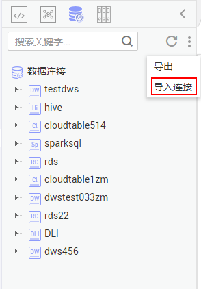
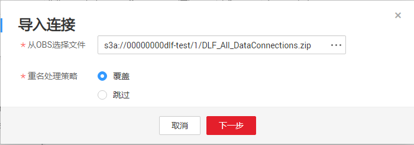

# 导入数据连接

通过导入数据连接功能，您可以快速的从本地导入数据到连接库中，增加新的数据连接。

## 前提条件

-   已获取连接数据源所需要的用户名、密码。
-   已开通对象存储服务，并在OBS中创建文件夹。
-   已将本地的数据连接上传至OBS文件夹。
-   数据连接的最大配额为20，当前数据连接的数量未达到最大配额。

## 操作步骤

1.  登录[DLF管理控制台](https://console.huaweicloud.com/dlf?locale=zh-cn)。
2.  在DLF控制台的左侧导航栏，选择“数据开发  \>  脚本开发“/“数据开发  \>  作业开发“。
3.  在页面中选择，右键单击连接目录中的\> 导入连接。

    **图 1**  导入数据连接  
    

4.  在“导入连接“页面，选择已上传至OBS文件夹中的连接文件，以及重名处理策略。

    **图 2**  导入连接  
    

5.  单击“下一步“，根据提示导入数据连接。各数据连接的参数解释请参见[参数说明](创建数据连接-0.md#zh-cn_topic_0125513549_section118852059172916)。

