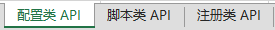
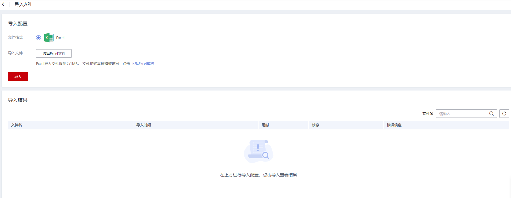

# 导出\\导入API

## 操作场景

数据服务支持批量导出\\导入API，可以快速复制或迁移现有的API。

## 前提条件

已创建API。

## 导出API

1.  在DGC控制台首页，选择对应工作空间的“数据服务“模块，进入数据服务页面。

    **图 1**  选择数据服务  
    

1.  在左侧导航栏选择服务版本（例如：专享版），进入总览页。
2.  单击“开发API  \>  API管理“页面，进入API管理页面。
3.  勾选待导出的API所在行，在API列表上方，选择“更多  \>  导出“，弹出导出窗口。
4.  在导出窗口中确认待导出的API，点击确认即可以Excel文件的形式导出API。

    **图 2**  导出API  
    

5.  打开下载到本地的Excel文件，可以查看导出的API。不同类型的API会分别导出到文件页签中, 点击下方页签可以切换查看并编辑。

    **图 3**  Excel文件样式  
    

## 导入API

1.  在DGC控制台首页，选择对应工作空间的“数据服务“模块，进入数据服务页面。

    **图 4**  选择数据服务  
    

1.  在左侧导航栏选择服务版本（例如：专享版），进入总览页。
2.  单击“开发API  \>  API管理“页面，进入API管理页面。
3.  在API列表上方，选择“更多  \>  导入“，进入导入API窗口。
4.  在导入窗口中点击“选择Excel文件”，选择后点击导入，导入结果中可以展示导入状态。

    > **说明：** 
    >待导入的API文件可以是从其他项目直接导出的API文件，也可以是通过模板填写的Excel文件，需要确保符合模板规范要求。

    **图 5**  导入API  
    

5.  导入成功后，即可在API列表中查看导入的API。

