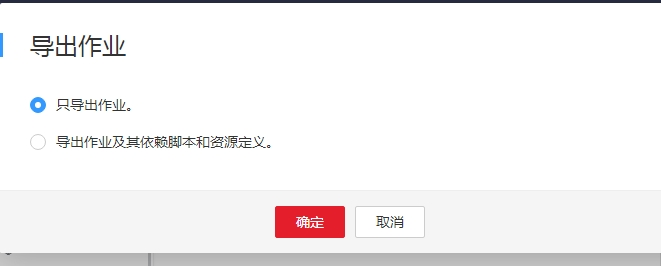
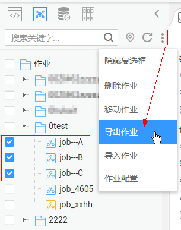
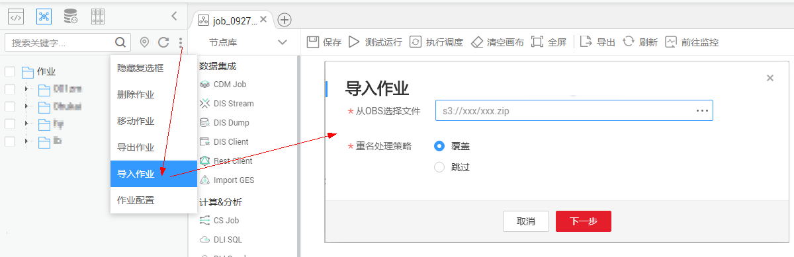
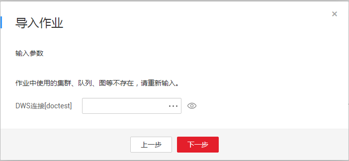

# 导出导入作业

## 导出作业

**方式一：在作业开发页面导出某一个作业**

1.  进入某一作业的开发页面，单击画布上方的导出按钮，选择导出作业的类型。

    -   只导出作业：导出作业中节点的连接关系，以及各节点的属性配置，不包含密码等敏感信息。导出后，用户获取到zip格式的压缩包文件。
    -   导出作业及其依赖脚本和资源定义：导出作业中节点的连接关系、各节点的属性配置，以及作业的调度配置、参数配置、依赖的脚本，资源定义，不包含密码等敏感信息。导出后，用户获取到zip格式的压缩包文件。

    **图 1**  导出作业（方式一）  
    

2.  单击“确定“，导出所需的作业文件。

**方式二：在作业目录中导出一个或多个作业**

1.  单击作业目录中的，选择“显示复选框“。

    **图 2**  显示复选框  
    

2.  勾选需要导出的作业，单击  \> 导出作业，导出作业及其依赖。

    **图 3**  选择并导出作业  
    

## 导入作业

**在作业目录中导入一个或多个作业**

1.  单击作业目录中的  \> 导入作业，选择已上传至OBS中的作业文件，以及重名处理策略。

    **图 4**  导入作业定义及依赖  
    

2.  单击“下一步“，根据提示导入作业。

    > **说明：**   
    >在导入作业过程中，若作业关联的数据连接、dis通道、dli 队列、ges图等在DLF系统中不存在时，系统会提示您重新选择。  

## 操作示例

背景信息：

-   在DLF系统中创建一个DWS的数据连接“doctest“
-   在作业目录中创建实时作业“doc1“，作业中添加节点“DWS SQL“，配置节点的“数据连接“为“doctest“，配置“SQL脚本“和“数据库“。

1.  在数据开发主界面的左侧导航栏，选择“数据开发  \>  作业开发“。
2.  在作业搜索框中搜索作业“doc1“，导出作业到本地，并上传作业至OBS文件夹中。
3.  在DLF系统中删掉作业关联的dws数据连接“doctest“。
4.  单击作业目录中的  \> 导入作业，选择上传至OBS文件夹中的作业，并设置重名处理策略。
5.  单击“下一步“，根据导入作业页面的提示重新选择数据连接。

    **图 5**  导入作业  
    

6.  单击“下一步“，再单击“关闭“。

