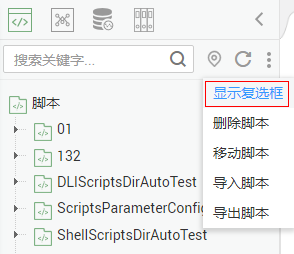
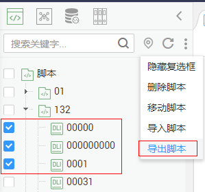
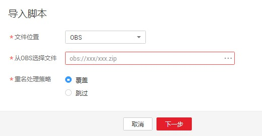

# 导出导入脚本

## 导出脚本

您可以在脚本目录中导出一个或多个脚本文件，导出的为开发态最新的已保存内容。

1.  单击脚本目录中的，选择“显示复选框“。

    **图 1**  显示复选框  
    

2.  勾选需要导出的脚本，单击  \> 导出脚本。

    **图 2**  选择并导出脚本  
    

## 导入脚本

导入脚本功能依赖于OBS服务，如无OBS服务，可从本地导入。

您可以在脚本目录中导入一个或多个脚本文件。导入会覆盖开发态的内容，并**自动提交一个新版本**。

1.  单击作业目录中的  \> 导入脚本，选择已上传至OBS中或本地的脚本文件，以及重名处理策略。

    **图 3**  导入脚本（有OBS场景）  
    

2.  单击“下一步“，根据提示导入脚本。

