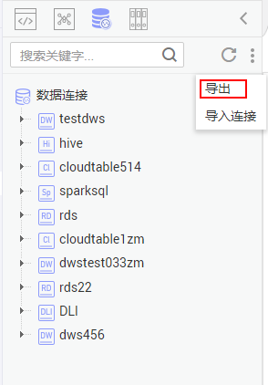

# 导出数据连接

数据连接创建完成后，您可以在连接页面全量导出创建的数据连接。

导出连接，将存在的主机连接同步导出。

## 前提条件

已开通或创建相应的云服务，并[创建数据连接](创建数据连接-0.md#dayu_01_0525)。

## 操作步骤

1.  登录[DLF管理控制台](https://console.huaweicloud.com/dlf?locale=zh-cn)。
2.  在DLF控制台的左侧导航栏，选择“数据开发  \>  脚本开发“/“数据开发  \>  作业开发“。
3.  在页面中选择，右键单击连接目录中的\> 导出。

    **图 1**  导出数据连接  
    

