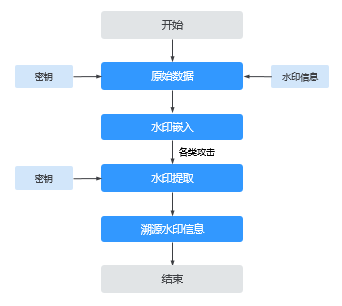
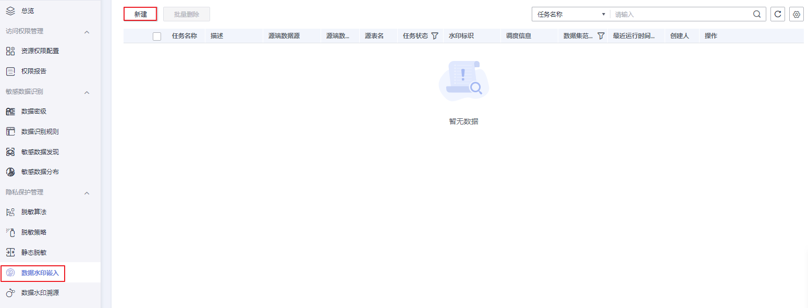
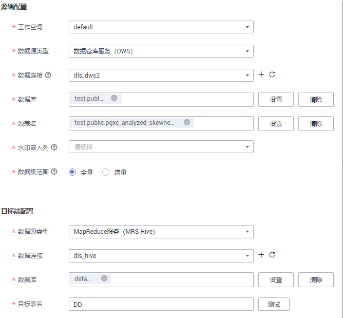
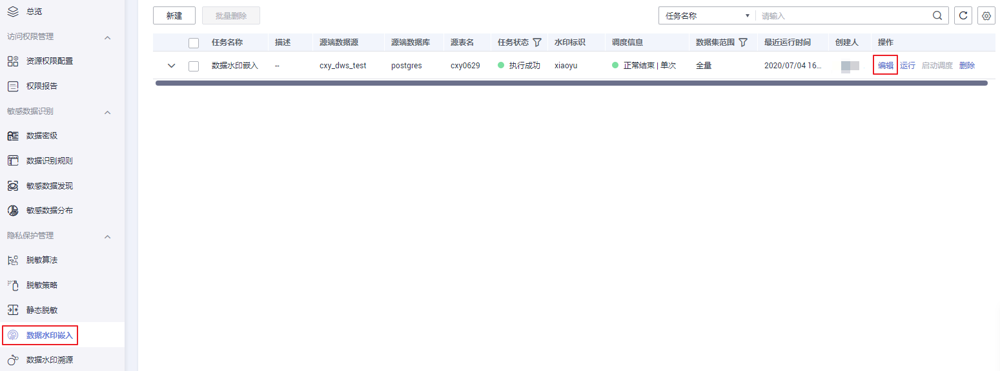
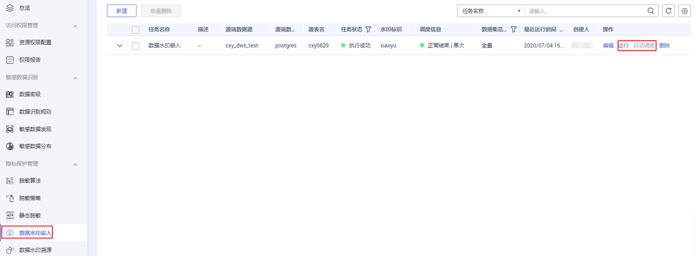
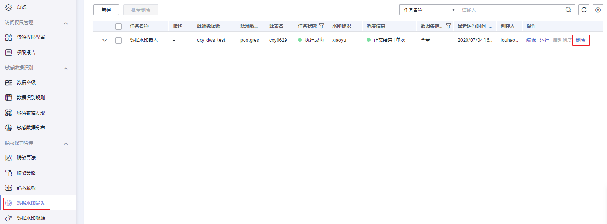

# 嵌入数据水印

本章主要介绍如何进行数据水印嵌入。

## 水印特性

-   水印容量：支持嵌入大容量信息。
-   隐蔽性：嵌入水印后不会引起数据明显的降质，并且不易被察觉，不影响宿主数据的可用性。
-   鲁棒性：嵌入水印的数据可以抵抗一定的恶意攻击。
-   安全性：持有密钥者（嵌入水印用户）才可正确提取出水印。
-   动态更新能力：支持数据增量（行级）嵌入。
-   盲检测：水印溯源过程不需要任何原始数据和辅助信息，只有水印嵌入者才可正确提取出水印。

## 使用场景

-   规范数据外发流程

    实现对企业内部人员数据外发进行有效流程化管理，非授权用户在数据外发前需审批，审批通过后采取数据水印技术生成可外发数据文件即可。

-   数据版权保护，

    通过在关系数据库中嵌入代表所有权的水印信息，可以将数据库与其拥有者联系起来，从而实现数据的版权保护。

-   对泄露数据进行快速溯源

    通过对泄露数据文件解封，根据数据文件的完整度和水印信息痕迹来检测水印是否存在，快速识别水印标记信息（数据源地址、分发单位、负责人、分发时间等），从而对安全事件精准定位追责。

## 数据水印使用流程

您可以通过[图1](#fig468313575540)来了解。

**图 1**  水印使用流程  

## 前提条件

已创建源端数据源类型为数据仓库服务（DWS）或MapReduce服务（MRS Hive）的数据连接，请参考[创建数据连接](创建数据连接.md)。

## 创建数据水印嵌入任务

1.  在DGC控制台首页，选择对应工作空间的“数据安全“模块，进入数据安全页面。

    **图 2**  选择数据安全  
    

2.  单击左侧导航树中的“数据水印嵌入“，进入数据水印嵌入页面，在页面上方单击“新建“。

    **图 3**  创建数据水印嵌入任务入口  
    

3.  在弹出的创建任务页面输入基本信息，单击“下一步“进行水印策略配置如，参数配置参考[表1](#table1093620161417)。

    **图 4**  水印策略配置  
    

    **表 1**  水印嵌入任务参数配置

    
    <table><thead align="left"><tr id="row393114160412"><th class="cellrowborder" valign="top" width="20.64%" id="mcps1.2.3.1.1">
参数名

    </th>
    <th class="cellrowborder" valign="top" width="79.36%" id="mcps1.2.3.1.2">
参数描述

    </th>
    </tr>
    </thead>
    <tbody><tr id="row1193114169412"><td class="cellrowborder" valign="top" width="20.64%" headers="mcps1.2.3.1.1 ">
任务名称

    </td>
    <td class="cellrowborder" valign="top" width="79.36%" headers="mcps1.2.3.1.2 ">
嵌入水印任务的名称，只能包含英文字母、数字、中文字符、下划线或中划线，且长度为1~64个字符。

    </td>
    </tr>
    <tr id="row20931171616414"><td class="cellrowborder" valign="top" width="20.64%" headers="mcps1.2.3.1.1 ">
描述

    </td>
    <td class="cellrowborder" valign="top" width="79.36%" headers="mcps1.2.3.1.2 ">
为更好的识别嵌入水印任务，此处加以描述信息。长度不能超过1024个字符。

    </td>
    </tr>
    <tr id="row16931161654111"><td class="cellrowborder" valign="top" width="20.64%" headers="mcps1.2.3.1.1 ">
水印标识

    </td>
    <td class="cellrowborder" valign="top" width="79.36%" headers="mcps1.2.3.1.2 ">
长度不超过16个字符即可。

    </td>
    </tr>
    <tr id="row1193212166412"><td class="cellrowborder" valign="top" width="20.64%" headers="mcps1.2.3.1.1 ">
纠错等级

    </td>
    <td class="cellrowborder" valign="top" width="79.36%" headers="mcps1.2.3.1.2 ">
等级越高，水印信息编码位数越长，溯源时误码率越低。需注意高纠错等级需要更大的数据量来保证信息的嵌入完整性。默认为1。

    </td>
    </tr>
    <tr id="row7932191613412"><td class="cellrowborder" valign="top" width="20.64%" headers="mcps1.2.3.1.1 ">
水印版本

    </td>
    <td class="cellrowborder" valign="top" width="79.36%" headers="mcps1.2.3.1.2 ">
V1版本：嵌入水印时依赖主键列，嵌入速度快。若主键遭受强攻击，溯源一定概率失败。

    
V2版本：嵌入水印时不依赖主键，只与嵌入列相关，嵌入速度慢，鲁棒性增强。

    </td>
    </tr>
    <tr id="row11861339307"><td class="cellrowborder" valign="top" width="20.64%" headers="mcps1.2.3.1.1 ">
工作空间

    </td>
    <td class="cellrowborder" valign="top" width="79.36%" headers="mcps1.2.3.1.2 ">
数据所属工作空间。

    </td>
    </tr>
    <tr id="row093312169412"><td class="cellrowborder" valign="top" width="20.64%" headers="mcps1.2.3.1.1 ">
源端数据源类型

    </td>
    <td class="cellrowborder" valign="top" width="79.36%" headers="mcps1.2.3.1.2 ">
目前只支持数据仓库服务（DWS）和MapReduce服务（MRS Hive）。

    </td>
    </tr>
    <tr id="row49342016204119"><td class="cellrowborder" valign="top" width="20.64%" headers="mcps1.2.3.1.1 ">
源端数据连接

    </td>
    <td class="cellrowborder" valign="top" width="79.36%" headers="mcps1.2.3.1.2 ">
仅允许选择连接方式为“通过代理连接”的数据连接。

    </td>
    </tr>
    <tr id="row17934201684110"><td class="cellrowborder" valign="top" width="20.64%" headers="mcps1.2.3.1.1 ">
源端数据库

    </td>
    <td class="cellrowborder" valign="top" width="79.36%" headers="mcps1.2.3.1.2 ">
呈现待嵌入水印的数据库，当不进行设置时，默认选择该数据连接下的所有数据库 。

    
当数据库和数据表均不设置时，则水印嵌入任务处理的数据范围为该数据连接下的所有数据表。

    </td>
    </tr>
    <tr id="row59346166416"><td class="cellrowborder" valign="top" width="20.64%" headers="mcps1.2.3.1.1 ">
源表名

    </td>
    <td class="cellrowborder" valign="top" width="79.36%" headers="mcps1.2.3.1.2 ">
呈现待嵌入的数据表，当不进行设置时，默认选择数据库下的所有数据表。

    </td>
    </tr>
    <tr id="row12935616144118"><td class="cellrowborder" valign="top" width="20.64%" headers="mcps1.2.3.1.1 ">
水印嵌入列

    </td>
    <td class="cellrowborder" valign="top" width="79.36%" headers="mcps1.2.3.1.2 ">
下拉选择常见的字段类型作为嵌入列。如数值型、字符型。

    
注意：当选择水印版本为V1时，请不要选取主键列作为嵌入列。

    </td>
    </tr>
    <tr id="row59358166416"><td class="cellrowborder" valign="top" width="20.64%" headers="mcps1.2.3.1.1 ">
源端数据集范围

    </td>
    <td class="cellrowborder" valign="top" width="79.36%" headers="mcps1.2.3.1.2 ">
只有使用时间字段timestamp、Date 来确定增量范围时，才可以选择增量模式

    
数据集范围为全量，只支持单次调度。

    </td>
    </tr>
    <tr id="row393519162415"><td class="cellrowborder" valign="top" width="20.64%" headers="mcps1.2.3.1.1 ">
目标端数据源类型

    </td>
    <td class="cellrowborder" valign="top" width="79.36%" headers="mcps1.2.3.1.2 ">
目前只支持数据仓库服务（DWS）和MapReduce服务（MRS Hive）。

    </td>
    </tr>
    <tr id="row19361416184112"><td class="cellrowborder" valign="top" width="20.64%" headers="mcps1.2.3.1.1 ">
目标端数据连接

    </td>
    <td class="cellrowborder" valign="top" width="79.36%" headers="mcps1.2.3.1.2 ">
仅允许选择连接方式为“通过代理连接”的数据连接。

    </td>
    </tr>
    <tr id="row1093681616419"><td class="cellrowborder" valign="top" width="20.64%" headers="mcps1.2.3.1.1 ">
目标端数据库

    </td>
    <td class="cellrowborder" valign="top" width="79.36%" headers="mcps1.2.3.1.2 ">
下拉选择存放水印表的数据库。

    </td>
    </tr>
    <tr id="row149361916174116"><td class="cellrowborder" valign="top" width="20.64%" headers="mcps1.2.3.1.1 ">
目标表名

    </td>
    <td class="cellrowborder" valign="top" width="79.36%" headers="mcps1.2.3.1.2 ">
用户手动输入，不能与目标端数据库表名重复。当用户输入的表名不存在时会创建该表。输入请单击“测试”，否则将无法进行下一步操作。

    </td>
    </tr>
    </tbody>
    </table>

4.  单击“下一步“，进行调度信息配置，参数配置参考[表2](#zh-cn_topic_0141836083_table75621469441)。

    **表 2**  配置周期调度参数

    
    <table><thead align="left"><tr id="zh-cn_topic_0141836083_row1656214694416"><th class="cellrowborder" valign="top" width="21.240000000000002%" id="mcps1.2.3.1.1">
参数名

    </th>
    <th class="cellrowborder" valign="top" width="78.75999999999999%" id="mcps1.2.3.1.2">
说明

    </th>
    </tr>
    </thead>
    <tbody><tr id="zh-cn_topic_0141836083_row856213462449"><td class="cellrowborder" valign="top" width="21.240000000000002%" headers="mcps1.2.3.1.1 ">
单次调度

    </td>
    <td class="cellrowborder" valign="top" width="78.75999999999999%" headers="mcps1.2.3.1.2 ">
源端数据集范围设置为全量模式时，只能执行单次调度模式。

    </td>
    </tr>
    <tr id="zh-cn_topic_0141836083_row65623466445"><td class="cellrowborder" valign="top" width="21.240000000000002%" headers="mcps1.2.3.1.1 ">
周期调度

    </td>
    <td class="cellrowborder" valign="top" width="78.75999999999999%" headers="mcps1.2.3.1.2 ">
选择调度任务的执行周期，并配置相关参数。

    <ul id="zh-cn_topic_0141836083_ul9562114610446"><li>月/周
如果周期是“周”或“月”，那么调度时会从对应的星期几或几号执行。

    
例如：选择调度周期是周，调度区间是2020-06-30 15:52:43至2020-08-01 17:20:21，那么06-30是周二，也就是在调度区间内，每周二的15点52分43秒会执行任务。

    </li><li>天
调度时会从每天对应的时间执行。

    </li></ul>
    </td>
    </tr>
    <tr id="zh-cn_topic_0141836083_row95621046154413"><td class="cellrowborder" valign="top" width="21.240000000000002%" headers="mcps1.2.3.1.1 ">
立即启动

    </td>
    <td class="cellrowborder" valign="top" width="78.75999999999999%" headers="mcps1.2.3.1.2 ">
勾选复选框，则表示立即启动此调度任务。

    </td>
    </tr>
    </tbody>
    </table>

5.  单击“确定“，完成创建数据水印嵌入任务。

## 编辑数据水印嵌入任务

1.  在DGC控制台首页，选择对应工作空间的“数据安全“模块，进入数据安全页面。

    **图 5**  选择数据安全  
    

2.  单击左侧导航树中的“数据水印嵌入“，进入数据水印嵌入页面。
3.  单击“编辑“，编辑数据水印嵌入任务。

    任务在运行或调度中时不可编辑。

    **图 6**  编辑数据水印嵌入任务  
    

## 调度运行数据水印嵌入任务

1.  在DGC控制台首页，选择对应工作空间的“数据安全“模块，进入数据安全页面。

    **图 7**  选择数据安全  
    

2.  单击左侧导航树中的“数据水印嵌入“，进入数据水印嵌入页面。
3.  单击“运行“或“启动调度“，调度运行数据水印嵌入任务，调度机制参考[图9](发现敏感数据.md#fig12746186121813)。

    **图 8**  调度运行数据水印嵌入任务  
    

## 删除数据水印嵌入任务

1.  在DGC控制台首页，选择对应工作空间的“数据安全“模块，进入数据安全页面。

    **图 9**  选择数据安全  
    

2.  单击左侧导航树中的“数据水印嵌入“，进入数据水印嵌入页面。
3.  单击“删除“，删除数据水印嵌入任务。

    正在执行的数据水印嵌入任务不能被删除。

    **图 10**  删除数据水印嵌入任务  
    

