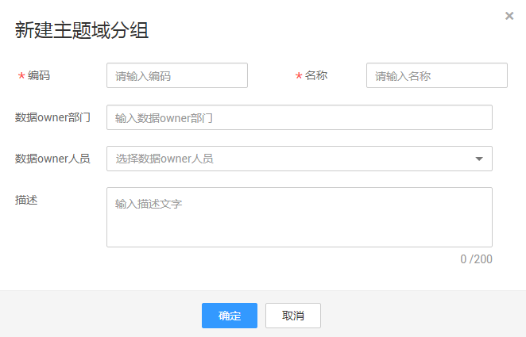
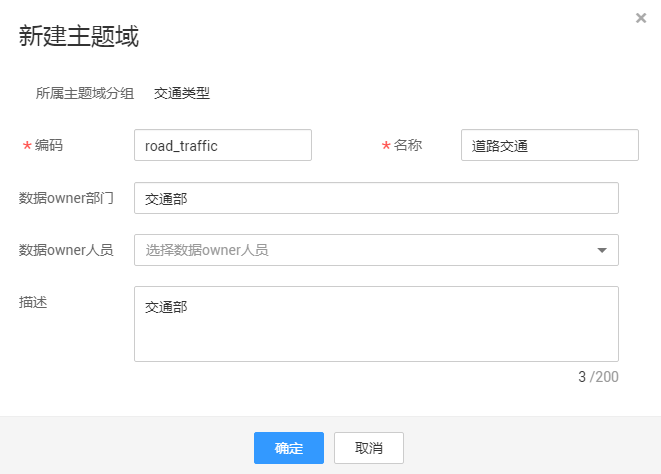
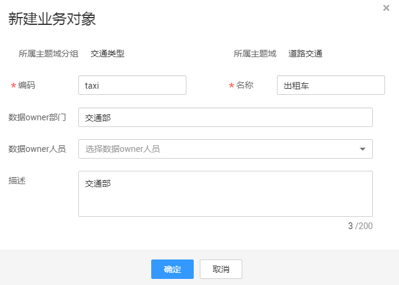
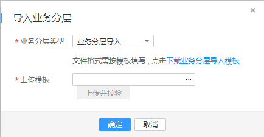
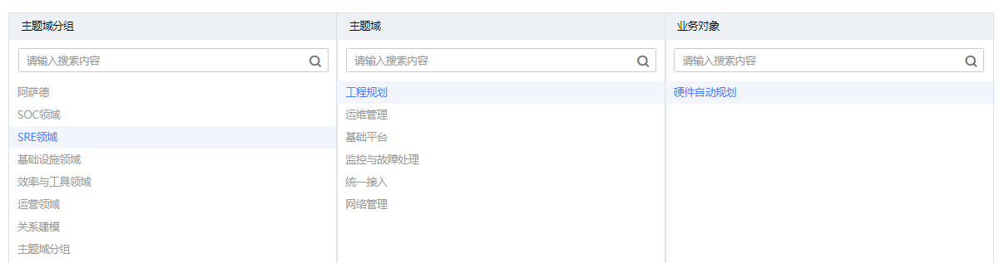

# 建立业务分层

通过分层架构表达对数据的分类和定义，帮助厘清数据资产，明确业务领域和业务对象的关联关系。

您可以通过以下两种方式建立业务分层：

-   [手动建立业务分层](#zh-cn_topic_0169427296_section325565610163)

    手动依次新建主题域分组、主题域和业务对象。

-   [导入业务分层](#zh-cn_topic_0169427296_section785421345411)

    下载系统提供的业务分层模板，设置好主题域分组、主题域和业务对象的相关参数后，使用模板批量导入业务分层。如果业务分层比较复杂，建议采用导入方式建立业务分层。

建立好业务分层后，可以对业务分层进行查找、编辑或删除操作，详情请参见[管理业务分类](#zh-cn_topic_0169427296_section7856181172118)。

## 手动建立业务分层

1.  [登录DAYU控制台](https://console.huaweicloud.com/dayu/)，找到所需要的DAYU实例，单击实例卡片上的“进入控制台”，进入概览页面。

    选择“空间管理”页签，完成工作空间的创建。

    在工作空间列表中，找到所需要的工作空间。

1.  单击相应工作空间的“规范设计“。

    系统跳转至规范设计页面。

2.  单击左侧导航栏中“业务分层“，进入业务分层页面，单击左上角的“新建主题域分组“
3.  在弹出对话框中配置如下参数，然后单击“确定”完成主题域分组的创建。

    **表 1**  主题域分组参数说明

    
    <table><thead align="left"><tr id="zh-cn_topic_0169427296_row7193832336"><th class="cellrowborder" valign="top" width="22.93%" id="mcps1.2.3.1.1">
参数名

    </th>
    <th class="cellrowborder" valign="top" width="77.07000000000001%" id="mcps1.2.3.1.2">
说明

    </th>
    </tr>
    </thead>
    <tbody><tr id="zh-cn_topic_0169427296_row1319418320339"><td class="cellrowborder" valign="top" width="22.93%" headers="mcps1.2.3.1.1 ">
编码

    </td>
    <td class="cellrowborder" valign="top" width="77.07000000000001%" headers="mcps1.2.3.1.2 ">
英文名称。只允许除/、\、&lt;、&gt;以外的字符。

    </td>
    </tr>
    <tr id="zh-cn_topic_0169427296_row111943313318"><td class="cellrowborder" valign="top" width="22.93%" headers="mcps1.2.3.1.1 ">
名称

    </td>
    <td class="cellrowborder" valign="top" width="77.07000000000001%" headers="mcps1.2.3.1.2 ">
只允许除/、\、&lt;、&gt;以外的字符。

    </td>
    </tr>
    <tr id="zh-cn_topic_0169427296_row9194113143318"><td class="cellrowborder" valign="top" width="22.93%" headers="mcps1.2.3.1.1 ">
数据owner部门

    </td>
    <td class="cellrowborder" valign="top" width="77.07000000000001%" headers="mcps1.2.3.1.2 ">
数据的拥有者所在部门。

    </td>
    </tr>
    <tr id="zh-cn_topic_0169427296_row61941935335"><td class="cellrowborder" valign="top" width="22.93%" headers="mcps1.2.3.1.1 ">
数据owner人员

    </td>
    <td class="cellrowborder" valign="top" width="77.07000000000001%" headers="mcps1.2.3.1.2 ">
在下拉框中选择需要的数据owner人员，支持多选。

    </td>
    </tr>
    <tr id="zh-cn_topic_0169427296_row61953318339"><td class="cellrowborder" valign="top" width="22.93%" headers="mcps1.2.3.1.1 ">
描述

    </td>
    <td class="cellrowborder" valign="top" width="77.07000000000001%" headers="mcps1.2.3.1.2 ">
主题域分组的描述信息。

    </td>
    </tr>
    </tbody>
    </table>

    **图 1**  新建主题域分组  
    

4.  新建主题域。

    在一个主题域分组下，可以新建多个主题域。您可以参照如下步骤依次添加所需要的主题域：

    1.  在主题域分组列表中，找到刚才新建的主题域分组，右键单击主题域分组名称，选择菜单“新建主题域“。
    2.  在弹出窗口中，配置如下参数，然后单击“确定“完成主题域的新建。

        **表 2**  主题域参数说明

        
        <table><thead align="left"><tr id="zh-cn_topic_0169427296_row44641834115116"><th class="cellrowborder" valign="top" width="21.37%" id="mcps1.2.3.1.1">
参数名

        </th>
        <th class="cellrowborder" valign="top" width="78.63%" id="mcps1.2.3.1.2">
说明

        </th>
        </tr>
        </thead>
        <tbody><tr id="zh-cn_topic_0169427296_row204654343517"><td class="cellrowborder" valign="top" width="21.37%" headers="mcps1.2.3.1.1 ">
编码

        </td>
        <td class="cellrowborder" valign="top" width="78.63%" headers="mcps1.2.3.1.2 ">
主题域编码。只允许除/、\、&lt;、&gt;以外的字符。

        </td>
        </tr>
        <tr id="zh-cn_topic_0169427296_row1446516347515"><td class="cellrowborder" valign="top" width="21.37%" headers="mcps1.2.3.1.1 ">
名称

        </td>
        <td class="cellrowborder" valign="top" width="78.63%" headers="mcps1.2.3.1.2 ">
主题域名称。只允许除/、\、&lt;、&gt;以外的字符。

        </td>
        </tr>
        <tr id="zh-cn_topic_0169427296_row17465173475117"><td class="cellrowborder" valign="top" width="21.37%" headers="mcps1.2.3.1.1 ">
数据owner部门

        </td>
        <td class="cellrowborder" valign="top" width="78.63%" headers="mcps1.2.3.1.2 ">
数据的拥有者所在部门。

        </td>
        </tr>
        <tr id="zh-cn_topic_0169427296_row9466133455113"><td class="cellrowborder" valign="top" width="21.37%" headers="mcps1.2.3.1.1 ">
数据owner人员

        </td>
        <td class="cellrowborder" valign="top" width="78.63%" headers="mcps1.2.3.1.2 ">
在下拉框中选择需要的数据owner人员，支持多选。

        </td>
        </tr>
        <tr id="zh-cn_topic_0169427296_row1446653475113"><td class="cellrowborder" valign="top" width="21.37%" headers="mcps1.2.3.1.1 ">
描述

        </td>
        <td class="cellrowborder" valign="top" width="78.63%" headers="mcps1.2.3.1.2 ">
主题域的描述信息。

        </td>
        </tr>
        </tbody>
        </table>

        **图 2**  新建主题域  
        

5.  新建业务对象。

    在一个主题域下，可以新建多个业务对象。您可以参照如下步骤依次添加所需要的业务对象：

    1.  在主题域列表中，右键单击所需要的主题域，选择菜单“新建业务对象“。
    2.  在弹出窗口中，配置如下参数，然后单击“确定“完成业务对象新建。

        **表 3**  业务对象参数说明

        
        <table><thead align="left"><tr id="zh-cn_topic_0169427296_row55961731194313"><th class="cellrowborder" valign="top" width="21.95%" id="mcps1.2.3.1.1">
参数名

        </th>
        <th class="cellrowborder" valign="top" width="78.05%" id="mcps1.2.3.1.2">
说明

        </th>
        </tr>
        </thead>
        <tbody><tr id="zh-cn_topic_0169427296_row1859663184311"><td class="cellrowborder" valign="top" width="21.95%" headers="mcps1.2.3.1.1 ">
编码

        </td>
        <td class="cellrowborder" valign="top" width="78.05%" headers="mcps1.2.3.1.2 ">
业务对象编码。只允许除/、\、&lt;、&gt;以外的字符。

        </td>
        </tr>
        <tr id="zh-cn_topic_0169427296_row45961331124311"><td class="cellrowborder" valign="top" width="21.95%" headers="mcps1.2.3.1.1 ">
名称

        </td>
        <td class="cellrowborder" valign="top" width="78.05%" headers="mcps1.2.3.1.2 ">
业务对象名称。只允许除/、\、&lt;、&gt;以外的字符。

        </td>
        </tr>
        <tr id="zh-cn_topic_0169427296_row95963311436"><td class="cellrowborder" valign="top" width="21.95%" headers="mcps1.2.3.1.1 ">
数据owner部门

        </td>
        <td class="cellrowborder" valign="top" width="78.05%" headers="mcps1.2.3.1.2 ">
数据的拥有者所在部门。

        </td>
        </tr>
        <tr id="zh-cn_topic_0169427296_row55971431144317"><td class="cellrowborder" valign="top" width="21.95%" headers="mcps1.2.3.1.1 ">
数据owner人员

        </td>
        <td class="cellrowborder" valign="top" width="78.05%" headers="mcps1.2.3.1.2 ">
在下拉框中选择需要的数据owner人员，支持多选。

        </td>
        </tr>
        <tr id="zh-cn_topic_0169427296_row8597731204314"><td class="cellrowborder" valign="top" width="21.95%" headers="mcps1.2.3.1.1 ">
描述

        </td>
        <td class="cellrowborder" valign="top" width="78.05%" headers="mcps1.2.3.1.2 ">
业务对象的描述信息。

        </td>
        </tr>
        </tbody>
        </table>

        **图 3**  新建业务对象  
        

## 导入业务分层

1.  在规范设计页面，单击左侧的“业务分层“，进入业务分层页面。
2.  单击左上角的“导入业务分层“，弹出对话框，如下图所示，选择“业务分层类型”为“业务分层导入”。

    **图 4**  导入业务分层页面  
    

3.  单击“下载业务分层导入模板”下载模板，请根据业务需求填写好模板中的相关参数并保存。

    模板中的参数说明如下，其中名称前带“\*”的参数为必填参数，名称前未带“\*”的参数为可选参数。

    **表 4**  模板参数说明

    
    <table><thead align="left"><tr id="zh-cn_topic_0169427296_row53671112161"><th class="cellrowborder" valign="top" width="27.82%" id="mcps1.2.3.1.1">
参数名

    </th>
    <th class="cellrowborder" valign="top" width="72.18%" id="mcps1.2.3.1.2">
说明

    </th>
    </tr>
    </thead>
    <tbody><tr id="zh-cn_topic_0169427296_row1291010251664"><td class="cellrowborder" valign="top" width="27.82%" headers="mcps1.2.3.1.1 ">
*主题域分组(CHN)

    </td>
    <td class="cellrowborder" valign="top" width="72.18%" headers="mcps1.2.3.1.2 ">
主题域分组的名称。只允许除/、\、&lt;、&gt;以外的字符。

    </td>
    </tr>
    <tr id="zh-cn_topic_0169427296_row10858230620"><td class="cellrowborder" valign="top" width="27.82%" headers="mcps1.2.3.1.1 ">
*主题域分组(ENG)

    </td>
    <td class="cellrowborder" valign="top" width="72.18%" headers="mcps1.2.3.1.2 ">
主题域分组的编码。只允许除/、\、&lt;、&gt;以外的字符。

    </td>
    </tr>
    <tr id="zh-cn_topic_0169427296_row16331444987"><td class="cellrowborder" valign="top" width="27.82%" headers="mcps1.2.3.1.1 ">
*主题域(CHN)

    </td>
    <td class="cellrowborder" valign="top" width="72.18%" headers="mcps1.2.3.1.2 ">
主题域名称。只允许除/、\、&lt;、&gt;以外的字符。

    </td>
    </tr>
    <tr id="zh-cn_topic_0169427296_row7937147984"><td class="cellrowborder" valign="top" width="27.82%" headers="mcps1.2.3.1.1 ">
*主题域(ENG)

    </td>
    <td class="cellrowborder" valign="top" width="72.18%" headers="mcps1.2.3.1.2 ">
主题域编码。只允许除/、\、&lt;、&gt;以外的字符。

    </td>
    </tr>
    <tr id="zh-cn_topic_0169427296_row1136871218617"><td class="cellrowborder" valign="top" width="27.82%" headers="mcps1.2.3.1.1 ">
*业务对象(CHN)

    </td>
    <td class="cellrowborder" valign="top" width="72.18%" headers="mcps1.2.3.1.2 ">
业务对象名称。只允许除/、\、&lt;、&gt;以外的字符。

    </td>
    </tr>
    <tr id="zh-cn_topic_0169427296_row13368121211611"><td class="cellrowborder" valign="top" width="27.82%" headers="mcps1.2.3.1.1 ">
*业务对象(ENG)

    </td>
    <td class="cellrowborder" valign="top" width="72.18%" headers="mcps1.2.3.1.2 ">
业务对象编码。只允许除/、\、&lt;、&gt;以外的字符。

    </td>
    </tr>
    <tr id="zh-cn_topic_0169427296_row739741696"><td class="cellrowborder" valign="top" width="27.82%" headers="mcps1.2.3.1.1 ">
业务对象定义

    </td>
    <td class="cellrowborder" valign="top" width="72.18%" headers="mcps1.2.3.1.2 ">
业务对象的描述信息。

    </td>
    </tr>
    <tr id="zh-cn_topic_0169427296_row436818122069"><td class="cellrowborder" valign="top" width="27.82%" headers="mcps1.2.3.1.1 ">
业务对象数据owner

    </td>
    <td class="cellrowborder" valign="top" width="72.18%" headers="mcps1.2.3.1.2 ">
数据的拥有者所在部门。

    </td>
    </tr>
    <tr id="zh-cn_topic_0169427296_row1536817128617"><td class="cellrowborder" valign="top" width="27.82%" headers="mcps1.2.3.1.1 ">
业务对象数据owner人员

    </td>
    <td class="cellrowborder" valign="top" width="72.18%" headers="mcps1.2.3.1.2 ">
数据的拥有者，支持填写多个，中间以逗号分隔。

    </td>
    </tr>
    </tbody>
    </table>

4.  返回“导入业务分层”的页面，选择[3](#zh-cn_topic_0169427296_li1843194016414)中配置好的业务分层模板文件，然后单击“上传并校验“。

    如果上传的模板文件校验不通过，请修改正确后，再重新上传。

5.  单击“确定“完成业务分层的导入。

## 管理业务分类

**图 5**  业务分层区域  

-   查找业务分类

    您可以根据主题域分组\\主题域\\业务对象三种信息，输入相应关键字，通过进行查找。

-   管理现有业务分类

    您可以在主题域分组\\主题域\\业务对象三种业务名称上，单击右键，可对该业务分类进行新建、编辑、删除操作。

