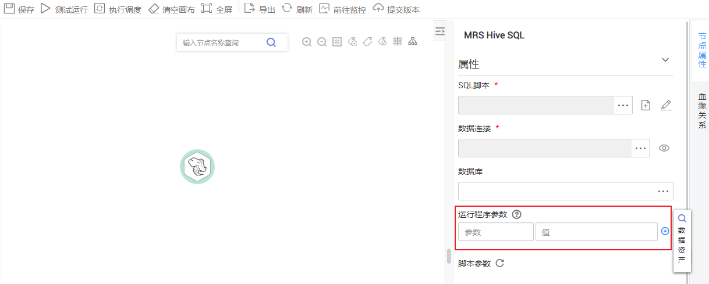

# 开发SQL脚本<a name="dgc_01_0424"></a>

对SQL脚本进行在线开发、调试和执行，开发完成的脚本也可以在作业中执行（请参见[开发作业](开发作业.md)）。

## 前提条件<a name="zh-cn_topic_0104967365_section536330414847"></a>

-   已开通相应的云服务并在云服务中创建数据库。Flink SQL脚本不涉及该操作。
-   已创建与脚本的数据连接类型匹配的数据连接，请参见[新建数据连接](新建数据连接.md)。Flink SQL脚本不涉及该操作。

## 操作步骤<a name="zh-cn_topic_0104967365_section3093294014851"></a>

1.  登录DGC控制台。选择对应工作空间的“数据开发“模块，进入数据开发页面。

    **图 1**  选择数据开发<a name="dgc_01_0423_fig746051541519"></a>  
    

2.  在数据开发主界面的左侧导航栏，选择“数据开发  \>  脚本开发“。
3.  在脚本目录中，双击脚本名称，进入脚本开发页面。
4.  在编辑器上方，选择如[表1](#zh-cn_topic_0104967365_table18459183312499)所示的属性。创建Flink SQL脚本时请跳过此步骤。

    **表 1**  SQL脚本属性

    <a name="zh-cn_topic_0104967365_table18459183312499"></a>
    <table><thead align="left"><tr id="zh-cn_topic_0104967365_row144598332490"><th class="cellrowborder" valign="top" width="20.18%" id="mcps1.2.3.1.1"><p id="zh-cn_topic_0104967365_p3475163304919"><a name="zh-cn_topic_0104967365_p3475163304919"></a><a name="zh-cn_topic_0104967365_p3475163304919"></a>属性</p>
    </th>
    <th class="cellrowborder" valign="top" width="79.82000000000001%" id="mcps1.2.3.1.2"><p id="zh-cn_topic_0104967365_p447543364917"><a name="zh-cn_topic_0104967365_p447543364917"></a><a name="zh-cn_topic_0104967365_p447543364917"></a>说明</p>
    </th>
    </tr>
    </thead>
    <tbody><tr id="zh-cn_topic_0104967365_row0475533134913"><td class="cellrowborder" valign="top" width="20.18%" headers="mcps1.2.3.1.1 "><p id="zh-cn_topic_0104967365_p18475123313491"><a name="zh-cn_topic_0104967365_p18475123313491"></a><a name="zh-cn_topic_0104967365_p18475123313491"></a>数据连接</p>
    </td>
    <td class="cellrowborder" valign="top" width="79.82000000000001%" headers="mcps1.2.3.1.2 "><p id="zh-cn_topic_0104967365_p8475153311497"><a name="zh-cn_topic_0104967365_p8475153311497"></a><a name="zh-cn_topic_0104967365_p8475153311497"></a>选择数据连接。</p>
    </td>
    </tr>
    <tr id="row86214269514"><td class="cellrowborder" valign="top" width="20.18%" headers="mcps1.2.3.1.1 "><p id="p797710514510"><a name="p797710514510"></a><a name="p797710514510"></a>数据库</p>
    </td>
    <td class="cellrowborder" valign="top" width="79.82000000000001%" headers="mcps1.2.3.1.2 "><p id="p109771551205120"><a name="p109771551205120"></a><a name="p109771551205120"></a>选择数据库。</p>
    </td>
    </tr>
    <tr id="zh-cn_topic_0104967365_row1649013331499"><td class="cellrowborder" valign="top" width="20.18%" headers="mcps1.2.3.1.1 "><p id="zh-cn_topic_0104967365_p194901533194919"><a name="zh-cn_topic_0104967365_p194901533194919"></a><a name="zh-cn_topic_0104967365_p194901533194919"></a>资源队列</p>
    </td>
    <td class="cellrowborder" valign="top" width="79.82000000000001%" headers="mcps1.2.3.1.2 "><p id="zh-cn_topic_0104967365_p9490233194919"><a name="zh-cn_topic_0104967365_p9490233194919"></a><a name="zh-cn_topic_0104967365_p9490233194919"></a>选择执行<span id="zh-cn_topic_0104967365_text134901933194914"><a name="zh-cn_topic_0104967365_text134901933194914"></a><a name="zh-cn_topic_0104967365_text134901933194914"></a>DLI</span>作业的资源队列。当脚本为<span id="zh-cn_topic_0104967365_text2062413313190"><a name="zh-cn_topic_0104967365_text2062413313190"></a><a name="zh-cn_topic_0104967365_text2062413313190"></a>DLI</span> SQL时，配置该参数。</p>
    <div class="p" id="zh-cn_topic_0104967365_p4632865112"><a name="zh-cn_topic_0104967365_p4632865112"></a><a name="zh-cn_topic_0104967365_p4632865112"></a>如需新建资源队列，请参考以下方法：<a name="zh-cn_topic_0104967365_zh-cn_topic_0099822521_ul46080727105259"></a><a name="zh-cn_topic_0104967365_zh-cn_topic_0099822521_ul46080727105259"></a><ul id="zh-cn_topic_0104967365_zh-cn_topic_0099822521_ul46080727105259"><li>单击<a name="zh-cn_topic_0104967365_image4422159103310"></a><a name="zh-cn_topic_0104967365_image4422159103310"></a><span></span>，进入<span id="zh-cn_topic_0104967365_text66132110547"><a name="zh-cn_topic_0104967365_text66132110547"></a><a name="zh-cn_topic_0104967365_text66132110547"></a>DLI</span>的<span class="wintitle" id="zh-cn_topic_0104967365_wintitle154711403146"><a name="zh-cn_topic_0104967365_wintitle154711403146"></a><a name="zh-cn_topic_0104967365_wintitle154711403146"></a>“队列管理”</span>页面新建资源队列。</li><li>前往<span id="zh-cn_topic_0104967365_text155328398531"><a name="zh-cn_topic_0104967365_text155328398531"></a><a name="zh-cn_topic_0104967365_text155328398531"></a>DLI</span>管理控制台进行新建。</li></ul>
    </div>
    <div class="note" id="zh-cn_topic_0104967365_note24901033174917"><a name="zh-cn_topic_0104967365_note24901033174917"></a><a name="zh-cn_topic_0104967365_note24901033174917"></a><span class="notetitle"> 说明： </span><div class="notebody"><p id="zh-cn_topic_0104967365_p144901133144918"><a name="zh-cn_topic_0104967365_p144901133144918"></a><a name="zh-cn_topic_0104967365_p144901133144918"></a><span id="zh-cn_topic_0104967365_text7490163344913"><a name="zh-cn_topic_0104967365_text7490163344913"></a><a name="zh-cn_topic_0104967365_text7490163344913"></a>DLI</span>提供默认资源队列<span class="parmvalue" id="zh-cn_topic_0104967365_parmvalue19490193354912"><a name="zh-cn_topic_0104967365_parmvalue19490193354912"></a><a name="zh-cn_topic_0104967365_parmvalue19490193354912"></a>“default”</span>，该资源队列不支持insert、load、cat命令。</p>
    </div></div>
    <p id="zh-cn_topic_0104967365_p18631105416596"><a name="zh-cn_topic_0104967365_p18631105416596"></a><a name="zh-cn_topic_0104967365_p18631105416596"></a>如需以<span class="parmvalue" id="zh-cn_topic_0104967365_parmvalue01563426512"><a name="zh-cn_topic_0104967365_parmvalue01563426512"></a><a name="zh-cn_topic_0104967365_parmvalue01563426512"></a>“key/value”</span>的形式设置提交SQL作业的属性，请单击<a name="zh-cn_topic_0104967365_image1839611418218"></a><a name="zh-cn_topic_0104967365_image1839611418218"></a><span></span>。最多可设置10个属性，属性说明如下：</p>
    <a name="zh-cn_topic_0104967365_ul45587104143542"></a><a name="zh-cn_topic_0104967365_ul45587104143542"></a><ul id="zh-cn_topic_0104967365_ul45587104143542"><li>dli.sql.autoBroadcastJoinThreshold（自动使用BroadcastJoin的数据量阈值）</li><li>dli.sql.shuffle.partitions（指定Shuffle过程中Partition的个数）</li><li>dli.sql.cbo.enabled（是否打开CBO优化策略）</li><li>dli.sql.cbo.joinReorder.enabled（开启CBO优化时，是否允许重新调整join的顺序）</li><li>dli.sql.multiLevelDir.enabled（OBS表的指定目录或OBS表分区表的分区目录下有子目录时，是否查询子目录的内容；默认不查询）</li><li>dli.sql.dynamicPartitionOverwrite.enabled（在动态分区模式时，只会重写查询中的数据涉及的分区，未涉及的分区不删除）</li></ul>
    </td>
    </tr>
    </tbody>
    </table>

5.  在编辑器中输入SQL语句（支持输入多条SQL语句）。

    > **说明：** 
    >-   需要注意，使用SQL语句获取的系统日期和通过数据库工具获取的系统日期是不一样，查询结果存到数据库是以YYYY-MM-DD格式，而页面显示查询结果是经过转换后的格式。
    >-   SQL语句之间以“;“分隔。如果其它地方使用“;“，请通过“\\“进行转义。例如：
    >    ```
    >    select 1;
    >    select * from a where b="dsfa\;";  --example 1\;example 2.
    >    ```

    为了方便脚本开发，数据开发模块提供了如下能力：

    -   脚本编辑器支持使用如下快捷键，以提升脚本开发效率。
        -   Ctrl + /：注释或解除注释光标所在行或代码块
        -   Ctrl + S：保存
        -   Ctrl + Z：撤销
        -   Ctrl + Y：重做
        -   Ctrl + F：查找
        -   Ctrl + Shift + R：替换
        -   Ctrl + X：剪切，光标未选中时剪切一行
        -   Alt + 鼠标拖动：列模式编辑，修改一整块内容
        -   Ctrl + 鼠标点选：多列模式编辑，多行缩进
        -   Shift + Ctrl + K：删除当前行
        -   Ctrl + →或Ctrl + ←：向右或向左按单词移动光标
        -   Ctrl + Home或Ctrl + End：移至当前文件的最前或最后
        -   Home或End：移至当前行最前或最后
        -   Ctrl + Shift + L：鼠标双击相同的字符串后，为所有相同的字符串添加光标，实现批量修改

    -   支持系统函数功能（当前RDS SQL、Flink SQL、Spark SQL、Presto SQL不支持该功能）。

        单击编辑器右侧的“系统函数“，显示该数据连接类型支持的函数，您可以双击函数到编辑器中使用。

    -   支持脚本参数（当前仅Flink SQL不支持该功能）。

        在SQL语句中直接写入脚本参数，调试脚本时可以在脚本编辑器下方输入参数值。如果脚本被作业引用，在作业开发页面可以配置参数值，参数值支持使用EL表达式（参见[表达式概述](表达式概述.md)）。

        脚本示例如下，其中str1是参数名称，只支持英文字母、数字、“-”、“\_”、“<”和“\>”，最大长度为16字符，且参数名称不允许重名。

        ```
        select ${str1} from data;
        ```

        另外，对于MRS Spark SQL和MRS Hive SQL脚本的运行程序参数，除了在SQL脚本中参考语句“set hive.exec.parallel=true;“配置参数，也可以在对应作业节点属性的“运行程序参数”中配置该参数。

        **图 2**  运行程序参数<a name="fig1857519591160"></a>  
        

6.  （可选）在编辑器上方，单击“格式化“，格式化SQL语句。创建Flink SQL脚本请跳过此步骤。
7.  在编辑器上方，单击“运行“。如需单独执行某部分SQL语句，请选中SQL语句再运行。SQL语句运行完成后，在编辑器下方可以查看脚本的执行历史、执行结果。Flink SQL脚本不涉及，请跳过该步骤。

    > **说明：** 
    >MRS集群为非安全集群、且未限制命令白名单时，在Hive SQL执行过程中，添加application name信息后，则可以方便的根据脚本名称与执行时间在MRS的Yarn管理界面中根据job name找到对应任务。需要注意若默认引擎为tez，则要显式配置引擎为mr，使tez引擎下不生效。

8.  在编辑器上方，单击，保存脚本。

    如果脚本是新建且未保存过的，请配置如[表2](#zh-cn_topic_0104967365_table35383235269)所示的参数。

    **表 2**  保存脚本

    <a name="zh-cn_topic_0104967365_table35383235269"></a>
    <table><thead align="left"><tr id="zh-cn_topic_0104967365_row55381123202616"><th class="cellrowborder" valign="top" width="20.18%" id="mcps1.2.4.1.1"><p id="zh-cn_topic_0104967365_p1153817231264"><a name="zh-cn_topic_0104967365_p1153817231264"></a><a name="zh-cn_topic_0104967365_p1153817231264"></a>参数</p>
    </th>
    <th class="cellrowborder" valign="top" width="12.67%" id="mcps1.2.4.1.2"><p id="zh-cn_topic_0104967365_p195381623142618"><a name="zh-cn_topic_0104967365_p195381623142618"></a><a name="zh-cn_topic_0104967365_p195381623142618"></a>是否必选</p>
    </th>
    <th class="cellrowborder" valign="top" width="67.15%" id="mcps1.2.4.1.3"><p id="zh-cn_topic_0104967365_p75541123192614"><a name="zh-cn_topic_0104967365_p75541123192614"></a><a name="zh-cn_topic_0104967365_p75541123192614"></a>说明</p>
    </th>
    </tr>
    </thead>
    <tbody><tr id="zh-cn_topic_0104967365_row5554122311266"><td class="cellrowborder" valign="top" width="20.18%" headers="mcps1.2.4.1.1 "><p id="zh-cn_topic_0104967365_p155414231262"><a name="zh-cn_topic_0104967365_p155414231262"></a><a name="zh-cn_topic_0104967365_p155414231262"></a>脚本名称</p>
    </td>
    <td class="cellrowborder" valign="top" width="12.67%" headers="mcps1.2.4.1.2 "><p id="zh-cn_topic_0104967365_p7554122342613"><a name="zh-cn_topic_0104967365_p7554122342613"></a><a name="zh-cn_topic_0104967365_p7554122342613"></a>是</p>
    </td>
    <td class="cellrowborder" valign="top" width="67.15%" headers="mcps1.2.4.1.3 "><p id="zh-cn_topic_0104967365_p255482312611"><a name="zh-cn_topic_0104967365_p255482312611"></a><a name="zh-cn_topic_0104967365_p255482312611"></a>脚本的名称，只能包含字符：英文字母、数字、中文、中划线、下划线和点号，且长度小于等于128个字符。</p>
    </td>
    </tr>
    <tr id="zh-cn_topic_0104967365_row155541323182616"><td class="cellrowborder" valign="top" width="20.18%" headers="mcps1.2.4.1.1 "><p id="zh-cn_topic_0104967365_p655422312266"><a name="zh-cn_topic_0104967365_p655422312266"></a><a name="zh-cn_topic_0104967365_p655422312266"></a>描述</p>
    </td>
    <td class="cellrowborder" valign="top" width="12.67%" headers="mcps1.2.4.1.2 "><p id="zh-cn_topic_0104967365_p4554122316263"><a name="zh-cn_topic_0104967365_p4554122316263"></a><a name="zh-cn_topic_0104967365_p4554122316263"></a>否</p>
    </td>
    <td class="cellrowborder" valign="top" width="67.15%" headers="mcps1.2.4.1.3 "><p id="zh-cn_topic_0104967365_p13554112392618"><a name="zh-cn_topic_0104967365_p13554112392618"></a><a name="zh-cn_topic_0104967365_p13554112392618"></a>脚本的描述信息。</p>
    </td>
    </tr>
    <tr id="zh-cn_topic_0104967365_row25851239261"><td class="cellrowborder" valign="top" width="20.18%" headers="mcps1.2.4.1.1 "><p id="zh-cn_topic_0104967365_p18585623182610"><a name="zh-cn_topic_0104967365_p18585623182610"></a><a name="zh-cn_topic_0104967365_p18585623182610"></a>选择目录</p>
    </td>
    <td class="cellrowborder" valign="top" width="12.67%" headers="mcps1.2.4.1.2 "><p id="zh-cn_topic_0104967365_p16585112317266"><a name="zh-cn_topic_0104967365_p16585112317266"></a><a name="zh-cn_topic_0104967365_p16585112317266"></a>是</p>
    </td>
    <td class="cellrowborder" valign="top" width="67.15%" headers="mcps1.2.4.1.3 "><p id="zh-cn_topic_0104967365_p9585102317266"><a name="zh-cn_topic_0104967365_p9585102317266"></a><a name="zh-cn_topic_0104967365_p9585102317266"></a>选择脚本所属的目录，默认为根目录。</p>
    </td>
    </tr>
    </tbody>
    </table>

    > **说明：** 
    >如果脚本未保存，重新打开脚本时，可以从本地缓存中恢复脚本内容。


## 下载或转储脚本执行结果<a name="section2558253151213"></a>

**约束限制**：转储脚本执行结果功能依赖于OBS服务，如无OBS服务，则不支持该功能。

用户可根据需求下载或转储执行结果，仅支持具有拥有DAYU Administrator或Tenant Administrator权限的用户下载和转储。参考如下：

-   下载结果：下载CSV格式的结果文件到本地。
-   转储结果：转储CSV格式的结果文件到OBS中，请参见[表3](#table1192101552416)。

    > **说明：** 
    >Flink SQL脚本、RDS SQL脚本、Shell脚本的执行结果，不支持转储。

    **表 3**  转储结果

    <a name="table1192101552416"></a>
    <table><thead align="left"><tr id="row15922515192417"><th class="cellrowborder" valign="top" width="18.17%" id="mcps1.2.4.1.1"><p id="p29222015142417"><a name="p29222015142417"></a><a name="p29222015142417"></a>参数</p>
    </th>
    <th class="cellrowborder" valign="top" width="13.200000000000001%" id="mcps1.2.4.1.2"><p id="p1892241562411"><a name="p1892241562411"></a><a name="p1892241562411"></a>是否必选</p>
    </th>
    <th class="cellrowborder" valign="top" width="68.63%" id="mcps1.2.4.1.3"><p id="p792271532416"><a name="p792271532416"></a><a name="p792271532416"></a>说明</p>
    </th>
    </tr>
    </thead>
    <tbody><tr id="row2922515142417"><td class="cellrowborder" valign="top" width="18.17%" headers="mcps1.2.4.1.1 "><p id="p4922101518241"><a name="p4922101518241"></a><a name="p4922101518241"></a>数据格式</p>
    </td>
    <td class="cellrowborder" valign="top" width="13.200000000000001%" headers="mcps1.2.4.1.2 "><p id="p1292291511248"><a name="p1292291511248"></a><a name="p1292291511248"></a>是</p>
    </td>
    <td class="cellrowborder" valign="top" width="68.63%" headers="mcps1.2.4.1.3 "><p id="p10922101532411"><a name="p10922101532411"></a><a name="p10922101532411"></a>目前仅支持导出CSV格式的结果文件。</p>
    </td>
    </tr>
    <tr id="row15922115202417"><td class="cellrowborder" valign="top" width="18.17%" headers="mcps1.2.4.1.1 "><p id="p16922515102419"><a name="p16922515102419"></a><a name="p16922515102419"></a>资源队列</p>
    </td>
    <td class="cellrowborder" valign="top" width="13.200000000000001%" headers="mcps1.2.4.1.2 "><p id="p992241502418"><a name="p992241502418"></a><a name="p992241502418"></a>否</p>
    </td>
    <td class="cellrowborder" valign="top" width="68.63%" headers="mcps1.2.4.1.3 "><p id="p199221715192417"><a name="p199221715192417"></a><a name="p199221715192417"></a>选择执行导出操作的<span id="text6922415192411"><a name="text6922415192411"></a><a name="text6922415192411"></a>DLI</span>队列。当脚本为<span id="text59220158241"><a name="text59220158241"></a><a name="text59220158241"></a>DLI</span> SQL时，配置该参数。</p>
    </td>
    </tr>
    <tr id="row16922215182418"><td class="cellrowborder" valign="top" width="18.17%" headers="mcps1.2.4.1.1 "><p id="p7922715102418"><a name="p7922715102418"></a><a name="p7922715102418"></a>压缩格式</p>
    </td>
    <td class="cellrowborder" valign="top" width="13.200000000000001%" headers="mcps1.2.4.1.2 "><p id="p5922815182415"><a name="p5922815182415"></a><a name="p5922815182415"></a>否</p>
    </td>
    <td class="cellrowborder" valign="top" width="68.63%" headers="mcps1.2.4.1.3 "><p id="p592211153241"><a name="p592211153241"></a><a name="p592211153241"></a>选择压缩格式。当脚本为<span id="text79231815132420"><a name="text79231815132420"></a><a name="text79231815132420"></a>DLI</span> SQL时，配置该参数。</p>
    <a name="ul149231715182410"></a><a name="ul149231715182410"></a><ul id="ul149231715182410"><li>none</li><li>bzip2</li><li>deflate</li><li>gzip</li></ul>
    </td>
    </tr>
    <tr id="row10923101510246"><td class="cellrowborder" valign="top" width="18.17%" headers="mcps1.2.4.1.1 "><p id="p192311522419"><a name="p192311522419"></a><a name="p192311522419"></a>存储路径</p>
    </td>
    <td class="cellrowborder" valign="top" width="13.200000000000001%" headers="mcps1.2.4.1.2 "><p id="p13924191519243"><a name="p13924191519243"></a><a name="p13924191519243"></a>是</p>
    </td>
    <td class="cellrowborder" valign="top" width="68.63%" headers="mcps1.2.4.1.3 "><p id="p0924715182413"><a name="p0924715182413"></a><a name="p0924715182413"></a>设置结果文件的OBS存储路径。选择OBS路径后，您需要在选择的路径后方自定义一个文件夹名称，系统将在OBS路径下创建文件夹，用于存放结果文件。</p>
    </td>
    </tr>
    <tr id="row19924101518248"><td class="cellrowborder" valign="top" width="18.17%" headers="mcps1.2.4.1.1 "><p id="p6924715172415"><a name="p6924715172415"></a><a name="p6924715172415"></a>覆盖类型</p>
    </td>
    <td class="cellrowborder" valign="top" width="13.200000000000001%" headers="mcps1.2.4.1.2 "><p id="p14924111522419"><a name="p14924111522419"></a><a name="p14924111522419"></a>否</p>
    </td>
    <td class="cellrowborder" valign="top" width="68.63%" headers="mcps1.2.4.1.3 "><p id="p3924191562414"><a name="p3924191562414"></a><a name="p3924191562414"></a>如果<span class="parmname" id="parmname9924111582414"><a name="parmname9924111582414"></a><a name="parmname9924111582414"></a>“存储路径”</span>中，您自定义的文件夹在OBS路径中已存在，选择覆盖类型。当脚本为<span id="text12924161515244"><a name="text12924161515244"></a><a name="text12924161515244"></a>DLI</span> SQL时，配置该参数。</p>
    <a name="ul12924161520245"></a><a name="ul12924161520245"></a><ul id="ul12924161520245"><li>覆盖：删除OBS路径中已有的重名文件夹，重新创建自定义的文件夹。</li><li>存在即报错：系统返回错误信息，退出导出操作。</li></ul>
    </td>
    </tr>
    </tbody>
    </table>


