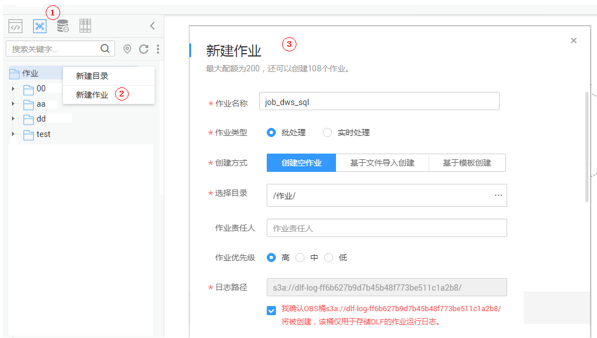
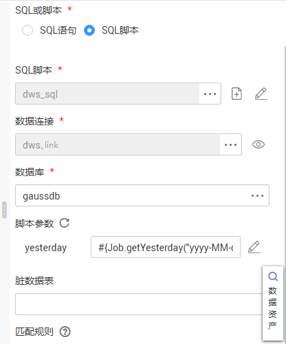

# 开发一个DWS SQL脚本作业<a name="dgc_01_0524"></a>

介绍如何在数据开发模块上通过DWS SQL算子进行作业开发。

## 场景说明<a name="zh-cn_topic_0127305016_section722114374269"></a>

本教程通过开发一个DWS作业来统计某门店的前一天销售额。

## 环境准备<a name="zh-cn_topic_0127305016_section8658103210277"></a>

-   已开通DWS服务，并创建DWS集群，为DWS SQL提供运行环境。
-   已开通CDM增量包，并创建CDM集群。

    CDM集群创建时，需要注意：

    虚拟私有云、子网、安全组与DWS集群可以网络互通。


## 创建DWS的数据连接<a name="zh-cn_topic_0127305016_section1033111569439"></a>

开发DWS SQL前，我们需要在“数据开发 \> 数据连接“模块中建立一个到DWS的连接，数据连接名称为“dws\_link“。

关键参数说明：

-   集群名：环境准备中创建的DWS集群名称。
-   绑定Agent：环境准备中创建的CDM集群。

## 创建数据库<a name="section1318945519560"></a>

在DWS中创建数据库，以“gaussdb”数据库为例。详情请参考[新建数据库](新建数据库.md)进行操作。

## 创建数据表<a name="section19115188573"></a>

在“gaussdb”数据库中创建数据表trade\_log和trade\_report。详情请参考如下建表脚本。

```
create schema store_sales;
set current_schema= store_sales;
drop table if exists trade_log;
CREATE TABLE trade_log
(
        sn           VARCHAR(16), 
        trade_time   DATE,
        trade_count   INTEGER(8)        
);
set current_schema= store_sales;
drop table if exists trade_report;
CREATE TABLE trade_report
( 
        rq   DATE,
        trade_total   INTEGER(8)        
);

```

## 开发DWS SQL脚本<a name="zh-cn_topic_0127305016_section17888155820591"></a>

在“数据开发 \> 脚本开发“模块中创建一个DWS SQL脚本，脚本名称为“dws\_sql“。在编辑器中输入SQL语句，通过SQL语句来实现业务需求。

**图 1**  开发脚本<a name="zh-cn_topic_0127305016_fig693875618223"></a>  


关键说明：

-   [图1](#zh-cn_topic_0127305016_fig693875618223)中的脚本开发区为临时调试区，关闭脚本页签后，开发区的内容将丢失。请单击“保存并提交版本”。
-   数据连接：[创建DWS的数据连接](#zh-cn_topic_0127305016_section1033111569439)创建的连接。

## 开发DWS SQL作业<a name="section8560636173110"></a>

DWS SQL脚本开发完成后，我们为DWS SQL脚本构建一个周期执行的作业，使得该脚本能定期执行。

1.  创建一个数据开发模块空作业，作业名称为“job\_dws\_sql“。

    **图 2**  创建job\_dws\_sql作业<a name="zh-cn_topic_0127305016_fig235635122312"></a>  
    

2.  然后进入到作业开发页面，拖动DWS SQL节点到画布中并单击，配置节点的属性。

    **图 3**  配置DWS SQL节点属性<a name="zh-cn_topic_0127305016_fig1736311111259"></a>  
    

    关键属性说明：

    -   SQL脚本：关联[开发DWS SQL脚本](#zh-cn_topic_0127305016_section17888155820591)中开发完成的DWS SQL脚本“dws\_sql“。
    -   数据连接：默认选择SQL脚本“dws\_sql“中设置的数据连接，支持修改。
    -   数据库：默认选择SQL脚本“dws\_sql“中设置的数据库，支持修改。
    -   脚本参数：通过EL表达式获取"yesterday"的值，EL表达式如下：

        ```
        #{Job.getYesterday("yyyy-MM-dd")}
        ```

    -   节点名称：默认显示为SQL脚本“dws\_sql“的名称，支持修改。

3.  作业编排完成后，单击，测试运行作业。
4.  如果运行成功，单击画布空白处，在右侧的“调度配置“页面，配置作业的调度策略。

    **图 4**  配置调度方式<a name="zh-cn_topic_0127305016_fig18819172118"></a>  
    

    说明：

    2021/08/06至2021/08/31，每天2点执行一次作业。

5.  单击“保存并提交版本”，执行调度作业，实现作业每天自动运行。

