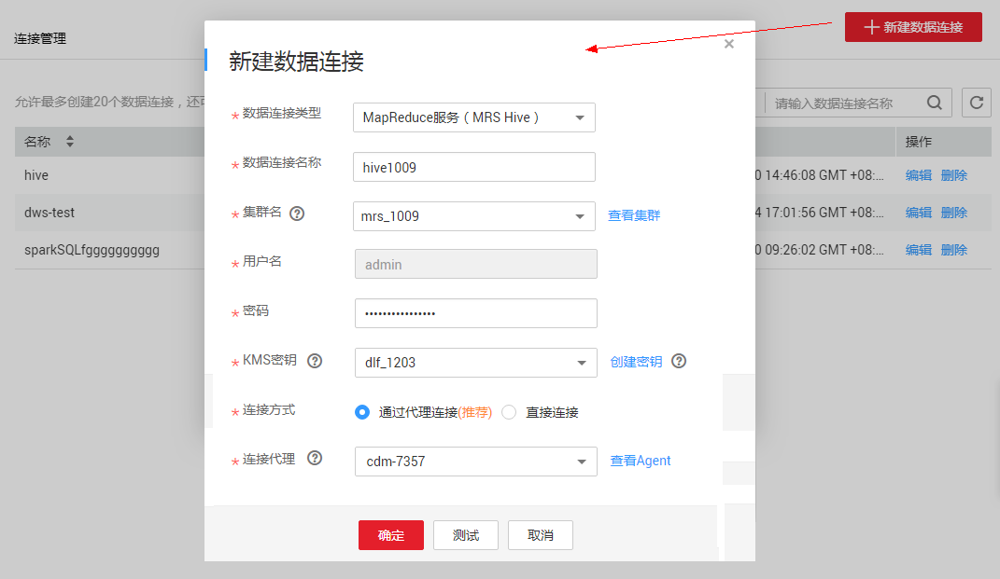
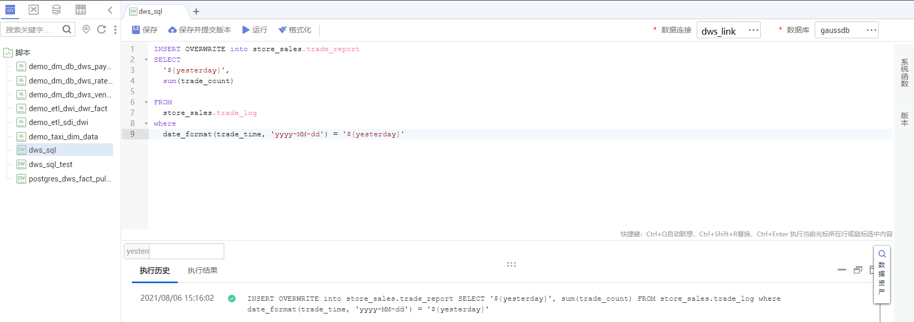
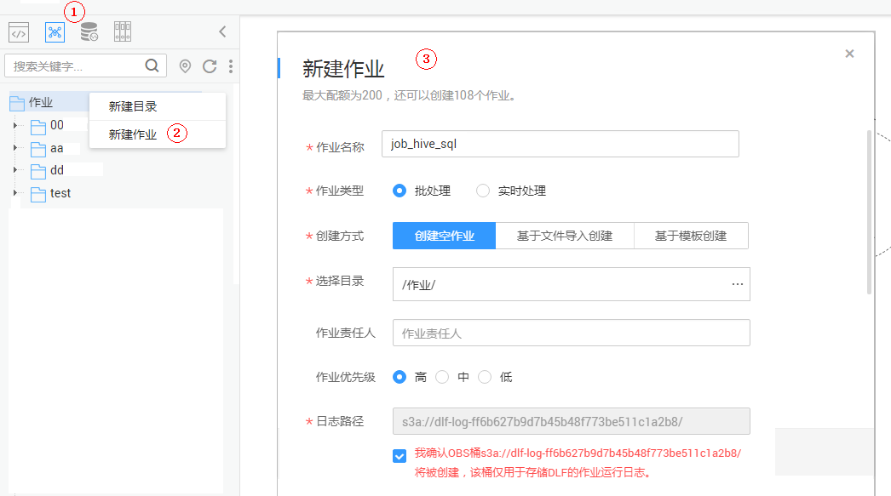
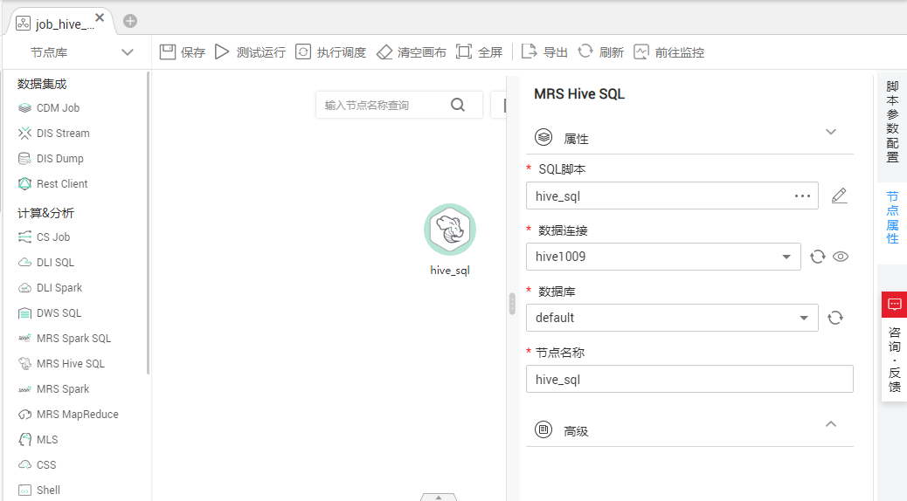
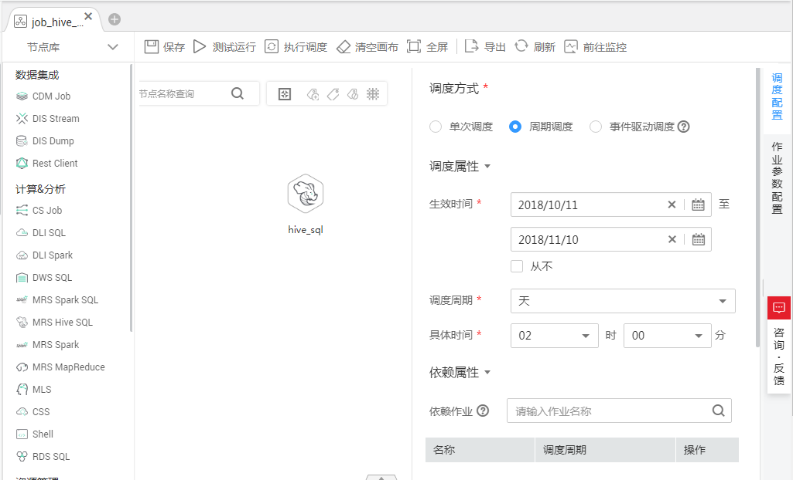

# 开发一个Hive SQL脚本

本章节介绍如何在DLF上进行Hive SQL开发。

## 场景说明

DLF作为一站式大数据开发平台，支持多种大数据工具的开发。Hive是基于Hadoop的一个数据仓库工具，可以将结构化的数据文件映射为一张数据库表，并提供简单的SQL查询功能；可以将SQL语句转换为MapReduce任务进行运行。

## 环境准备

-   已开通MapReduce服务MRS，并创建MRS集群“MRS\_1009“，为Hive SQL提供运行环境。

    MRS集群创建时，需要注意：

    -   集群关闭Kerberos认证。
    -   组件要包含Hive。

-   已开通云数据迁移服务CDM，并创建CDM集群“cdm-7357“，为DLF提供DLF与MRS通信的代理。

    CDM集群创建时，需要注意：

    -   虚拟私有云、子网、安全组与MRS集群“MRS\_1009“可以网络互通。

## 建立Hive的数据连接

开发Hive SQL前，我们需要在DLF中建立一个到MRS Hive的连接，数据连接名称为“hive1009“。

**图 1**  创建数据连接  

关键参数说明：

-   集群名：[•已开通MapReduce服务MRS，并创建MR...](#zh-cn_topic_0127305016_li138081449163217)中创建的MRS集群。
-   绑定Agent：[•已开通数据迁移服务CDM，并创建CDM集群“c...](#zh-cn_topic_0127305016_li10628945142712)中创建的CDM集群。

## 开发Hive SQL脚本

在DLF中创建一个Hive SQL脚本，脚本名称为“hive\_sql“。在编辑器中输入SQL语句，通过SQL语句来实现业务需求。

**图 2**  开发脚本  

关键说明：

-   [图2](#zh-cn_topic_0127305016_fig693875618223)中的脚本开发区为临时调试区，关闭脚本页签后，开发区的内容将丢失。请单击，将脚本保存至指定的目录中。
-   数据连接：[建立Hive的数据连接](#zh-cn_topic_0127305016_section1033111569439)创建的连接。

## 开发Hive SQL作业

Hive SQL脚本开发完成后，我们为Hive SQL脚本构建一个周期执行的作业，使得该脚本能定期执行。

1.  创建一个DLF空作业，作业名称为“job\_hive\_sql“。

    **图 3**  创建job\_hive\_sql作业  
    

2.  然后进入到作业开发页面，拖动MRS Hive SQL节点到画布中并单击，配置节点的属性。

    **图 4**  配置MRS Hive SQL节点属性  
    

    关键属性说明：

    -   SQL脚本：关联[开发Hive SQL脚本](#zh-cn_topic_0127305016_section17888155820591)中开发完成的Hive SQL脚本“hive\_sql“。
    -   数据连接：默认选择SQL脚本“hive\_sql“中设置的数据连接，支持修改。
    -   数据库：默认选择SQL脚本“hive\_sql“中设置的数据库，支持修改。
    -   节点名称：默认显示为SQL脚本“hive\_sql“的名称，支持修改。

3.  作业编排完成后，单击，测试运行作业。
4.  如果日志运行正常，单击画布空白处，在右侧的“调度配置“页面，配置作业的调度策略。

    **图 5**  配置调度方式  
    

    说明：

    -   2018/10/11至2018/11/10，每天2点执行一次作业。

5.  最后我们需要保存作业（单击），并执行调度作业（单击），实现作业每天自动运行。

