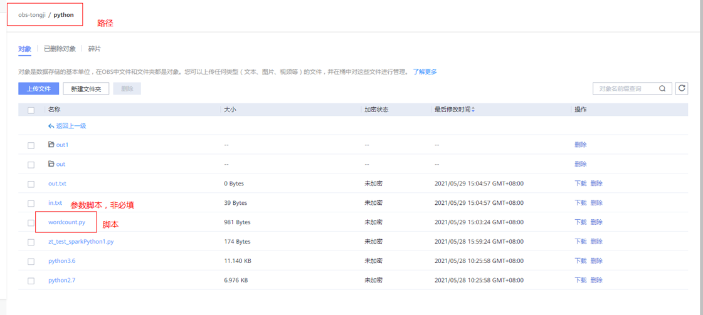
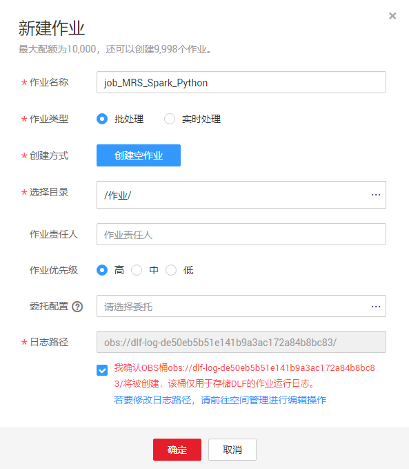
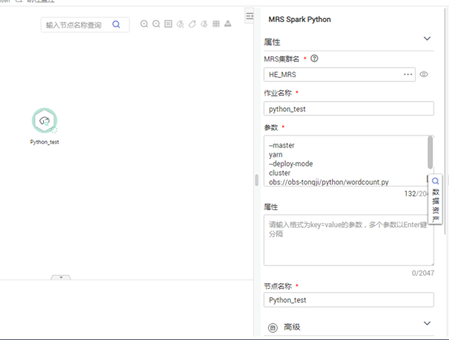
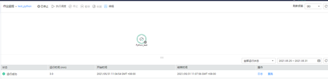
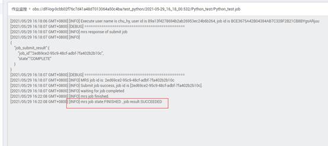
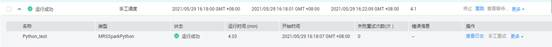
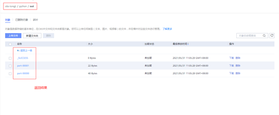
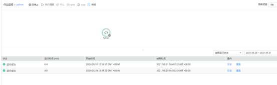
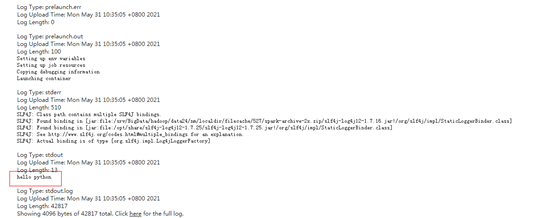

# 开发一个MRS Spark Python作业<a name="dgc_01_0525"></a>

本章节介绍如何在数据开发模块上进行MRS Spark Python作业开发。

## 案例一：<a name="section1015762201619"></a>

通过MRS Spark Python作业实现统计单词的个数。

**前提条件：**

具有OBS相关路径的访问权限。

**数据准备：**

-   准备脚本文件"wordcount.py"，具体内容如下：

    ```
    # -*- coding: utf-8 -*
    import sys
    from pyspark import SparkConf, SparkContext
    def show(x):
        print(x)
    if __name__ == "__main__":
        if len(sys.argv) < 2:
            print ("Usage: wordcount <inputPath> <outputPath>")
            exit(-1)
        #创建SparkConf
        conf = SparkConf().setAppName("wordcount")
        #创建SparkContext  注意参数要传递conf=conf
        sc = SparkContext(conf=conf)
        inputPath = sys.argv[1]
        outputPath = sys.argv[2]
        lines = sc.textFile(name = inputPath)
        #每一行数据按照空格拆分  得到一个个单词
        words = lines.flatMap(lambda line:line.split(" "),True)
        #将每个单词 组装成一个tuple 计数1
        pairWords = words.map(lambda word:(word,1),True)
        #使用3个分区 reduceByKey进行汇总 
        result = pairWords.reduceByKey(lambda v1,v2:v1+v2)
        #打印结果
        result.foreach(lambda t :show(t))
        #将结果保存到文件
        result.saveAsTextFile(outputPath)
        #停止SparkContext
        sc.stop()
    ```

    > **说明：** 
    >值得注意的是：需要将编码格式设置为“UTF-8”，否则后续脚本运行时会报错。

-   准备数据文件“in.txt”,内容为一段英文单词。

**操作步骤**：

1.  将脚本和数据文件传入OBS桶中，如下图。

    

    > **说明：** 
    >本例中，**wordcount.py**和**in.txt**文件上传路径为：obs://obs-tongji/python/

2.  创建一个数据开发模块空作业，作业名称为“job\_MRS\_Spark\_Python”。

    

3.  进入到作业开发页面，拖动“MRS Spark Python”节点到画布中并单击，配置节点的属性。

    

    参数设置说明：

    ```
    --master
    yarn
    --deploy-mode
    cluster
    obs://obs-tongji/python/wordcount.py
    obs://obs-tongji/python/in.txt
    obs://obs-tongji/python/out
    ```

    其中：

    obs://obs-tongji/python/wordcount.py为脚本存放路径；

    obs://obs-tongji/python/in.txt为wordcount.py的传入参数路径，可以把需要统计的单词写到里面；

    obs://obs-tongji/python/out为输出参数文件夹的路径，并且会在OBS桶中自动创建该目录（如已存在out目录，会报错）。

4.  单击“测试运行”，执行该脚本作业。
5.  待测试完成，执行保存并提交版本。
6.  在“作业监控”界面，查看作业执行结果。

    

    作业日志中显示已运行成功

    

    

7.  查看OBS桶中返回的记录。（没设置返回可跳过）

    


## 案例二<a name="section11329152875915"></a>

通过MRS Spark Python作业实现打印输出"hello python"

**前提条件：**

具有OBS相关路径的访问权限。

**数据准备：**

准备脚本文件"zt\_test\_sparkPython1.py"，具体内容如下：

```
from pyspark import SparkContext, SparkConf
conf = SparkConf().setAppName("master"). setMaster("yarn")
sc = SparkContext(conf=conf)
print("hello python")
sc.stop()
```

**操作步骤：**

1.  将脚本文件传入OBS桶中。
2.  创建一个数据开发模块空作业。
3.  进入到作业开发页面，拖动“MRS Spark Python”节点到画布中并单击，配置节点的属性。

    参数设置说明：

    ```
    --master
    yarn
    --deploy-mode
    cluster
    obs://obs-tongji/python/zt_test_sparkPython1.py
    ```

    其中：zt\_test\_sparkPython1.py 为脚本所在路径

4.  单击“测试运行”，执行该脚本作业。
5.  待测试完成，执行保存并提交版本。
6.  在“作业监控”界面，查看作业执行结果。

    

7.  日志验证。

    运行成功后，登录MRS manager后在YARN上查看日志，发现有**hello python**的输出。

    


