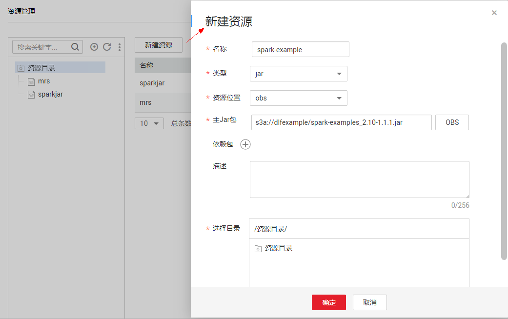
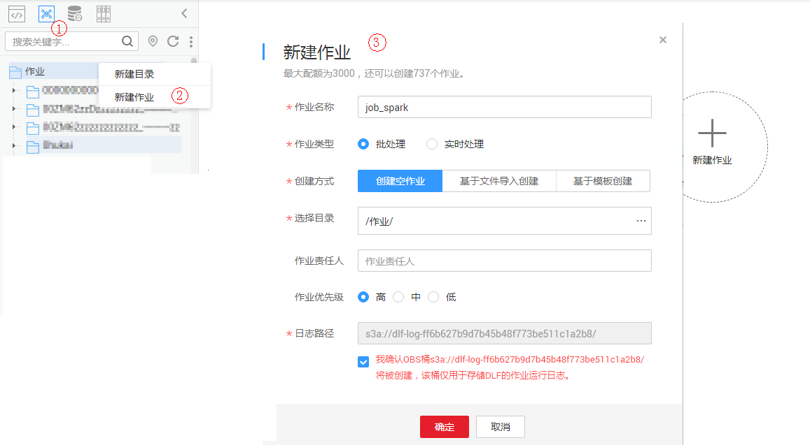
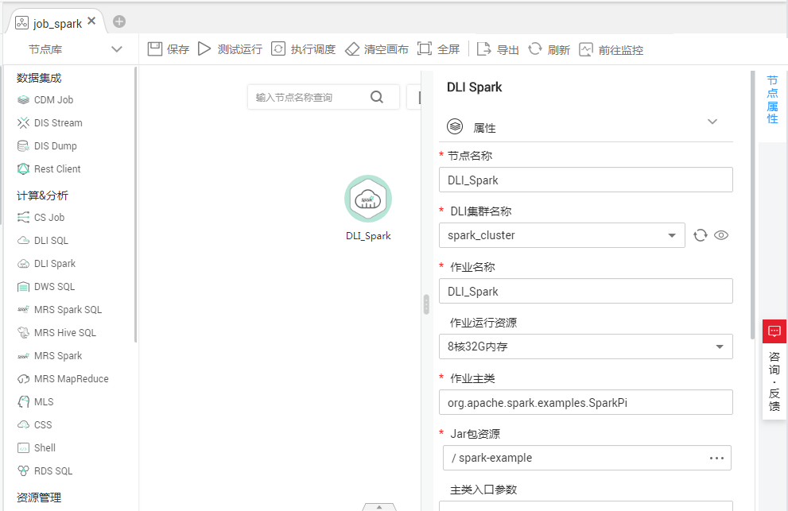
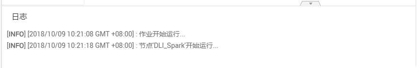

# 开发一个Spark作业

在本章节用户可以学习到数据开发模块资源管理、作业编辑等功能。

## 场景说明

用户在使用DLI服务时，大部分时间会使用SQL对数据进行分析处理，有时候处理的逻辑特别复杂，无法通过SQL处理，那么可以通过Spark作业进行分析处理。本章节通过一个例子演示如何在数据开发模块中提交一个Spark作业。

操作流程如下：

1.  创建DLI集群，通过DLI集群的物理资源来运行Spark作业。
2.  获取Spark作业的演示JAR包，并在数据开发模块中关联到此JAR包。
3.  创建数据开发模块作业，通过DLI Spark节点提交Spark作业。

## 环境准备

-   已开通对象存储服务OBS，并创建桶，例如“s3a://dlfexample“，用于存放Spark作业的JAR包。
-   已开通数据湖探索服务DLI，并创建Spark集群“spark\_cluster“，为Spark作业提供运行所需的物理资源。

## 获取Spark作业代码

本示例使用的Spark作业代码来自maven库（下载地址：[https://repo.maven.apache.org/maven2/org/apache/spark/spark-examples\_2.10/1.1.1/spark-examples\_2.10-1.1.1.jar](https://repo.maven.apache.org/maven2/org/apache/spark/spark-examples_2.10/1.1.1/spark-examples_2.10-1.1.1.jar)），此Spark作业是计算π的近似值。

1.  获取Spark作业代码JAR包后，将JAR包上传到OBS桶中，存储路径为“obs://dlfexample/spark-examples\_2.10-1.1.1.jar“。
2.  登录DGC控制台。选择对应工作空间的“数据开发“模块，进入数据开发页面。

    **图 1**  选择数据开发  
    

3.  在数据开发主界面的左侧导航栏，选择“配置管理  \>  资源管理“。在数据开发模块中创建一个资源关联到[1](#zh-cn_topic_0127305014_li202617185718)的JAR包，资源名称为“spark-example“。

    **图 2**  创建资源  
    

## 提交Spark作业

用户需要在数据开发模块中创建一个作业，通过作业的DLI Spark节点提交Spark作业。

1.  创建一个数据开发模块空作业，作业名称为“job\_spark“。

    **图 3**  创建作业  
    

2.  然后进入作业开发页面，拖动DLI Spark节点到画布并单击，配置节点的属性。

    **图 4**  配置节点属性  
    

    关键属性说明：

    -   DLI集群名称：[•已开通数据湖探索服务DLI，并创建Spark集...](#zh-cn_topic_0127305014_li12147104114565)中创建的Spark集群。
    -   作业运行资源：DLI Spark节点运行时，限制最大可以使用的CPU、内存资源。
    -   作业主类：DLI Spark节点的main class，本例的main class是“org.apache.spark.examples.SparkPi“。
    -   Jar包资源：[3](#zh-cn_topic_0127305014_li95886261478)中创建的资源。

3.  作业编排完成后，单击，测试运行作业。

    **图 5**  作业日志（仅参考）  
    

4.  如果日志运行正常，保存作业并提交版本。

