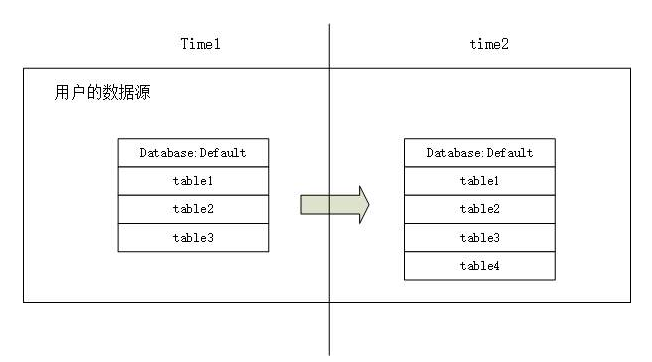
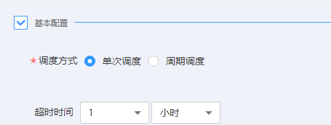
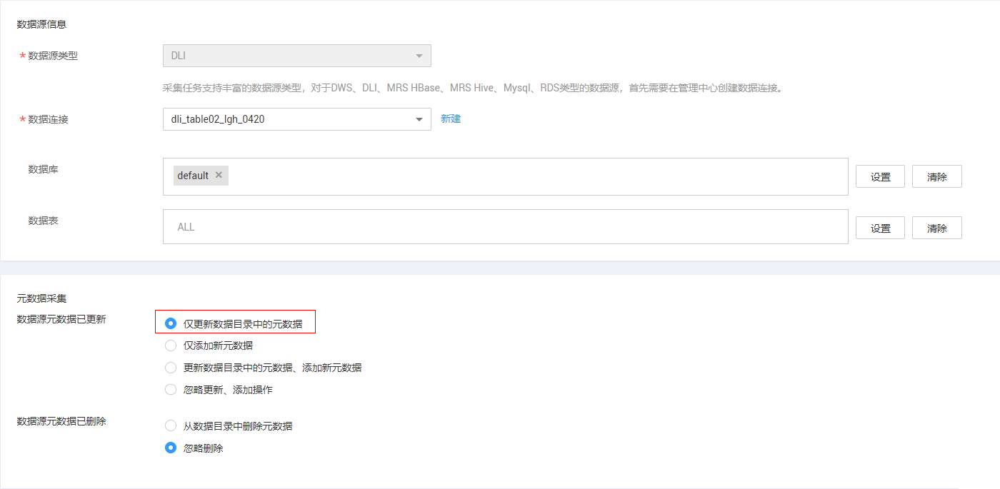
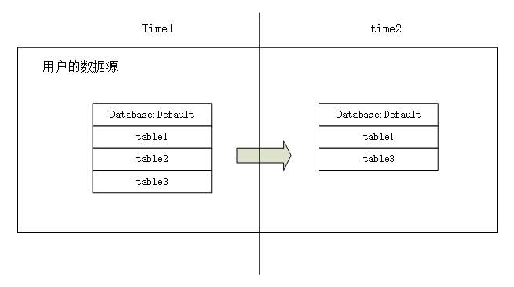
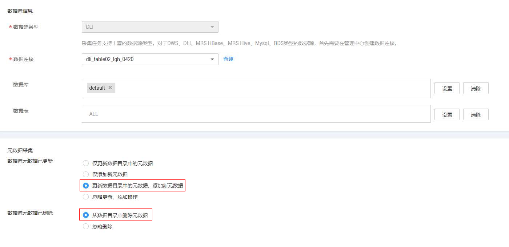

# 开发一个增量元数据采集任务

配置、运行采集任务是构建数据资产的前提，下面举例说明如何通过配置采集任务达到灵活采集元数据的目的。

## 场景一：仅添加新元数据

用户的数据库中新增的数据表，采集任务仅采集新增的表。

按照下面的配置，采集任务仅会采集table4。（前提：table1-table3已经在数据资产中）

1.  进入DGC控制台首页的数据资产模块。
2.  单击左侧导航的“任务管理”。
3.  单击“新建”。
4.  配置任务信息，如下图所示。

    

5.  单击“下一步”，配置调度属性如下图所示。

    

6.  单击“提交”，完成采集任务的创建。
7.  单击任务管理列表中的“运行”或“启动调度”，跳转到任务监控页面。
8.  单击操作列的“更多”\>“扫描结果”，可查看任务采集的详细情况。

## 场景二：更新数据目录中的元数据，添加新元数据

用户的数据库中新增了数据表，采集任务采集数据源中指定的所有表。

按照如下配置，采集任务会采集default下所有的表（table1-table4）。

1.  进入DGC控制台首页的数据资产模块。
2.  单击左侧导航的“任务管理”。
3.  单击“新建”。
4.  配置任务信息，如下图所示。

    

5.  单击“下一步”，配置调度属性如下图所示。

    

6.  单击“提交”，完成采集任务的创建。
7.  单击任务管理列表中的“运行”或“启动调度”，跳转到任务监控页面。
8.  单击操作列的“更多”\>“扫描结果”，可查看任务采集的详细情况。

## 场景三：仅更新数据目录中的元数据

用户的数据库中数据表有新增的情况，采集任务仅采集数据资产中已经存在的表。

按照如下配置，采集任务仅采集table1/table2/table3。

1.  进入DGC控制台首页的数据资产模块。
2.  单击左侧导航的“任务管理”。
3.  单击“新建”。
4.  配置任务信息，如下图所示。

    

5.  单击“下一步”，配置调度属性如下图所示。

    

6.  单击“提交”，完成采集任务的创建。
7.  单击任务管理列表中的“运行”或“启动调度”，跳转到任务监控页面。
8.  单击操作列的“更多”\>“扫描结果”，可查看任务采集的详细情况。

## 场景四：更新数据目录中的元数据，添加新元数据 ，并从数据目录中删除元数据

用户的数据库中数据表有删除的情况，采集任务能够删除数据资产中对应的数据表。

按照如下配置，采集任务会删除数据资产中的table2。

1.  进入DGC控制台首页的数据资产模块。
2.  单击左侧导航的“任务管理”。
3.  单击“新建”。
4.  配置任务信息，如下图所示。

    

5.  单击“下一步”，配置调度属性如下图所示。

    

6.  单击“提交”，完成采集任务的创建。
7.  单击任务管理列表中的“运行”或“启动调度”，跳转到任务监控页面。
8.  单击操作列的“更多”\>“扫描结果”，可查看任务采集的详细情况。

