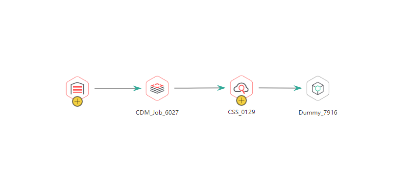
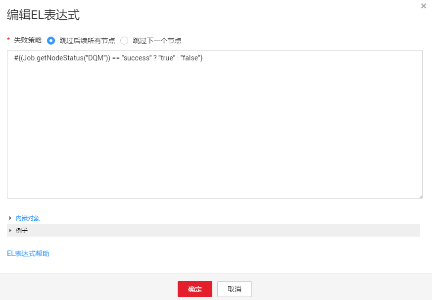

# 开发作业

对已新建的作业进行编排和配置。

## 前提条件

已[新建作业](新建作业.md)。

## 编排作业节点

1.  登录DGC控制台。选择对应工作空间的“数据开发“模块，进入数据开发页面。

    **图 1**  选择数据开发  
    

2.  在数据开发主界面的左侧导航栏，选择“数据开发  \>  作业开发“。
3.  在作业目录中，双击作业名称，进入作业开发页面。
4.  拖动所需的节点至画布，鼠标移动到节点图标上，选中连线图标并拖动，连接到下一个节点上。

    > **说明：** 
    >每个作业最多可以包含200个节点。

    **图 2**  编排作业  
    

5.  配置节点功能。右键单击画布中的节点图标，根据实际需要选择如[表1](#zh-cn_topic_0099797007_table13918279378)所示的功能。

    **表 1**  右键节点功能

    
    <table><thead align="left"><tr id="zh-cn_topic_0099797007_row94121276371"><th class="cellrowborder" valign="top" width="17.11%" id="mcps1.2.3.1.1">
功能

    </th>
    <th class="cellrowborder" valign="top" width="82.89%" id="mcps1.2.3.1.2">
说明

    </th>
    </tr>
    </thead>
    <tbody><tr id="zh-cn_topic_0099797007_row164333273374"><td class="cellrowborder" valign="top" width="17.11%" headers="mcps1.2.3.1.1 ">
配置

    </td>
    <td class="cellrowborder" valign="top" width="82.89%" headers="mcps1.2.3.1.2 ">
进入该节点的“节点属性”页面。

    </td>
    </tr>
    <tr id="zh-cn_topic_0099797007_row144581727133713"><td class="cellrowborder" valign="top" width="17.11%" headers="mcps1.2.3.1.1 ">
删除

    </td>
    <td class="cellrowborder" valign="top" width="82.89%" headers="mcps1.2.3.1.2 ">
支持删除一个节点或同时删除多个节点。

    <ul id="zh-cn_topic_0099797007_ul426395635211"><li>单节点删除：右键单击画布中的节点图标，选择删除或按快捷键<strong id="zh-cn_topic_0099797007_b174864817359">Delete</strong>。</li><li>多节点删除：按下键盘中的<strong id="zh-cn_topic_0099797007_b3500121293514">Ctrl</strong>，单击画布中需要删除的节点图标，在当前作业画布空白处单击右键，选择删除或按快捷键<strong id="zh-cn_topic_0099797007_b4954181713513">Delete</strong>。</li></ul>
    </td>
    </tr>
    <tr id="zh-cn_topic_0099797007_row24771227163713"><td class="cellrowborder" valign="top" width="17.11%" headers="mcps1.2.3.1.1 ">
复制

    </td>
    <td class="cellrowborder" valign="top" width="82.89%" headers="mcps1.2.3.1.2 ">
支持复制一个或多个节点至任意作业中：

    <ul id="zh-cn_topic_0099797007_ul1063871653916"><li>单节点复制：右键单击画布中的节点图标，选择复制或按快捷键<strong id="zh-cn_topic_0099797007_b768042223518">Ctrl+C</strong>，在作业画布空白处粘贴节点或按快捷键<strong id="zh-cn_topic_0099797007_b1159120203614">Ctrl+V</strong>，复制后的节点携带原节点的配置信息。</li><li>多节点复制：按下键盘中的<strong id="zh-cn_topic_0099797007_b119341411163710">Ctrl</strong>，单击画布中需要复制的节点图标，在当前作业画布空白处单击右键选择复制或按快捷键<strong id="zh-cn_topic_0099797007_b19352171218369">Ctrl+C</strong>，在目标作业画布空白处粘贴或按快捷键<strong id="zh-cn_topic_0099797007_b5612817133616">Ctrl+V</strong>。复制后的节点携带原节点的配置信息，但不包含节点间的连接关系。</li></ul>
    </td>
    </tr>
    <tr id="zh-cn_topic_0099797007_row12496327163718"><td class="cellrowborder" valign="top" width="17.11%" headers="mcps1.2.3.1.1 ">
测试运行

    </td>
    <td class="cellrowborder" valign="top" width="82.89%" headers="mcps1.2.3.1.2 ">
测试运行该节点。

    </td>
    </tr>
    <tr id="row962734162815"><td class="cellrowborder" valign="top" width="17.11%" headers="mcps1.2.3.1.1 ">
添加/删除连线

    </td>
    <td class="cellrowborder" valign="top" width="82.89%" headers="mcps1.2.3.1.2 ">
可以选择为两个不同的节点添加或删除连线，

    </td>
    </tr>
    <tr id="zh-cn_topic_0099797007_row186271027173713"><td class="cellrowborder" valign="top" width="17.11%" headers="mcps1.2.3.1.1 ">
编辑CDM作业

    </td>
    <td class="cellrowborder" valign="top" width="82.89%" headers="mcps1.2.3.1.2 ">
仅CDM Job节点显示该选项。选择CDM集群和作业后，可以跳转到CDM作业编辑页面，进行作业修改。

    </td>
    </tr>
    <tr id="zh-cn_topic_0099797007_row965792743711"><td class="cellrowborder" valign="top" width="17.11%" headers="mcps1.2.3.1.1 ">
编辑脚本

    </td>
    <td class="cellrowborder" valign="top" width="82.89%" headers="mcps1.2.3.1.2 ">
仅关联了脚本的节点显示该选项。跳转到脚本编辑页面，对关联的脚本进行编辑。

    </td>
    </tr>
    <tr id="row15842482920"><td class="cellrowborder" valign="top" width="17.11%" headers="mcps1.2.3.1.1 ">
添加便签

    </td>
    <td class="cellrowborder" valign="top" width="82.89%" headers="mcps1.2.3.1.2 ">
为该节点添加便签，每个节点可以有多个便签。

    </td>
    </tr>
    </tbody>
    </table>

6.  （可选）配置连线功能。右键单击画布中的节点间连线，显示“删除”和“设置条件”功能，您可以根据实际需要进行选择。
    -   删除：可以删除节点间的连线。
    -   设置条件：在弹出的窗口中，您可以通过EL表达式语法填写三元表达式。当三元表达式结果为true的时候，才会执行连线后面的节点，否则后续节点将被跳过。

        如下图所示，是一个典型的三元表达式。当“DQM”节点的运行结果为true时，才会执行连线后的节点。当运行结果为false时，如果失败策略为“跳过所有节点”，则该连线后面的节点A以及A后的所有节点均会被跳过。

        

        关于EL表达式的语法，您可以查看[EL表达式参考](表达式概述.md)。

7.  请参见[节点概述](节点概述.md)配置具体节点的属性。
8.  配置节点属性。单击画布中的节点，在右侧显示“节点属性“页签，默认展开此配置页面，请参见[节点概述](节点概述.md)配置具体节点的属性。

## 配置作业基本信息

为作业配置责任人、优先级信息后，用户可根据责任人、优先级来检索相应的作业。操作方法如下：

单击画布右侧“作业基本信息“页签，展开配置页面，配置如[表2](#zh-cn_topic_0099797007_table723651785)所示的参数。

**表 2**  作业基本信息

<table><thead align="left"><tr id="zh-cn_topic_0099797007_row53625586"><th class="cellrowborder" valign="top" width="16.3%" id="mcps1.2.3.1.1">
参数

</th>
<th class="cellrowborder" valign="top" width="83.7%" id="mcps1.2.3.1.2">
说明

</th>
</tr>
</thead>
<tbody><tr id="zh-cn_topic_0099797007_row124865681"><td class="cellrowborder" valign="top" width="16.3%" headers="mcps1.2.3.1.1 ">
作业责任人

</td>
<td class="cellrowborder" valign="top" width="83.7%" headers="mcps1.2.3.1.2 ">
自动匹配创建作业时配置的作业责任人，此处支持修改。

</td>
</tr>
<tr id="zh-cn_topic_0099797007_row53761191048"><td class="cellrowborder" valign="top" width="16.3%" headers="mcps1.2.3.1.1 ">
执行用户

</td>
<td class="cellrowborder" valign="top" width="83.7%" headers="mcps1.2.3.1.2 ">
执行作业的用户。如果输入了执行用户，则作业以执行用户身份执行；如果没有输入执行用户，则以提交作业启动的用户身份执行。

</td>
</tr>
<tr id="row1241410054511"><td class="cellrowborder" valign="top" width="16.3%" headers="mcps1.2.3.1.1 ">
作业委托

</td>
<td class="cellrowborder" valign="top" width="83.7%" headers="mcps1.2.3.1.2 ">
配置委托后，作业执行过程中，以委托的身份与其他服务交互。

</td>
</tr>
<tr id="zh-cn_topic_0099797007_row1657451284"><td class="cellrowborder" valign="top" width="16.3%" headers="mcps1.2.3.1.1 ">
作业优先级

</td>
<td class="cellrowborder" valign="top" width="83.7%" headers="mcps1.2.3.1.2 ">
自动匹配创建作业时配置的作业优先级，此处支持修改。

</td>
</tr>
<tr id="zh-cn_topic_0099797007_row3112384478"><td class="cellrowborder" valign="top" width="16.3%" headers="mcps1.2.3.1.1 ">
实例超时时间

</td>
<td class="cellrowborder" valign="top" width="83.7%" headers="mcps1.2.3.1.2 ">
配置作业实例的超时时间，设置为0或不配置时，该配置项不生效。如果您为作业设置了异常通知，当作业实例执行时间超过超时时间，将触发异常通知，发送消息给用户。

</td>
</tr>
<tr id="zh-cn_topic_0099797007_row2671951686"><td class="cellrowborder" valign="top" width="16.3%" headers="mcps1.2.3.1.1 ">
自定义字段

</td>
<td class="cellrowborder" valign="top" width="83.7%" headers="mcps1.2.3.1.2 ">
配置自定义字段的参数名称和参数值。

</td>
</tr>
<tr id="row187556312426"><td class="cellrowborder" valign="top" width="16.3%" headers="mcps1.2.3.1.1 ">
作业标签

</td>
<td class="cellrowborder" valign="top" width="83.7%" headers="mcps1.2.3.1.2 ">
配置作业的标签，用以分类管理作业。

单击“新增”，可给作业重新添加一个标签。也可选择<a href="管理作业标签.md">管理作业标签</a>中已配置的标签。

</td>
</tr>
</tbody>
</table>

## 配置作业参数

作业参数为全局参数，可用于作业中的任意节点。操作方法如下：

单击画布的空白处，在右侧显示“作业参数配置“页签，单击此页签，展开配置页面，配置如[表3](#zh-cn_topic_0099797007_table20701161192718)所示的参数。

**表 3**  作业参数配置

<table><thead align="left"><tr id="zh-cn_topic_0099797007_row4717717274"><th class="cellrowborder" valign="top" width="16.76%" id="mcps1.2.3.1.1">
功能

</th>
<th class="cellrowborder" valign="top" width="83.24000000000001%" id="mcps1.2.3.1.2">
说明

</th>
</tr>
</thead>
<tbody><tr id="zh-cn_topic_0099797007_row1296517379302"><td class="cellrowborder" colspan="2" valign="top" headers="mcps1.2.3.1.1 mcps1.2.3.1.2 ">
<strong id="zh-cn_topic_0099797007_b1478874763017">参数</strong>

</td>
</tr>
<tr id="zh-cn_topic_0099797007_row17309182714"><td class="cellrowborder" valign="top" width="16.76%" headers="mcps1.2.3.1.1 ">
新增

</td>
<td class="cellrowborder" valign="top" width="83.24000000000001%" headers="mcps1.2.3.1.2 ">
单击“新增”，在文本框中填写作业参数的名称和参数值。

<ul id="zh-cn_topic_0099797007_ul187409117279"><li>参数名称
名称只能包含字符：英文字母、数字、中划线和下划线。

</li><li>参数值<ul id="zh-cn_topic_0099797007_ul157660122715"><li>字符串类的参数直接填写字符串，例如：str1</li><li>数值类的参数直接填写数值或运算表达式。</li></ul>
</li></ul>

参数配置完成后，在作业中的引用格式为：${参数名称}

</td>
</tr>
<tr id="zh-cn_topic_0099797007_row158016117275"><td class="cellrowborder" valign="top" width="16.76%" headers="mcps1.2.3.1.1 ">
修改

</td>
<td class="cellrowborder" valign="top" width="83.24000000000001%" headers="mcps1.2.3.1.2 ">
在参数名和参数值的文本框中直接修改，修改完成后，请保存。

</td>
</tr>
<tr id="zh-cn_topic_0099797007_row2081310112712"><td class="cellrowborder" valign="top" width="16.76%" headers="mcps1.2.3.1.1 ">
保存

</td>
<td class="cellrowborder" valign="top" width="83.24000000000001%" headers="mcps1.2.3.1.2 ">
单击“保存”，保存作业参数的配置。

</td>
</tr>
<tr id="zh-cn_topic_0099797007_row5824415277"><td class="cellrowborder" valign="top" width="16.76%" headers="mcps1.2.3.1.1 ">
删除

</td>
<td class="cellrowborder" valign="top" width="83.24000000000001%" headers="mcps1.2.3.1.2 ">
在参数值文本框后方，单击，删除作业参数。

</td>
</tr>
<tr id="zh-cn_topic_0099797007_row12548195220309"><td class="cellrowborder" colspan="2" valign="top" headers="mcps1.2.3.1.1 mcps1.2.3.1.2 ">
<strong id="zh-cn_topic_0099797007_b1623716813116">常量</strong>

</td>
</tr>
<tr id="zh-cn_topic_0099797007_row16650721143114"><td class="cellrowborder" valign="top" width="16.76%" headers="mcps1.2.3.1.1 ">
新增

</td>
<td class="cellrowborder" valign="top" width="83.24000000000001%" headers="mcps1.2.3.1.2 ">
单击“新增”，在文本框中填写作业常量的名称和参数值。

<ul id="zh-cn_topic_0099797007_ul16587642103115"><li>参数名称
名称只能包含字符：英文字母、数字、中划线和下划线。

</li><li>参数值<ul id="zh-cn_topic_0099797007_zh-cn_topic_0099797007_ul157660122715"><li>字符串类的参数直接填写字符串，例如：str1</li><li>数值类的参数直接填写数值或运算表达式。</li></ul>
</li></ul>

参数配置完成后，在作业中的引用格式为：${参数名称}

</td>
</tr>
<tr id="zh-cn_topic_0099797007_row11706164053115"><td class="cellrowborder" valign="top" width="16.76%" headers="mcps1.2.3.1.1 ">
修改

</td>
<td class="cellrowborder" valign="top" width="83.24000000000001%" headers="mcps1.2.3.1.2 ">
在参数名和参数值的文本框中直接修改，修改完成后，请保存。

</td>
</tr>
<tr id="zh-cn_topic_0099797007_row4139163853118"><td class="cellrowborder" valign="top" width="16.76%" headers="mcps1.2.3.1.1 ">
保存

</td>
<td class="cellrowborder" valign="top" width="83.24000000000001%" headers="mcps1.2.3.1.2 ">
单击“保存”，保存作业常量的配置。

</td>
</tr>
<tr id="zh-cn_topic_0099797007_row14421933193118"><td class="cellrowborder" valign="top" width="16.76%" headers="mcps1.2.3.1.1 ">
删除

</td>
<td class="cellrowborder" valign="top" width="83.24000000000001%" headers="mcps1.2.3.1.2 ">
在参数值文本框后方，单击，删除作业常量。

</td>
</tr>
</tbody>
</table>

## 调测并保存作业

作业编排和配置完成后，请执行以下操作：

**批处理作业**

1.  单击画布上方的测试运行按钮，测试作业。
2.  测试完成后，单击画布上方的保存按钮，保存作业的配置信息。如果测试未通过请按照提示修改后再次运行。

**实时处理作业**

1.  单击画布上方的保存按钮，保存作业的配置信息。

