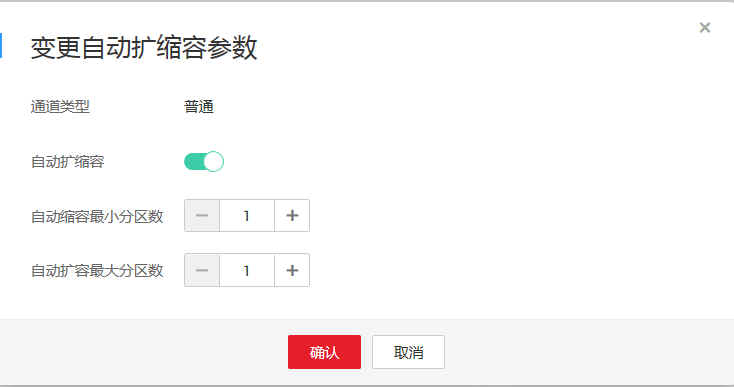

# 弹性伸缩分区

用户在创建通道成功后，随着业务的发展和变化，对通道容量有了新的需求。弹性伸缩分区可以对已经创建成功的通道进行分区扩容或者分区缩容以满足用户这一需求，支持自动和手动扩缩容两种方式。

## 功能介绍

**弹性伸缩规则**

-   扩容分区时“目标分区数量“需大于当前分区数量，且小于等于租户剩余配额与当前分区数量的总和。
-   扩容分区时，首先将状态为“DELETED“的分区恢复为“ACTIVE“状态，成为可读写分区。其次将状态为“EXPIRED“的分区恢复为“ACTIVE“状态，成为可读写分区。若前两者恢复后仍不满足扩容需求，系统将新建分区。
-   缩容分区时“目标分区数量“需要大于等于“1“，且小于当前分区数量。
-   对已有分区进行缩容操作后，缩容成功的分区不再进行计费也不参与配额控制。在[按需计费方式购买实时数据接入的增量包](实时数据接入快速入门.md#section135623119496)  中配置的“生命周期“时间内，缩容成功的分区可以读取数据不可写入数据，超过此时间则不可读取/写入数据。
-   每个通道在一小时内仅可操作实现10次自动扩容、10次手动扩容、1次缩容（包含手动缩容和自动缩容）操作。
-   自动扩缩容间隔时间大于1分钟，且发生扩容（含自动扩容和手工扩容）后2分钟内，不触发自动缩容。发生缩容（包含手动缩容和自动缩容）后的2分钟内，不触发自动扩容。

**注意事项**

-   上传数据时，可根据需要设置数据的PartitionKey，以便DIS根据通道分区的数量将数据自动散列到多个分片中。
-   下载数据时，需要定期的使用descriptStream接口检测通道分区数量的变化，以便DIS可以下载到所有分区的数据。

## 执行手动扩缩容操作

选择如下任意一种方法进行手动扩缩容。

-   方法一
    1.  在“通道管理“页面中单击需要扩缩容的通道名称。
    2.  在通道详情页面的右上角单击“扩缩容“按钮，弹出“变更分区数目“对话框。
    3.  修改“目标分区数“，单击“确认“。

-   方法二
    1.  针对待扩缩容的通道，选中“操作”列中的“更多”下拉列表中的“扩缩容”。
    2.  弹出“变更分区数目“对话框。
    3.  修改“目标分区数“，单击“确认“。

## 执行自动扩缩容操作

1.  在“通道管理“页面中单击需要扩缩容的通道名称。
2.  单击通道详情页面的“自动扩缩容“菜单后的编辑。
3.  系统弹出“变更自动扩缩容参数“对话框，将自动扩缩容的开关开启。

    **图 1**  变更自动扩缩容参数  
    

4.  设置自动扩缩容的分区上限和下限，单击“确认“。

