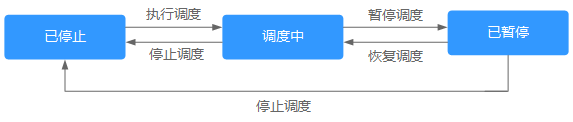
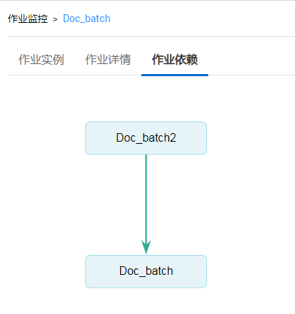
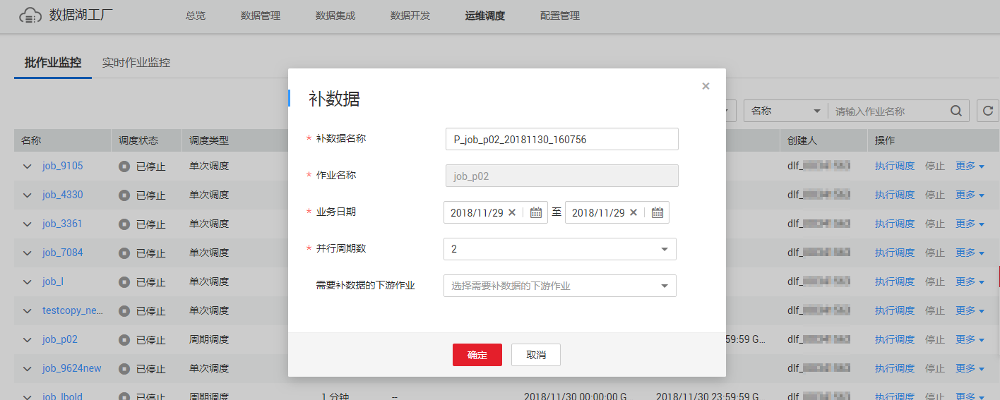
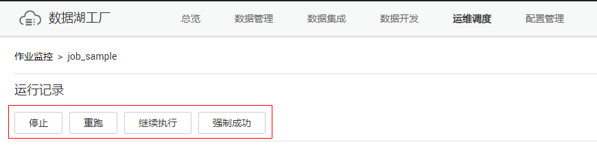

# 批作业监控

## 批处理：调度作业

作业开发完成后，用户可以在“作业监控“页面中管理作业的调度任务，例如：执行调度、暂停调度、恢复调度、停止调度。

**图 1**  调度作业  

1.  在数据开发主界面的左侧导航栏，选择“运维调度  \>  作业监控“。
2.  单击“批作业监控“页签，进入批作业的监控页面。
3.  在作业的“操作“列，单击“执行调度“/“暂停调度“/“恢复调度“/“停止“。

## 批处理：调度依赖作业

当批处理作业在“调度配置“页签中配置有依赖作业，而依赖作业没有执行调度，您可以在“作业监控“页面对该批处理作业执行调度时设置是否启动依赖的作业。如何配置依赖作业，请参见[配置作业调度任务](开发作业.md#zh-cn_topic_0099797007_section1590152794714)。

1.  在数据开发主界面的左侧导航栏，选择“运维调度  \>  作业监控“。
2.  单击“批作业监控“页签，选择配置好有依赖作业的作业。
3.  在作业的“操作“列，单击“执行调度“。

    当依赖的作业没有执行调度，您在执行调度该作业时可以设置为只启动当前作业或同时启动依赖的作业。

    **图 2**  启动作业  
    

## 批处理：通知设置

用户可以通过该功能配置某一个作业的通知任务，当作业运行异常或成功时向相关人员发送通知。同时，用户也可以在“运维调度“中配置通知任务，请参见[管理通知](管理通知.md)。

1.  在数据开发主界面的左侧导航栏，选择“运维调度  \>  作业监控“。
2.  单击“批作业监控“页签，进入批作业的监控页面。
3.  在作业的“操作“列，选择“更多  \>  通知设置“，弹出“新建通知“页面，参考[表1](管理通知.md#zh-cn_topic_0114591806_table63861718143217)配置通知参数。
4.  单击“确定“，为作业配置通知任务。

## 批处理：实例监控

用户可以通过该功能查看某一个作业所有实例的运行记录。

1.  在数据开发主界面的左侧导航栏，选择“运维调度  \>  作业监控“。
2.  单击“批作业监控“页签，进入批作业的监控页面。
3.  在作业的“操作“列，选择“更多  \>  实例监控“，查看该作业所有实例的运行记录。
    -   实例的“操作“列，请参见[表2](#zh-cn_topic_0159100548_table958254318576)。
    -   节点的“操作“列，请参见[表3](#zh-cn_topic_0159100548_table181913016117)。

## 批处理：调度配置

快速跳转至作业开发页面的“调度配置“。

1.  在数据开发主界面的左侧导航栏，选择“运维调度  \>  作业监控“。
2.  单击“批作业监控“页签，进入批作业的监控页面。
3.  在作业的“操作“列，选择“更多  \>  调度配置“。

## 批处理：作业依赖关系视图

支持查看作业与其他作业的依赖关系。

1.  在数据开发主界面的左侧导航栏，选择“运维调度  \>  作业监控“。
2.  单击“批作业监控“页签，进入批作业的监控页面。
3.  单击作业名称，选择“作业依赖“页签。查看作业间的依赖关系。

    **图 3**  作业依赖视图  
    

    单击视图中的作业，将进入该作业的开发页面。

## 批处理：补数据

补数据是指作业执行一个调度任务，在过去某一段时间里生成一系列的实例。用户可以通过补数据，修正历史中出现数据错误的作业实例，或者构建更多的作业记录以便调试程序等。

只有配置了周期调度的作业，才支持使用该功能。如需查看补数据的执行情况，请参见[补数据监控](补数据监控.md)。

> **说明：**   
>当作业正在补数据时，请勿修改作业配置，否则会影响补数据过程中生成的作业实例。  

1.  在数据开发主界面的左侧导航栏，选择“运维调度  \>  作业监控“。
2.  单击“批作业监控“页签，进入批作业的监控页面。
3.  在作业的“操作“列，选择“更多  \>  补数据“。
4.  弹出“补数据“对话框，配置如所示[表1](#zh-cn_topic_0159100548_table15019455411)的参数。

    **图 4**  补数据参数  
    

    **表 1**  参数说明

    
    <table><thead align="left"><tr id="zh-cn_topic_0159100548_row9507465414"><th class="cellrowborder" valign="top" width="35.17%" id="mcps1.2.3.1.1">
参数

    </th>
    <th class="cellrowborder" valign="top" width="64.83%" id="mcps1.2.3.1.2">
说明

    </th>
    </tr>
    </thead>
    <tbody><tr id="zh-cn_topic_0159100548_row1350845549"><td class="cellrowborder" valign="top" width="35.17%" headers="mcps1.2.3.1.1 ">
补数据名称

    </td>
    <td class="cellrowborder" valign="top" width="64.83%" headers="mcps1.2.3.1.2 ">
系统自动生成一个补数据的任务名称，允许修改。

    </td>
    </tr>
    <tr id="zh-cn_topic_0159100548_row165015410541"><td class="cellrowborder" valign="top" width="35.17%" headers="mcps1.2.3.1.1 ">
作业名称

    </td>
    <td class="cellrowborder" valign="top" width="64.83%" headers="mcps1.2.3.1.2 ">
显示需要补数据的作业名称。

    </td>
    </tr>
    <tr id="zh-cn_topic_0159100548_row450174175418"><td class="cellrowborder" valign="top" width="35.17%" headers="mcps1.2.3.1.1 ">
业务日期

    </td>
    <td class="cellrowborder" valign="top" width="64.83%" headers="mcps1.2.3.1.2 ">
选择需要补数据的时间段。

    </td>
    </tr>
    <tr id="zh-cn_topic_0159100548_row6501415546"><td class="cellrowborder" valign="top" width="35.17%" headers="mcps1.2.3.1.1 ">
并行周期数

    </td>
    <td class="cellrowborder" valign="top" width="64.83%" headers="mcps1.2.3.1.2 ">
设置同时执行的实例数量，最多可同时执行5个实例。

    </td>
    </tr>
    <tr id="zh-cn_topic_0159100548_row4501543540"><td class="cellrowborder" valign="top" width="35.17%" headers="mcps1.2.3.1.1 ">
需要补数据的下游作业

    </td>
    <td class="cellrowborder" valign="top" width="64.83%" headers="mcps1.2.3.1.2 ">
选择需要补数据的下游作业（指依赖于当前作业的作业），支持多选。

    </td>
    </tr>
    </tbody>
    </table>

5.  单击“确定“，开始补数据，并进入“补数据监控“页面。

## 批处理：批量处理作业

DLF支持批量执行调度、停止作业、配置通知任务。

1.  在数据开发主界面的左侧导航栏，选择“运维调度  \>  作业监控“。
2.  单击“批作业监控“页签，进入批作业的监控页面。
3.  勾选作业名称前的复选框，单击“执行调度“/“停止“/“通知配置“，批量处理相应的作业。

## 批处理：查看运行中的实例

用户可以通过该功能查看某一个作业正在运行的5条实例信息。

1.  在数据开发主界面的左侧导航栏，选择“运维调度  \>  作业监控“。
2.  单击“批作业监控“页签，进入批作业的监控页面。
3.  单击作业名称前方的，显示“最近的实例“页面，查看该作业正在运行的5条实例信息。

## 批处理：查看所有实例

用户可以通过“运行记录“页面查看某一个作业的所有运行记录，以及根据实际需求对实例/节点进行更多操作。

1.  在数据开发主界面的左侧导航栏，选择“运维调度  \>  作业监控“。
2.  单击“批作业监控“页签，进入批作业的监控页面。
3.  单击作业名称，进入“运行记录“页面。

    支持批量停止、重跑、继续执行、强制成功多个实例，使用说明参见[表2](#zh-cn_topic_0159100548_table958254318576)。

    其中，批量重跑多个实例时，重跑的顺序如下：

    -   如果作业不依赖上一调度周期，多个实例并行重跑。
    -   如果作业自依赖，多个实例串行重跑，以上一调度周期中实例执行完成的先后顺序为准，先执行完成的先重跑。

    **图 5**  批量操作  
    

4.  在实例的“操作“列，提供如[表2](#zh-cn_topic_0159100548_table958254318576)所示的操作。

    **表 2**  操作（实例）

    
    <table><thead align="left"><tr id="zh-cn_topic_0159100548_row1558284313572"><th class="cellrowborder" valign="top" width="30%" id="mcps1.2.3.1.1">
操作项

    </th>
    <th class="cellrowborder" valign="top" width="70%" id="mcps1.2.3.1.2">
说明

    </th>
    </tr>
    </thead>
    <tbody><tr id="zh-cn_topic_0159100548_row35827433577"><td class="cellrowborder" valign="top" width="30%" headers="mcps1.2.3.1.1 ">
停止

    </td>
    <td class="cellrowborder" valign="top" width="70%" headers="mcps1.2.3.1.2 ">
停止运行状态为“待运行”、“运行中”或“运行异常”的实例。

    </td>
    </tr>
    <tr id="zh-cn_topic_0159100548_row10582843155716"><td class="cellrowborder" valign="top" width="30%" headers="mcps1.2.3.1.1 ">
重跑

    </td>
    <td class="cellrowborder" valign="top" width="70%" headers="mcps1.2.3.1.2 ">
重新运行状态为“成功”或“取消”的实例。

    </td>
    </tr>
    <tr id="zh-cn_topic_0159100548_row1845754013820"><td class="cellrowborder" valign="top" width="30%" headers="mcps1.2.3.1.1 ">
查看等待作业实例

    </td>
    <td class="cellrowborder" valign="top" width="70%" headers="mcps1.2.3.1.2 ">
实例的状态为“等待运行”时，支持查看等待的作业实例。

    </td>
    </tr>
    <tr id="zh-cn_topic_0159100548_row158214433574"><td class="cellrowborder" valign="top" width="30%" headers="mcps1.2.3.1.1 ">
继续执行

    </td>
    <td class="cellrowborder" valign="top" width="70%" headers="mcps1.2.3.1.2 ">
实例的状态为“运行异常”时，支持继续运行实例中的后续节点。

    
 说明： 

只有节点的“节点属性 &gt; 高级 &gt; 失败策略”设置为“挂起当前作业执行计划”时，才可以执行该操作。

    

    </td>
    </tr>
    <tr id="zh-cn_topic_0159100548_row15821434571"><td class="cellrowborder" valign="top" width="30%" headers="mcps1.2.3.1.1 ">
更多 &gt; 强制成功

    </td>
    <td class="cellrowborder" valign="top" width="70%" headers="mcps1.2.3.1.2 ">
强制将状态为“运行异常”、“取消”、“失败”的实例变更为“成功”状态。

    </td>
    </tr>
    <tr id="zh-cn_topic_0159100548_row9642818103917"><td class="cellrowborder" valign="top" width="30%" headers="mcps1.2.3.1.1 ">
更多 &gt; 查看

    </td>
    <td class="cellrowborder" valign="top" width="70%" headers="mcps1.2.3.1.2 ">
跳转至作业开发页面，查看作业信息。

    </td>
    </tr>
    </tbody>
    </table>

5.  单击实例前方的，显示该实例所有节点的运行记录。
6.  在节点的“操作“列，提供如[表3](#zh-cn_topic_0159100548_table181913016117)所示的操作。

    **表 3**  操作（节点）

    
    <table><thead align="left"><tr id="zh-cn_topic_0159100548_row241300116"><th class="cellrowborder" valign="top" width="32%" id="mcps1.2.3.1.1">
操作项

    </th>
    <th class="cellrowborder" valign="top" width="68%" id="mcps1.2.3.1.2">
说明

    </th>
    </tr>
    </thead>
    <tbody><tr id="zh-cn_topic_0159100548_row194120212"><td class="cellrowborder" valign="top" width="32%" headers="mcps1.2.3.1.1 ">
查看日志

    </td>
    <td class="cellrowborder" valign="top" width="68%" headers="mcps1.2.3.1.2 ">
查看节点的日志信息。

    </td>
    </tr>
    <tr id="zh-cn_topic_0159100548_row18195019113"><td class="cellrowborder" valign="top" width="32%" headers="mcps1.2.3.1.1 ">
手工重试

    </td>
    <td class="cellrowborder" valign="top" width="68%" headers="mcps1.2.3.1.2 ">
节点的状态为“失败”时，支持重新运行节点。

    
 说明： 

只有节点的“节点属性 &gt; 高级 &gt; 失败策略”设置为“挂起当前作业执行计划”时，才可以执行该操作。

    

    </td>
    </tr>
    <tr id="zh-cn_topic_0159100548_row719100419"><td class="cellrowborder" valign="top" width="32%" headers="mcps1.2.3.1.1 ">
强制成功

    </td>
    <td class="cellrowborder" valign="top" width="68%" headers="mcps1.2.3.1.2 ">
节点的状态为“失败”时，支持将该节点强制变更为“成功”状态。

    
 说明： 

只有节点的“节点属性 &gt; 高级 &gt; 失败策略”设置为“挂起当前作业执行计划”时，才可以执行该操作。

    

    </td>
    </tr>
    <tr id="zh-cn_topic_0159100548_row151950117"><td class="cellrowborder" valign="top" width="32%" headers="mcps1.2.3.1.1 ">
更多 &gt; 跳过

    </td>
    <td class="cellrowborder" valign="top" width="68%" headers="mcps1.2.3.1.2 ">
节点的状态为“待运行”或“已暂停节点”时，支持跳过该节点。

    </td>
    </tr>
    <tr id="zh-cn_topic_0159100548_row5191401120"><td class="cellrowborder" valign="top" width="32%" headers="mcps1.2.3.1.1 ">
更多 &gt; 暂停

    </td>
    <td class="cellrowborder" valign="top" width="68%" headers="mcps1.2.3.1.2 ">
节点的状态为“待运行”时，支持暂停运行该节点，该暂停节点的后续节点将会被阻塞。

    </td>
    </tr>
    <tr id="zh-cn_topic_0159100548_row0191701213"><td class="cellrowborder" valign="top" width="32%" headers="mcps1.2.3.1.1 ">
更多 &gt; 恢复

    </td>
    <td class="cellrowborder" valign="top" width="68%" headers="mcps1.2.3.1.2 ">
节点的状态为“已暂停”时，支持恢复运行该节点。

    </td>
    </tr>
    </tbody>
    </table>

