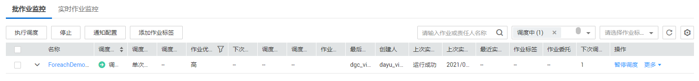
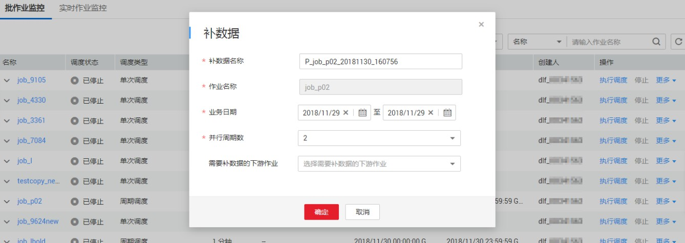
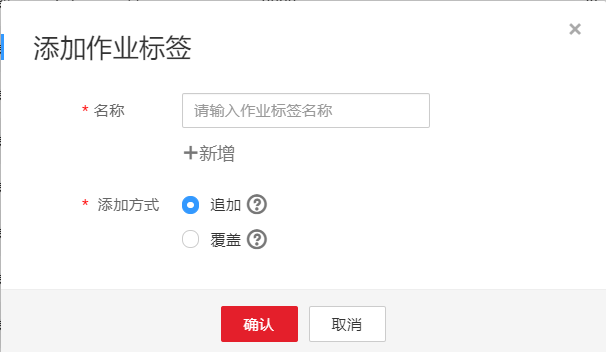
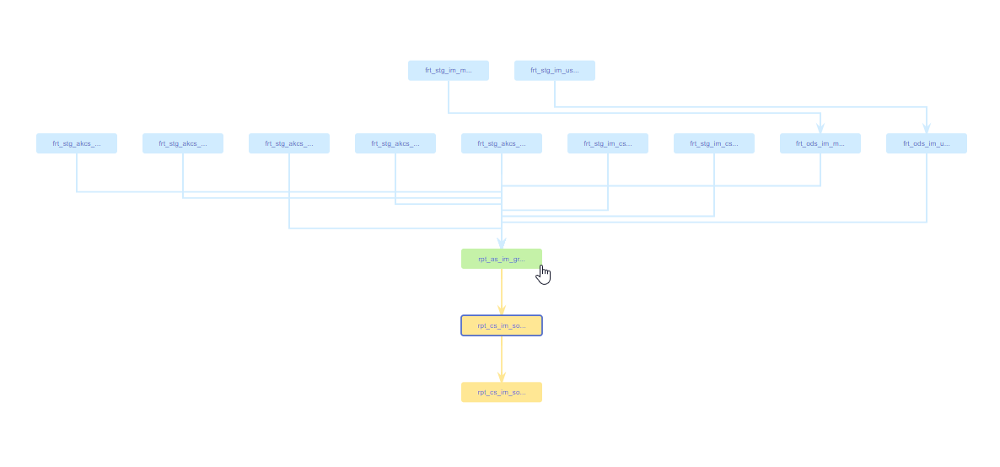
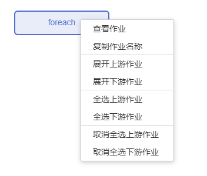

# 批作业监控

批作业监控提供了对批处理作业的状态进行监控的能力。

批处理作业支持作业级别的调度计划，可以定期处理批量数据，主要用于实时性要求低的场景。批作业是是由一个或多个多个算子组成的流水线，以流水线作为一个整体被调度。被调度触发后，任务执行一段时间必须结束，即任务不能无限时间持续运行。

您可以在“作业监控 \> 批作业监控“页面查看批处理作业的调度状态、调度频率、调度开始时间等信息，以及进行如[表1](#zh-cn_topic_0159098544_table958254318576)所示的操作。

**图 1**  批作业监控  

**表 1**  批作业监控支持的操作项

<table><thead align="left"><tr id="zh-cn_topic_0159098544_row1558284313572"><th class="cellrowborder" valign="top" width="5.050000000000001%" id="mcps1.2.4.1.1">
序号

</th>
<th class="cellrowborder" valign="top" width="26.840000000000003%" id="mcps1.2.4.1.2">
支持的操作项

</th>
<th class="cellrowborder" valign="top" width="68.11%" id="mcps1.2.4.1.3">
说明

</th>
</tr>
</thead>
<tbody><tr id="row679218403524"><td class="cellrowborder" valign="top" width="5.050000000000001%" headers="mcps1.2.4.1.1 ">
1

</td>
<td class="cellrowborder" valign="top" width="26.840000000000003%" headers="mcps1.2.4.1.2 ">
根据“作业名”或“责任人名”搜索作业

</td>
<td class="cellrowborder" valign="top" width="68.11%" headers="mcps1.2.4.1.3 ">
-

</td>
</tr>
<tr id="zh-cn_topic_0159098544_row35827433577"><td class="cellrowborder" valign="top" width="5.050000000000001%" headers="mcps1.2.4.1.1 ">
2

</td>
<td class="cellrowborder" valign="top" width="26.840000000000003%" headers="mcps1.2.4.1.2 ">
根据“调度状态”或“作业标签”筛选作业

</td>
<td class="cellrowborder" valign="top" width="68.11%" headers="mcps1.2.4.1.3 ">
-

</td>
</tr>
<tr id="row26614215186"><td class="cellrowborder" valign="top" width="5.050000000000001%" headers="mcps1.2.4.1.1 ">
3

</td>
<td class="cellrowborder" valign="top" width="26.840000000000003%" headers="mcps1.2.4.1.2 ">
批量配置作业

</td>
<td class="cellrowborder" valign="top" width="68.11%" headers="mcps1.2.4.1.3 ">
通过勾选作业名称前的复选框，支持批量执行操作。

</td>
</tr>
<tr id="row11419103816393"><td class="cellrowborder" valign="top" width="5.050000000000001%" headers="mcps1.2.4.1.1 ">
4

</td>
<td class="cellrowborder" valign="top" width="26.840000000000003%" headers="mcps1.2.4.1.2 ">
查看作业实例状态

</td>
<td class="cellrowborder" valign="top" width="68.11%" headers="mcps1.2.4.1.3 ">
单击作业名称前方的，显示“最近的实例”页面，查看该作业最近的实例信息。

</td>
</tr>
<tr id="row1694122981615"><td class="cellrowborder" valign="top" width="5.050000000000001%" headers="mcps1.2.4.1.1 ">
5

</td>
<td class="cellrowborder" valign="top" width="26.840000000000003%" headers="mcps1.2.4.1.2 ">
查看作业的节点信息

</td>
<td class="cellrowborder" valign="top" width="68.11%" headers="mcps1.2.4.1.3 ">
单击作业名称，在打开的页面中点击作业节点，查看该节点的相关关联作业\脚本与监控信息。

</td>
</tr>
<tr id="zh-cn_topic_0159098544_row10582843155716"><td class="cellrowborder" valign="top" width="5.050000000000001%" headers="mcps1.2.4.1.1 ">
6

</td>
<td class="cellrowborder" valign="top" width="26.840000000000003%" headers="mcps1.2.4.1.2 ">
调度作业相关

</td>
<td class="cellrowborder" valign="top" width="68.11%" headers="mcps1.2.4.1.3 ">
在作业的“操作”列，支持执行调度、暂停调度、恢复调度、停止调度、调度配置等，详情请参见<a href="#zh-cn_topic_0159100548_section1617819411343">批作业监控：调度作业</a>。

</td>
</tr>
<tr id="zh-cn_topic_0159098544_row158214433574"><td class="cellrowborder" valign="top" width="5.050000000000001%" headers="mcps1.2.4.1.1 ">
7

</td>
<td class="cellrowborder" valign="top" width="26.840000000000003%" headers="mcps1.2.4.1.2 ">
通知设置

</td>
<td class="cellrowborder" valign="top" width="68.11%" headers="mcps1.2.4.1.3 ">
在作业的“操作”列，选择“更多 &gt; 通知设置”，弹出“新建通知”页面，参考<a href="管理通知.md#zh-cn_topic_0114591806_table63861718143217">表1</a>配置通知参数。

</td>
</tr>
<tr id="zh-cn_topic_0159098544_row15821434571"><td class="cellrowborder" valign="top" width="5.050000000000001%" headers="mcps1.2.4.1.1 ">
8

</td>
<td class="cellrowborder" valign="top" width="26.840000000000003%" headers="mcps1.2.4.1.2 ">
实例监控

</td>
<td class="cellrowborder" valign="top" width="68.11%" headers="mcps1.2.4.1.3 ">
在作业的“操作”列，选择“更多 &gt; 实例监控”，跳转到实例监控页面，查看该作业所有实例的运行记录。

</td>
</tr>
<tr id="row10989143521416"><td class="cellrowborder" valign="top" width="5.050000000000001%" headers="mcps1.2.4.1.1 ">
9

</td>
<td class="cellrowborder" valign="top" width="26.840000000000003%" headers="mcps1.2.4.1.2 ">
补数据

</td>
<td class="cellrowborder" valign="top" width="68.11%" headers="mcps1.2.4.1.3 ">
在作业的“操作”列，选择“更多 &gt; 补数据”，弹出“补数据”对话框，详情请参见<a href="#zh-cn_topic_0159100548_section1819004120344">批作业监控：补数据</a>。

</td>
</tr>
<tr id="row17262173810149"><td class="cellrowborder" valign="top" width="5.050000000000001%" headers="mcps1.2.4.1.1 ">
10

</td>
<td class="cellrowborder" valign="top" width="26.840000000000003%" headers="mcps1.2.4.1.2 ">
添加作业标签

</td>
<td class="cellrowborder" valign="top" width="68.11%" headers="mcps1.2.4.1.3 ">
在作业的“操作”列，选择“更多 &gt; 添加作业标签”，弹出“添加作业标签”对话框，详情请参见<a href="#zh-cn_topic_0159100548_section12186114111347">批作业监控：添加作业标签</a>。

</td>
</tr>
<tr id="row159085301514"><td class="cellrowborder" valign="top" width="5.050000000000001%" headers="mcps1.2.4.1.1 ">
11

</td>
<td class="cellrowborder" valign="top" width="26.840000000000003%" headers="mcps1.2.4.1.2 ">
查看作业依赖关系图

</td>
<td class="cellrowborder" valign="top" width="68.11%" headers="mcps1.2.4.1.3 ">
在作业的“操作”列，选择“更多 &gt; 查看作业依赖关系图”，详情请参见<a href="#section1913992715419">批作业监控：查看作业依赖关系图</a>。

</td>
</tr>
</tbody>
</table>

## 批作业监控：调度作业

作业开发完成后，用户可以在“作业监控“页面中管理作业的调度任务，例如：执行调度、暂停调度、恢复调度、停止调度。

**图 2**  调度作业  

1.  登录DGC控制台。选择对应工作空间的“数据开发“模块，进入数据开发页面。

    **图 3**  选择数据开发  
    

2.  在数据开发主界面的左侧导航栏，选择“运维调度  \>  作业监控“。
3.  单击“批作业监控“页签，进入批作业的监控页面。
4.  在作业的“操作“列，单击“执行调度“/“暂停调度“/“恢复调度“/“停止“。

如果该批处理作业设置有依赖的作业，执行调度该作业时可以设置为只启动当前作业或同时启动依赖的作业。如何配置依赖作业，请参见[配置作业调度任务（批处理作业）](调度作业.md#zh-cn_topic_0099797007_section1590152794714)。

**图 4**  启动作业  

## 批作业监控：补数据

补数据是指作业执行一个调度任务，在过去某一段时间里生成一系列的实例。用户可以通过补数据，修正历史中出现数据错误的作业实例，或者构建更多的作业记录以便调试程序等。

只有配置了周期调度的作业，才支持使用该功能。如需查看补数据的执行情况，请参见[补数据监控](补数据监控.md)。

> **说明：** 
>当作业正在补数据时，请勿修改作业配置，否则会影响补数据过程中生成的作业实例。

1.  登录DGC控制台。选择对应工作空间的“数据开发“模块，进入数据开发页面。

    **图 5**  选择数据开发  
    

2.  在数据开发主界面的左侧导航栏，选择“运维调度  \>  作业监控“。
3.  单击“批作业监控“页签，进入批作业的监控页面。
4.  在作业的“操作“列，选择“更多  \>  补数据“。
5.  弹出“补数据“对话框，配置如所示[表2](#zh-cn_topic_0159100548_table15019455411)的参数。

    **图 6**  补数据参数  
    

    **表 2**  参数说明

    
    <table><thead align="left"><tr id="zh-cn_topic_0159100548_row9507465414"><th class="cellrowborder" valign="top" width="35.17%" id="mcps1.2.3.1.1">
参数

    </th>
    <th class="cellrowborder" valign="top" width="64.83%" id="mcps1.2.3.1.2">
说明

    </th>
    </tr>
    </thead>
    <tbody><tr id="zh-cn_topic_0159100548_row1350845549"><td class="cellrowborder" valign="top" width="35.17%" headers="mcps1.2.3.1.1 ">
补数据名称

    </td>
    <td class="cellrowborder" valign="top" width="64.83%" headers="mcps1.2.3.1.2 ">
系统自动生成一个补数据的任务名称，允许修改。

    </td>
    </tr>
    <tr id="zh-cn_topic_0159100548_row165015410541"><td class="cellrowborder" valign="top" width="35.17%" headers="mcps1.2.3.1.1 ">
作业名称

    </td>
    <td class="cellrowborder" valign="top" width="64.83%" headers="mcps1.2.3.1.2 ">
显示需要补数据的作业名称。

    </td>
    </tr>
    <tr id="zh-cn_topic_0159100548_row450174175418"><td class="cellrowborder" valign="top" width="35.17%" headers="mcps1.2.3.1.1 ">
业务日期

    </td>
    <td class="cellrowborder" valign="top" width="64.83%" headers="mcps1.2.3.1.2 ">
选择需要补数据的时间段。

    </td>
    </tr>
    <tr id="zh-cn_topic_0159100548_row6501415546"><td class="cellrowborder" valign="top" width="35.17%" headers="mcps1.2.3.1.1 ">
并行周期数

    </td>
    <td class="cellrowborder" valign="top" width="64.83%" headers="mcps1.2.3.1.2 ">
设置同时执行的实例数量，最多可同时执行5个实例。

    
 说明： 

请根据实际情况配置并行周期数，例如CDM作业实例，不可同时执行补数据操作，并行周期数只可设置为1。

    

    </td>
    </tr>
    <tr id="zh-cn_topic_0159100548_row4501543540"><td class="cellrowborder" valign="top" width="35.17%" headers="mcps1.2.3.1.1 ">
需要补数据的下游作业

    </td>
    <td class="cellrowborder" valign="top" width="64.83%" headers="mcps1.2.3.1.2 ">
选择需要补数据的下游作业（指依赖于当前作业的作业），支持多选。

    
此处系统会展示作业依赖关系视图，关于作业依赖关系视图的操作，请参考<a href="#section1913992715419">批作业监控：查看作业依赖关系图</a>。

    </td>
    </tr>
    </tbody>
    </table>

6.  单击“确定“，开始补数据，并进入“补数据监控“页面。

## 批作业监控：添加作业标签

支持给作业添加标签，便于作业实例的筛选分类。

1.  登录DGC控制台。选择对应工作空间的“数据开发“模块，进入数据开发页面。

    **图 7**  选择数据开发  
    

2.  在数据开发主界面的左侧导航栏，选择“运维调度  \>  作业监控“。
3.  单击“批作业监控“页签，进入批作业的监控页面。
4.  在作业的“操作“列，选择“更多  \>  添加作业标签“。
5.  弹出“添加作业标签“对话框，填写需要配置的作业标签。

    **图 8**  添加作业标签参数  
    

6.  填写完标签后，单击“确定“，完成作业标签的添加。

## 批作业监控：查看作业依赖关系图

作业依赖关系视图支持查看作业与其他作业的依赖关系。

1.  登录DGC控制台。选择对应工作空间的“数据开发“模块，进入数据开发页面。

    **图 9**  选择数据开发  
    

2.  在数据开发主界面的左侧导航栏，选择“运维调度  \>  作业监控“。
3.  单击“批作业监控“页签，进入批作业的监控页面。
4.  在作业的“操作“列，选择“更多  \>  查看作业依赖关系图“。
5.  在弹出的“作业依赖关系视图“页面，支持如下操作：
    -   视图右上角支持“显示完整依赖图“和“只显示当前作业“。
    -   鼠标滚轮可放大、缩小关系图。
    -   鼠标按住空白处，可自由拖拽用以查看完整关系图。
    -   鼠标按住节点处，可自由拖拽当前节点位置。
    -   鼠标光标悬停在作业节点上，该作业节点会被标记为绿色，上游作业会被标记为青蓝色，下游作业会被标记为橙黄色。

        **图 10**  上下游作业节点标记  
        

    -   在作业节点上左键单击，可选择该节点，再次点击即可取消选择。
    -   在作业节点上右键单击，可进行查看作业、复制节点名称、展开上/下游作业、选择/取消该节点的上/下游节点等操作。

        **图 11**  作业节点操作  
        

另外，作业依赖关系还可以通过作业详情查看。

1.  登录DGC控制台。选择对应工作空间的“数据开发“模块，进入数据开发页面。

    **图 12**  选择数据开发  
    

2.  在数据开发主界面的左侧导航栏，选择“运维调度  \>  作业监控“。
3.  单击“批作业监控“页签，进入批作业的监控页面。
4.  单击作业名称，选择“作业依赖“页签。查看作业间的依赖关系。

    单击“编辑“，将进入该作业的开发页面。

