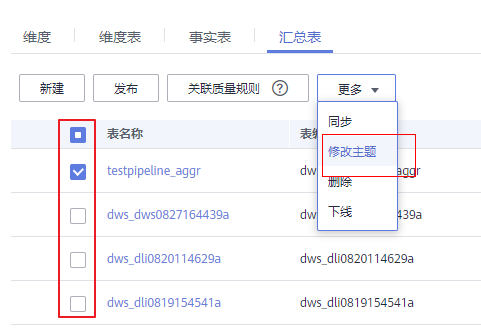
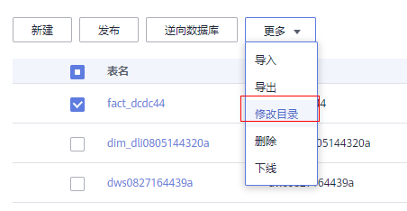
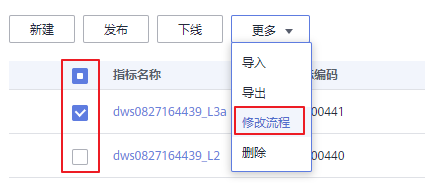

# 批量修改主题/目录/流程

## 批量修改主题

当前仅支持信息架构、关系建模、维度、事实表、汇总表、技术指标模块进行批量修改主题操作，操作流程相同。

此处以批量修改信息架构为例，展示如下：

1.  在DGC规范设计控制台，单击左侧导航栏中的“信息架构“。
2.  进入后，在页面选择所需要批量修改主题的项，单击“更多 \> 修改主题”，可以将选中的项更改到其它主题。配置完成点击“确定“。

    **图 1**  批量修改主题  
    

## 批量修改目录

当前仅支持码表管理、数据标准进行批量修改目录操作。

1.  在DGC规范设计控制台，单击左侧导航栏中的码表管理或数据标准。
2.  进入后，在页面选择所需要批量修改目录的项，单击“更多 \> 修改目录”，可以将选中的项更改到其它目录。

    **图 2**  批量修改目录（此处以码表管理模块为例）  
    

## 批量修改流程

当前仅支持业务指标进行批量修改流程操作。

1.  在DGC规范设计控制台，单击左侧导航栏中的业务指标。
2.  进入业务指标页面后，在页面选择所需要批量修改流程的指标，单击“更多 \> 修改流程”，可以将选中的项更改到其它流程。

    **图 3**  批量修改流程  
    

