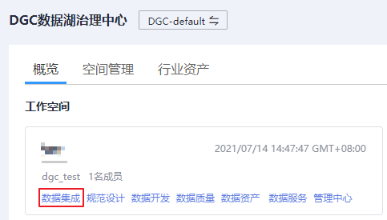
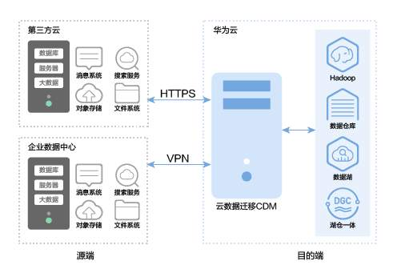
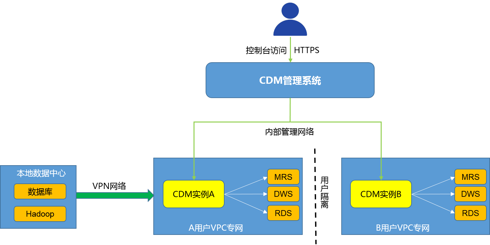

# 批量数据迁移概述

DGC批量数据迁移是一种高效、易用的批量数据迁移服务，围绕大数据迁移上云和智能数据湖解决方案，提供了简单易用的迁移能力和多种数据源到数据湖的集成能力，降低了客户数据源迁移和集成的复杂性，有效的提高您数据迁移和集成的效率。

批量数据迁移即云数据迁移（Cloud Data Migration，后简称CDM）服务，本文中的“云数据迁移”、“CDM”均指“批量数据迁移”。

您可以通过以下方式之一进入CDM主界面：

-   登录CDM控制台，单击“集群管理“，进入到CDM主界面。
-   登录DGC控制台。选择对应工作空间的“数据集成“模块，进入CDM主界面。

    **图 1**  选择数据集成  
    

## 批量数据集成简介

批量数据迁移基于分布式计算框架，利用并行化处理技术，支持用户稳定高效地对海量数据进行移动，实现不停服数据迁移，快速构建所需的数据架构。

**图 2**  批量数据迁移定位  

## 产品功能

-   **表/文件/整库迁移**

    支持批量迁移表或者文件，还支持同构/异构数据库之间整库迁移，一个作业即可迁移几百张表。

-   **增量数据迁移**

    支持文件增量迁移、关系型数据库增量迁移、HBase/CloudTable增量迁移，以及使用Where条件配合时间变量函数实现增量数据迁移。

-   **事务模式迁移**

    支持当CDM作业执行失败时，将数据回滚到作业开始之前的状态，自动清理目的表中的数据。

-   **字段转换**

    支持去隐私、字符串操作、日期操作等常用字段的数据转换功能。

-   **文件加密**

    在迁移文件到文件系统时，CDM支持对写入云端的文件进行加密。

-   **MD5校验一致性**

    支持使用MD5校验，检查端到端文件的一致性，并输出校验结果。

-   **脏数据归档**

    支持将迁移过程中处理失败的、被清洗过滤掉的、不符合字段转换或者不符合清洗规则的数据单独归档到脏数据日志中，便于用户查看。并支持设置脏数据比例阈值，来决定任务是否成功。

## CDM迁移原理

用户使用CDM服务时，CDM管理系统在用户VPC中发放全托管的CDM实例。此实例仅提供控制台和Rest API访问权限，用户无法通过其他接口（如SSH）访问实例。这种方式保证了CDM用户间的隔离，避免数据泄漏，同时保证VPC内不同云服务间数据迁移时的传输安全。用户还可以使用VPN网络将本地数据中心的数据迁移到云服务，具有高度的安全性。

CDM数据迁移以抽取-写入模式进行。CDM首先从源端抽取数据然后将数据写入到目的端，数据访问操作均由CDM主动发起，对于数据源（如RDS数据源）支持SSL时，会使用SSL加密传输。迁移过程要求用户提供源端和目的端数据源的用户名和密码，这些信息将存储在CDM实例的数据库中。保护这些信息对于CDM安全至关重要。

**图 3**  CDM迁移原理  

